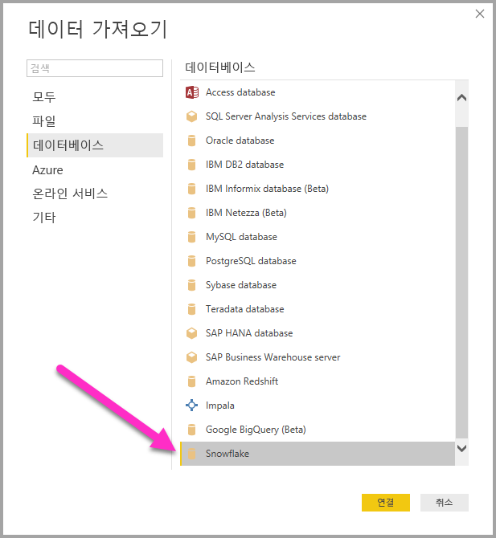
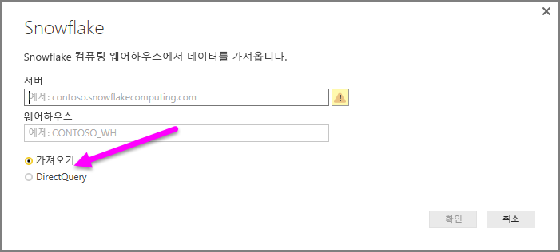
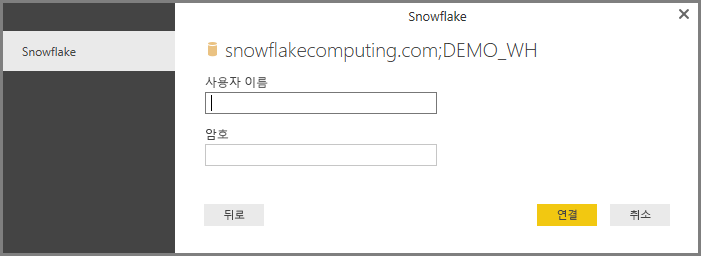
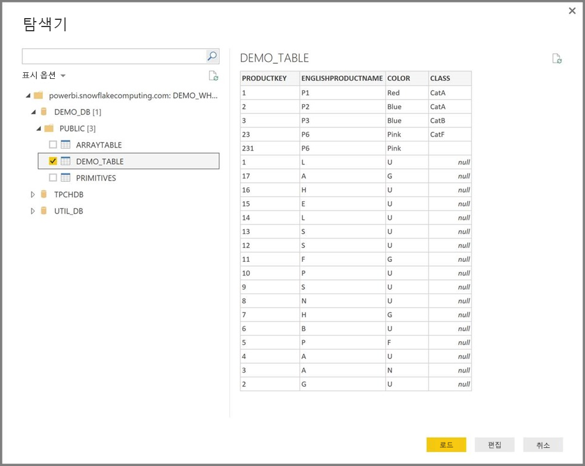

# Power BI Desktop에서 Snowflake에 연결
Power BI Desktop에서 **Snowflake** 컴퓨팅 웨어하우스에 연결하고 Power BI Desktop의 다른 데이터 원본처럼 기본 데이터를 사용할 수 있습니다. 

> [!NOTE]
> 또한 **Snowflake ODBC 드라이버**를 **Power BI Desktop** 32 비트 또는 64 비트 설치와 일치하는 아키텍처를 사용하여 **Snowflake** 커넥터를 사용하는 컴퓨터에 설치*해야* 합니다. 다음 링크를 따라가서 [해당되는 Snowflake ODBC 드라이버를 다운로드](http://go.microsoft.com/fwlink/?LinkID=823762)합니다.
> 
> 

## Snowflake 컴퓨팅 웨어하우스에 연결
**Snowflake** 컴퓨팅 웨어하우스에 연결하려면 Power BI Desktop의 **홈** 리본 메뉴에서 **데이터 가져오기**를 선택합니다. 왼쪽에 있는 범주에서 **데이터베이스**를 선택하면 **Snowflake**가 표시됩니다.

**Snowflake** 창이 나타나면 상자에 Snowflake 컴퓨팅 웨어하우스 이름을 입력하거나 붙여 넣고 **확인**을 선택합니다. Power BI로 데이터를 직접 **가져오거나** **DirectQuery**를 사용할 수 있습니다. [DirectQuery 사용](desktop-use-directquery.md)에 대해 자세히 알아볼 수 있습니다.

메시지가 표시되면 사용자 이름 및 암호를 입력합니다.

> [!NOTE]
> 특정 **Snowflake** 서버에 사용자 이름 및 암호를 입력하면 Power BI Desktop에서 후속 연결을 시도할 때에도 동일한 자격 증명을 사용합니다. **파일 > 옵션 및 설정 > 데이터 원본 설정**으로 이동하여 해당 자격 증명을 수정할 수 있습니다.
> 
> 

성공적으로 연결되면 **탐색기** 창이 나타나고 서버에 사용 가능한 데이터를 표시합니다. 여기서 하나 이상의 요소를 선택하여 **Power BI Desktop**에 가져오고 사용할 수 있습니다.

선택된 테이블을 **로드**하여 전체 테이블을 **Power BI Desktop**에 가져오거나 쿼리를 **편집**하여 **쿼리 편집기**를 열고 사용하려는 데이터의 집합을 필터링하고 재정의한 후 조정된 데이터 집합을 **Power BI Desktop**에 로드할 수 있습니다.

## 다음 단계
Power BI Desktop을 사용하여 연결할 수 있는 모든 종류의 데이터가 있습니다. 데이터 원본에 대한 자세한 내용은 다음 리소스를 확인하세요.

* [Power BI Desktop이란?](desktop-what-is-desktop.md)
* [Power BI Desktop의 데이터 원본](desktop-data-sources.md)
* [Power BI Desktop에서 데이터 셰이핑 및 결합](desktop-shape-and-combine-data.md)
* [Power BI Desktop에서 Excel 통합 문서에 연결](desktop-connect-excel.md)   
* [Power BI Desktop에 데이터 직접 연결](desktop-enter-data-directly-into-desktop.md)   

