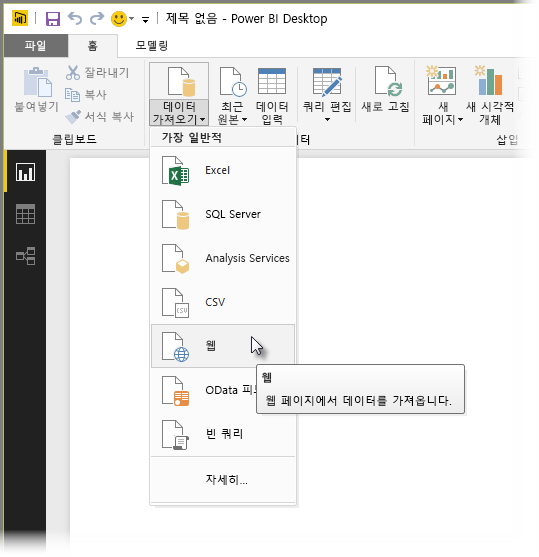
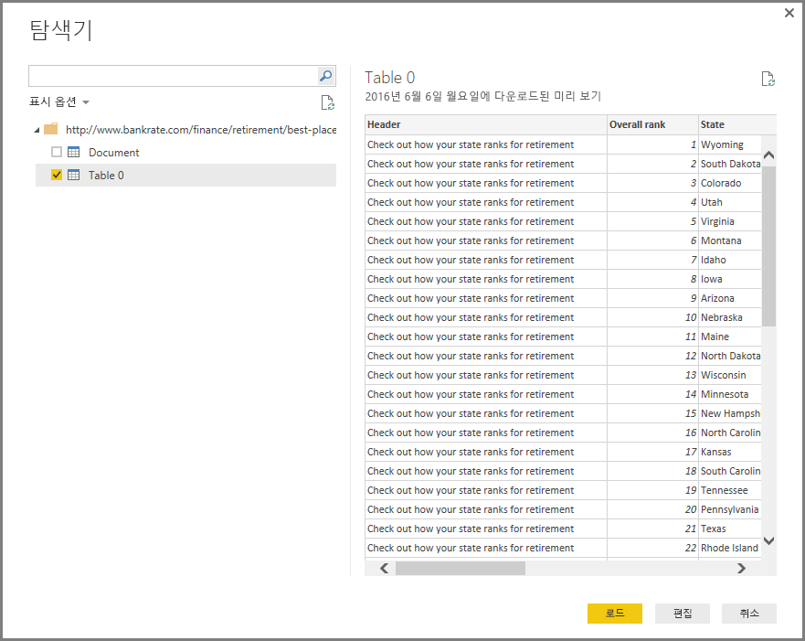
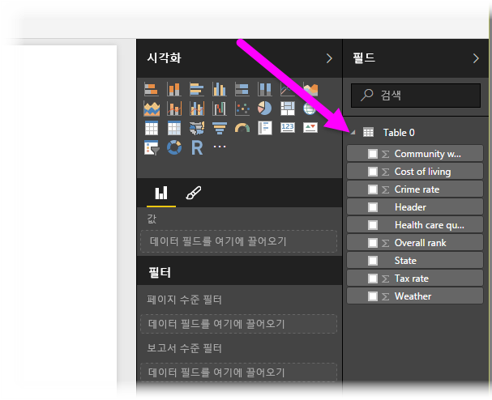

# Power BI Desktop에서 웹 페이지에 연결
웹 페이지에 연결하고 해당 데이터를 Power BI Desktop으로 가져와 시각적 개체 및 데이터 모델에서 사용할 수 있습니다.

Power BI Desktop의 **홈** 리본에서 **데이터 가져오기 > 웹**을 선택합니다.

대화 상자가 나타나면 데이터를 가져오려는 웹 페이지의 URL을 묻는 메시지가 표시됩니다.

URL을 입력했으면(또는 붙여넣기) **확인**을 선택합니다. Power BI Desktop이 해당 페이지에 연결된 후 페이지의 사용 가능한 데이터를 **탐색기** 창에 표시됩니다. 사용 가능한 데이터 요소(예: 전체 페이지의 테이블) 중 하나를 선택하면 **탐색기** 창 오른쪽에 데이터 미리 보기가 표시됩니다.

**편집** 단추를 선택하면 **쿼리 편집기**가 실행되며 여기에서 데이터를 Power BI Desktop으로 가져오기 전에 웹 페이지 데이터의 모양을 지정하고 변환할 수 있습니다. 또는 **로드** 단추를 선택하고 왼쪽 창에서 선택한 모든 데이터 요소를 가져올 수 있습니다.

**로드**를 선택하면 Power BI Desktop에서 선택한 항목을 가져오고 Power BI Desktop의 보고서 보기 오른쪽에 있는 **필드** 창에서 사용할 수 있습니다.

웹 페이지에 연결하고 데이터를 Power BI Desktop으로 가져오는 데 필요한 작업을 마쳤습니다.

여기에서 해당 필드를 보고서 캔버스로 끌어서 원하는 모든 시각화를 만들 수 있습니다. 또한 다른 데이터처럼 웹 페이지의 데이터로도 이러한 작업을 수행할 수 있습니다. 모양을 지정하고 이들과 모델의 다른 데이터 원본 간의 관계를 만들며, Power BI 보고서처럼 만들고자 하는 다른 작업을 수행할 수 있습니다.

자세한 웹 페이지 연결 과정 및 동작에 대해 알아보려면 [Power BI Desktop 시작 가이드](desktop-getting-started.md)를 살펴보세요.

### 다음 단계
Power BI Desktop을 사용하여 연결할 수 있는 모든 종류의 데이터가 있습니다. 데이터 원본에 대한 자세한 내용은 다음 리소스를 확인하세요.

* [Power BI Desktop의 데이터 원본](desktop-data-sources.md)
* [Power BI Desktop에서 데이터 셰이핑 및 결합](desktop-shape-and-combine-data.md)
* [Power BI Desktop에서 Excel 통합 문서에 연결](desktop-connect-excel.md)   
* [Power BI Desktop에서 CSV 파일에 연결](desktop-connect-csv.md)   
* [Power BI Desktop에 데이터 직접 연결](desktop-enter-data-directly-into-desktop.md)   

