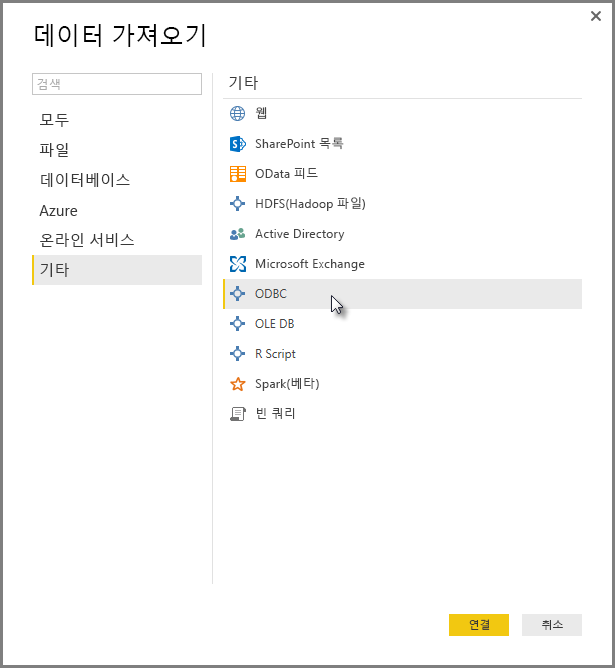
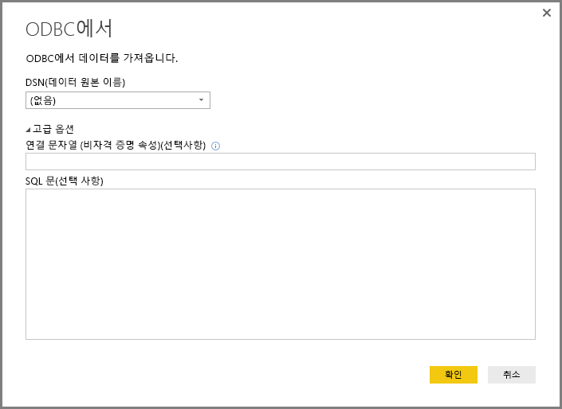
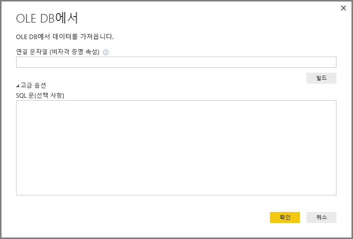
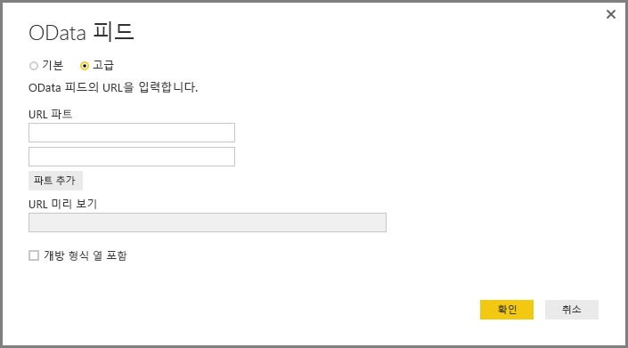
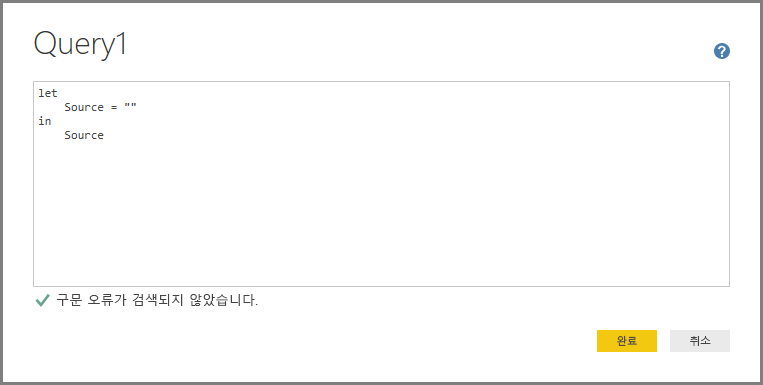
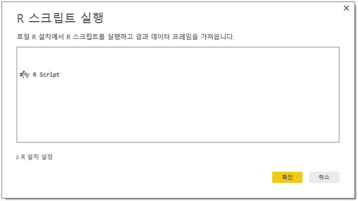

# Power BI Desktop에서 제네릭 인터페이스를 사용하여 데이터에 연결
**데이터 가져오기** 창에 표시된 대로, **Access 데이터베이스**에서 **Zendesk** 리소스에 이르는 기본 제공 데이터 커넥터를 사용하여 **Power BI Desktop**에서 다수의 다양한 데이터 원본에 연결할 수 있습니다. **Power BI Desktop**에 빌드된 제네릭 인터페이스(예: **ODBC** 또는 **REST API**)를 사용하여 모든 종류의 *다른* 데이터 원본에 연결하여 추가로 사용자 연결 옵션을 더욱 확장시킬 수도 있습니다.

## Power BI Desktop 데이터 인터페이스
**Power BI Desktop**에는 특정 데이터 원본에 연결하도록 구성된 데이터 커넥터의 컬렉션이 계속 증가됩니다. 예를 들어 **데이터 가져오기 > 추가...**(이전 이미지에 표시됨)를 선택할 때 표시되는 창에 다른 데이터 원본이 있는 경우 **SharePoint 목록** 데이터 커넥터는 **SharePoint 목록**을 위해 구성된 연결 시퀀스 진행 중에 특정 필드 및 지원 정보를 제공합니다.

또한 **Power BI Desktop**에서는 다음과 같은 제네릭 데이터 인터페이스 중 하나를 사용하여 **데이터 가져오기** 목록에서 식별되지 않는 데이터 원본에 연결할 수 있습니다.

* **ODBC**
* **OLE DB**
* **OData**
* **REST API**
* **R 스크립트**

이러한 제네릭 인터페이스에서 제공되는 연결 창에서 적절한 매개 변수를 제공함으로써 **Power BI Desktop**에서 액세스하여 사용할 수 있는 데이터 원본의 세계는 현저하게 증가합니다.

다음 섹션에서는 이러한 제네릭 인터페이스에서 액세스할 수 있는 데이터 원본의 목록을 찾을 수 있습니다.

**Power BI Desktop**에 사용하려는 데이터 원본이 없나요? Power BI 팀의 [아이디어 및 요청 목록](https://ideas.powerbi.com/)에 아이디어를 제출해 주세요.

## ODBC를 통해 액세스할 수 있는 데이터 원본
**Power BI Desktop**의 **ODBC** 커넥터를 사용하면 간단히 **데이터 원본 이름(DSN)** 또는 *연결 문자열*을 지정하여 모든 타사 ODBC 드라이버에서 데이터를 가져올 수 있습니다. 필요에 따라 ODBC 드라이버에 대해 실행할 SQL 문을 지정할 수도 있습니다.

다음 목록에서는 **Power BI Desktop**이 제네릭 **ODBC**를 사용하여 연결할 수 있는 데이터 원본의 몇 가지 예를 자세히 설명합니다.

| Power BI Desktop 제네릭 커넥터 | 외부 데이터 원본 | 자세한 정보에 대한 링크 |
| --- | --- | --- |
| ODBC |Cassandra |[Cassandra ODBC 드라이버](http://www.simba.com/drivers/cassandra-odbc-jdbc/) |
| ODBC |Couchbase DB |[Couchbase 및 Power BI](https://powerbi.microsoft.com/blog/visualizing-data-from-couchbase-server-v4-using-power-bi/) |
| ODBC |DynamoDB |[DynamoDB ODBC 드라이버](http://www.simba.com/drivers/dynamodb-odbc-jdbc/) |
| ODBC |Google BigQuery |[BigQuery ODBC 드라이버](http://www.simba.com/drivers/bigquery-odbc-jdbc/) |
| ODBC |Hbase |[Hbase ODBC 드라이버](http://www.simba.com/drivers/hbase-odbc-jdbc/) |
| ODBC |Hive |[Hive ODBC 드라이버](http://www.simba.com/drivers/hive-odbc-jdbc/) |
| ODBC |IBM Netezza |[IBM Netezza 정보](https://www.ibm.com/support/knowledgecenter/SSULQD_7.2.1/com.ibm.nz.datacon.doc/c_datacon_plg_overview.html) |
| ODBC |기능 |[Presto ODBC 드라이버](http://www.simba.com/drivers/presto-odbc-jdbc/) |
| ODBC |프로젝트 온라인 |[프로젝트 온라인 문서](desktop-project-online-connect-to-data.md) |
| ODBC |Progress OpenEdge |[Progress OpenEdge ODBC 드라이버 블로그 게시물](https://na01.safelinks.protection.outlook.com/?url=https%3A%2F%2Fwww.progress.com%2Fblogs%2Fconnect-microsoft-power-bi-to-openedge-via-odbc-driver&data=02%7C01%7CMatt.Masson%40microsoft.com%7C5e63742e6c454308b58a08d4034b5923%7C72f988bf86f141af91ab2d7cd011db47%7C1%7C0%7C636137069555329811&sdata=gSu2Rq3vZ0uBVOgjaXxd8Y3uBf%2B8DidX6PG33jwAduY%3D&reserved=0) |

## OLE DB를 통해 액세스할 수 있는 데이터 원본
**Power BI Desktop**의 **OLE DB** 커넥터를 사용하면 간단히 *연결 문자열*을 지정하여 모든 타사 OLE DB 드라이버에서 데이터를 가져올 수 있습니다. 필요에 따라 OLE DB 드라이버에 대해 실행할 SQL 문을 지정할 수도 있습니다.

다음 목록에서는 **Power BI Desktop**에서 제네릭 **OLE DB** 인터페이스를 사용하여 연결할 수 있는 데이터 원본의 몇 가지 예를 자세히 설명합니다.

| Power BI Desktop 제네릭 커넥터 | 외부 데이터 원본 | 자세한 정보에 대한 링크 |
| --- | --- | --- |
| OLE DB |SAS OLE DB |[SAS provider for OLE DB](https://support.sas.com/downloads/package.htm?pid=648) |
| OLE DB |Sybase OLE DB |[Sybase provider for OLE DB](http://infocenter.sybase.com/help/index.jsp?topic=/com.sybase.infocenter.dc35888.1550/doc/html/jon1256941734395.html) |

## OData를 통해 액세스할 수 있는 데이터 원본
**Power BI Desktop**의 **OData** 커넥터를 사용하면 간단히 **OData** URL을 입력하거나 붙여 넣어 모든 **OData**에서 데이터를 가져올 수 있습니다. **OData 피드** 창에 제공된 텍스트 상자에 이러한 링크를 입력하거나 붙여 넣어 여러 URL 파트를 추가할 수 있습니다.

다음 목록에서는 **Power BI Desktop**에서 제네릭 **OData** 인터페이스를 사용하여 연결할 수 있는 데이터 원본의 몇 가지 예를 자세히 설명합니다.

| Power BI Desktop 제네릭 커넥터 | 외부 데이터 원본 | 자세한 정보에 대한 링크 |
| --- | --- | --- |
| OData |제공 예정 |OData 데이터 원본은 곧 다시 방문하여 확인하세요. |

## REST API를 통해 액세스할 수 있는 데이터 원본
**REST API**를 사용하여 데이터 원본에 연결할 수 있으므로 **REST**를 지원하는 모든 종류의 데이터 원본에서 데이터를 사용할 수 있습니다.

다음 목록에서는 **Power BI Desktop**에서 제네릭 **REST API** 인터페이스를 사용하여 연결할 수 있는 데이터 원본의 몇 가지 예를 자세히 설명합니다.

| Power BI Desktop 제네릭 커넥터 | 외부 데이터 원본 | 자세한 정보에 대한 링크 |
| --- | --- | --- |
| REST API |Couchbase DB |[Couchbase REST API 정보](https://powerbi.microsoft.com/blog/visualizing-data-from-couchbase-server-v4-using-power-bi/) |

## R 스크립트를 통해 액세스할 수 있는 데이터 원본
**R 스크립트**를 사용하여 데이터 원본에 액세스하고 **Power BI Desktop**에서 해당 데이터를 사용할 수 있습니다.

다음 목록에서는 **Power BI Desktop**에서 제네릭 **R 스크립트** 인터페이스를 사용하여 연결할 수 있는 데이터 원본의 몇 가지 예를 자세히 설명합니다.

| Power BI Desktop 제네릭 커넥터 | 외부 데이터 원본 | 자세한 정보에 대한 링크 |
| --- | --- | --- |
| R 스크립트 |SAS 파일 |[CRAN의 R 스크립트 지침](https://cran.r-project.org/doc/manuals/R-data.html) |
| R 스크립트 |SPSS 파일 |[CRAN의 R 스크립트 지침](https://cran.r-project.org/doc/manuals/R-data.html) |
| R 스크립트 |R 통계 파일 |[CRAN의 R 스크립트 지침](https://cran.r-project.org/doc/manuals/R-data.html) |

## 다음 단계
**Power BI Desktop**을 사용하여 연결할 수 있는 모든 종류의 데이터 원본이 있습니다. 데이터 원본에 대한 자세한 내용은 다음 리소스를 확인하세요.

* [Power BI Desktop이란?](desktop-what-is-desktop.md)
* [Power BI Desktop의 데이터 원본](desktop-data-sources.md)
* [Power BI Desktop에서 데이터 셰이핑 및 결합](desktop-shape-and-combine-data.md)
* [Power BI Desktop에서 Excel 통합 문서에 연결](desktop-connect-excel.md)   
* [Power BI Desktop에 데이터 직접 연결](desktop-enter-data-directly-into-desktop.md)   

