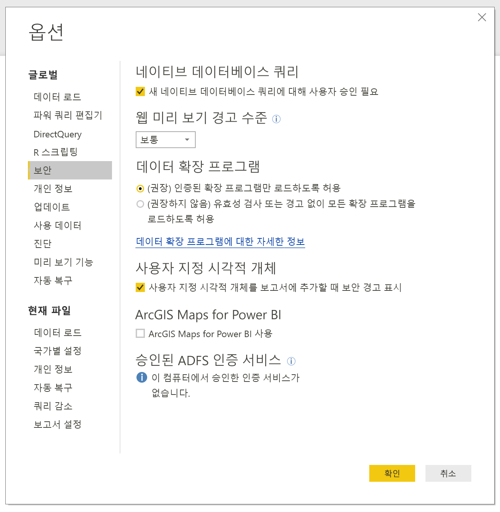
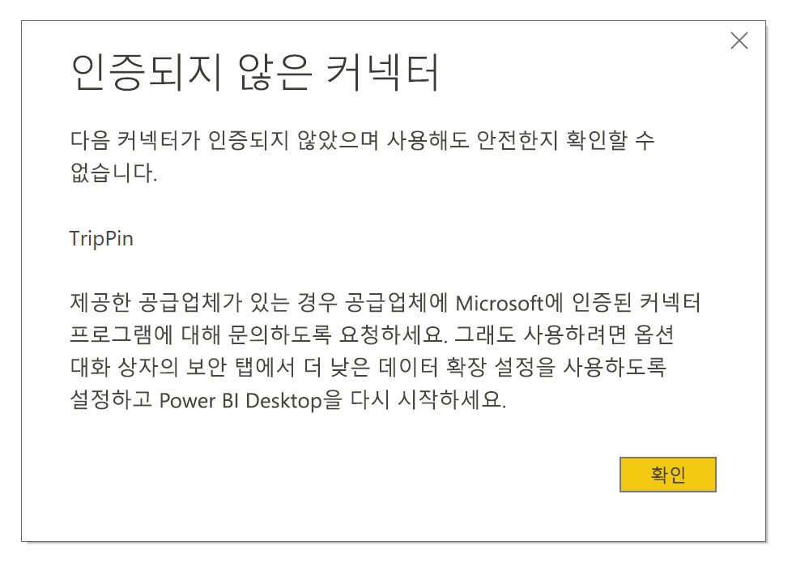

# Power BI에서 커넥터 확장성

Power BI에서 고객 및 개발자는 여러 가지 방법으로 연결 되는 데이터 원본을 확장할 수 있습니다. 기존 커넥터 및 일반 데이터 원본 (예: ODBC, OData, Oledb, 웹, CSV, XML, JSON) 사용합니다. 또는 개발자 라고 하는 데이터 확장 프로그램을 만들 **사용자 지정 커넥터**를 **Certified 커넥터**합니다.

현재 사용 하도록 설정 하면 **사용자 지정 커넥터** 시스템에서 실행할 수 있도록 하려면 사용자 지정 코드의 수준을 제어할 수 있도록 안전 하 게 메뉴를 사용 하 여 합니다. 모든 사용자 지정 커넥터 또는 커넥터에만 인증 하 고 microsoft에서 배포를 선택할 수 있습니다 합니다 **데이터 가져오기** 대화 상자.

## 사용자 지정 커넥터

**사용자 지정 커넥터** Microsoft 대규모 산업 관련 서비스를 비즈니스에 중요 한 작은 Api에서 사이의 커넥터에 대 한 정책을 릴리스하지, 광범위 한 기능을 포함할 수 있습니다. 많은 커넥터 공급 업체에서 배포 됩니다. 가 특정 데이터 커넥터에 대 한 필요 없는 경우 공급 업체를 문의 해야 합니다.

사용 하는 **사용자 지정 커넥터**에 배치 합니다  *\[문서]\\Power BI Desktop\\사용자 지정 커넥터* 폴더에 설명 된 대로 보안 설정을 조정 하 고 다음 섹션입니다.

**인증된 커넥터**를 사용하도록 보안 설정을 조정하지 않아도 됩니다.

## 데이터 확장 보안

데이터 확장 보안 설정을 변경 하려면 **Power BI Desktop** 선택 **파일 > 옵션 및 설정 > 옵션 > 보안**합니다.

**데이터 확장 프로그램**에서 두 가지 보안 수준을 선택할 수 있습니다.

* (권장) 인증된 확장 프로그램만 로드하도록 허용
* (권장하지 않음) 경고 없이 모든 확장 프로그램을 로드하도록 허용

사용 하려는 경우 **사용자 지정 커넥터** 를 선택 해야 하는 타사에서 개발한 커넥터 또는 **"(Not Recommended) 모든 확장을 로드할 경고 없이 허용"** 합니다. 사용자 지정 커넥터를 반드시 신뢰할 수 없는 경우이 보안 설정은 권장 하지 않습니다. 여기에 코드에서 자격 증명을 보내고 HTTP를 통해 포함 하 여 처리 하 고 개인 정보 수준을 무시 수 있으므로 합니다.

에 **"(권장)"** 보안 설정, 시스템에서 사용자 지정 커넥터가 있는 경우 오류가 나타나는 보안으로 인해 로드할 수 없는 커넥터에 설명 합니다.

오류를 해결 하 고 해당 커넥터를 사용 하려면 보안 설정을 변경 합니다 **"(Not Recommended) 모든 확장을 로드할 경고 없이 허용"** 앞에서 설명한 대로 설정 합니다. 를 다시 시작 **Power BI Desktop**합니다.

## 인증된 커넥터

데이터 확장 프로그램의 제한 된 하위 비율은 **Certified**합니다. 인증 된 커넥터에 액세스 합니다 **데이터 가져오기** 대화 상자. 하지만 커넥터를 만든 타사 개발자가 해당 유지 관리 및 지원 해야 합니다. Microsoft는 커넥터를 배포 하는 동안에 해당 성능 또는 지속적인된 함수 처리 하지 않습니다.

사용자 지정 커넥터를 인증하려는 경우 해당 공급업체가 dataconnectors@microsoft.com에 연락하도록 하세요.
