# Power BI Desktop에서 관계 만들기 및 관리
여러 테이블을 가져올 때 이러한 모든 테이블의 데이터를 사용하여 분석을 수행하려는 경우가 있습니다. 결과를 정확하게 계산하고 보고서에 올바른 정보를 표시하려면 테이블 간의 관계가 필요합니다. Power BI Desktop에서는 이러한 관계를 쉽게 만들 수 있습니다. 실제로 아무 작업도 수행할 필요가 없는 경우가 대부분입니다. 자동 검색 기능이 자동으로 작업을 수행할 수 있습니다. 그러나 경우에 따라 직접 관계를 만들어야 하거나 관계를 일부 변경해야 할 수 있습니다. 어떤 경우든지 Power BI Desktop에서의 관계 및 관계를 만들고 편집하는 방법을 이해하는 것이 중요합니다. 

## 로드하는 동안 자동 검색 
둘 이상의 테이블을 동시에 쿼리하는 경우 데이터가 로드될 때 Power BI Desktop에서 자동으로 관계를 찾고 만들려고 합니다. 카디널리티, 교차 필터 방향 및 활성 속성이 자동으로 설정됩니다. Power BI Desktop은 쿼리하는 테이블의 열 이름을 보고 잠재적 관계가 있는지 여부를 확인합니다. 관계가 있는 경우 자동으로 생성됩니다. Power BI Desktop이 높은 수준의 신뢰도로 일치 항목이 있음을 확인할 수 없는 경우에는 자동으로 관계를 만들지 않습니다. 이 경우 관계 관리 대화 상자를 사용하여 관계를 만들거나 편집할 수 있습니다.

## 자동 검색을 사용하여 관계 만들기
**홈** 탭에서 **관계 관리**\> **자동 검색**을 클릭합니다.

## 수동으로 관계 만들기
1. **홈**탭에서 **관계 관리** \> **새로 만들기**를 클릭합니다.
2. **관계 만들기** 대화 상자의 첫 번째 테이블 드롭다운 목록에서 테이블을 선택한 다음 관계에 사용할 열을 선택합니다.
3. 두 번째 테이블 드롭다운 목록에서 관계에 사용할 다른 테이블을 선택하고 사용할 다른 열을 선택한 다음 **확인**을 클릭합니다.

기본적으로 Power BI Desktop이 새 관계에 대한 카디널리티(방향), 교차 필터 방향 및 활성 속성을 자동으로 구성하지만 필요한 경우 변경할 수 있습니다. 자세한 내용은 이 아티클의 뒷부분에 있는 추가 옵션 이해 섹션을 참조하세요.

관계에 대해 선택된 테이블에 고유한 값이 없는 경우, *열 중 하나가 고유한 값을 가져야 합니다*라는 오류가 표시됩니다. 관계에 있는 테이블 중 적어도 하나에는 모든 관계형 데이터베이스 기술에 대한 공통 요구 사항인 고유한 키 값 목록이 있어야 *합니다*. 

해당 오류가 발생하면 이를 해결할 수 있는 몇 가지 방법이 있습니다.

* "중복 행 제거"를 사용하여 고유한 값을 가진 열을 만듭니다. 이 방법의 단점은 중복 행이 제거될 때 정보도 손실된다는 것이며, 이 때문에 키(행)가 복제되기도 합니다.
* 별개의 키 값 목록으로 만들어진 중간 테이블을 모델에 추가하면 관계의 원래 두 열 모두에 연결됩니다.

자세한 내용은 이에 대해 자세히 설명된 [블로그 게시물](https://blogs.technet.microsoft.com/cansql/2016/12/19/relationships-in-power-bi-fixing-one-of-the-columns-must-have-unique-values-error-message/)을 참조하세요.

## 관계 편집
1. **홈** 탭에서 **관계 관리**를 클릭합니다.
2. **관계 관리** 대화 상자에서 관계를 선택하고 **편집**을 클릭합니다.

## 추가 구성 옵션
관계를 만들거나 편집할 때 추가 옵션을 구성할 수 있습니다.  기본적으로 최상의 추측에 따라 추가 옵션이 자동으로 구성됩니다. 열의 데이터에 따라 각 관계마다 다를 수 있습니다.

## 카디널리티
**다대일(\*:1)** - 가장 일반적인 기본 형식입니다. 이는 한 테이블의 열은 둘 이상의 값 인스턴스를 가질 수 있고, 다른 관련 테이블(조회 테이블이라고도 함)은 하나의 값 인스턴스만 가질 수 있음을 의미합니다.

**일대일(1:1)** - 이는 한 테이블의 열과 다른 관련 테이블이 하나의 특정 값 인스턴스만 가질 수 있음을 의미합니다.

카디널리티를 변경하는 경우에 대한 자세한 내용은 이 아티클의 뒷부분에 있는 추가 옵션 이해 섹션을 참조하세요.

## 교차 필터 방향
**양쪽** - 가장 일반적인 기본 방향입니다. 이는 필터링 용도로 두 테이블이 모두 단일 테이블인 것처럼 처리됨을 의미합니다.  이 작업은 주위에 조회 테이블이 많은 단일 테이블에서 잘 작동합니다.  부서에 대한 조회 테이블이 있는 판매 실적 테이블을 예로 들 수 있습니다.  이를 종종 별 모양 스키마 구성(여러 조회 테이블이 있는 중앙 테이블)이라고 합니다.  그러나 조회 테이블이 있는(일부 공통) 테이블이 여럿인 경우 양쪽 설정을 사용하지 않는 게 나을 것입니다.  앞의 예에서 각 부서에 대한 목표 예산을 기록하는 판매 예산 테이블도 있다고 가정해 보겠습니다.  또한 부서 테이블은 판매와 예산에 모두 연결되어 있습니다.  이러한 유형의 구성에서는 양쪽 설정을 사용하지 않습니다.

**단일** – 이는 값이 집계되는 테이블에 연결된 테이블의 필터링 선택 항목이 적용됨을 의미합니다. Excel 2013 이전 버전의 데이터 모델에서 파워 피벗을 가져오는 경우 모든 관계가 단일 방향을 갖습니다. 

교차 필터 방향을 변경하는 경우에 대한 자세한 내용은 이 아티클의 뒷부분에 있는 추가 옵션 이해 섹션을 참조하세요.

## 이 관계를 활성으로 만들기
이 옵션을 선택하면 관계가 활성 기본 관계로 사용됩니다.  두 테이블 간에 두 개 이상의 관계가 있는 경우 활성 관계를 통해 Power BI Desktop이 두 테이블을 포함하는 시각화 요소를 자동으로 만들 수 있습니다.

특정 관계를 활성으로 만드는 경우에 대한 자세한 내용은 이 아티클의 뒷부분에 있는 추가 옵션 이해 섹션을 참조하세요.

## 관계 이해
관계를 사용하여 두 테이블을 연결한 후에는 관계 세부 정보에 대해 걱정하거나 가져오기 전에 단일 테이블로 평면화할 필요 없이 단일 테이블인 것처럼 두 테이블의 데이터로 작업할 수 있습니다.  대부분의 상황에서 Power BI Desktop은 자동으로 관계를 만들 수 있으므로 사용자가 직접 관계를 만드는 작업은 필요하지 않습니다. 그러나 Power BI Desktop은 두 테이블 간의 관계가 존재해야 하는 상황에서 불확실성이 높아 관계를 결정하지 못할 경우 자동으로 관계를 만듭니다. 이 경우 관계를 직접 만들어야 합니다.   

Power BI Desktop에서 관계가 작동하는 방식을 이해하는 데 도움이 되도록 간단한 자습서로 연습해 보겠습니다.

>[!TIP]
>이 단원은 직접 완료할 수 있습니다. 아래 ProjectHours 표를 Excel 워크시트로 복사하고 셀을 모두 선택한 다음 **삽입** \> **표**를 클릭합니다. **테이블 만들기** 대화 상자에서 **확인**을 클릭합니다. 그런 다음 **테이블 이름**에 **ProjectHours**를 입력합니다. CompanyProject 테이블에 대해 동일한 작업을 수행합니다. 그런 다음 Power BI Desktop에서 **데이터 가져오기**를 사용하여 데이터를 가져올 수 있습니다. 통합 문서와 테이블을 데이터 소스로 선택합니다.

첫 번째 테이블인 ProjectHours는 개인이 특정 프로젝트에서 작업한 시간 수를 기록하는 작업 티켓 레코드입니다.  

**ProjectHours**

| **Ticket** | **SubmittedBy** | **Hours** | **Project** | **DateSubmit** |
| ---:|:--- | ---:|:--- | ---:|
| 1001 |Brewer, Alan |22 |Blue |1/1/2013 |
| 1002 |Brewer, Alan |26 |Red |2/1/2013 |
| 1003 |Ito, Shu |34 |Yellow |12/4/2012 |
| 1004 |Brewer, Alan |13 |Orange |1/2/2012 |
| 1005 |Bowen, Eli |29 |Purple |10/1/2013 |
| 1006 |Bento, Nuno |35 |Green |2/1/2013 |
| 1007 |Hamilton, David |10 |Yellow |10/1/2013 |
| 1008 |Han, Mu |28 |Orange |1/2/2012 |
| 1009 |Ito, Shu |22 |Purple |2/1/2013 |
| 1010 |Bowen, Eli |28 |Green |10/1/2013 |
| 1011 |Bowen, Eli |9 |Blue |10/15/2013 |

두 번째 테이블인 CompanyProject는 A, B 또는 C 우선 순위가 할당된 프로젝트 목록입니다. 

**CompanyProject**

| **ProjName** | **Priority** |
| --- | --- |
| Blue |A |
| Red |B |
| Green |C |
| Yellow |C |
| Purple |B |
| Orange |C |

각 테이블에는 프로젝트 열이 있습니다. 각각의 이름은 약간씩 다르게 지정되나 값은 동일하게 보입니다. 이는 중요하며, 잠시 후에 다시 살펴보겠습니다.

이제 두 테이블을 모델로 가져왔으므로 보고서를 만들어 보겠습니다. 먼저 프로젝트 우선 순위별로 제출된 시간 수를 확인하려고 하므로 필드에서 **Priority** 및 **Hours**를 선택합니다.

 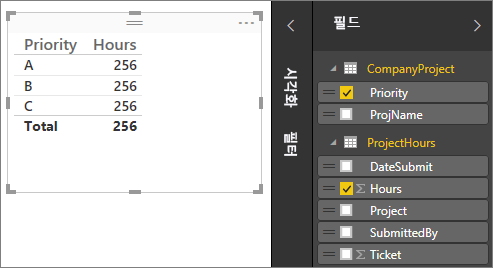

보고서 캔버스에서 테이블을 보면 각 프로젝트에 대한 시간 수가 **256.00**으로 표시되며, 합계이기도 합니다. 분명히 이 값은 잘못된 것입니다. 이유가 무엇일까요? 이는 두 테이블 간의 관계가 없으면 다른 테이블의 값(CompanyProject 테이블의 Priority)으로 분리된 한 테이블의 값(Project 테이블의 Hours)에 대한 합계를 계산할 수 없기 때문입니다.

따라서 이러한 두 테이블 간에 관계를 만들겠습니다.

열에서 두 테이블에 모두 프로젝트 이름이 있지만 값은 비슷해 보였습니다. 이러한 두 열을 사용하여 테이블 간의 관계를 만들겠습니다.

이러한 열을 사용하는 이유는 무엇일까요? ProjectHours 테이블의 Project 열을 보면 Blue, Red, Yellow, Orange 등의 값이 표시됩니다. 실제로 동일한 값을 가진 여러 행이 표시됩니다. 프로젝트에 대한 많은 색상 값이 있습니다.

CompanyProject 테이블의 ProjName 열을 보면 프로젝트에 대해 각 색상 값이 하나뿐입니다. 이 테이블의 각 색상 값은 고유하며, 이러한 두 테이블 간에 관계를 만들 수 있기 때문에 이는 중요합니다. 이 경우 다대일 관계입니다. 다대일 관계에서는 테이블 중 하나에 고유한 값을 가진 열이 하나 이상 있어야 합니다. 일부 관계에 대한 몇 가지 추가 옵션이 있으며 나중에 살펴보겠지만, 지금은 두 테이블의 각 Project 열 간에 관계를 만들겠습니다.

### 새 관계를 만들려면
1. **홈&gt;관계 관리**를 클릭합니다.
2. **관계 관리**에서 **새로 만들기**를 클릭합니다. 관계에 사용하려는 테이블, 열 및 추가 설정을 선택할 수 있는 **관계 만들기** 대화 상자가 열립니다.
3. 첫 번째 테이블에서 **ProjectHours**를 선택한 다음 **Project** 열을 선택합니다. 관계의 다 측면입니다.
4. 두 번째 테이블에서 **CompanyProject**를 선택한 다음 **ProjName** 열을 선택합니다. 관계의 일 측면입니다.  
5. **관계 만들기** 대화 상자와 **관계 관리** 대화 상자에서 **확인**을 클릭합니다.

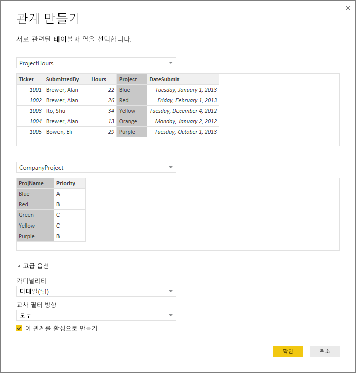

자세한 설명을 위해 지금은 이 관계를 어려운 방법으로 만들었습니다. 관계 관리 대화 상자에서 자동 검색 단추를 클릭하기만 해도 됐을 것입니다. 사실 두 열의 이름이 같은 경우 자동 검색은 사용자가 데이터를 로드할 때 이미 이 작업을 마쳤습니다. 하지만 무엇이 문제일까요?

이제 보고서 캔버스에서 다시 테이블을 살펴보겠습니다.

 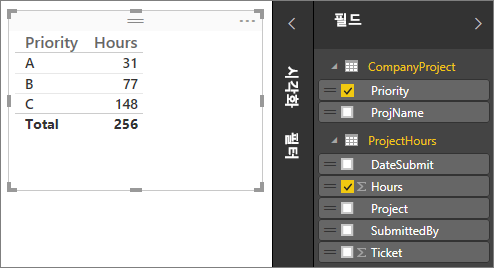

이제 훨씬 좋아보이지 않나요?

Priority를 기준으로 시간 합계를 계산하는 경우 Power BI Desktop은 CompanyProject 조회 테이블에서 고유한 색상 값의 모든 인스턴스를 찾고 CompanyProject 테이블에서 각 값의 모든 인스턴스를 찾은 다음 각 고유한 값의 합계를 계산합니다.

꽤 쉬웠지만 사실 자동 검색을 사용하면 이러한 작업조차 불필요할 수 있습니다.

## 추가 옵션 이해
자동 검색을 통해 관계가 생성되거나 수동으로 관계를 만들면 Power BI Desktop이 테이블의 데이터를 기반으로 하여 추가 옵션을 자동으로 구성합니다. 가장 낮은 부분의 관계 만들기/편집 대화 상자에 있는 이러한 추가 관계 속성을 구성할 수 있습니다.

 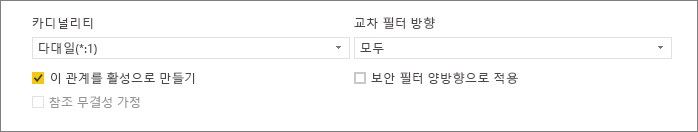

이미 설명한 것처럼 이러한 속성은 일반적으로 자동으로 설정되며 사용자가 처리할 필요가 없습니다. 그러나 직접 추가 옵션을 구성하는 것이 좋은 여러 가지 상황이 있습니다.

## 이후에 데이터를 업데이트하려면 다른 카디널리티가 필요합니다.
일반적으로 Power BI Desktop은 관계에 대한 최상의 카디널리티를 자동으로 결정할 수 있습니다.  데이터가 나중에 변경될 것을 알고 있으므로 자동 설정을 재정의해야 하는 경우 카디널리티 컨트롤에서 선택할 수 있습니다. 다른 카디널리티를 선택해야 하는 예를 살펴보겠습니다.

아래의 CompanyProjectPriority 테이블은 모든 회사 프로젝트 목록과 해당 우선 순위입니다. ProjectBudget 테이블은 예산이 승인된 프로젝트 집합입니다.

**ProjectBudget**

| **Approved Projects** | **BudgetAllocation** | **AllocationDate** |
|:--- | ---:| ---:|
| Blue |40,000 |12/1/2012 |
| Red |100,000 |12/1/2012 |
| Green |50,000 |12/1/2012 |

**CompanyProjectPriority**

| **Project** | **Priority** |
| --- | --- |
| Blue |A |
| Red |B |
| Green |C |
| Yellow |C |
| Purple |B |
| Orange |C |

CompanyProjectPriority 테이블의 Project 열과 ProjectBudget 테이블의 ApprovedProjects 열 간에 다음과 같이 관계를 만듭니다.

 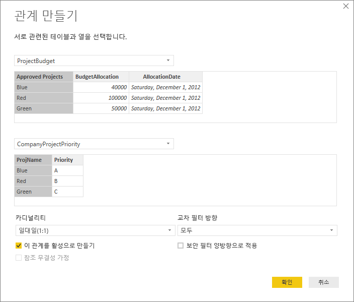

카디널리티는 자동으로 일대일(1:1)로 설정되고 교차 필터링은 양쪽으로 설정됩니다(표시 참조).  이는 Power BI Desktop에서 두 테이블의 최적 조합은 실제로 다음과 같이 표시되기 때문입니다.

| **Project** | **Priority** | **BudgetAllocation** | **AllocationDate** |
|:--- | --- | ---:| ---:|
| Blue |A |40,000 |12/1/2012 |
| Red |B |100,000 |12/1/2012 |
| Green |C |50,000 |12/1/2012 |
| Yellow |C |  |  |
| Purple |B |  |  |
| Orange |C |  |  |

결합된 테이블의 Project 열에 반복 값이 없기 때문에 두 테이블 간에 일대일 관계가 있습니다. Project 열은 각 값이 한 번씩만 나타나므로 고유하며, 따라서 두 테이블의 행을 중복 없이 직접 결합할 수 있습니다.

그러나 다음에 새로 고칠 때 데이터가 변경되는 것을 알고 있다고 가정해 보세요. 이제 새로 고친 버전의 ProjectBudget 테이블에 Blue와 Red에 대한 추가 행이 있습니다.

**ProjectBudget**

| **Approved Projects** | **BudgetAllocation** | **AllocationDate** |
| --- | ---:| ---:|
| Blue |40,000 |12/1/2012 |
| Red |100,000 |12/1/2012 |
| Green |50,000 |12/1/2012 |
| Blue |80,000 |6/1/2013 |
| Red |90,000 |6/1/2013 |

 이는 두 테이블의 최적 조합이 이제 다음과 같이 표시됨을 의미합니다. 

| **Project** | **Priority** | **BudgetAllocation** | **AllocationDate** |
| --- | --- | ---:| ---:|
| Blue |A |40,000 |12/1/2012 |
| Red |B |100,000 |12/1/2012 |
| Green |C |50,000 |12/1/2012 |
| Yellow |C |  |  |
| Purple |B |  |  |
| Orange |C |  |  |
| Blue |A |80000 |6/1/2013 |
| Red |B |90000 |6/1/2013 |

새로 결합된 테이블의 Project 열에는 반복 값이 있습니다.  테이블을 새로 고치고 나면 원래의 두 테이블 간에 일대일 관계가 없습니다. 이 경우 이후의 업데이트로 인해 Project 열에 중복 항목이 포함될 것을 알고 있으므로 ProjectBudget 쪽을 다로 지정하고 CompanyProjectPriority 쪽을 일로 지정하여 카디널리티를 다대일(\*:1)로 설정하려고 합니다.

## 복잡한 테이블 및 관계 집합에 대해 교차 필터 방향 조정
대부분의 관계에 대해 교차 필터 방향은 '양쪽'으로 설정됩니다.  그러나 드물긴 하지만 모든 관계가 단일 방향으로 설정되는 이전 버전의 파워 피벗에서 모델을 가져오는 경우처럼 기본값과 다른 값으로 설정해야 하는 경우가 있습니다. 

양쪽 설정을 사용하면 Power BI Desktop이 연결된 테이블의 모든 측면을 단일 테이블처럼 처리할 수 있습니다.  그러나 Power BI Desktop이 관계의 교차 필터 방향을 '양쪽'으로 설정할 수 없고 보고 용도로 명확한 기본값 집합도 사용 가능하도록 유지해야 하는 경우가 있습니다. 관계 교차 필터 방향을 양쪽으로 설정하지 않는 경우는 보통 모호해지기 때문입니다.  기본 교차 필터 설정이 적합하지 않은 경우 특정 테이블 방향이나 양쪽으로 설정할 수 있습니다.

단일 방향 교차 필터링은 대부분의 상황에서 작동합니다.  실제로 Excel 2013 또는 그 이전 버전의 파워 피벗에서 모델을 가져온 경우 모든 관계가 단일 방향으로 설정됩니다.  단일 방향은 집계 작업이 발생하는 테이블에 연결된 테이블의 필터링 선택 항목이 적용됨을 의미합니다.  때로는 교차 필터링 이해가 약간 어려울 수 있으므로 예를 살펴보겠습니다.

 

단일 방향 교차 필터링을 사용하여 프로젝트 시간을 요약하는 보고서를 만드는 경우 CompanyProject, Priority 또는 CompanyEmployee, City를 기준으로 요약(또는 필터링)하도록 선택할 수 있습니다.   그러나 (덜 일반적인 질문이기는 하지만) 프로젝트당 직원 수를 계산하려는 경우에는 작동하지 않습니다. 모두 동일한 값을 가진 열이 생성됩니다.  아래 예제에서는 관계 교차 필터링 방향이 둘 다 단일 방향(ProjectHours 테이블 방향)으로 설정됩니다.

 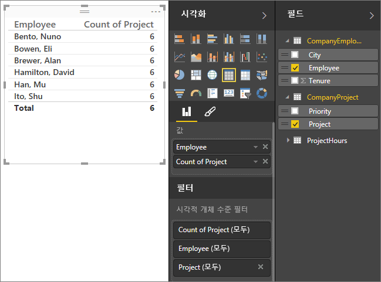

필터 지정은 CompanyProject에서 CompanyEmployee로 진행되지만(아래 그림 참조) CompanyEmployee까지 진행되지는 않습니다.  그러나 교차 필터링 방향을 양쪽으로 설정하면 작동합니다.  양쪽으로 설정하면 필터 지정이 Employee까지 진행될 수 있습니다.

 

교차 필터링 방향을 둘 다로 설정하면 이제 보고서가 올바르게 표시됩니다.

 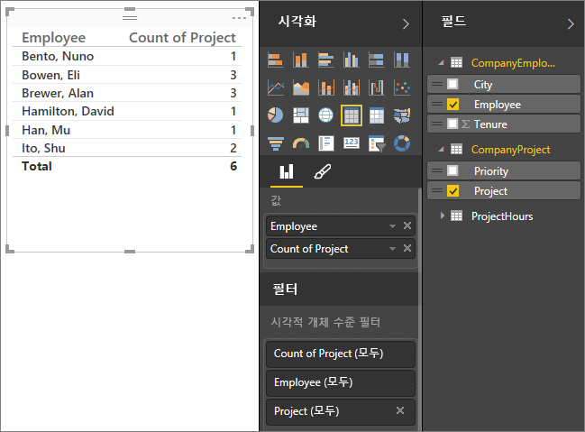

양쪽 방향으로의 교차 필터링은 위 패턴과 같은 테이블 관계 패턴에서도 제대로 작동합니다. 일반적으로 이를 다음과 같이 별모양 스키마라고 합니다.

 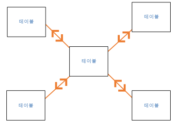

교차 필터링 방향은 다음 다이어그램과 같이 데이터베이스에서 자주 발견되는 보다 일반적인 패턴에서는 제대로 작동하지 않습니다.

 

루프와 함께 이러한 테이블 패턴이 있는 경우 교차 필터링에서 모호한 관계 집합을 만들 수 있습니다. 예를 들어 테이블 X에서 필드 합계를 계산한 다음 테이블 Y의 필드를 기준으로 필터링하도록 선택하는 경우 필터가 상단 테이블을 통해 진행되어야 하는지 또는 하단 테이블을 통해 진행되어야 하는지 명확하지 않습니다. 이러한 패턴의 일반적인 예로 판매 실적 데이터가 있는 판매 테이블인 테이블 X와 예산 데이터가 될 테이블 Y를 들 수 있습니다. 그러면 가운데 테이블이 부서, 지역 등, 두 테이블이 사용할 조회 테이블이 됩니다. 

활성/비활성 관계와 마찬가지로 보고서에 모호성을 만드는 경우 Power BI Desktop에서 관계를 양쪽으로 설정할 수 없습니다. 여러 가지 방법으로 이를 처리할 수 있는 데, 가장 일반적인 두 가지 방법은 다음과 같습니다.

* 모호성을 줄이기 위해 관계를 삭제하거나 비활성으로 표시합니다. 그런 다음 관계 교차 필터링을 양쪽으로 설정할 수 있습니다.
* 테이블을 두 번 가져와(두 번째는 다른 이름으로) 루프를 제거합니다.  이렇게 하면 관계 패턴이 별모양 스키마와 비슷해집니다.  별모양 스키마를 사용할 경우 모든 관계를 양쪽으로 설정할 수 있습니다.

## 잘못된 활성 관계
Power BI Desktop이 자동으로 관계를 만들 때 두 테이블 간에 둘 이상의 관계를 발견하는 경우도 있습니다.  이 경우 관계 중 하나만 활성으로 설정됩니다.  활성 관계는 서로 다른 두 테이블에서 필드를 선택할 때 Power BI Desktop이 자동으로 시각화를 만들 수 있도록 기본 관계 역할을 합니다.  그러나 자동으로 선택된 관계가 잘못된 경우도 있습니다.  관계 관리 대화 상자를 사용하여 관계를 활성 또는 비활성으로 설정하거나, 관계 편집 대화 상자에서 활성 관계를 설정할 수 있습니다. 

기본 관계가 있도록 하기 위해 Power BI Desktop은 지정된 시간에 두 테이블 간에 하나의 활성 관계만 허용합니다.  따라서 먼저 현재 관계를 비활성으로 설정한 다음 활성화할 관계를 설정해야 합니다.

예를 살펴보겠습니다. 이 첫 번째 테이블은 ProjectTickets이고 다음 테이블은 EmployeeRole입니다.

**ProjectTickets**

| **Ticket** | **OpenedBy** | **SubmittedBy** | **Hours** | **Project** | **DateSubmit** |
| ---:|:--- |:--- | ---:|:--- | ---:|
| 1001 |Perham, Tom |Brewer, Alan |22 |Blue |1/1/2013 |
| 1002 |Roman, Daniel |Brewer, Alan |26 |Red |2/1/2013 |
| 1003 |Roth, Daniel |Ito, Shu |34 |Yellow |12/4/2012 |
| 1004 |Perham, Tom |Brewer, Alan |13 |Orange |1/2/2012 |
| 1005 |Roman, Daniel |Bowen, Eli |29 |Purple |10/1/2013 |
| 1006 |Roth, Daniel |Bento, Nuno |35 |Green |2/1/2013 |
| 1007 |Roth, Daniel |Hamilton, David |10 |Yellow |10/1/2013 |
| 1008 |Perham, Tom |Han, Mu |28 |Orange |1/2/2012 |
| 1009 |Roman, Daniel |Ito, Shu |22 |Purple |2/1/2013 |
| 1010 |Roth, Daniel |Bowen, Eli |28 |Green |10/1/2013 |
| 1011 |Perham, Tom |Bowen, Eli |9 |Blue |10/15/2013 |

**EmployeeRole**

| **Employee** | **Role** |
| --- | --- |
| Bento, Nuno |Project Manager |
| Bowen, Eli |Project Lead |
| Brewer, Alan |Project Manager |
| Hamilton, David |Project Lead |
| Han, Mu |Project Lead |
| Ito, Shu |Project Lead |
| Perham, Tom |Project Sponsor |
| Roman, Daniel |Project Sponsor |
| Roth, Daniel |Project Sponsor |

실제로 여기에는 두 개의 관계가 있습니다. 하나는 ProjectTickets 테이블의 SubmittedBy와 EmployeeRole 테이블의 Employee 간 관계이고, 다른 하나는 ProjectTickets 테이블의 OpenedBy와 EmployeeRole 테이블의 Employee 간 관계입니다.

 

두 관계를 모두 모델에 추가하면(먼저 OpenedBy 추가) 관계 관리 대화 상자에 OpenedBy가 활성 상태로 표시됩니다.

 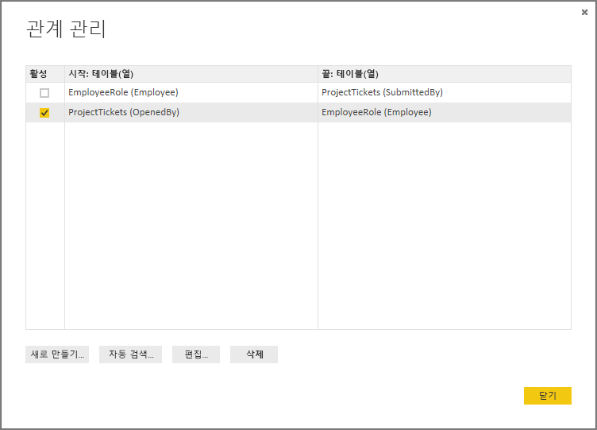

이제 보고서 캔버스의 테이블 시각화에 EmployeeRole의 Role 및 Employee 필드와 ProjectTickets의 Hours 필드를 사용하는 보고서를 만들면 프로젝트 스폰서만 표시되는 데 이것은 이들만이 프로젝트 티켓을 열었기 때문입니다.

 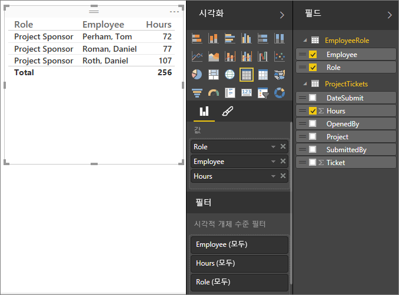

활성 관계를 변경하여 OpenedBy 대신 SubmittedBy를 가져올 수 있습니다. 관계 관리에서 ProjectTickets(OpenedBy)와 EmployeeRole(Employee) 간의 관계를 선택 취소한 다음 Project Tickets(SubmittedBy)와 EmployeeRole(Employee) 간의 관계를 선택합니다.

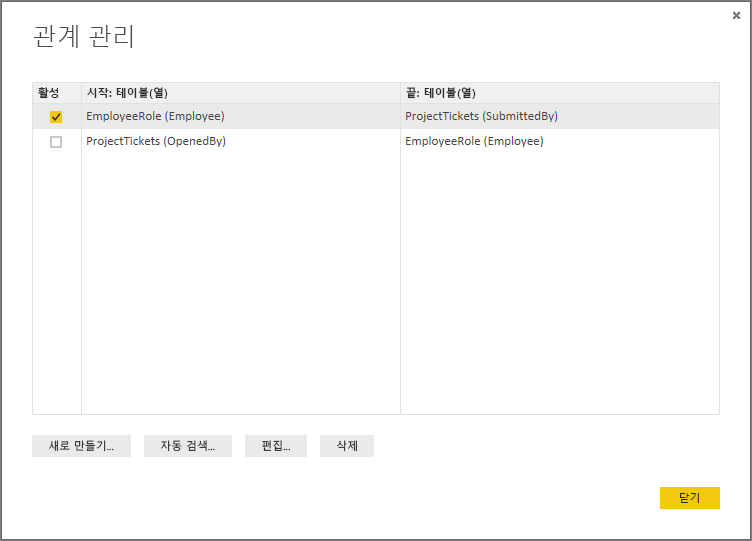

## 관계 보기의 모든 관계 참조
경우에 따라 모델에 여러 테이블이 있고 테이블 간의 관계가 복잡할 수 있습니다. Power BI Desktop의 관계 보기는 모델의 모든 관계, 방향 및 카디널리티를 이해하기 쉽고 사용자 지정 가능한 표로 제시합니다. 자세한 내용은 [Power BI Desktop의 관계 보기](desktop-relationship-view.md)를 참조하세요.

