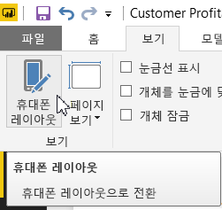
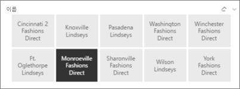
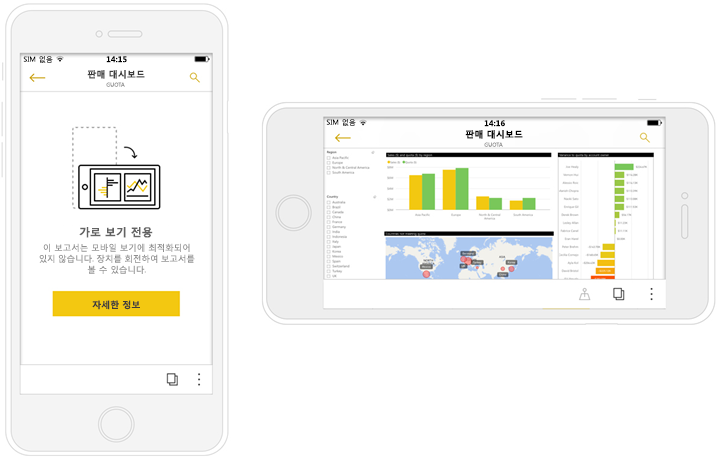

# Power BI 모바일 앱에 최적화된 보고서 만들기
휴대폰 또는 태블릿의 모바일 앱에서 편리하게 볼 수 있도록 보고서를 만들 수 있습니다. 휴대폰 및 태블릿을 위해 세로 버전의 보고서를 만들면 됩니다. 휴대폰 및 태블릿에서 편리하게 볼 수 있도록 Power BI Desktop과 Power BI 서비스에서 시각적 개체를 재배치하거나 크기를 조정하는 등 보고서를 조정할 수 있습니다. 시각적 개체를 모두 포함하지 않아도 됩니다. 또한 휴대폰에서 볼 수 있도록 크기를 적절히 조정하는 [*반응형* 시각적 개체](#optimize-a-visual-for-any-size) 및 [반응형 슬라이서](#enhance-slicers-to-to-work-well-in-phone-reports)를 만들 수 있습니다. 보고서에 필터를 추가한 경우, 해당 필터가 최적화된 보고서에 자동으로 나타납니다. 보고서 구독자는 해당 필터를 확인하고 해당 필터로 보고서를 필터링할 수 있습니다.

## 세로 버전의 보고서 페이지 레이아웃 지정하기

보고서를 만들었으면 휴대폰 및 태블릿에 맞게 최적화할 수 있습니다.

1. Power BI Desktop의 보고서 보기에 있는 **보기** 탭에서 **휴대폰 레이아웃**을 선택합니다.  
   
    
   
    Power BI 서비스에서 **보고서 편집** > **모바일 레이아웃**를 선택합니다.

    휴대폰 모양의 빈 캔버스를 볼 수 있습니다. 원본 보고서 페이지의 모든 시각적 개체는 오른쪽의 시각화 창에 나열됩니다.

3. 휴대폰 레이아웃에 시각적 개체를 추가하려면 시각화 창에서 휴대폰 캔버스로 끌어옵니다.
   
    휴대폰 보고서는 그리드 레이아웃을 사용합니다. 시각적 개체를 모바일 캔버스로 끌어오면 해당 그리드로 딸깍 소리를 내며 맞춰집니다.
   
    
   
    마스터 보고서 페이지의 일부 또는 모든 시각적 개체를 휴대폰 보고서 페이지에 추가할 수 있습니다. 각 시각적 개체는 한 번만 추가할 수 있습니다.

4. 그리드 위의 시각적 개체를 대시보드 및 모바일 대시보드 위의 타일에 대해서와 마찬가지로 크기를 조정할 수 있습니다.
   
   휴대폰용 보고서 그리드는 다양한 크기의 휴대폰에 맞게 크기가 조정되므로 보고서가 크고 작은 휴대폰 화면에서 모두 보기 좋게 표시됩니다.
   
   

## 모든 크기에 대해 시각적 개체 최적화
대시보드 또는 보고서에서 시각적 개체를 *반응형*으로 설정하면 시각적 개체가 화면 크기에 따라 동적으로 변경되어 가능한 한 많은 데이터와 정보가 표시됩니다. 

Power BI는 시각적 요소의 크기가 변경될 때 데이터가 보여지는 방식을 최우선으로 고려합니다. 예를 들어, 시각적 개체의 크기가 작아져도 정보가 효과적으로 표시되도록 자동으로 패딩을 제거하고 시각적 요소의 맨 위로 범례를 이동합니다.

각 시각적 개체에 대해 응답성을 사용하도록 설정할지 여부를 선택합니다. [시각적 개체 최적화](visuals/desktop-create-responsive-visuals.md)에 대해 자세히 알아보세요.

## 휴대폰 보고서 레이아웃을 만들 때 고려 사항
* 여러 페이지의 보고서인 경우 모든 페이지 또는 일부만 최적화할 수 있습니다. 
* 보고서 페이지에 대한 배경색을 정의한 경우 휴대폰 보고서는 동일한 배경색을 갖게 됩니다.
* 휴대폰에 대해서만 서식 지정 설정을 수정할 수 없습니다. 서식 지정은 마스터 및 모바일 레이아웃 간에 일관됩니다. 예를 들어 글꼴 크기는 같을 것입니다.
* 서식 지정, 데이터 세트, 필터 또는 기타 특성을 변경하는 것과 같이 시각적 개체를 변경하려면 일반 보고서 작성 모드로 돌아갑니다.
* Power BI는 모바일 앱에서 휴대폰 보고서에 대한 기본 제목 및 페이지 이름을 제공합니다. 보고서에 제목 및 페이지 이름에 대한 텍스트 시각적 개체를 만들었다면 휴대폰 보고서에는 추가하지 않는 것이 좋습니다.     

## 휴대폰 레이아웃에서 시각적 개체 제거
* 시각적 개체를 제거 하려면, 휴대폰 캔버스에서 시각적 개체의 오른쪽 위에 있는 X를 클릭하거나 그것을 선택하고 **삭제**를 누릅니다.
  
   여기서 시각적 개체를 제거하면 휴대폰 레이아웃 캔버스에서만 제거됩니다. 시각적 개체와 원본 보고서가 영향을 받지 않습니다.
  
   

## 휴대폰 보고서에서 잘 작동하도록 슬라이서 강화
슬라이서는 보고서 데이터의 캔버스 상 필터링을 제공합니다. 일반 보고서 작성 모드에서 슬라이서를 디자인할 때 휴대폰 보고서에서 더 유용하도록 슬라이서 설정을 일부 수정할 수 있습니다.

* 보고서를 읽는 사람이 항목을 하나만 또는 여러 개 선택할 수 있는지 결정합니다.
* 보고서를 보다 검색하기 쉽게 하려면 슬라이서 주위에 상자를 배치합니다.
* 슬라이서를 수직, 수평 또는 *반응형*이 되게 합니다. 

슬라이서를 반응형으로 설정하는 경우 크기와 셰이프를 변경함에 따라 더 많거나 적은 옵션이 표시됩니다. 길게, 짧게, 넓게 또는 좁게 적용할 수 있습니다. 충분히 작게 만드는 경우 보고서 페이지에 필터 아이콘만 표시됩니다. 

[반응형 슬라이서 만들기](power-bi-slicer-filter-responsive.md)에 대해 자세히 알아보세요.

## 휴대폰 보고서 게시
* 휴대폰 버전의 보고서를 게시하려면 [주 보고서를 Power BI Desktop에서 Power BI 서비스에 게시](desktop-upload-desktop-files.md)하고 동시에 휴대폰 버전을 게시합니다.
  
    [Power BI에서 공유 및 사용 권한](service-how-to-collaborate-distribute-dashboards-reports.md)에 대해 자세히 알아보세요.

## 휴대폰 또는 태블릿에서 최적화된 보고서와 최적화되지 않은 보고서 보기
휴대폰 상의 Mobile Apps에서 Power BI는 최적화된 휴대폰 보고서와 최적화되지 않은 휴대폰 보고서를 자동으로 검색합니다. 휴대폰에 최적화된 보고서가 있다면 Power BI 휴대폰 앱은 휴대폰 보고서 모드에서 보고서를 자동으로 엽니다.

휴대폰에 최적화된 보고서가 없다면 보고서는 최적화되지 않은 가로 보기 화면으로 열립니다.  

휴대폰 보고서에서 휴대폰을 가로 보기 방향으로 바꿀 경우 보고서 최적화 여부에 상관없이 보고서는 최적화되지 않은 보기에서 원본 보고서 레이아웃으로 열립니다.

일부 페이지만 최적화하는 경우, 독자가 세로 보기 메시지를 보게 될 것이며 이는 보고서가 가로 보기로 사용 가능하다는 것을 의미합니다.

보고서를 보는 사용자는 휴대폰 또는 태블릿을 가로로 돌려서 페이지를 가로 모드로 볼 수 있습니다. [세로 모드에 최적화된 Power BI 보고서와 상호 작용](consumer/mobile/mobile-apps-view-phone-report.md)하는 방법에 대해 자세히 알아보세요.

## 다음 단계
* [Power BI에서 대시보드 휴대폰 보기 만들기](service-create-dashboard-mobile-phone-view.md)
* [휴대폰에 대해 최적화된 Power BI 보고서 보기](consumer/mobile/mobile-apps-view-phone-report.md)
* [모든 크기에 최적화된 반응형 시각적 개체 만들기](visuals/desktop-create-responsive-visuals.md)
* 궁금한 점이 더 있나요? [Power BI 커뮤니티에 질문합니다.](http://community.powerbi.com/)

