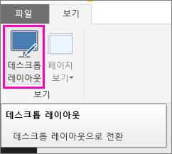
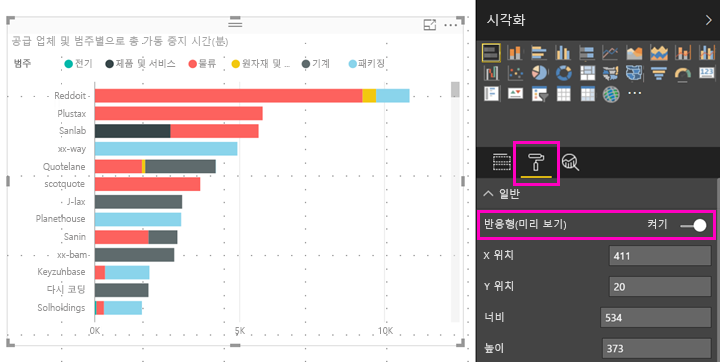

# 모든 크기의 Power BI 시각적 개체 최적화
대시보드 또는 보고서에서 시각적 개체를 *반응형*으로 설정하여 화면 크기와 상관없이 최대 데이터 양 및 정보를 표시하도록 동적으로 변경할 수 있습니다.

시각적 개체 크기가 변경되면, Power BI는 데이터 보기의 우선 순위를 지정합니다. 예를 들어 패딩을 제거하고 범례를 시각적으로 맨 위로 자동으로 이동하여 시각적 개체 크기가 작아져도 정보를 계속 제공할 수 있도록 합니다. 응답성은 휴대폰에 있는 Power BI 모바일 앱의 시각적 개체에 특히 유용합니다.

X축, Y축 및 슬라이서를 사용하여 시각적 개체에 대한 응답성을 켤 수 있습니다.

## Power BI Desktop에서 응답성 켜기
1. Power BI Desktop의 **보기** 탭에서 **데스크톱 레이아웃**에 있는지 확인합니다.
   
    
2. 시각적 개체를 선택하고 **시각화** 창에서 **형식** 섹션을 선택합니다.
3. **일반**을 확장하고 > **Responsive(반응형)**을 **켜기**로 밉니다.
   
    
   
     이제 [휴대폰에 최적화된 보고서를 만들고](desktop-create-phone-report.md) 이 시각적 개체를 추가하면 적절하게 크기가 조정됩니다.

## Power BI 서비스에서 응답성 켜기
Power BI 서비스에 있는 보고서의 시각적 개체에 대해 응답성을 켭니다. 보고서를 편집할 수 있어야 합니다.

1. Power BI 서비스의 보고서에서([https://powerbi.com](https://powerbi.com)) **보고서 편집**을 선택합니다.
2. 시각적 개체를 선택하고 **시각화** 창에서 **형식** 섹션을 선택합니다.
3. **일반**을 확장하고 > **Responsive(반응형)**을 **켜기**로 밉니다.
   
    
   
     이제 [대시보드의 휴대폰 보기를 만들고](service-create-dashboard-mobile-phone-view.md) 이 시각적 개체를 추가하면 적절하게 크기가 조정됩니다.

## 다음 단계
* [Power BI 휴대폰 앱에 대해 최적화된 보고서 만들기](desktop-create-phone-report.md)
* [Power BI에서 대시보드 휴대폰 보기 만들기](service-create-dashboard-mobile-phone-view.md)
* [휴대폰에 대해 최적화된 Power BI 보고서 보기](mobile-apps-view-phone-report.md)
* 궁금한 점이 더 있나요? [Power BI 커뮤니티에 질문합니다.](http://community.powerbi.com/)

