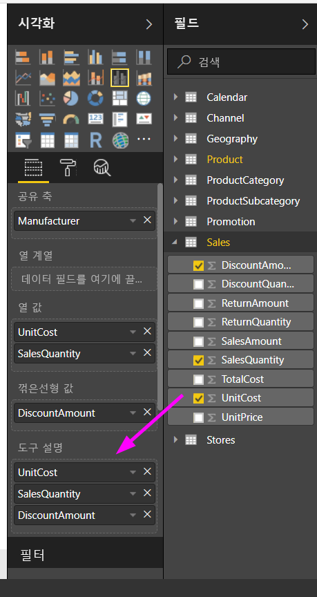
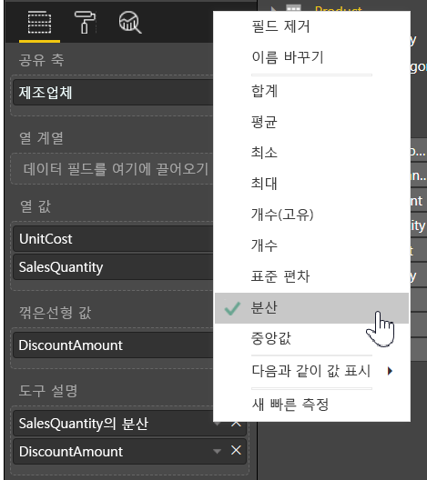

# Power BI Desktop에서 도구 설명 사용자 지정
도구 설명은 시각적 개체의 데이터 요소에 대한 자세한 컨텍스트 정보 및 세부 정보를 제공하는 세련된 방법입니다. 다음 이미지는 Power BI Desktop에서 차트에 적용되는 도구 설명을 보여 줍니다.

시각화가 만들어질 때 기본 도구 설명은 데이터 요소 값 및 범주를 표시합니다. 도구 설명 정보를 사용자 지정할 수 있는 것이 유용하고, 시각적 개체를 보는 사용자에게 추가 컨텍스트 및 정보를 제공할 수 있는 경우가 많습니다. 사용자 지정 도구 설명을 통해 도구 설명의 일부로 표시하는 추가 데이터 요소를 지정할 수 있습니다.

## 도구 설명을 사용자 지정하는 방법
사용자 지정된 도구 설명을 만들려면 다음 그림과 같이 **시각화** 창의 **필드** 영역에서 **도구 설명** 버킷으로 필드를 끌어서 놓습니다. 다음 이미지에서 두 개의 필드가 **도구 설명** 버킷에 배치되었습니다.

도구 설명이 필드에 추가된 후에 시각화의 데이터 요소를 가리키면 도구 설명의 해당 필드에 대한 값을 표시합니다.

## 집계 또는 빠른 계산으로 도구 설명 사용자 지정
집계 함수를 선택하거나 **도구 설명** 버킷에서 필드 옆의 화살표를 선택하고 사용 가능한 옵션에서 선택하여 빠른 계산으로 추가로 도구 설명을 사용자 지정할 수 있습니다. 

대시보드 또는 보고서를 보는 사용자에게 신속한 정보를 전달하기 위해 데이터 세트에서 사용할 수 있는 모든 필드를 사용하여 **도구 설명**을 사용자 지정하는 많은 방법이 있습니다.

