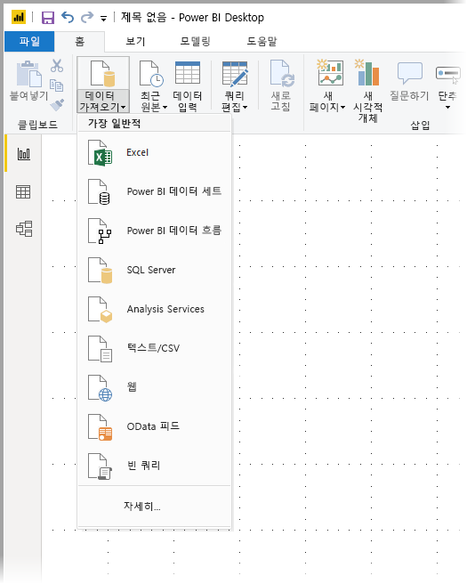
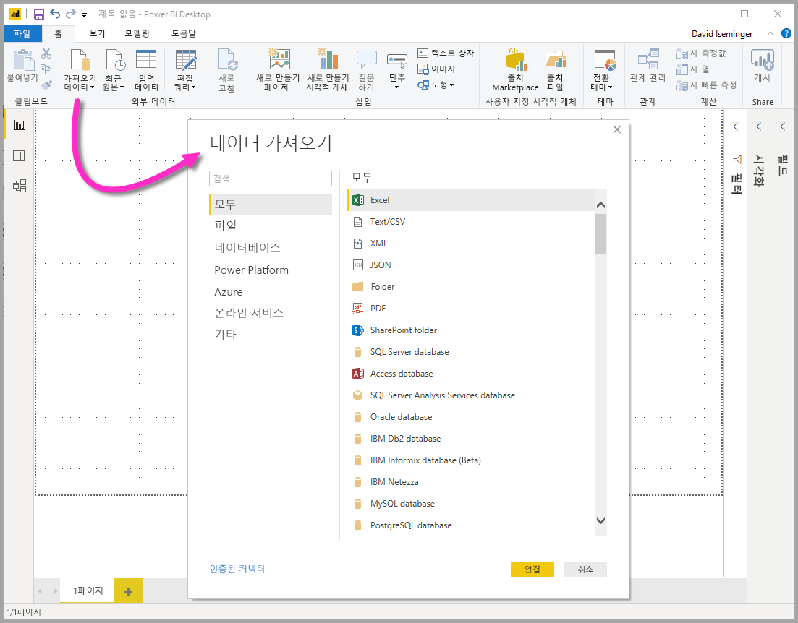
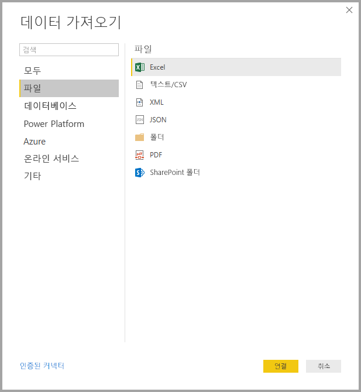
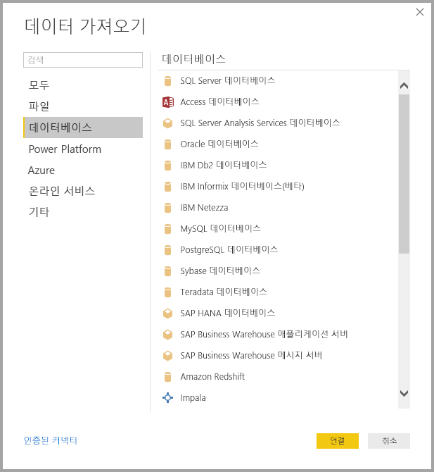
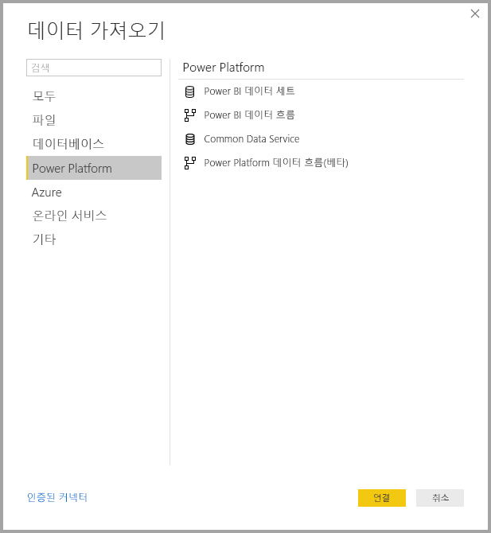
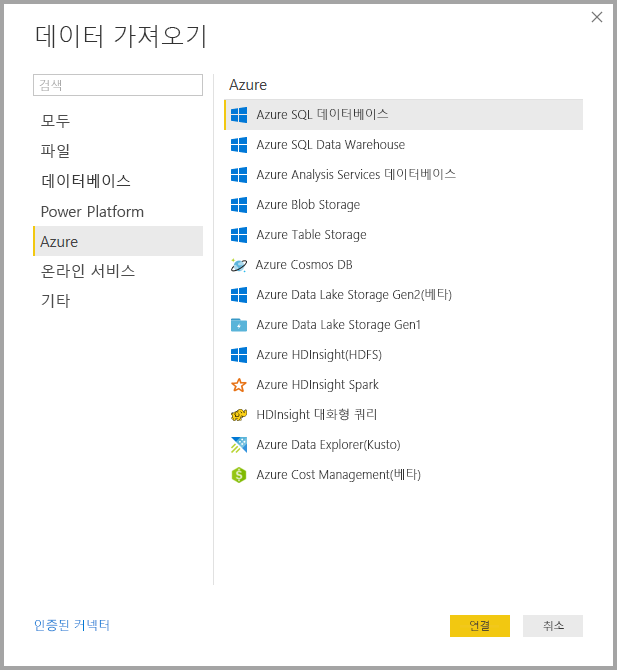
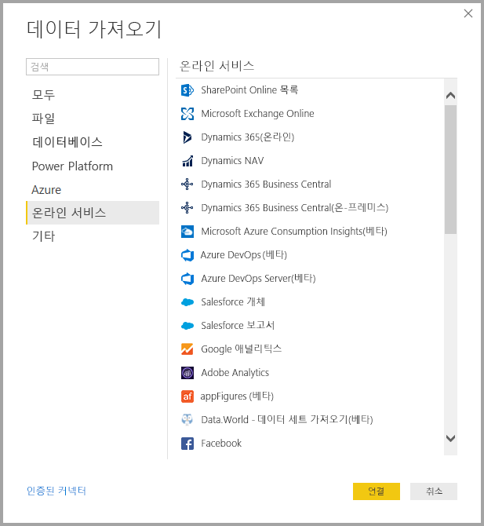
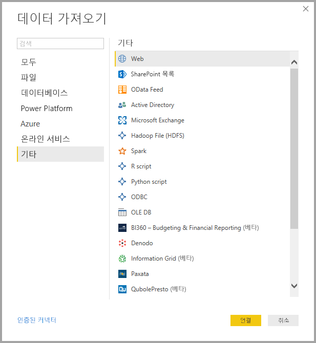
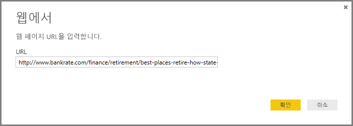
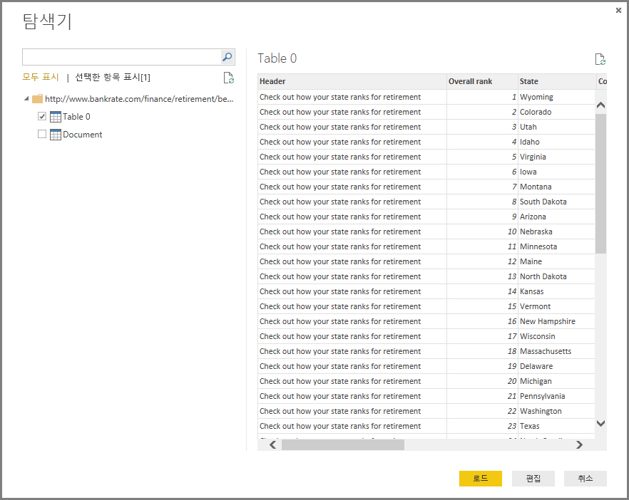

# <a name="data-sources-in-power-bi-desktop"></a>Power BI Desktop의 데이터 원본

Power BI Desktop을 사용하면 다양한 원본의 데이터에 연결할 수 있습니다. 사용 가능한 데이터 원본에 대한 전체 목록은 [Power BI 데이터 원본](power-bi-data-sources.md)을 참조하세요.

**홈** 리본을 사용하여 데이터에 연결합니다. **가장 일반적** 데이터 형식 메뉴를 표시하려면 **데이터 가져오기** 단추 레이블이나 아래쪽 화살표를 선택합니다.



**데이터 가져오기** 대화 상자로 이동하려면 **가장 일반적** 데이터 형식 메뉴를 표시하고 **자세히**를 선택합니다. **데이터 가져오기** 아이콘을 직접 선택하여 **데이터 가져오기** 대화 상자를 표시할 수도 있습니다(**가장 일반적** 메뉴 무시).



> [!NOTE]
> Power BI 팀은 Power BI Desktop 및 Power BI 서비스에 사용할 수 있는 데이터 원본을 지속적으로 확장하고 있습니다. 따라서 **베타** 또는 **미리 보기**로 표시된 작업 진행 데이터 원본의 초기 버전을 자주 볼 수 있습니다. **베타** 또는 **미리 보기**로 표시된 모든 데이터 원본은 지원 및 기능이 제한되며, 프로덕션 환경에서 사용하면 안 됩니다. 또한 Power BI Desktop에서 **베타** 또는 **미리 보기**로 표시된 데이터 원본은 데이터 원본이 GA(일반 공급) 상태가 될 때까지 Power BI 서비스 또는 기타 Microsoft 서비스에서 사용하지 못할 수 있습니다.

> [!NOTE]
> 인증에 Internet Explorer 10 이상이 필요한 Power BI Desktop용 데이터 커넥터가 많습니다. 


## <a name="data-sources"></a>데이터 원본

**데이터 가져오기** 대화 상자는 다음 범주의 데이터 형식을 구성합니다.

* 모두
* 파일
* 데이터베이스
* Power Platform
* Azure
* 온라인 서비스
* 기타

**모두** 범주에는 모든 범주의 모든 데이터 연결 유형이 포함됩니다.

### <a name="file-data-sources"></a>파일 데이터 원본

**파일** 범주는 다음과 같은 데이터 연결을 제공합니다.

* Excel
* 텍스트/CSV
* XML
* JSON
* 폴더
* PDF
* SharePoint 폴더

다음 그림은 **파일**에 대한 **데이터 가져오기** 창을 보여 줍니다.



### <a name="database-data-sources"></a>데이터베이스 데이터 원본

**데이터베이스** 범주는 다음과 같은 데이터 연결을 제공합니다.

* SQL Server 데이터베이스
* Access 데이터베이스
* SQL Server Analysis Services 데이터베이스
* Oracle 데이터베이스
* IBM DB2 데이터베이스
* IBM Informix 데이터베이스(베타)
* IBM Netezza
* MySQL 데이터베이스
* PostgreSQL 데이터베이스
* Sybase 데이터베이스
* Teradata 데이터베이스
* SAP HANA 데이터베이스
* SAP Business Warehouse 애플리케이션 서버
* SAP Business Warehouse 메시지 서버
* Amazon Redshift
* Impala
* Google BigQuery
* Vertica
* Snowflake
* Essbase
* AtScale 큐브(베타)
* BI 커넥터
* Denodo
* Dremio
* Exasol
* Indexima(베타)
* InterSystems IRIS(베타)
* Jethro(베타)
* Kyligence
* MarkLogic

> [!NOTE]
> 일부 데이터베이스 커넥터는 **파일 > 옵션 및 설정 > 옵션**을 선택한 다음 **미리 보기 기능**을 선택하고 커넥터를 사용하도록 설정하여 사용해야 합니다. 위에서 언급한 커넥터 중 일부를 표시하지 않고 사용하지 않으려는 경우 **미리 보기 기능** 설정을 확인합니다. *베타* 또는 *미리 보기*로 표시된 모든 데이터 원본은 제한된 지원 및 기능을 가지며 프로덕션 환경에서는 사용할 수 없습니다.

다음 그림은 **데이터베이스**에 대한 **데이터 가져오기** 창을 보여 줍니다.



### <a name="power-platform-data-sources"></a>Power Platform 데이터 원본

**Power Platform** 범주는 다음과 같은 데이터 연결을 제공합니다.

* Power BI 데이터 세트
* Power BI 데이터 흐름
* Common Data Service
* Power Platform 데이터 흐름

다음 그림은 **Power Platform**에 대한 **데이터 가져오기** 창을 보여 줍니다.



### <a name="azure-data-sources"></a>Azure 데이터 원본

**Azure** 범주는 다음과 같은 데이터 연결을 제공합니다.

* Azure SQL 데이터베이스
* Azure SQL Data Warehouse
* Azure Analysis Services 데이터베이스
* Azure Blob Storage
* Azure Table Storage
* Azure Cosmos DB
* Azure Data Lake Storage Gen2
* Azure Data Lake Storage Gen1
* Azure HDInsight(HDFS)
* Azure HDInsight Spark
* HDInsight 대화형 쿼리
* Azure Data Explorer(Kusto)
* Azure Cost Management
* Azure Time Series Insights(베타)

다음 그림은 **Azure**에 대한 **데이터 가져오기** 창을 보여 줍니다.



### <a name="online-services-data-sources"></a>온라인 서비스 데이터 원본

**온라인 서비스** 범주는 다음과 같은 데이터 연결을 제공합니다.

* SharePoint Online 목록
* Microsoft Exchange Online
* Dynamics 365(온라인)
* Dynamics NAV
* Dynamics 365 Business Central
* Dynamics 365 Business Central(온-프레미스)
* Microsoft Azure Consumption Insights(베타)
* Azure DevOps(베타)
* Azure DevOps Server(베타)
* Salesforce 개체
* Salesforce 보고서
* Google 애널리틱스
* Adobe Analytics
* appFigures(베타)
* Data.World - 데이터 세트 가져오기(베타)
* Facebook
* GitHub(베타)
* LinkedIn Sales Navigator(베타)
* MailChimp(베타)
* Marketo(베타)
* Mixpanel(베타)
* Planview Enterprise One - PRM(베타)
* Planview Projectplace(베타)
* QuickBooks Online(베타)
* Smartsheet
* SparkPost(베타)
* SweetIQ(베타)
* Planview Enterprise One - CTM(베타)
* Twilio(베타)
* tyGraph(베타)
* Webtrends(베타)
* Zendesk(베타)
* Dynamics 365 Customer Insights(베타)
* Emigo 데이터 원본
* Entersoft Business Suite(베타)
* Industrial App Store
* Intune Data Warehouse(베타)
* Microsoft Graph 보안(베타)
* Product Insights(베타)
* Quick Base
* TeamDesk(베타)
* Workplace Analytics(베타)

다음 그림은 **온라인 서비스**에 대한 **데이터 가져오기** 창을 보여 줍니다.



### <a name="other-data-sources"></a>기타 데이터 원본

**기타** 범주는 다음과 같은 데이터 연결을 제공합니다.

* 웹
* SharePoint 목록
* OData 피드
* Active Directory
* Microsoft Exchange
* HDFS(Hadoop 파일)
* Spark
* R 스크립트
* Python 스크립트
* ODBC
* OLE DB
* BI360 - 예산 및 재무 보고(베타)
* Information Grid(베타)
* Paxata
* QubolePresto(베타)
* Roamler(베타)
* Siteimprove(베타)
* SurveyMonkey(베타)
* Tenforce(스마트) 목록(베타)
* Vena(베타)
* Workforce Dimensions(베타)
* 빈 쿼리

다음 그림은 **기타**에 대한 **데이터 가져오기** 창을 보여 줍니다.



> [!NOTE]
> 지금은 Azure Active Directory를 사용하여 보호되는 사용자 지정 데이터 원본에 연결할 수 없습니다.

## <a name="connecting-to-a-data-source"></a>데이터 원본에 연결

데이터 원본에 연결하려면 **데이터 가져오기** 창에서 데이터 원본을 선택한 다음 **연결**을 선택합니다. 다음 그림에서는 **기타** 데이터 연결 범주에서 **웹**이 선택됩니다.


데이터 연결 형식과 관련된 연결 창이 표시됩니다. 자격 증명이 필요한 경우 제공하라는 메시지가 표시됩니다. 다음 그림은 웹 데이터 원본에 연결하기 위해 입력되는 URL을 보여 줍니다.



URL 또는 리소스 연결 정보를 입력한 다음 **확인**을 선택합니다. Power BI Desktop이 데이터 원본에 연결하고 **탐색기**에 사용 가능한 데이터 원본을 제공합니다.



데이터를 로드하려면 **탐색기** 창의 맨 아래에서 **로드** 단추를 선택합니다. Power Query 편집기에서 쿼리를 변환하거나 편집하려면 데이터를 로드하기 전에 **데이터 변환** 단추를 선택합니다.

Power BI Desktop에서 데이터 원본에 연결하는 데 필요한 작업을 마쳤습니다. 데이터 원본의 성장 목록에서 데이터에 연결을 시도하고 자주 확인하세요. 항상 이 목록에 계속해서 추가합니다.

## <a name="using-pbids-files-to-get-data"></a>PBIDS 파일을 사용하여 데이터 가져오기

PBIDS 파일은 특정 구조가 있는 Power BI Desktop 파일이며, Power BI 데이터 원본 파일임을 식별하기 위한 .PBIDS 확장명이 있습니다.

PBIDS 파일을 만들어 조직에서 보고서 작성자의 **데이터 가져오기** 환경을 간소화할 수 있습니다. 관리자는 새 보고서 작성자가 보다 쉽게 PBIDS 파일을 사용할 수 있도록 일반적으로 사용되는 연결을 위해 이러한 파일을 만드는 것이 좋습니다.

작성자가 PBIDS 파일을 열면 Power BI Desktop이 열리고 인증을 위해 자격 증명을 입력하라는 메시지를 사용자에게 표시하고 파일에 지정되어 있는 데이터 원본에 연결합니다. **탐색** 대화 상자가 나타나면 사용자가 해당 데이터 원본에서 테이블을 선택하여 모델에 로드해야 합니다. PBIDS 파일에서 데이터베이스가 지정되지 않은 경우 사용자가 데이터베이스를 선택해야 할 수도 있습니다.

선택한 후에는 사용자가 시각화를 빌드하거나 **최근 원본**을 선택하여 새 테이블 집합을 모델에 로드할 수 있습니다.

현재 PBIDS 파일은 한 파일에서 하나의 데이터 원본만 지원합니다. 둘 이상의 데이터 원본을 지정하면 오류가 발생합니다.

PBIDS 파일을 만들려면 관리자가 단일 연결에 필요한 입력을 지정해야 합니다. 연결 모드를 DirectQuery 또는 가져오기로 지정할 수도 있습니다. 파일에 **모드**가 없거나 null인 경우, Power BI Desktop에서 파일을 여는 사용자에게 **DirectQuery** 또는 **가져오기**를 선택하라는 메시지가 표시됩니다.

### <a name="pbids-file-examples"></a>PBIDS 파일 예제

이 섹션에서는 일반적으로 사용되는 데이터 원본의 몇 가지 예를 제공합니다. PBIDS 파일 형식은 Power BI Desktop에서도 지원되는 데이터 연결만 지원합니다. 단, Live Connect 및 빈 쿼리의 경우는 예외입니다.

PBIDS 파일은 인증 정보와 테이블 및 스키마 정보를 포함하지 *않습니다*.  

다음 코드 조각은 PBIDS 파일의 몇 가지 일반적인 예이지만 완전하거나 포괄적이지는 않습니다. 다른 데이터 원본에 대해서는 [프로토콜 및 주소 정보를 위한 DSR(데이터 원본 참조) 서식](https://docs.microsoft.com/azure/data-catalog/data-catalog-dsr#data-source-reference-specification)을 참조할 수 있습니다.

이러한 예는 편의를 위한 것으로, 포괄적이지 않으며, 지원되는 모든 커넥터를 DSR 서식에 포함하지는 않습니다. 관리자 또는 조직은 이러한 예를 자체 데이터 원본 파일을 만들고 지원할 수 있는 가이드로 사용하여 자체 데이터 원본을 만들 수 있습니다.

#### <a name="azure-as"></a>Azure AS

```json
{ 
    "version": "0.1", 
    "connections": [ 
    { 
        "details": { 
        "protocol": "analysis-services", 
        "address": { 
            "server": "server-here" 
        }, 
        } 
    } 
    ] 
}
```

#### <a name="folder"></a>폴더

```json
{ 
  "version": "0.1", 
  "connections": [ 
    { 
      "details": { 
        "protocol": "folder", 
        "address": { 
            "path": "folder-path-here" 
        } 
      } 
    } 
  ] 
} 
```

#### <a name="odata"></a>OData

```json
{ 
  "version": "0.1", 
  "connections": [ 
    { 
      "details": { 
        "protocol": "odata", 
        "address": { 
            "url": "URL-here" 
        } 
      } 
    } 
  ] 
} 
```

#### <a name="sap-bw"></a>SAP BW

```json
{ 
  "version": "0.1", 
  "connections": [ 
    { 
      "details": { 
        "protocol": "sap-bw-olap", 
        "address": { 
          "server": "server-name-here", 
          "systemNumber": "system-number-here", 
          "clientId": "client-id-here" 
        }, 
      } 
    } 
  ] 
} 
```

#### <a name="sap-hana"></a>SAP Hana

```json
{ 
  "version": "0.1", 
  "connections": [ 
    { 
      "details": { 
        "protocol": "sap-hana-sql", 
        "address": { 
          "server": "server-name-here:port-here" 
        }, 
      } 
    } 
  ] 
} 
```

#### <a name="sharepoint-list"></a>SharePoint 목록

URL은 사이트 내의 목록이 아니라 SharePoint 사이트 자체를 가리켜야 합니다. 사용자는 해당 사이트에서 목록을 하나 이상 선택할 수 있는 탐색기를 가져옵니다(이러한 목록은 각각 모델에서 테이블이 됩니다).

```json
{ 
  "version": "0.1", 
  "connections": [ 
    { 
      "details": { 
        "protocol": "sharepoint-list", 
        "address": { 
          "url": "URL-here" 
        }, 
       } 
    } 
  ] 
} 
```

#### <a name="sql-server"></a>SQL Server

```json
{ 
  "version": "0.1", 
  "connections": [ 
    { 
      "details": { 
        "protocol": "tds", 
        "address": { 
          "server": "server-name-here", 
          "database": "db-name-here (optional) "
        } 
      }, 
      "options": {}, 
      "mode": "DirectQuery" 
    } 
  ] 
} 
```

#### <a name="text-file"></a>텍스트 파일

```json
{ 
  "version": "0.1", 
  "connections": [ 
    { 
      "details": { 
        "protocol": "file", 
        "address": { 
            "path": "path-here" 
        } 
      } 
    } 
  ] 
} 
```

#### <a name="web"></a>웹

```json
{ 
  "version": "0.1", 
  "connections": [ 
    { 
      "details": { 
        "protocol": "http", 
        "address": { 
            "url": "URL-here" 
        } 
      } 
    } 
  ] 
} 
```

#### <a name="dataflow"></a>데이터 흐름

```json
{
  "version": "0.1",
  "connections": [
    {
      "details": {
        "protocol": "powerbi-dataflows",
        "address": {
          "workspace":"workspace id (Guid)",
          "dataflow":"optional dataflow id (Guid)",
          "entity":"optional entity name"
        }
       }
    }
  ]
}
```

## <a name="next-steps"></a>다음 단계

Power BI Desktop으로 모든 종류의 작업을 수행할 수 있습니다. 해당 기능에 대한 자세한 내용은 다음 리소스를 확인하세요.

* [Power BI Desktop이란?](desktop-what-is-desktop.md)
* [Power BI Desktop을 사용한 쿼리 개요](desktop-query-overview.md)
* [Power BI Desktop의 데이터 형식](desktop-data-types.md)
* [Power BI Desktop에서 데이터 셰이핑 및 결합](desktop-shape-and-combine-data.md)
* [Power BI Desktop의 일반적인 쿼리 작업](desktop-common-query-tasks.md)
