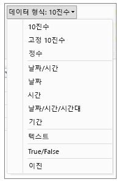
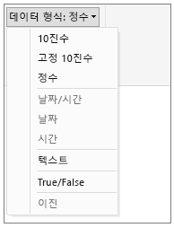

# Power BI Desktop의 데이터 형식
이 문서에서는 Power BI Desktop 및 DAX(Data Analysis Expressions)에서 지원하는 데이터 형식을 설명합니다. 

데이터를 로드할 때 Power BI Desktop은 원본 열의 데이터 형식을 더 효율적인 저장, 계산 및 데이터 시각화를 지원할 수 있는 데이터 형식으로 변환하려 합니다. 예를 들어 Excel에서 가져오는 값 열에 소수 자릿수 값이 없는 경우, Power BI Desktop은 데이터의 전체 열을 정수 저장에 더 적합한 한정수 데이터 형식으로 변환합니다.

일부 DAX 함수에는 특정 데이터 형식 요구 사항이 있기 때문에 이 개념은 중요합니다. 많은 경우 DAX는 암시적으로 데이터 형식을 변환하나 그렇지 않은 경우도 일부 존재합니다.  예를 들어, DAX 함수에서 날짜 데이터 형식이 필요한데 열의 데이터 형식은 텍스트인 경우 DAX 함수가 제대로 작동하지 않습니다.  따라서 열에 정확한 데이터 형식을 확보하는 것이 중요하면서 유용합니다. 암시적 변환은 이 문서의 뒷부분에서 설명합니다.

## 열의 데이터 형식 확인 및 지정
Power BI Desktop에서는 쿼리 편집기, 데이터 보기 또는 보고서 보기의 열 데이터 형식을 결정 및 지정할 수 있습니다.

**쿼리 편집기의 데이터 형식**

**데이터 보기 또는 보고서 보기의 데이터 형식**

쿼리 편집기의 데이터 형식 드롭다운에는 현재 데이터 또는 보고서 보기에는 없는 두 가지 데이터 형식이 있습니다. 즉 **날짜/시간/표준 시간대**와 **기간**입니다. 이러한 데이터 형식이 있는 열을 모델에 로드하고 데이터 또는 보고서 보기에서 볼 때는 날짜/시간/표준 시간대 데이터 형식의 열은 날짜/시간으로, 기간 데이터 형식의 열은 10진수로 변환됩니다. 

### 숫자 형식
Power BI Desktop은 3가지 숫자 형식을 지원합니다.

**10진수** – 64비트(8바이트) 부동 소수점 숫자를 나타냅니다. 가장 일반적인 숫자 형식이며, 보통 떠올리는 숫자에 해당합니다.  자릿수 값을 포함하는 숫자를 처리할 수 있게 설계되었으나 정수도 처리합니다.  10 진수 형식은 음수 -1.79E +308 ~ -2.23E -308, 0, 양수 2.23E -308 ~ 1.79E + 308 범위의 값을 처리할 수 있습니다. 예를 들어 34, 34.01, 34.000367063 등은 유효한 10진수입니다. 10진수 형식으로 나타낼 수 있는 가장 큰 값은 15자리 길이입니다.  소수 구분 기호는 숫자 안의 어디에나 놓일 수 있습니다. 10진수 형식은 Excel이 숫자를 저장하는 방법에 해당합니다.

**고정 10진수** – 소수 구분 기호의 고정 위치가 있습니다. 소수 구분 기호는 항상 오른쪽 4자리이며 19개의 숫자가 허용됩니다.  나타낼 수는 가장 큰 값은 922,337,203,685,477.5807(양수 또는 음수)입니다.  고정 10진수 형식은 반올림에서 오류가 발생할 수 있는 경우에 유용합니다.  소수 부분의 값이 작은 많은 숫자를 작업할 때 간혹 누적되어 숫자 값에 약간 차이가 있게 됩니다.  소수 구분 기호 오른쪽 4자리를 벗어난 값은 잘리므로 고정 10진수 형식은 이런 종류의 오류를 방지하는 데 도움이 됩니다.   SQL Server에 익숙할 경우 이 데이터 형식은 SQL Server의 10진수(19,4) 또는 Power Pivot의 통화 데이터 형식에 해당합니다. 

**정수** – 64비트(8바이트) 정수 값을 나타냅니다. 정수이기 때문에 소수점 오른쪽에 자리가 없습니다. -9,223,372,036,854,775,808(-2^63) ~ 9,223,372,036,854,775,807(2^63-1) 범위의 양수 또는 음수 19자리가 허용됩니다.  다양한 숫자 데이터 형식 중에서 나타낼 수 있는 숫자 값이 가장 큽니다.  고정 10진수 형식처럼 실수 형식도 반올림을 억제해야 하는 상황에서 유용할 수 있습니다. 

### 날짜/시간 형식
Power BI Desktop은 쿼리 보기에서 5가지, 보고서 보기 및 모델에서 3가지 날짜/시간 데이터 형식을 지원합니다.   모델로 로드하는 동안 날짜/시간/표준 시간대와 기간이 모두 변환됩니다.

**날짜/시간** - 날짜 및 시간 값을 나타냅니다.  내부적으로 날짜/시간 값은 10진수 숫자 형식으로 저장됩니다.  따라서 실질적으로 두 값 사이를 변환할 수 있습니다.   날짜의 시간 부분은 1/300초(3.33ms)의 배수에 대한 분수로 저장됩니다.  1900 ~ 9999 사이의 날짜를 지원합니다.

**날짜** – (시간을 제외한) 날짜 부분만 나타냅니다.  모델로 변환할 때 날짜는 소수 자릿수 값이 0인 날짜/시간 값과 동일합니다.

**시간** – (날짜를 제외한) 시간만 나타냅니다.  모델로 변환할 때 시간 값은 소수점 왼쪽에 자릿수가 없는 날짜/시간 값과 동일합니다.

**날짜/시간/표준 시간대** – UTC 날짜/시간을 나타냅니다.  현재, 모델로 로드할 때 날짜/시간으로 변환됩니다.

**기간** – 시간의 길이를 나타냅니다. 모델에 로드할 때 10진수 숫자 형식으로 변환됩니다.  10진수 형식이므로 날짜/시간 필드에서 가감하여 정확한 결과를 얻을 수 있습니다.  10 진수 형식이기 때문에 크기를 나타내는 시각화 요소에서 간편하게 사용할 수 있습니다.

### 텍스트 형식
**텍스트** - 유니코드 문자 데이터 문자열입니다. 텍스트 형식의 문자열, 숫자 또는 날짜일 수 있습니다. 최대 문자열 길이는 유니코드268,435,456자(256 메가 캐릭터) 또는 536,870,912바이트입니다.

### True/False 형식
**True/False** -True 또는 False의 부울 값입니다.

### 공백/Null 형식
**공백** - SQL null을 표현 및 대체하는 DAX의 데이터 형식입니다. [BLANK](http://msdn.microsoft.com/library/ee634820.aspx) 함수를 사용하여 공백을 만들고 [ISBLANK](https://msdn.microsoft.com/library/ee634204.aspx) 논리 함수를 사용하여 공백을 테스트할 수 있습니다.

### 테이블 데이터 형식
DAX는 집계, 시간 인텔리전스 계산 등과 같이 다양한 함수에서 테이블 데이터 형식을 사용합니다. 어떤 함수에는 테이블에 대한 참조가 필요하고 어떤 함수는 다른 함수에 대한 입력으로 사용할 수 있게 테이블을 반환합니다. 입력으로 테이블이 필요한 여러 함수에서 테이블을 평가하는 식을 지정할 수 있습니다. 어떤 함수에서는 기본 테이블에 대한 참조가 필요합니다. 특정 함수의 요구 사항에 대한 정보는 [DAX 함수 참조](https://msdn.microsoft.com/library/ee634396.aspx)에서 확인하세요.

## DAX 수식의 암시적 및 명시적 데이터 형식 변환
각 DAX 함수에는 입력 및 출력에 사용되는 데이터 형식에 따라 특정한 요구 사항이 있습니다. 예를 들어 어떤 함수에서는 특정 인수에는 정수를, 다른 인수에는 날짜를 요구하며 다른 함수에서는 텍스트나 테이블이 필요합니다.

인수로 지정한 열의 데이터가 함수에서 요구하는 데이터 형식과 호환되지 않으면 대부분의 경우 DAX가 오류를 반환합니다. 그러나 가능한 모든 상황에서 DAX는 암시적으로 데이터를 필요한 데이터 형식으로 변환하려 합니다. 예:

* 문자열로 날짜를 입력할 수 있으며, DAX는 이 문자열을 구문 분석하여 이를 Windows 날짜 및 시간 형식 중 하나로 캐스팅하려 합니다.
* TRUE + 1을 추가하고 2의 결과를 받을 수 있습니다. TRUE는 암시적으로 숫자 1로 변환되므로 1+1 연산이 수행됩니다.
* 두 열에 값을 추가했으며 한 값은 텍스트(“12”), 다른 값이 숫자(12)인 경우 DAX는 암시적으로 문자열을 숫자로 변환하며 더하기를 통해 숫자 결과를 반환합니다. "22" + 22 식은 44를 반환합니다.
* 두 숫자를 연결하려 할 경우 Excel은 이를 문자열로 표현하여 연결합니다. 12 & 34 식은 "1234"를 반환합니다.

### 암시적 데이터 변환 표
수행되는 변환 유형은 요청된 연산을 수행하기 전에 필요한 값을 캐스팅하는 연산자에 따라 결정됩니다. 이 표에서는 연산자를 나열하며 교차하는 행의 데이터 형식과 연결될 때 열에서 각 데이터 형식에 대해 수행되는 변환을 표시합니다.

> [!NOTE]
>  텍스트 데이터 형식은 이 표에 포함되지 않았습니다. 숫자를 텍스트 형식으로 표현할 때, 일부 경우 Power BI가 숫자 유형을 판단하고 숫자로 표시하려 합니다.
> 
> 

**더하기(+)**

| 연산자(+) | 정수 | 통화 | 실수 | 날짜/시간 |
| --- | --- | --- | --- | --- |
| 정수 |정수 |통화 |실수 |날짜/시간 |
| 통화 |통화 |통화 |실수 |날짜/시간 |
| 실수 |실수 |실수 |실수 |날짜/시간 |
| 날짜/시간 |날짜/시간 |날짜/시간 |날짜/시간 |날짜/시간 |

예를 들어, 통화 데이터와 연결된 더하기 작업에서 실수를 사용할 경우 두 값이 실수로 변환되며 결과도 실수로 반환됩니다.

**빼기(-)**

다음 테이블에서 행 머리글은 피감수(왼쪽), 열 머리글은 감수(오른쪽)를 나타냅니다.

| 연산자(-) | 정수 | 통화 | 실수 | 날짜/시간 |
| --- | --- | --- | --- | --- |
| 정수 |정수 |통화 |실수 |실수 |
| 통화 |통화 |통화 |실수 |실수 |
| 실수 |실수 |실수 |실수 |실수 |
| 날짜/시간 |날짜/시간 |날짜/시간 |날짜/시간 |날짜/시간 |

예를 들어, 다른 데이터 형식과의 빼기 작업에 날짜를 사용할 경우 두 값이 모두 날짜로 변환되며 반환 값도 날짜입니다.

> [!NOTE]
>    데이터 모델은 단항 연산자 -(음수)도 지원하지만 이 연산자는 피연산자의 데이터 형식을 변경하지 않습니다.
> 
> 

**곱하기(*)**

| 연산자(*) | 정수 | 통화 | 실수 | 날짜/시간 |
| --- | --- | --- | --- | --- |
| 정수 |정수 |통화 |실수 |정수 |
| 통화 |통화 |실수 |통화 |통화 |
| 실수 |실수 |통화 |실수 |실수 |

예를 들어, 정수가 곱하기 작업에서 실수와 연결된 경우 두 숫자 모두 실수로 변환되며 반환되는 값도 실수입니다.

**나누기(/)**

다음 표에서 행 머리글은 분자, 열 머리글은 분모입니다.

| 연산자(/)(행/열) | 정수 | 통화 | 실수 | 날짜/시간 |
| --- | --- | --- | --- | --- |
| 정수 |실수 |통화 |실수 |실수 |
| 통화 |통화 |실수 |통화 |실수 |
| 실수 |실수 |실수 |실수 |실수 |
| 날짜/시간 |실수 |실수 |실수 |실수 |

예를 들어, 정수가 나누기 작업에서 통화 값과 연결된 경우 두 숫자 모두 실수로 변환되며 반환되는 값도 실수입니다.

### 비교 연산자
비교 식에서 부울 값은 문자열 값보다 크고, 문자열 값은 숫자 또는 날짜/시간 값보다 크며, 숫자 및 날짜/시간 값은 동일한 순위로 간주됩니다. 부울 또는 문자열 값에는 암시적 변환이 수행되지 않으며 공백 또는 빈 값은 타 비교 대상 값의 데이터 형식에 따라 0/""/false로 변환됩니다.

다음 DAX 식은 이 동작을 보여줍니다.

=IF(FALSE()\>"true","Expression is true", "Expression is false"), returns "Expression is true"

=IF("12"\>12,"Expression is true", "Expression is false"), returns "Expression is true"

=IF("12"=12,"Expression is true", "Expression is false"), returns "Expression is false"

다음 표에서 설명한 것처럼 숫자 또는 날짜/시간 형식에 대해 변환이 암시적으로 수행됩니다.

| 비교 연산자 | 정수 | 통화 | 실수 | 날짜/시간 |
| --- | --- | --- | --- | --- |
| 정수 |정수 |통화 |실수 |실수 |
| 통화 |통화 |통화 |실수 |실수 |
| 실수 |실수 |실수 |실수 |실수 |
| 날짜/시간 |실수 |실수 |실수 |날짜/시간 |

### 공백, 빈 문자열 및 0 값 처리
DAX에서 null, 빈 값, 공백 셀 또는 누락된 값은 모두 동일한 새 값 형식인 BLANK로 나타납니다. BLANK 함수를 사용하여 공백을 만들거나 ISBLANK 함수로 공백을 테스트할 수도 있습니다.

더하기 또는 연결 등의 연산에서 공백이 처리되는 방식은 개별 함수에 따라 다릅니다. 다음 표에서는 DAX와 Microsoft Excel 식 사이에서 공백 처리 방식의 차이점을 요약합니다.

| 식 | DAX | Excel |
| --- | --- | --- |
| BLANK + BLANK |BLANK |0(zero) |
| BLANK + 5 |5 |5 |
| BLANK * 5 |BLANK |0(zero) |
| 5/BLANK |무한대 |오류 |
| 0/BLANK |NaN |오류 |
| BLANK/BLANK |BLANK |오류 |
| FALSE OR BLANK |FALSE |FALSE |
| FALSE AND BLANK |FALSE |FALSE |
| TRUE OR BLANK |TRUE |TRUE |
| TRUE AND BLANK |FALSE |TRUE |
| BLANK OR BLANK |BLANK |오류 |
| BLANK AND BLANK |BLANK |오류 |

