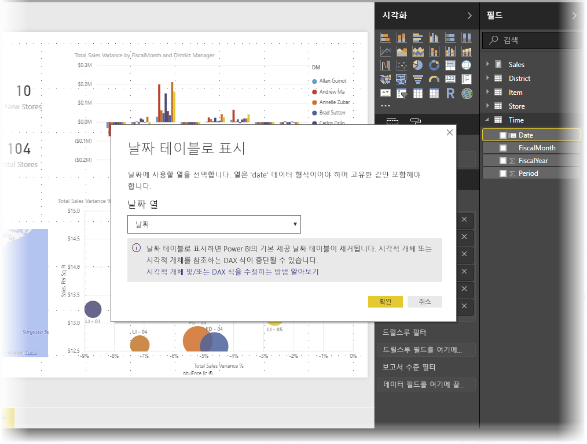
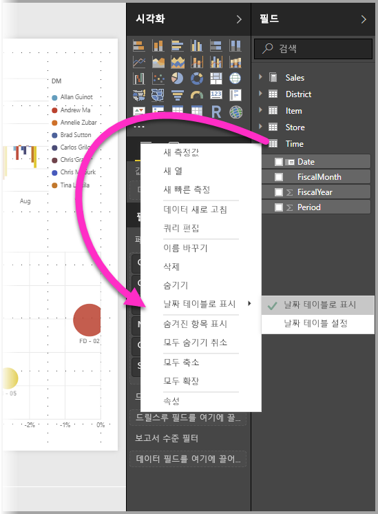
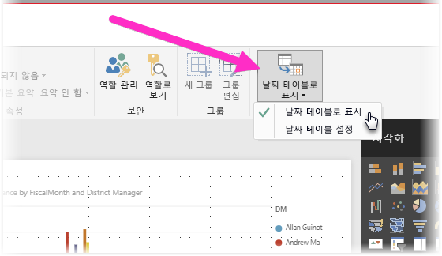
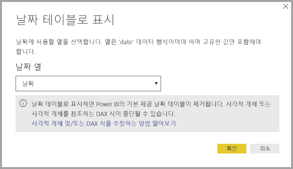
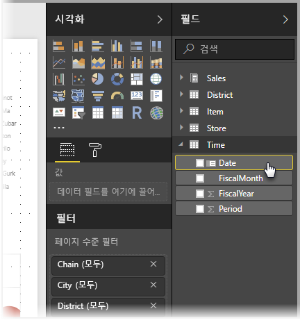
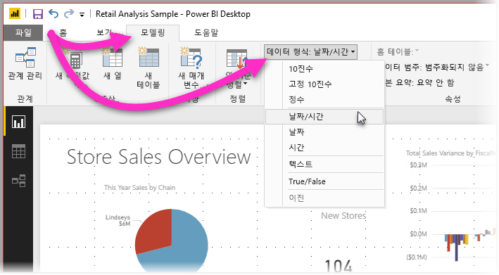

# Power BI Desktop에서 날짜 테이블 설정 및 사용

**Power BI Desktop**은 백그라운드에서 작동하여 테이블을 **날짜 테이블**로 자동으로 식별한 다음, 사용자를 대신하여 날짜 계층 구조 및 모델에 대해 사용 가능한 기타 메타데이터를 만듭니다. 그러면 시각적 개체, 테이블, 빠른 측정, 슬라이서 등과 같은 보고서 기능을 만들 때 그러한 기본 제공 계층 구조를 사용할 수 있습니다. Power BI Desktop은 보고서와 DAX 식에 사용할 수 있는 숨겨진 테이블을 사용자를 대신하여 만들어 이러한 작업을 수행합니다.

많은 데이터 분석가가 고유한 날짜 테이블을 만드는 것을 선호합니다. **Power BI Desktop**에서 모델에서 **날짜 테이블**로 사용할 테이블을 지정한 다음, 테이블의 날짜 데이터를 사용하여 날짜 관련 시각적 개체, 테이블, 빠른 측정 등을 만들 수 있습니다. 고유한 날짜 테이블을 지정하면 모델에 생성된 날짜 계층 구조를 제어하고 **빠른 측정** 및 모델의 날짜 테이블을 사용하는 기타 작업에서 사용할 수 있습니다. 

## 고유한 날짜 테이블 설정

**날짜 테이블**을 설정하려면 다음 이미지에 표시된 것처럼 **필드** 창에서 날짜 테이블로 사용할 테이블을 선택한 다음, 테이블을 마우스 오른쪽 단추로 클릭하고 나타나는 메뉴에서 **날짜 테이블로 표시 > 날짜 테이블로 표시**를 선택합니다.

테이블을 선택한 다음, 여기에 표시되는 **모델링** 리본에서 **날짜 테이블로 표시**를 선택할 수도 있습니다.

고유한 **날짜 테이블**을 지정할 때 Power BI Desktop은 해당 열과 데이터에 대해 다음 유효성 검사를 수행하여 데이터에 대해 다음을 확인합니다.

* 고유 값이 포함되어 있음
* null 값이 포함되어 있지 않음
* 연속 날짜 값이 포함되어 있음(시작부터 끝까지)
* **날짜/시간** 데이터 형식인 경우 각 값에 동일한 타임스탬프가 있음

고유한 날짜 테이블 작성에 대해 가능한 시나리오는 두 가지이며, 둘 다 합리적인 방법입니다.

* 첫 번째 시나리오는 정식 또는 기본 날짜 테이블 및 계층 구조를 만드는 경우입니다. 이전에 설명한 날짜 테이블에 대한 유효성 검사 기준을 충족하는 데이터의 테이블입니다. 

* 두 번째 시나리오는 예를 들어 날짜 테이블로 사용할 ‘희미한 날짜’ 필드를 사용하는 것처럼 Analysis Services의 테이블을 사용하는 경우입니다. 

날짜 테이블을 지정하면 해당 테이블에서 날짜 열인 열을 선택할 수 있습니다. **필드** 창에서 테이블을 선택하여 사용할 열을 지정한 다음, 테이블을 마우스 오른쪽 단추로 클릭하고 **날짜 테이블로 표시 > 날짜 테이블 설정**을 선택합니다. 다음 창이 나타납니다. 이 창의 드롭다운 상자에서 날짜 테이블로 사용할 열을 선택할 수 있습니다.

고유한 날짜 테이블을 지정할 때 **Power BI Desktop**은 사용자를 대신하여 모델에 빌드하는 계층 구조를 자동으로 만들지 않습니다. 나중에 날짜 테이블을 선택 취소하고 더 이상 수동으로 설정한 날짜 테이블이 없는 경우 Power BI Desktop은 테이블의 날짜 열에 대해 자동으로 생성된 기본 제공 날짜 테이블을 다시 만듭니다.

테이블을 날짜 테이블로 표시하면 Power BI Desktop에서 만든 기본 제공(자동으로 생성된) 날짜 테이블이 제거되고, 해당 기본 제공 테이블을 기반으로 이전에 생성된 모든 시각적 개체 또는 DAX 식이 더 이상 제대로 작동하지 않습니다. 

## 날짜 테이블을 적절한 데이터 형식으로 표시

고유한 **날짜 테이블**을 지정할 때 데이터 형식이 올바르게 설정되었는지 확인해야 합니다. **데이터 형식**을 **날짜/시간** 또는 **날짜**로 설정할 수 있습니다. 그렇게 하려면 다음 단계를 수행하세요.

1. **필드** 창에서 **데이터 테이블**을 선택하고 필요한 경우 확장한 다음, 날짜로 사용할 열을 선택합니다.
   
     

2. **모델링** 탭에서 **데이터 형식:**을 선택한 다음, 드롭다운 화살표를 클릭하여 사용 가능한 데이터 형식을 표시합니다.

    

3. 열에 대한 데이터 형식을 지정합니다. 

## 다음 단계

다음 문서에도 관심이 있을 수 있습니다.

* [Power BI Desktop의 데이터 형식](desktop-data-types.md)

 