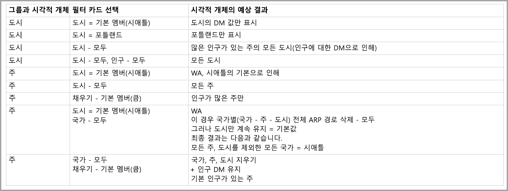

# Power BI의 다차원 모델의 기본 멤버

Power BI에서 다차원 모델에 연결하고 해당 모델 내에 모든 종류의 데이터를 시각화하는 보고서를 만들 수 있습니다. 다차원 모델을 사용하는 경우 Power BI는 ‘기본 멤버’로 정의되는 열을 기준으로 데이터 처리 방법에 규칙을 적용합니다.  

다차원 모델을 사용하는 경우 Power BI는 **DefaultMember**를 포함하는 열이 사용되는 위치를 기준으로 모델의 데이터를 처리합니다. *DefaultMember* 특성은 다차원 모델에서 특정 열에 대한 CSDL(개념 스키마 정의 언어)로 설정됩니다. [특성 속성 문서](https://docs.microsoft.com/sql/analysis-services/multidimensional-models/attribute-properties-define-a-default-member?view=sql-server-2017)에서 기본 멤버에 대해 자세히 알아볼 수 있습니다. DAX 쿼리를 실행하는 경우 모델에 지정된 기본 멤버가 자동으로 적용됩니다.

이 문서에서는 ‘기본 멤버’가 있는 위치를 기준으로 다차원 모델을 사용하는 다양한 상황에서 Power BI의 작동 방식을 설명했습니다.  

## 필터 카드 작업

기본 멤버를 사용하여 필드의 필터 카드를 만드는 경우 기본 멤버 필드 값은 필터 카드에서 자동으로 선택됩니다. 따라서 필터 카드의 영향을 받는 모든 시각적 개체는 해당 기본 모델을 데이터베이스에 보존합니다. 이 필터 카드의 값은 해당 기본 멤버를 반영합니다.

기본 멤버를 제거하는 경우 값을 선택 취소하면 필터 카드가 적용되는 모든 시각적 개체의 값이 지워지고 표시되는 값은 기본 멤버를 반영하지 않습니다.

예를 들어 *USD*로 설정된 기본 멤버를 포함하는 *Currency* 열이 있다고 가정해 봅니다.

* 이 예제 사례에서 *Total Sales*를 표시하는 카드가 있는 경우 이 값에는 기본 멤버가 적용되어 있고 “USD”에 해당하는 판매액이 표시됩니다.
* *Currency*를 필터 카드 창으로 끌 경우 *USD*가 기본값으로 선택되어 있습니다. 기본 멤버가 적용되므로 *Total Sales* 값이 동일하게 유지됩니다.
* 그러나 필터 카드에서 *USD* 값을 선택 취소하면 *Currency*의 기본 멤버가 지워지고 이제 *Total Sales*가 모든 통화를 반영합니다.
* 동시에, 기본 멤버와 함께 필터 카드에서 또 다른 값을 선택하면(*EURO*를 선택한다고 가정) *Total Sales*는 필터 *Currency IN {USD, EURO}* 를 반영합니다.

## 그룹화 동작

Power BI에서는 ‘기본 멤버’를 포함하는 열에서 시각적 개체를 그룹화할 때마다 Power BI가 해당 열의 ‘기본 멤버’와 해당 특성 관계 경로를 지웁니다.   따라서 기본값만이 아닌 모든 값이 시각적 개체에 표시됩니다.

## ARP(특성 관계 경로)

ARP(특성 관계 경로)는 ‘기본 멤버’에 강력한 기능을 제공하지만 일정 정도의 복잡성을 추가하기도 합니다.  ARP를 발견하면 Power BI는 ARP 경로를 따라 다른 열의 추가 기본 멤버를 지움으로써 시각적 개체 데이터를 일관되고 정확하게 처리합니다.

이 동작을 분명히 설명하는 예를 살펴보겠습니다. ARP의 다음 구성을 고려하세요.

이제 해당 열에 다음 ‘기본 멤버’가 설정되어 있다고 가정해 봅니다. 

* City > Seattle
* State > WA
* Country > US
* Population > Large

이제 각 열이 Power BI에서 사용될 때 어떤 일이 일어나는지 살펴보겠습니다. 시각적 개체가 다음 열에서 그룹화되는 경우 결과는 다음과 같습니다.

* **City** - Power BI는 *City*, *State*, *Country*의 **기본 멤버**를 지워서 모든 도시를 표시하지만, *Population*의 **기본 멤버**를 유지합니다. Power BI가 *City*의 전체 ARP를 지웠습니다.
    > [!NOTE]
    > *Population*은 *City*의 ARP 경로에 없고 *State*에만 연결되므로 Power BI는 이 항목을 지우지 않습니다.
* **State** - Power BI는 *City*, *State*, *Country* 및 *Population*의 모든 **기본 멤버**를 지워서 모든 *State*를 표시합니다.
* **Country** - Power BI는 *City*, *State* 및 *Country*의 모든 **기본 멤버**를 지워서 모든 국가를 표시하지만, *Population*의 **기본 멤버**를 유지합니다.
* **City 및 State** - Power BI는 모든 열의 모든 **기본 멤버**를 지웁니다.

시각적 개체에 표시되는 그룹의 전체 ARP 경로가 지워집니다. 

그룹이 시각적 개체에 표시되지 않지만 또 다른 그룹화된 열의 ARP 경로에 포함된 경우에는 다음과 같이 적용됩니다.

* ARP 경로의 일부 분기가 자동으로 지워지지 않습니다.
* 해당 그룹은 지워지지 않은 **기본 멤버**를 기준으로 계속 필터링됩니다.

### 슬라이서 및 필터 카드

슬라이서 또는 필터 카드를 사용하는 경우 다음 동작이 나타납니다.

* 슬라이서 또는 필터 카드가 데이터와 함께 로드되는 경우 Power BI는 시각적 개체의 열에서 그룹화되므로 표시 동작은 이전 섹션에서 설명한 것과 동일합니다.

슬라이서 및 필터 카드는 종종 다른 시각적 개체를 조작하는 데 사용되므로 영향을 받는 시각적 개체의 **기본 멤버**를 지우는 논리는 다음 표에 설명된 대로 나타납니다. 

이 표에서는 이 문서 앞부분에서 사용한 동일한 예제 데이터 사용합니다.

해당 상황에서 Power BI의 동작 방식에는 다음 규칙이 적용됩니다.

Power BI가 특정 열의 **기본 멤버**를 지우는 경우는 다음과 같습니다.

* Power BI가 해당 열에서 그룹화되는 경우
* Power BI가 해당 열에 관련된 그룹에서 그룹화되는 경우(ARP의 아무 곳이나, 위쪽 또는 아래쪽)
* Power BI가 ARP에 있는 열에서 필터링되는 경우(위쪽 또는 아래쪽)
* 열에 *ALL* 상태의 필터 카드가 있는 경우
* 열에 값이 선택된 필터 카드가 있는 경우(Power BI가 해당 열의 필터를 받음)

Power BI가 특정 열의 **기본 멤버**를 지우지 않는 경우는 다음과 같습니다.

* 열에 기본 상태의 필터 카드가 있고 Power BI가 해당 ARP에 있는 열에서 그룹화되는 경우
* 열이 ARP의 또 다른 열 위에 있고 Power BI에 기본 상태인 해당 다른 열의 필터 카드가 있는 경우

## 다음 단계

이 문서에서는 다차원 모델의 기본 멤버를 사용하는 경우 Power BI의 동작을 설명했습니다. 다음 문서에도 관심이 있을 수 있습니다. 

* [Power BI에서 데이터가 없는 항목 표시](desktop-show-items-no-data.md)
* [Power BI Desktop의 데이터 원본](desktop-data-sources.md)
