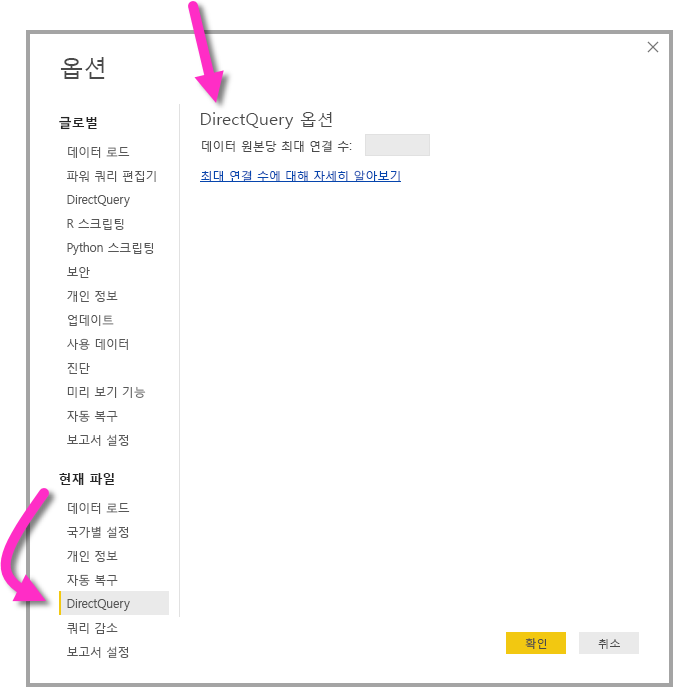

# <a name="about-using-directquery-in-power-bi"></a>Power BI에서 DirectQuery를 사용하는 방법

*Power BI Desktop* 또는 *Power BI 서비스*를 사용하는 경우 모든 종류의 다양한 데이터 원본에 연결할 수 있으며 이러한 데이터를 여러 가지 방법으로 연결할 수 있습니다. 데이터를 가져오는 가장 일반적인 방법인 Power BI로 데이터를 *가져오거나* *DirectQuery*로 알려진 원래의 원본 리포지토리에 있는 데이터에 직접 연결할 수 있습니다. 이 문서에서는 DirectQuery의 기능에 대해 설명합니다.

* DirectQuery에 대한 다양한 연결 옵션
* 가져오기 대신 DirectQuery를 사용할 때 고려해야 하는 지침
* DirectQuery 사용의 단점
* DirectQuery를 사용하기 위한 모범 사례

가져오기와 DirectQuery를 사용하는 모범 사례:

* 가능하면 Power BI로 데이터를 가져와야 합니다. 이를 통해 Power BI의 고성능 쿼리 엔진을 활용할 수 있으며, 완벽한 기능을 갖춘 대화형 환경을 제공합니다.
* 데이터 가져옴으로써 목표를 충족할 수 없는 경우에는 DirectQuery를 사용하는 것이 좋습니다. 예를 들어 데이터가 자주 변경되고 보고서에 최신 데이터가 반영되어야 하는 경우에 DirectQuery가 가장 적합할 수 있습니다. 그러나 DirectQuery는 기본 데이터 원본에서 일반적인 집계 쿼리를 위한 대화형 쿼리(5초 미만)를 제공하고 생성될 쿼리 로드를 처리할 수 있는 경우에만 사용할 수 있습니다. 또한 DirectQuery 사용에 수반되는 제한 사항 목록을 신중하게 고려해야 합니다.

Power BI에서 가져오기 및 DirectQuery를 위해 제공하는 기능 집합은 시간이 지남에 따라 향상됩니다. 즉, 가져온 데이터를 사용할 때 더 많은 유연성을 제공하여 더 많은 경우에 가져오기를 사용할 수 있게 될 뿐만 아니라 DirectQuery 사용 시의 몇몇 단점이 제거될 수도 있습니다. 향상된 기능이 무엇이건 간에, DirectQuery를 사용할 때의 기본 데이터 원본의 성능은 항상 중요한 고려 사항이 됩니다. 기본 데이터 원본이 느린 경우에는 해당 원본에 대해 DirectQuery를 사용하기 어렵습니다.

이 문서에서는 *SQL Server Analysis Services*가 아니라 Power BI에서 사용하는 DirectQuery에 대해 설명합니다. DirectQuery는 SQL Server Analysis Services의 기능이기도 합니다. 이 문서에서 설명하는 대부분의 정보는 SQL Server Analysis Services에도 적용됩니다. 둘 사이에는 중요한 차이점도 있습니다. SQL Server Analysis Services에서 DirectQuery를 사용하는 방법에 대한 자세한 내용은 [SQL Server 2016 Analysis Services의 DirectQuery](https://download.microsoft.com/download/F/6/F/F6FBC1FC-F956-49A1-80CD-2941C3B6E417/DirectQuery%20in%20Analysis%20Services%20-%20Whitepaper.pdf)를 참조하세요.

이 문서에서는 보고서를 Power BI Desktop에서 만드는 경우인 DirectQuery 워크플로를 집중적으로 다루되, Power BI 서비스에서 직접 연결하는 방법도 설명합니다.

## <a name="power-bi-connectivity-modes"></a>Power BI 연결 모드

Power BI는 다음과 같이 다양한 데이터 원본에 연결됩니다.

* 온라인 서비스(Salesforce, Dynamics 365, 기타)
* 데이터베이스(SQL Server, Access, Amazon Redshift, 기타)
* 간단한 파일(Excel, JSON, 기타)
* 다른 데이터 원본(Spark, 웹 사이트, Microsoft Exchange, 기타)

이 원본의 데이터를 Power BI로 가져올 수 있습니다. 어떤 경우에는 DirectQuery를 사용하여 연결할 수도 있습니다. DirectQuery에서 지원하는 원본에 대해 알아보려면 [DirectQuery에서 지원하는 데이터 원본](desktop-directquery-data-sources.md)을 참조하세요. 주로 뛰어난 대화형 쿼리 성능을 제공하도록 기대할 수 있는 원본에 집중하여 향후에는 더 많은 원본에서 DirectQuery를 사용할 수 있게 됩니다.

SQL Server Analysis Services는 특별한 경우입니다. SQL Server Analysis Services에 연결하는 경우 데이터를 가져오거나 *라이브 연결*을 사용하도록 선택할 수 있습니다. 라이브 연결을 사용하는 것은 DirectQuery를 사용하는 것과 비슷합니다. 가져와야 하는 데이터가 없고, 시각적 개체를 새로 고칠 때는 항상 기본 데이터 원본이 쿼리됩니다. 라이브 연결은 다른 여러 측면에서 차이점이 있으므로 *DirectQuery* 대신에 *라이브 연결*이라는 별도의 용어가 사용됩니다.

데이터에 연결하는 옵션에는 *가져오기*, *DirectQuery* 및 *라이브 연결*, 이렇게 3가지가 있습니다.

### <a name="import-connections"></a>가져오기 연결

가져오기의 경우, Power BI Desktop에서 **데이터 가져오기**를 사용하여 SQL Server와 같은 데이터 원본에 연결할 때 해당 연결의 동작은 다음과 같습니다.

* 초기 데이터 가져오기 환경에서 선택한 테이블 집합은 각각 데이터 집합을 반환하는 쿼리를 정의합니다. 이러한 쿼리는 데이터를 로드하기 전에 필터를 적용하거나 데이터를 집계하거나 다른 테이블과 조인하도록 편집할 수 있습니다.
* 로드되면 해당 쿼리에서 정의한 모든 데이터를 Power BI 캐시로 가져옵니다.
* Power BI Desktop 내에서 시각적 개체를 빌드하면 가져온 데이터가 쿼리됩니다. Power BI 저장소는 쿼리가 빠르게 처리되도록 보장합니다. 시각적 개체의 모든 변경 내용이 즉시 반영됩니다.
* 기본 데이터에 대한 모든 변경 내용은 어떤 시각적 개체에도 반영되지 않습니다. 데이터를 다시 가져오려면 *새로 고침*이 필요합니다.
* Power BI 서비스에 보고서를 *.pbix 파일*로 게시하면 데이터 세트가 만들어지고 Power BI 서비스에 업로드됩니다. 가져온 데이터가 해당 데이터 세트에 포함됩니다. 그러면 해당 데이터의 새로 고침을 예약할 수 있습니다(예: 매일 데이터 다시 가져오기). 원래 데이터 원본의 위치에 따라 온-프레미스 데이터 게이트웨이를 구성해야 할 수도 있습니다.
* Power BI 서비스에서 기존 보고서를 열거나 새 보고서를 작성할 때, 가져온 데이터가 다시 쿼리되어 상호 작용을 보장합니다.
* 시각적 개체 또는 전체 보고서 페이지는 대시보드 타일로 고정할 수 있습니다. 기본 데이터 세트가 새로 고침될 때마다 타일이 자동으로 새로 고침됩니다.

### <a name="directquery-connections"></a>DirectQuery 연결

DirectQuery의 경우, Power BI Desktop에서 **데이터 가져오기**를 사용하여 데이터 원본에 연결할 때 해당 연결의 동작은 다음과 같습니다.

* 초기 데이터 가져오기 환경에서 원본이 선택됩니다. 관계형 원본의 경우 테이블 집합이 선택되고, 각각이 여전히 논리적으로 데이터 세트를 반환하는 쿼리를 정의합니다. SAP BW와 같은 다차원 원본의 경우에는 원본만 선택됩니다.
* 그러나 로드되면 실제로 Power BI 저장소로 가져와지는 데이터는 없습니다. 대신 Power BI Desktop 내에서 시각적 개체를 빌드하면 필요한 데이터를 가져오기 위해 기본 데이터 원본으로 쿼리가 전송됩니다. 시각적 개체를 새로 고치는 데 걸리는 시간은 기본 데이터 원본의 성능에 따라 달라집니다.
* 기본 데이터에 대한 모든 변경 내용은 기존 시각적 개체에 즉시 반영되지 않습니다. 변경 내용이 반영되려면 새로 고침이 필요합니다. 이에 따라 각 시각적 개체에 대해 필요한 쿼리가 다시 보내지고 필요에 따라 시각적 개체가 업데이트됩니다.
* Power BI 서비스에 보고서를 게시하면 가져오기의 경우와 마찬가지로 Power BI 서비스에서 데이터 세트가 만들어집니다. 그러나 해당 데이터 세트에는 *어떤 데이터도 포함되지 않습니다*.
* Power BI 서비스에서 기존 보고서를 열거나 새 보고서를 작성할 때 기본 데이터 원본이 다시 쿼리되어 필요한 데이터를 가져옵니다. 가져오기 모드에서 데이터가 새로 고침되는 경우 필요한 것처럼 원래 데이터 원본의 위치에 따라 온-프레미스 데이터 게이트웨이를 구성해야 할 수도 있습니다.
* 시각적 개체 또는 전체 보고서 페이지는 대시보드 타일로 고정할 수 있습니다. 대시보드를 빨리 열 수 있도록 하기 위해 일정(예: 매시간)에 따라 자동으로 타일이 새로 고침됩니다. 이 새로 고침의 빈도를 제어하여 데이터를 변경하는 빈도와 최신 데이터를 표시하는 중요도를 반영할 수 있습니다. 대시보드를 열면 타일에 마지막 새로 고침 시점의 데이터가 반영되며, 항상 기본 원본에 대한 최신 변경 내용이 반영되는 것은 아닙니다. 열려 있는 대시보드를 새로 고치면 최신 상태를 반영할 수 있습니다.

### <a name="live-connections"></a>라이브 연결

SQL Server Analysis Services에 연결하는 경우 선택한 데이터 모델에서 데이터를 가져오거나 이 모델에 라이브 연결하는 옵션이 있습니다. 가져오기를 사용할 경우, 해당 외부 SQL Server Analysis Services 원본에 대한 쿼리가 정의되고 데이터가 정상적으로 가져와집니다. 라이브 연결을 시용할 경우, 정의되는 쿼리가 없으며 필드 목록에 전체 외부 모델이 표시됩니다.

데이터를 가져오는 옵션이 없다는 점을 제외하고는 앞 단락에서 설명한 상황이 다음 원본에 연결하는 경우에도 적용됩니다.

* Power BI 데이터 세트(예: 이전에 만들어 서비스에 게시한 Power BI 데이터 세트에 연결하여 이를 통해 새 보고서를 작성하는 경우)
* Common Data Service

Power BI 서비스에 게시할 때 SQL Server Analysis Services를 통한 보고서의 동작은 다음과 같은 방식으로, DirectQuery 보고서와 비슷합니다.

* Power BI 서비스에서 기존 보고서를 열거나 새 보고서를 작성할 때 기본 SQL Server Analysis Services 원본이 쿼리됩니다(온-프레미스 데이터 게이트웨이가 필요할 수도 있음).
* 대시보드 타일이 일정(예: 매시간)에 따라 자동으로 새로 고침됩니다.

둘 사이에는 중요한 차이점도 있습니다. 예를 들어, 라이브 연결의 경우 보고서를 여는 사용자의 ID가 항상 기본 SQL Server Analysis Services 원본으로 전달됩니다.

지금까지 비교를 살펴보았으니 이 문서의 나머지 부분에서는 DirectQuery에 집중하도록 하겠습니다.

## <a name="when-is-directquery-useful"></a>DirectQuery는 언제 유용한가요?

다음 표에서는 원래 원본에 데이터를 그대로 두는 것이 유익한 것으로 간주되는 경우를 포함하여 DirectQuery로 연결하는 것이 특히 유용할 수 있는 시나리오를 설명합니다. 설명에는 Power BI에서 지정된 시나리오를 사용할 수 있는지에 대한 검토가 포함되어 있습니다.

| 제한 사항 | 설명 |
| --- | --- |
| 데이터가 자주 변경되고 실시간에 가까운 보고가 필요합니다. |가져온 데이터가 있는 모델은 시간당 한 번씩 새로 고칠 수 있습니다. 데이터가 지속해서 변경되고 보고서에서 최신 데이터를 표시해야 하는 경우 예약된 새로 고침으로 가져오기를 사용하면 이러한 요구 사항을 충족하지 못할 수 있습니다. 이 경우 지원되는 데이터 볼륨에는 제한이 있지만 Power BI로 데이터를 직접 스트리밍할 수도 있습니다. <br/> <br/> 이와 대조적으로 DirectQuery를 사용하면 보고서 또는 대시보드를 열거나 새로 고침으로써 항상 원본의 최신 데이터가 표시됩니다. 또한 대시보드 타일은 더 자주(빠르게는 15분에 한 번씩) 업데이트될 수 있습니다. |
| 데이터가 매우 큽니다. |데이터가 매우 큰 경우 모든 데이터를 가져올 수는 없습니다. 이와 대조적으로 DirectQuery는 적절히 쿼리되므로 대량의 데이터 전송이 필요하지 않습니다. <br/> <br/> 그러나 [DirectQuery 사용의 의미](#implications-of-using-directquery)에서 설명하는 대로 큰 데이터로 인해 해당 기본 원본에 대한 쿼리 성능이 너무 느릴 수도 있습니다. 항상 세부 정보 데이터 전체를 가져올 필요는 없습니다. 대신 가져오기 중에 데이터를 미리 집계할 수 있으며, *쿼리 편집기*를 사용하면 이 작업을 쉽게 수행할 수 있습니다. 극단적으로 각 시각적 개체에 필요한 집계 데이터를 정확하게 가져올 수 있습니다. DirectQuery가 큰 데이터에 대한 가장 간단한 접근 방법이지만, 기본 원본이 너무 느린 경우 집계 데이터를 가져오는 것이 해결책이 될 수 있습니다. |
| 보안 규칙은 기본 원본에서 정의됩니다. |데이터를 가져오면 Power BI는 Power BI Desktop의 현재 사용자 자격 증명을 사용하여 데이터 원본에 연결하거나 Power BI 서비스에서 예약된 새로 고침 구성의 일부로 정의된 자격 증명을 사용하여 데이터 원본에 연결합니다. 이러한 보고서를 게시하고 공유할 때는 동일한 데이터를 볼 수 있는 사용자와만 공유하거나 데이터 세트의 일부로 행 수준 보안을 정의하는 데 주의를 기울여야 합니다. <br/> <br/> 이상적으로 DirectQuery는 항상 기본 원본을 쿼리하기 때문에 이렇게 하면 기본 원본의 모든 보안을 적용할 수 있습니다. 그러나 현재 Power BI는 가져오기에 사용되는 자격 증명과 동일한 자격 증명을 사용하여 기본 원본에 연결합니다. <br/> <br/> Power BI에서 보고서 소비자의 ID를 기본 원본으로 전달할 때까지 DirectQuery는 데이터 원본 보안과 관련하여 어떠한 이점도 제공하지 않습니다. |
| 데이터 주권 제한 사항이 적용됩니다. |일부 조직에는 데이터 주권에 관한 정책이 있습니다. 즉 데이터가 조직 구내를 벗어날 수 없습니다. 가져오기에 기반한 솔루션에서 문제를 명확히 제시할 것입니다. 이와 반대로 DirectQuery를 사용하는 경우 해당 데이터는 기본 원본에서 유지됩니다. <br/> <br/> 그러나 DirectQuery를 사용하는 경우에도 시각적 수준의 일부 데이터 캐시는 예약된 타일 새로 고침으로 인해 Power BI 서비스에서 유지됩니다. |
| 기본 데이터 원본은 측정값을 포함하는 OLAP 원본입니다. |기본 데이터 원본에 *측정값*(예: SAP HANA 또는 SAP Business Warehouse)이 포함된 경우 데이터를 가져오면 다른 문제가 발생합니다. 즉 가져온 데이터가 쿼리에서 정의한 대로 특정 집계 수준에 있다는 것입니다. 예를 들어 **클래스**, **연도** 및 **도시**를 기준으로 하여 **TotalSales**를 측정합니다. 그런 다음, 더 높은 집계 수준의 데이터(예: **연도**별 **TotalSales**)를 요청하는 시각적 개체를 작성하면 집계 값을 추가로 집계합니다. 이 경우 가산 측정값(예: **Sum**, **Min**)에서는 문제가 없지만, 비가산 측정값(예: **Average**, **DistinctCount**)에서는 문제가 됩니다. <br/> <br/> 특정 시각적 개체에 필요한 경우와 같이 원본에서 직접 정확한 집계 데이터를 가져오려면 DirectQuery에서와 같이 시각적 개체별로 쿼리를 보내야 합니다. <br/> <br/> SAP BW(Business Warehouse)에 연결할 때 DirectQuery를 선택하는 경우 이러한 측정값 처리를 사용하는 것이 좋습니다. SAP BW에 대한 자세한 내용은 [DirectQuery 및 SAP BW](desktop-directquery-sap-bw.md)를 참조하세요. <br/> <br/> 그러나 현재 SAP HANA를 통한 DirectQuery는 관계형 원본과 동일하게 처리하므로 가져오기와 비슷한 동작을 제공합니다. 이 접근 방법은 [DirectQuery 및 SAP HANA](desktop-directquery-sap-hana.md)에서 자세히 설명합니다. |

요약하자면, Power BI의 현재 DirectQuery 기능을 고려할 때 다음과 같은 시나리오에서 이점을 얻을 수 있습니다.

* 데이터가 자주 변경되고 실시간에 가까운 보고가 필요합니다.
* 미리 집계할 필요 없이 매우 큰 데이터를 처리합니다.
* 데이터 주권 제한 사항이 적용됩니다.
* 원본은 측정값을 포함하는 다차원 원본입니다(예: SAP BW).

이전 목록의 세부 정보는 Power BI만 사용하는 것과 관련이 있습니다. 대신 외부 SQL Server Analysis Services 또는 Azure Analysis Services 모델을 사용하여 데이터를 가져온 다음 Power BI를 사용하여 해당 모델에 연결할 수 있습니다. 이러한 방법은 추가적인 구성을 필요로 하지만 더 많은 유연성을 제공합니다. 훨씬 많은 양의 데이터를 가져올 수 있으며, 데이터 새로 고침 빈도에는 제한이 없습니다.

## <a name="implications-of-using-directquery"></a>DirectQuery 사용의 의미

DirectQuery를 사용하는 경우 이 섹션에서 설명한 대로 잠재적으로 부정적인 영향을 미칩니다. 이러한 제한 사항 중 일부는 사용되는 정확한 원본에 따라 약간 다릅니다. 제한 사항은 해당하는 경우 짚고 넘어가며, 별도의 문서에서 크게 차이가 나는 원본을 다룹니다.

### <a name="performance-and-load-on-the-underlying-source"></a>기본 원본의 성능 및 로드

DirectQuery를 사용할 때 전반적인 환경은 기본 데이터 원본의 성능에 크게 의존합니다. 슬라이서 값을 변경한 후와 같이 각 시각적 개체를 새로 고치는 데 몇 초(5초 미만)가 걸리는 경우, 환경이 적절하더라도 Power BI로 데이터를 가져올 때 익숙했던 즉각적인 응답과 비교하여 여전히 느리다고 느낄 수 있습니다 . 원본의 느린 속도로 인해 개별 시각적 개체에서 수십 초보다 오래 걸리게 될 경우, 환경의 성능이 매우 저하되며 쿼리 시간이 초과될 수도 있습니다.

기본 원본의 성능과 함께 원본에 부과되는 부하도 신중하게 살펴봐야 합니다. 부하는 성능에 영향을 줍니다. 공유 보고서를 여는 각 사용자와 새로 고침되는 각 대시보드 타일은 시각적 개체당 하나 이상의 쿼리를 기본 원본으로 보냅니다. 이 경우 원본에서 적절한 성능을 계속 유지하면서 이러한 쿼리 부하를 처리할 수 있어야 합니다.

### <a name="security-implications-when-combining-data-sources"></a>데이터 원본을 결합할 때의 보안 영향

[복합 모델](desktop-composite-models.md) 기능을 사용하여 데이터를 가져올 때와 마찬가지로 DirectQuery 모델에서 여러 개의 데이터 원본을 사용할 수 있습니다. 여러 개의 데이터 원본을 사용하는 경우 기본 데이터 원본 간에 데이터가 이동되는 방식과 그에 따른 [보안 영향](desktop-composite-models.md#security-implications)을 이해하는 것이 중요합니다.

### <a name="limited-data-transformations"></a>제한된 데이터 변환

마찬가지로 쿼리 편집기 내에서 적용할 수 있는 데이터 변환에는 제한이 있습니다. 가져온 데이터를 사용하면 정교한 변환 세트를 쉽게 적용하여 시각적 개체를 만들기 전에 데이터를 정리하고 모양을 변경할 수 있습니다(예: JSON 문서 구문 분석 또는 열에서 행 형식으로 데이터 피벗). DirectQuery에서는 이러한 변환이 더욱 제한적입니다.

먼저 SAP Business Warehouse와 같은 OLAP 원본에 연결할 때 변환을 전혀 정의할 수 없으며, 원본에서 전체 외부 모델을 가져옵니다. SQL Server와 같은 관계형 원본의 경우 쿼리당 변환 집합을 정의할 수도 있지만 이러한 변환은 성능상의 이유로 제한됩니다.

이러한 변환은 한 번의 데이터 새로 고침이 아니라 기본 원본에 대한 모든 쿼리에 적용되어야 하므로 합리적으로 단일 기본 쿼리로 변환할 수 있도록 제한됩니다. 너무 복잡한 변환을 사용하면 삭제해야 하거나 모델이 가져오기로 전환되었다는 오류 메시지가 표시됩니다.

또한 **데이터 가져오기** 대화 상자 또는 쿼리 편집기의 결과로 생성된 쿼리는 생성된 쿼리 내의 하위 select에 사용되어 시각적 개체에 필요한 데이터를 검색할 수 있도록 보내집니다. 쿼리 편집기에 정의된 쿼리는 이 컨텍스트 내에서 유효해야 합니다. 구체적으로, 공통 테이블 식을 사용하거나 저장 프로시저를 호출하는 쿼리를 사용할 수 없습니다.

### <a name="modeling-limitations"></a>모델링 제한 사항

이 컨텍스트에서 *모델링*이라는 용어는 원시 데이터를 사용하여 보고서를 작성하는 과정의 일부로 해당 원시 데이터를 정제하고 보강하는 작업을 의미합니다. 예를 들어 다음과 같습니다.

* 테이블 간의 관계 정의
* 새 계산(계산 열 및 측정값) 추가
* 열 및 측정값 이름 바꾸기 및 숨기기
* 계층 정의
* 열에 대한 서식, 기본 요약 및 정렬 순서 정의
* 값 그룹화 또는 클러스터링

DirectQuery를 사용하는 경우 이러한 모델 대부분은 계속 보강될 수 있으며 나중에 소비를 향상시키기 위해 원시 데이터를 보강한다는 원칙이 분명히 있습니다. 그러나 DirectQuery를 사용하는 경우 일부 모델링 기능은 사용할 수 없거나 제한됩니다. 일반적으로 이러한 제한 사항은 성능 문제를 방지하기 위해 적용됩니다. 아래에 모든 DirectQuery 원본에 공통되는 제한 사항이 나열되어 있습니다. [다음 단계](#next-steps)에서 설명하는 대로 개별 원본에 추가 제한 사항이 적용될 수 있습니다.

* **기본 제공 날짜 계층 구조 없음:** 데이터를 가져올 때는 모든 날짜 및 날짜/시간 열에 기본적으로 사용할 수 있는 기본 제공 날짜 계층 구조가 있습니다. 예를 들어 **OrderDate** 열을 포함한 판매 주문 테이블을 가져오는 경우 시각적 개체에서 **OrderDate**를 사용할 때 사용할 적절한 수준(년, 월, 일)을 선택할 수 있습니다. DirectQuery를 사용하는 경우 이 기본 제공 날짜 계층 구조는 사용할 수 없습니다. 많은 데이터 웨어하우스에서 일반적인 것처럼 기본 원본에서 사용할 수 있는 **날짜** 테이블이 있는 경우 DAX 시간 인텔리전스 함수는 정상적으로 사용할 수 있습니다.
* **날짜/시간은 두 번째 정확도까지만 지원됨:** 데이터 세트에서 시간 열을 사용할 때 Power BI는 기본 원본으로 초 수준까지만 쿼리를 발행합니다. 밀리초 수준의 경우 쿼리가 DirectQuery 원본으로 전송되지 않습니다. 원본 열의 시간에서 밀리초 부분을 제거하세요.
* **계산 열 제한:** 계산 열은 내부 행으로 제한되며, 마찬가지로 집계 함수를 사용하지 않고 동일한 테이블에 있는 다른 열의 값만 참조할 수 있습니다. 또한 허용되는 DAX 스칼라 함수(예: `LEFT()`)는 기본 원본에 푸시될 수 있는 함수로 제한됩니다. 함수는 원본의 정확한 기능에 따라 달라집니다. 지원되지 않는 함수는 계산 열에 대해 DAX를 작성할 때 자동 완성에 나열되지 않으며, 사용되는 경우 오류가 발생합니다.
* **부모-자식 DAX 함수 지원 안 함:** DirectQuery 모델에서는 `DAX PATH()` 함수 집합을 사용할 수 없습니다. 이 집합에서는 일반적으로 부모-자식 구조(예: 계정 차트 또는 직원 계층)를 처리합니다.
* **계산된 테이블은 지원되지 않음:** DAX 식을 사용하여 계산된 테이블을 정의하는 기능은 DirectQuery 모드에서 지원되지 않습니다.
* **관계 필터링:** 양방향 필터링에 대한 자세한 내용은 [양방향 교차 필터링](https://download.microsoft.com/download/2/7/8/2782DF95-3E0D-40CD-BFC8-749A2882E109/Bidirectional%20cross-filtering%20in%20Analysis%20Services%202016%20and%20Power%20BI.docx)을 참조하세요. 이 백서에서는 SQL Server Analysis Services의 맥락에서 예제를 제공합니다. 기본 요점은 Power BI에도 동일하게 적용됩니다.
* **클러스터링 없음:** DirectQuery를 사용하는 경우 클러스터링 기능을 사용하여 그룹을 자동으로 찾을 수 없습니다.

### <a name="reporting-limitations"></a>보고 제한 사항

DirectQuery 모델에서는 거의 모든 보고 기능이 지원됩니다. 따라서 기본 원본에서 적절한 수준의 성능을 제공하는 한 동일한 시각화 집합을 사용할 수 있습니다. 보고서가 게시된 후 Power BI 서비스에서 제공되는 다른 기능 중 일부에는 몇 가지 중요한 제한 사항이 있습니다.

* **빠른 인사이트가 지원되지 않음:** Power BI 빠른 인사이트는 잠재적으로 흥미로운 정보를 검색하기 위해 정교한 알고리즘 집합을 적용하는 동시에 데이터 세트의 여러 하위 세트를 검색합니다. 매우 높은 성능의 쿼리가 필요하기 때문에 이 기능은 DirectQuery를 사용하는 데이터 세트에서 사용할 수 없습니다.
* **Q&A가 지원되지 않음:** Power BI Q&A를 사용하면 직관적인 자연어 기능을 사용하여 데이터를 탐색하고 차트와 그래프 형식으로 답변을 받을 수 있습니다. 그러나 현재 DirectQuery를 사용하는 데이터 세트에서는 지원되지 않습니다.
* **Excel에서 탐색 사용 시 성능 저하:** 데이터 세트에서 [Excel에서 탐색] 기능을 사용하여 데이터를 탐색할 수 있습니다. 이렇게 하면 Excel에서 피벗 테이블과 피벗 차트를 만들 수 있습니다. 이 기능은 DirectQuery를 사용하는 데이터 세트에서 지원되지만, 일반적으로 Power BI에서 시각적 개체를 만드는 것보다 성능이 느리기 때문에 시나리오에서 Excel을 사용하는 것이 중요하다면 DirectQuery를 사용하기로 결정할 때 이 사실을 고려해야 합니다.

### <a name="security"></a>보안

이 문서의 앞부분에서 설명한 대로 DirectQuery의 보고서는 Power BI 서비스에 게시한 후에 항상 동일한 고정 자격 증명을 사용하여 기본 데이터 원본에 연결합니다. 이 동작은 DirectQuery에 적용되며, SQL Server Analysis Services에 대한 라이브 연결에는 적용되지 않습니다. DirectQuery 보고서를 게시한 직후에는 사용할 사용자의 자격 증명을 구성해야 합니다. 자격 증명을 구성하기 전까지는 Power BI 서비스에서 보고서를 열면 오류가 발생합니다.

사용자 자격 증명이 제공되면 *어떤 사용자가 보고서를 열든 관계없이* 해당 자격 증명이 사용됩니다. 이 측면에서는 가져온 데이터와 똑같이 기능합니다. 보고서의 일부로 행 수준 보안이 정의되지 않은 한 모든 사용자가 동일한 데이터를 보게 됩니다. 기본 원본에 정의된 보안 규칙이 있는 경우 보고서 공유에 동일한 주의를 기울여야 합니다.

### <a name="behavior-in-the-power-bi-service"></a>Power BI 서비스의 동작

이 섹션에서는 보고서 및 대시보드를 공유할 사용자 수, 보고서의 복잡성 및 보고서에 행 수준 보안이 정의되었는지 여부를 고려할 때 백 엔드 데이터 원본에 배치되는 로드의 정도를 이해할 수 있도록 Power BI 서비스의 DirectQuery 보고서에 대한 동작을 주로 설명합니다.

#### <a name="reports--opening-interacting-with-editing"></a>보고서 - 열기, 상호 작용, 편집

보고서가 열리면 현재 표시된 페이지의 모든 시각적 개체를 새로 고칩니다. 각 시각적 개체에는 일반적으로 기본 데이터 원본에 대한 쿼리가 하나 이상 필요합니다. 일부 시각적 개체에는 쿼리가 둘 이상 필요할 수 있습니다. 그 예로 서로 다른 두 팩트 테이블의 집계 값을 표시하거나, 더 복잡한 측정값이 포함되거나, 비가산 측정값(예: Count Distinct)의 합계를 포함한 경우를 들 수 있습니다. 새 페이지로 이동하면 해당 시각적 개체가 새로 고침됩니다. 새로 고침이 수행되면 기본 원본으로 새로운 쿼리 집합이 전송됩니다.

보고서에 대한 모든 사용자의 상호 작용으로 인해 시각적 개체를 새로 고칠 수도 있습니다. 예를 들어 슬라이서에서 다른 값을 선택하면 영향을 받은 모든 시각적 개체를 새로 고치기 위해 새 쿼리 집합을 보내야 합니다. 한 시각적 개체를 클릭하여 다른 시각적 개체를 교차 강조 표시하거나 필터를 변경하는 경우에도 마찬가지입니다.

마찬가지로 새 보고서를 편집하면 경로의 단계마다 쿼리를 보내 최종 시각적 개체를 생성해야 합니다.

결과에 대한 일부 캐싱이 있으므로 최근에 똑같은 결과를 얻는 경우 시각적 개체 새로 고침은 순식간에 이루어집니다. 행 수준 보안이 정의되지 않은 경우에는 사용자들 간에 캐시가 공유되지 않습니다.

#### <a name="dashboard-refresh"></a>대시보드 새로 고침

대시보드에 개별 시각적 개체 또는 전체 페이지를 타일로 고정할 수 있습니다. DirectQuery 데이터 세트를 기반으로 하는 타일은 일정에 따라 자동으로 새로 고침됩니다. 타일은 백 엔드 데이터 원본으로 쿼리를 보냅니다. 기본적으로 데이터 세트 새로 고침은 매시간 발생하지만, 데이터 세트 설정의 일부로 매주 또는 매 15분으로 설정할 수 있습니다.

모델에 행 수준 보안이 정의되지 않으면 각 타일은 한 번만 새로 고쳐지고 그 결과가 모든 사용자와 공유됩니다. 그렇지 않은 경우 큰 승수 효과가 있을 수 있습니다. 각 타일마다 기본 원본으로 보낼 별도의 사용자별 쿼리가 필요합니다.

100명의 사용자와 공유하고, 행 수준 보안과 함께 DirectQuery를 사용하여 데이터 세트를 만들고, 15분마다 새로 고치도록 구성된 10개의 타일이 있는 대시보드에서는 15분마다 1,000개 이상의 쿼리를 백 엔드 원본으로 보내게 됩니다.

행 수준 보안을 사용할 때와 새로 고침 일정을 구성할 때는 신중하게 고려해야 합니다.

#### <a name="time-outs"></a>시간 제한

Power BI 서비스에서는 개별 쿼리에 시간 제한(4분)이 적용되고 이보다 오래 걸리는 쿼리는 실패합니다. 앞에서 강조한 대로 대화형에 가까운 쿼리 성능을 제공하는 원본에는 DirectQuery를 사용하는 것이 좋으므로 이 시간 제한은 지나치게 긴 실행 시간으로 인한 문제를 방지하기 위한 것입니다.

### <a name="other-implications"></a>기타 의미

DirectQuery를 사용하는 몇 가지 다른 일반적인 의미는 다음과 같습니다.

* **데이터가 변경되면 최신 데이터를 표시하도록 새로 고침이 필요함:** 캐시 사용을 고려할 때 시각적 개체에서 항상 최신 데이터를 표시한다는 보장이 없습니다. 예를 들어 시각적 개체에서 마지막 날의 트랜잭션을 표시할 수 있습니다. 그런 다음, 슬라이서가 변경되어 최근에 새로 도착한 일부 트랜잭션을 포함하여 최근 2일 동안의 트랜잭션을 새로 고쳐 보여 줄 수 있습니다. 슬라이서를 원래 값으로 반환하면 이전에 얻은 캐시된 값을 다시 표시하게 됩니다.

  **새로 고침**을 선택하면 캐시를 지우고 페이지의 모든 시각적 개체를 새로 고쳐 최신 데이터를 표시합니다.

* **데이터가 변경되면 시각적 개체 간에 일관성이 보장되지 않음:** 동일한 페이지 또는 다른 페이지에서 다른 시각적 개체를 서로 다른 시간에 새로 고칠 수 있습니다. 기본 원본의 데이터가 변경되면 각 시각적 개체에서 똑같은 시점의 데이터를 표시한다는 보장이 없습니다. 실제로 단일 시각적 개체에 대한 쿼리가 둘 이상 필요한 경우(예: 세부 정보와 합계를 얻기 위해) 단일 시각적 개체 내에서도 일관성이 보장되지 않습니다. 이 일관성을 보장하려면 어떤 시각적 개체를 새로 고칠 때마다 모든 시각적 개체를 새로 고치는 것에 대한 오버헤드가 필요하며, 기본 데이터 원본의 스냅샷 격리와 같이 비용이 많이 드는 기능을 병행하여 사용합니다.

  이 문제는 **새로 고침**을 다시 선택하여 페이지의 모든 시각적 개체를 새로 고침으로써 크게 완화할 수 있습니다. 가져오기 모드를 사용하는 경우에도 둘 이상의 테이블에서 데이터를 가져오면 유사한 일관성 보장 문제가 있습니다.

* **메타데이터 변경 내용을 반영하는 데 Power BI Desktop의 새로 고침이 필요함:** 보고서를 게시한 후에 **새로 고침**은 보고서의 시각적 개체를 새로 고칩니다. 기본 원본의 스키마가 변경되면 해당 변경 내용이 자동으로 적용되어 필드 목록에서 사용할 수 있는 필드가 변경되지 않습니다. 기본 원본에서 테이블이나 열을 제거한 경우 새로 고침에서 쿼리가 실패할 수 있습니다. Power BI Desktop에서 보고서를 열고 **새로 고침**을 선택하면 변경 내용을 반영하도록 모델의 필드가 업데이트됩니다.

* **모든 쿼리에서 반환되는 행이 1백만 개로 제한됨:** 기본 원본의 단일 쿼리에서 반환될 수 있는 행 수에 대해 1백만 개 행으로 고정되는 제한이 있습니다. 이 제한 사항은 일반적으로 실질적인 의미가 없으며, 시각적 개체 자체에서 많은 요소를 표시하지 않습니다. 그러나 Power BI에서 전송된 쿼리를 완전히 최적화하지 못하고 제한을 초과하는 중간 결과가 요청되는 경우에 이 제한이 발생할 수 있습니다. 더 적절한 최종 상태로 진행하는 경로에서 시각적 개체를 작성하는 동안에도 발생할 수 있습니다. 예를 들어 **고객** 및 **TotalSalesQuantity**(총판매량)를 포함하여 일부 필터가 적용될 때까지 1백만 명을 초과하는 고객이 있으면 이 제한에 도달합니다.

  다음과 같은 오류가 반환됩니다. “외부 데이터 원본에 대한 쿼리의 결과 집합이 허용되는 최대 크기인 '1000000'개 행을 초과합니다.”

* **가져오기에서 DirectQuery 모드로 변경할 수 없음:** DirectQuery 모드에서 가져오기 모드를 사용하도록 모델을 전환할 수 있지만, 이렇게 하면 필요한 모든 데이터를 가져와야 합니다. 또한 DirectQuery 모드에서 지원되지 않는 기능 집합 때문에 다시 전환할 수도 없습니다. 또한 SAP BW와 같은 다차원 원본을 통한 DirectQuery 모델에서는 외부 측정값을 다르게 처리하므로 DirectQuery에서 가져오기로 전환할 수 없습니다.

## <a name="directquery-in-the-power-bi-service"></a>Power BI 서비스의 DirectQuery

모든 원본은 Power BI Desktop에서 지원됩니다. 일부 원본은 Power BI 서비스 내에서 직접 사용할 수도 있습니다. 예를 들어 비즈니스 사용자는 Power BI를 사용하여 Salesforce의 데이터에 연결하고 Power BI Desktop을 사용하지 않고 대시보드를 즉시 얻을 수 있습니다.

DirectQuery에서 사용할 수 있는 원본 중 다음 2개만 이 서비스에서 직접 사용할 수 있습니다.

* Spark
* Azure SQL Data Warehouse

그러나 이 두 원본을 통한 DirectQuery의 사용은 Power BI Desktop에서 시작하는 것이 좋습니다. 처음 연결을 Power BI 서비스에서 만들면 여러 가지 제한 사항이 적용되기 때문입니다. Power BI 서비스에서 시작하면 시작 자체는 쉬우나 결과로 생성되는 보고서를 한층 향상시키는 데 여러 가지 제한 사항이 적용됩니다. 예를 들어, 계산을 만들 수도 없고, 분석 기능을 사용할 수도 없으며, 기본 스키마의 변경 사항을 반영하기 위해 메타데이터를 새로 고칠 수도 없습니다.

## <a name="guidance-for-using-directquery-successfully"></a>DirectQuery를 성공적으로 사용하기 위한 지침

이 섹션에서는 DirectQuery를 사용하는 경우 성공을 보장하기 위한 개략적인 지침을 제공합니다. 이 섹션의 지침은 이 문서에서 설명한 'DirectQuery 사용의 의미'에서 파생된 것입니다.

### <a name="back-end-data-source-performance"></a>백 엔드 데이터 원본 성능

단순한 시각적 개체가 적정 시간 안에 새로 고침되는지 확인합니다. 적절한 대화형 환경을 구현하기 위해 새로 고침 시간은 5초 이내여야 합니다. 시각적 개체가 30초보다 오래 걸리면 보고서를 게시한 후에 추가 문제가 발생할 가능성이 높습니다. 이 경우 솔루션이 작동하지 않게 될 수 있습니다.

쿼리가 느린 경우 기본 원본으로 전송되는 쿼리와 쿼리 성능의 이유를 조사해야 합니다. 이 문서에서는 잠재적인 기본 원본의 전체 집합에 대한 다양한 데이터베이스 최적화 모범 사례를 적용하지는 않지만, 대부분의 상황에 적용되는 다음 표준 데이터베이스 사례에 적용됩니다.

* 정수 열 기준 관계는 일반적으로 다른 데이터 형식의 열에 조인하는 것보다 더 효과적으로 수행됩니다.
* 적절한 인덱스를 만들어야 하는데, 일반적으로 인덱스를 지원하는 원본(예: SQL 서버)에서 열 저장소 인덱스를 사용하는 것을 의미합니다.
* 원본의 모든 필수 통계가 업데이트되어야 합니다.

### <a name="model-design-guidance"></a>모델 디자인 지침

모델을 정의할 때 다음 지침을 고려하시기 바랍니다.

* **쿼리 편집기에서 복잡한 쿼리를 사용하지 않습니다.** 쿼리 편집기는 복잡한 쿼리를 단일 SQL 쿼리로 변환합니다. 단일 쿼리는 해당 테이블로 전송된 모든 쿼리의 하위 select에 나타납니다. 해당 쿼리가 복잡하면 쿼리를 보낼 때마다 성능 문제가 발생할 수 있습니다. 쿼리 편집기에서 마지막 단계를 선택하고 컨텍스트 메뉴에서 **기본 쿼리 보기**를 선택하여 일단의 단계에 대한 실제 SQL 쿼리를 얻을 수 있습니다.
* **측정값을 단순하게 유지합니다.** 적어도 초기에는 측정값을 단순 집계로 제한하는 것이 좋습니다. 그런 다음, 측정값이 만족스러운 방식으로 수행되면 더 복잡한 측정값을 정의할 수 있지만 각각에 대한 성능에 주의해야 합니다.
* **계산 열에 대해 관계를 적용하지 않습니다.** 이 지침은 다중 열 조인을 수행해야 하는 데이터베이스에 적용됩니다. Power BI는 현재 FK/PK와 같이 여러 열을 기반으로 하는 관계를 허용하지 않습니다. 일반적인 해결 방법은 계산 열을 사용하여 열을 함께 연결하고 이 열을 기준으로 조인하는 것입니다. 이 해결 방법은 가져온 데이터에 대해서는 적절하지만, DirectQuery의 경우 식에 대한 조인이 발생하여 일반적으로 인덱스를 사용하지 못하도록 하며 성능이 저하됩니다. 유일한 해결 방법은 실제로 여러 열을 기본 데이터베이스의 단일 열로 구체화하는 것입니다.
* **Uniqueidentifier 열에 대해 관계를 적용하지 않습니다.** Power BI에서는 `uniqueidentifier`의 데이터 형식을 기본적으로 지원하지 않습니다. `uniqueidentifier` 열 형식의 열 간에 관계를 정의하면 캐스트와 관련된 조인이 있는 쿼리가 생성됩니다. 앞에서도 말했듯이 일반적으로 이로 인해 성능 저하가 발생합니다. 특히 이 경우가 최적화될 때까지 유일한 해결 방법은 기본 데이터베이스에 있는 다른 형식의 열을 구체화하는 것입니다.
* **관계에 대한 ‘to’ 열을 숨깁니다.** 관계에 대한 *to* 열은 *to* 테이블의 기본 키인 경우가 많습니다. 이 열은 숨겨야 합니다. 숨겨진 경우 필드 목록에 표시되지 않으며 시각적 개체에서 사용할 수 없습니다. 종종 관계의 기준이 되는 열은 실제로 *시스템 열*(예: 데이터 웨어하우스의 서로게이트 키)이며, 이러한 열은 숨기는 것이 좋습니다. 열에 의미가 있는 경우, 다음 예에서와 같이 기본 키와 동일한 간단한 식을 갖는, 눈에 보이는 열을 도입합니다.

  ```sql  
      ProductKey_PK   (Destination of a relationship, hidden)
      ProductKey (= [ProductKey_PK],   visible)
      ProductName
      ...
  ```

* **계산 열과 데이터 형식 변경 내용의 사용을 모두 검사합니다.** 이러한 기능의 사용이 반드시 위험한 것은 아니며, 열에 대한 간단한 참조가 아닌 식이 포함된 쿼리를 기본 원본으로 보내므로 결과적으로 인덱스를 사용하지 않을 수 있습니다.
* **관계에 대해 양방향 교차 필터링을 사용하지 않습니다.** 양방향 교차 필터링을 사용하면 제대로 작동하지 않는 문이 쿼리될 수 있습니다.
* ***참조 무결성 가정* 설정을 사용하여 실험합니다.** 관계에 대한 참조 무결성 가정 설정을 사용하면 쿼리에서 `OUTER JOIN` 문이 아닌 `INNER JOIN` 문을 사용할 수 있습니다. 이렇게 하면 일반적으로 쿼리 성능이 향상되지만 데이터 원본의 세부 정보에 따라 달라집니다.
* **쿼리 편집기에서 상대 데이터 필터링을 사용하지 않습니다.** 쿼리 편집기에서 상대 날짜 필터링을 정의할 수 있습니다. 예를 들어 날짜가 지난 14일 이내에 해당하는 행으로 필터링하는 경우가 있습니다.
  
  
  
  그러나 이 필터는 쿼리를 작성한 시점으로 고정된 날짜 기준의 필터로 변환됩니다. 이는 기본 쿼리 보기에서 볼 수 있습니다.
  
  
  
  이것은 원하는 결과가 아닙니다. 보고서를 실행할 때의 날짜를 기준으로 하는 필터가 적용되도록 하려면 보고서의 필터를 [보고서 필터]로 대신 적용합니다. 현재는 `DAX DATE()` 함수를 사용하여 지난 일 수를 계산하는 계산 열을 만든 다음 필터에서 계산 열을 사용하여 이 작업을 수행할 수 있습니다.

### <a name="report-design-guidance"></a>보고서 디자인 지침

DirectQuery 연결을 사용하여 보고서를 만들 때는 다음 지침을 따릅니다.

* **[쿼리 감소] 옵션 사용 고려:** Power BI는 쿼리를 더 적게 보내고, 결과 쿼리가 실행하는 데 시간이 오래 걸리는 경우 열악한 환경이 되는 특정 조작을 사용할 수 없도록 설정하는 옵션을 보고서에 제공합니다. Power BI Desktop에서 이러한 옵션에 액세스하려면 **파일** > **옵션 및 설정** > **옵션**으로 이동하고 **쿼리 감소**를 선택합니다.

   

    **쿼리 감소**의 상자 선택 항목을 선택하면 전체 보고서에서 교차 강조 표시를 사용하지 않도록 설정할 수 있습니다. 슬라이서 및 필터 선택 사항에 **적용** 단추를 표시하는 것도 가능합니다. 이렇게 하면 여러 슬라이서와 필터를 선택한 후 적용할 수 있습니다. 슬라이서에서 **적용** 단추를 선택하기 전까지는 쿼리가 전송되지 않습니다. 그러면 데이터를 필터링하는 데 선택 항목을 사용할 수 있습니다.

    이러한 옵션은 Power BI Desktop에서 조작하는 동안과 사용자가 Power BI 서비스에서 보고서를 사용할 때 보고서에 적용할 수 있습니다.

* **필터를 먼저 적용:** 시각적 개체를 작성할 때는 항상 적용할 수 있는 필터를 적용합니다. 예를 들어 **TotalSalesAmount**(총 판매 금액) 및 **ProductName**(제품 이름)에서 끄는 것이 아니라 특정 연도로 필터링한 다음 시작할 때 **Year**(년)에 필터를 적용합니다. 시각적 개체를 빌드하는 각 단계에서 쿼리를 전송됩니다. 첫 번째 쿼리가 완료되기 전에 또 다른 변경 작업을 수행할 수 있지만 여전히 기본 원본에 불필요한 로드가 남아 있게 됩니다. 필터를 일찍 적용하면 일반적으로 이러한 중간 쿼리의 비용을 낮춥니다. 또한 필터를 일찍 적용하지 않으면 위의 1백만 개 행 제한을 초과할 수 있습니다.
* **페이지의 시각적 개체 수 제한:** 페이지를 열거나 페이지 수준 슬라이서 또는 필터를 변경하는 경우 페이지의 모든 시각적 개체가 새로 고쳐집니다. 또한 동시에 보내는 쿼리의 수에는 제한이 있습니다. 시각적 개체 수가 늘어나면서 시각적 개체 일부가 순차적으로 새로 고쳐지므로 전체 페이지를 새로 고치는 데 걸리는 시간이 늘어납니다. 이 이유로 단일 페이지에 대한 시각적 개체의 수를 제한하고 더 단순하고 더 많은 페이지를 만드는 것이 좋습니다.
* **시각적 개체 간의 상호 작용 해제 고려:** 기본적으로 보고서 페이지의 시각화는 페이지에서 다른 시각화를 교차 필터링 및 교차 강조 표시하는 데 사용할 수 있습니다. 예를 들어 원형 차트에서 **1999**를 선택하면 세로 막대형 차트가 교차 강조 표시되어 **1999** 범주별 판매가 표시됩니다.
  
  
  
  DirectQuery에서 교차 필터링 및 교차 강조 표시를 사용하려면 쿼리를 기본 원본으로 제출해야 합니다. 사용자 선택에 응답하는 데 걸리는 시간이 길어질 경우 이러한 상호 적용을 해제하는 것이 좋습니다. 이 상호 작용은 해제할 수 있습니다. 상호 작용은 (쿼리 감소 옵션에 대해 위에서 설명한 것처럼) 전체 보고서에 대해 해제하거나 사례별로 해제할 수 있습니다. 자세한 내용은 [Power BI 보고서에서 시각적 개체가 서로 교차 필터링되는 방식](consumer/end-user-interactions.md)을 참조하세요.

위와 같은 제안에 더해, 다음과 같은 각각의 보고 기능으로 인해 성능 문제가 발생할 수 있습니다.

* **측정값 필터:** 측정값(또는 열 집계)이 포함된 시각적 개체에는 해당 측정값의 필터가 포함될 수 있습니다. 예를 들어 아래 그림에서는 **Category**(범주)별 **SalesAmount**(판매 금액)를 보여 주지만 판매 금액이 **2천만** 이상인 범주만 포함하고 있습니다.
  
  
  
  이 경우, 다음 두 개의 쿼리가 기본 원본으로 전송될 수 있습니다.
  
  * 첫 번째 쿼리는 **SalesAmount** > 2천만이라는 조건을 충족하는 범주를 가져옵니다.
  * 그런 다음 두 번째 쿼리는 `WHERE` 절의 조건을 충족하는 범주를 포함하여 시각적 개체에 필요한 데이터를 가져옵니다.
  
  이 접근 방식은 이 예제와 같이 일반적으로 수백 또는 수천 개의 범주가 있는 경우에만 정상적으로 수행됩니다. 범주 수가 훨씬 많으면 성능이 저하될 수 있습니다. 조건을 충족하지만 1백만 개가 넘는 범주가 있으면 쿼리가 실패합니다. 1백만 개 행 제한에 대해서는 앞에서 설명했습니다.

* **TopN 필터:** 고급 필터는 측정값으로 순위가 지정된 상위(또는 하위) N개 값만 필터링하도록 정의할 수 있습니다. 예를 들어 필터는 이전 시각적 개체의 상위 10개 범주를 포함할 수 있습니다. 이번에도 두 개의 쿼리가 기본 원본으로 전송됩니다. 그러나 첫 번째 쿼리에서 기본 원본의 모든 범주를 반환한 다음 반환된 결과에 따라 TopN이 결정됩니다. 관련된 열의 카디널리티에 따라 성능 문제(또는 1백만 개 행 제한으로 인한 쿼리 실패)가 발생할 수 있습니다.

* **중앙값:** 일반적으로 모든 집계(`Sum`, `Count Distinct`등)는 기본 원본으로 푸시됩니다. 그러나 중앙값의 경우에는 그렇지 않습니다. 이 집계는 일반적으로 기본 원본에서 지원되지 않기 때문입니다. 이러한 경우 세부 정보 데이터는 기본 원본에서 검색되고 반환되는 결과에서 중앙값이 계산됩니다. 상대적으로 적은 수의 결과로 중앙값을 계산할 때는 이 작업이 적절하지만, 카디널리티가 클 경우 성능 문제 또는 1백만 개 행 제한으로 인한 쿼리 실패가 발생합니다. 예를 들어 **국가 인구 중앙값**은 적절할 수 있지만, **판매 가격 중앙값**은 적절하지 않을 수 있습니다.

* **고급 텍스트 필터(_contains_ 및 유사 텍스트):** 텍스트 열에서 필터링할 때 고급 필터링을 사용하면 *포함(contains)* , *시작 문자(begins with)* 등의 필터를 사용할 수 있습니다. 이러한 필터는 확실히 일부 데이터 원본의 성능이 저하될 수 있습니다. 구체적으로, 정확한 일치가 필요한 경우에는 '포함(contains)' 필터를 사용하지 않아야 합니다.  결과는 실제 데이터에 따라 다를 수 있지만 인덱스를 사용하면 성능이 크게 달라질 수 있습니다.

* **다중 선택 슬라이서:** 기본적으로 슬라이서는 단일 선택만 허용합니다. 필터에서 다중 선택을 허용하면 사용자가 슬라이서에서 몇 개의 항목을 선택하게 되므로 성능 문제가 발생할 수 있습니다. 예를 들어, 사용자가 10개의 제품을 선택하는 경우 새 항목을 선택할 때마다 쿼리가 기본 원본으로 전송됩니다. 쿼리가 완료되기 전에 사용자가 다음 항목을 선택할 수 있지만 이렇게 하면 기본 원본에서 추가 부하가 발생합니다.

* **시각적 개체의 총계 해제 고려:** 기본적으로 테이블 및 메트릭은 총계와 소계를 표시합니다. 대부분의 경우 이러한 합계에 대한 값을 얻으려면 기본 원본에 별도의 쿼리를 전송해야 합니다. 이는 ‘DistinctCount’ 집계를 사용할 때마다 또는 SAP BW나 SAP HANA에서 DirectQuery를 사용할 때 모든 경우에 적용됩니다.  이러한 합계는 **서식** 창을 사용하여 해제해야 합니다.

### <a name="maximum-number-of-connections-option-for-directquery"></a>DirectQuery에 대한 최대 연결 수 옵션

각 기본 데이터 원본에 대해 DirectQuery가 여는 최대 연결 수를 설정하여 각 데이터 원본에 동시에 보내는 쿼리 수를 제어할 수 있습니다.

DirectQuery는 기본적으로 최대 10개의 동시 연결을 엽니다. Power BI Desktop에서 현재 파일의 최대 수를 변경할 수 있습니다. **파일** > **옵션 및 설정** > **옵션**으로 이동합니다. 왼쪽 창의 **현재 파일**에서 **DirectQuery**를 선택합니다.



이 설정은 현재 보고서에 DirectQuery 원본이 하나 이상 있는 경우에만 활성화됩니다. 이 값은 모든 DirectQuery 원본 및 동일한 보고서에 추가된 새 DirectQuery 원본에 적용됩니다.

**데이터 원본당 최대 연결 수**를 늘리면 지정된 최대 개수까지 더 많은 쿼리를 기본 데이터 원본으로 보낼 수 있으므로, 단일 페이지에 많은 시각적 개체가 있거나 많은 사용자가 동시에 보고서에 액세스할 때 유용합니다. 최대 연결 수에 도달하면 추가 쿼리는 연결을 사용할 수 있게 될 때까지 대기합니다. 이 제한을 늘리면 기본 원본에 더 많은 더 많은 부하가 발생하므로, 설정이 전체 성능 향상을 보장하지는 않습니다.

보고서가 게시된 후에는 기본 데이터 원본으로 전송되는 최대 동시 쿼리 수 또한 고정된 제한에 의해 결정됩니다. 제한은 보고서가 게시되는 대상 환경에 따라 달라집니다. 서로 다른 환경(예: Power BI, Power BI Premium 또는 Power BI Report Server)에서 각각 다른 제한 사항을 둘 수 있습니다.

### <a name="diagnosing-performance-issues"></a>성능 문제 진단

이 섹션에서는 성능 문제를 진단하는 방법 또는 보고서를 최적화할 수 있도록 더 자세한 정보를 가져오는 방법을 설명합니다.

성능 문제 진단은 Power BI 서비스가 아닌 Power BI Desktop에서 시작하는 것이 좋습니다. 성능 문제는 기본 원본의 성능에 기반을 두는 경우가 많습니다. 보다 격리된 환경인 Power BI Desktop에서 보다 쉽게 문제를 식별하고 진단할 수 있습니다. 이 접근 방식을 사용하면 초기에 Power BI 게이트웨이와 같은 특정 구성 요소가 제외됩니다. Power BI Desktop에서 성능 문제가 발견되지 않는 경우 Power BI 서비스에서 보고서의 세부 정보를 조사합니다. [성능 분석기](desktop-performance-analyzer.md)는 이 프로세스 전체에서 문제를 확인하는 데 유용한 도구입니다.

마찬가지로, 페이지의 여러 시각적 개체보다는 개별 시각적 개체로 모든 문제를 먼저 격리하는 것이 좋습니다.

이 섹션의 이전 단락에서 설명한 단계를 수행했다고 가정해 보겠습니다. 이제 Power BI Desktop의 한 페이지에 여전히 느린 시각적 개체 하나가 있습니다. [성능 분석기](desktop-performance-analyzer.md)를 사용하여 Power BI Desktop에서 기본 원본으로 보내는 쿼리를 확인합니다. 기본 데이터 원본에서 내보내는 추적 및 진단 정보를 볼 수도 있습니다. 추적에는 쿼리를 실행한 방법과 쿼리를 개선할 방법에 대한 유용한 정보도 포함되어 있을 수 있습니다.

또한 원본에서 이러한 추적이 없는 경우에도 다음 섹션에서 설명하는 대로 실행 시간과 함께 Power BI에서 보내는 쿼리를 볼 수 있습니다.

#### <a name="determining-the-queries-sent-by-power-bi-desktop"></a>Power BI Desktop에서 보내는 쿼리 확인

기본적으로 Power BI Desktop은 지정된 세션 동안 *FlightRecorderCurrent.trc*라는 추적 파일에 이벤트를 기록합니다.

일부 DirectQuery 원본의 경우 기본 데이터 원본에 보내는 모든 쿼리가 이 로그에 포함됩니다. 향후 나머지 DirectQuery 원본도 포함될 수 있습니다. 로그에 쿼리를 보내는 원본은 다음과 같습니다.

* SQL Server
* Azure SQL Database
* Azure SQL Data Warehouse
* Oracle
* Teradata
* SAP HANA

추적 파일은 현재 사용자의 *AppData* 폴더에 있을 수 있습니다.

*\<User>\AppData\Local\Microsoft\Power BI Desktop\AnalysisServicesWorkspaces*

이 폴더에 액세스하려면 Power BI Desktop에서 **파일** > **옵션 및 설정** > **옵션**을 선택하고 **진단**을 선택합니다. 다음과 같은 대화 상자가 나타납니다.


**진단 옵션** 아래에서 **크래시 덤프/추적 폴더 열기**를 선택하면 다음 폴더가 열립니다. *\<User>\AppData\Local\Microsoft\Power BI Desktop\Traces*.

해당 폴더의 부모 폴더로 이동하면 *AnalysisServicesWorkspaces*가 포함된 폴더가 표시됩니다. 이 폴더에는 열려 있는 Power BI Desktop 인스턴스마다 하나의 작업 영역 폴더가 포함되어 있습니다. 이러한 폴더의 이름은 *AnalysisServicesWorkspace2058279583*와 같이 정수 접미사로 지정됩니다.

해당 폴더 안에는 *\\Data* 폴더가 있습니다. Data 폴더에는 현재 Power BI 세션의 *FlightRecorderCurrent.trc* 추적 파일이 있습니다. 연결된 Power BI Desktop 세션이 끝나면 해당 작업 영역 폴더가 삭제됩니다.

추적 파일은 *SQL Server Profiler* 도구를 사용하여 읽을 수 있습니다. 무료 다운로드 [SQL Server Management Studio](https://msdn.microsoft.com/library/mt238290.aspx)의 일부로 받으세요.

SQL Server Management Studio를 다운로드하여 설치한 후에 SQL Server Profiler를 실행합니다.


추적 파일을 열려면 다음 단계를 수행합니다.

1. SQL Server Profiler에서 **파일** > **열기** > **추적 파일**을 선택합니다.

1. 다음과 같이 현재 열려 있는 Power BI 세션에 대한 추적 파일의 경로를 입력합니다. *C:\Users\<user>\AppData\Local\Microsoft\Power BI Desktop\AnalysisServicesWorkspaces\AnalysisServicesWorkspace2058279583\Data*.

1. *FlightRecorderCurrent.trc*를 엽니다.

현재 세션의 모든 이벤트가 표시됩니다. 아래에 표시된 주석 달린 예에는 이벤트 그룹이 강조 표시되어 있습니다. 각 그룹에 있는 이벤트는 다음과 같습니다.

* UI에 의해(예: 시각적 개체에서 또는 필터 UI의 값 목록 채우기에서) 생성된 DAX 쿼리의 시작과 끝을 나타내는 `Query Begin` 및 `Query End` 이벤트
* DAX 쿼리 계산 중에 기본 데이터 원본으로 보낸 쿼리를 나타내는 하나 이상의 `DirectQuery Begin` 및 `DirectQuery End` 이벤트 쌍

여러 DAX 쿼리를 병렬로 실행할 수 있으므로 여러 그룹의 이벤트를 인터리브할 수 있습니다. `ActivityID` 값은 동일한 그룹에 속하는 이벤트를 확인하는 데 사용할 수 있습니다.


관심 있는 다른 열은 다음과 같습니다.

* **TextData:** 이벤트의 텍스트 세부 정보입니다. `Query Begin/End` 이벤트의 세부 정보는 DAX 쿼리입니다. `DirectQuery Begin/End` 이벤트의 세부 정보는 기본 원본으로 전송된 SQL 쿼리입니다. 현재 선택한 이벤트에 대한 **TextData**는 아래쪽 영역에도 표시됩니다.
* **EndTime:** 이벤트의 완료 시간입니다.
* **Duration:** DAX 또는 SQL 쿼리를 실행하는 데 걸리는 시간(밀리초)입니다.
* **Error:** 오류가 발생했는지 여부를 나타냅니다. 오류가 발생한 경우 이벤트도 빨간색으로 표시됩니다.

위의 이미지에서 다른 열을 더 쉽게 볼 수 있도록 덜 관심 있는 열 중 일부가 좁혀졌습니다.

잠재적인 성능 문제를 진단하기 위해 추적을 캡처하는 데 권장되는 방법은 다음과 같습니다.

* 여러 작업 영역 폴더로 인한 혼동을 피하기 위해 단일 Power BI Desktop 세션을 엽니다.
* Power BI Desktop에서 관심 있는 일련의 작업을 수행합니다. 관심 있는 이벤트가 추적 파일로 플러시되도록 하려면 그 외의 몇 가지 추가 작업을 포함합니다.
* 앞에서 설명한 대로 SQL Server Profiler를 열고 추적을 검사합니다. Power BI Desktop을 닫으면 추적 파일이 삭제된다는 것에 유의하세요. 또한 Power BI Desktop의 추가 작업은 바로 표시되지 않으며, 새 이벤트를 확인하려면 추적 파일을 닫았다가 다시 열어야 합니다.
* 추적 파일을 쉽게 해석할 수 있도록 개별 세션을 적절한 크기로 작게 유지합니다(예: 작업 수백 초가 아닌 10초). 추적 파일의 크기가 제한되므로 긴 세션의 경우 조기 이벤트가 삭제될 가능성이 있습니다.

#### <a name="understanding-the-form-of-query-sent-by-power-bi-desktop"></a>Power BI Desktop에서 보내는 쿼리 형식의 이해

Power BI Desktop에서 만들고 보내는 쿼리의 일반 형식에서는 참조된 각 테이블에 대해 하위 select를 사용합니다. 하위 select는 쿼리 편집기 쿼리에서 정의합니다. 예를 들어 SQL Server의 다음 TPC-DS 테이블을 가정합니다.


다음 쿼리를 고려해 보세요.


이 쿼리에서 다음과 같은 시각적 개체가 생성됩니다.


해당 시각적 개체를 새로 고치면 아래에서 보여 주는 SQL 쿼리가 생성됩니다. 여기서 알 수 있듯이 `Web Sales`, `Item` 및 `Date_dim`에 대한 3개의 하위 select가 있습니다. 실제로 시각적 개체에서 4개의 열만 참조하지만 각각은 각 테이블의 모든 열을 반환합니다. 이러한 하위 select 쿼리(음영 처리됨)는 정확히 쿼리 편집기에서 정의된 쿼리의 결과입니다. 하위 select를 이런 방식으로 사용하면 지금까지 DirectQuery에서 지원되는 데이터 원본의 성능에 영향을 미치지 않습니다. SQL Server와 같은 데이터 원본은 다른 열에 대한 참조를 최적화합니다.

Power BI에서 이 패턴을 사용하는 이유는 사용할 SQL 쿼리를 분석가가 직접 제공할 수 있기 때문입니다. 쿼리는 다시 작성이 시도되지 않고 “제공된 상태 그대로” 사용됩니다.


## <a name="next-steps"></a>다음 단계

이 문서에서는 모든 데이터 원본 간에 공통되는 DirectQuery의 측면을 설명하고 있으며, 개별 원본과 관련된 자세한 내용이 있습니다. 특정 원본에 대해서는 다음 문서를 참조하세요.

* [DirectQuery 및 SAP HANA](desktop-directquery-sap-hana.md)
* [DirectQuery 및 SAP BW](desktop-directquery-sap-bw.md)

DirectQuery에 대한 자세한 내용은 다음 리소스를 확인하세요.

* [DirectQuery에서 지원하는 데이터 원본](desktop-directquery-data-sources.md)
