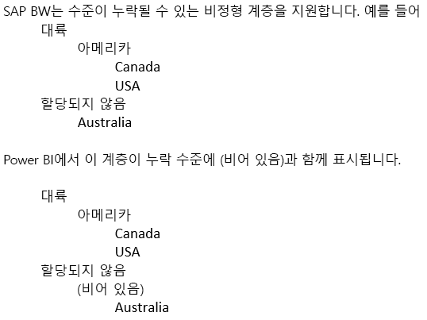

# DirectQuery 및 SAP BW(Business Warehouse)
**DirectQuery**를 사용하여 **SAP BW(Business Warehouse)** 데이터 원본에 직접 연결할 수 있습니다. SAP BW의 OLAP/다차원 특성을 고려할 때 관계형 원본(예: SQL Server)과 SAP BW에 대한 DirectQuery 간에는 많은 차이점이 있습니다. 이러한 차이점은 다음과 같이 요약됩니다.

* 관계형 원본에 대한 **DirectQuery**에는 **데이터 가져오기** 또는 **쿼리 편집기** 대화 상자에 정의된 것과 같이 필드 목록에서 사용할 수 있는 데이터를 논리적으로 정의하는 일단의 쿼리가 있습니다. 이는 SAP BW와 같은 OLAP 원본에 연결하는 경우가 *아닙니다*. 대신 **데이터 가져오기**를 사용하여 SAP 서버에 연결할 때 Infocube 또는 BEx 쿼리만 선택됩니다. 그런 다음 선택한 Infocube/BEx 쿼리의 모든 주요 수치와 차원을 필드 목록에서 사용할 수 있습니다.   
* 마찬가지로 SAP BW에 연결하는 경우 **쿼리 편집기**가 없습니다. 따라서 데이터 원본 설정(예: 서버 이름)은 **쿼리 편집 > 데이터 원본 설정**을 선택하여 변경할 수 있으며, 변수 설정은 **쿼리 편집 > 변수 편집**을 선택하여 변경할 수 있습니다.
* OLAP 원본의 고유한 특성을 고려할 때 DirectQuery에 적용되는 일반적인 제한 사항 외에도 추가로 적용되는 모델링 및 시각화 둘 다에 대한 제한 사항이 있습니다. 이러한 제한 사항은 이 문서의 뒷부분에서 설명합니다.

또한 Power BI에서 지원되지 않는 SAP BW 기능이 많이 있다는 것과 SAP BW에 대한 공용 인터페이스의 특성으로 인해 Power BI를 통해 나타나는 결과가 SAP 도구를 사용할 때 나타나는 결과와 일치하지 않는 중요한 경우가 있다는 것을 *이해해야 합니다*. 이러한 제한 사항은 이 문서의 뒷부분에서 설명합니다. 이러한 제한 사항과 동작의 차이점을 신중하게 검토하여 SAP 공용 인터페이스에서 반환된 Power BI를 통해 얻은 결과가 올바르게 해석되도록 합니다.  

## 추가 모델링 제한 사항
Power BI에서 DirectQuery를 사용하여 SAP BW에 연결할 때 기본적인 추가 모델링 제한 사항은 다음과 같습니다.

* **계산 열 지원 안 함:** 계산 열을 만드는 기능을 사용할 수 없습니다. 즉 계산 열을 만드는 그룹화 및 클러스터링을 사용할 수 없습니다.
* **측정값에 대한 추가 제한 사항:** SAP BW에서 제공하는 지원 수준을 반영하기 위해 측정값에서 사용할 수 있는 DAX 식에 추가로 적용되는 제한 사항이 있습니다.
* **관계 정의 지원 안 함:** 관계는 외부 SAP 원본에 내재되어 있으며 추가 관계를 모델에 정의할 수 없습니다.
* **데이터 보기 없음:** **데이터 보기**는 일반적으로 테이블의 세부 수준 데이터를 표시합니다. SAP BW와 같은 OLAP 원본의 특성을 고려할 때 이 보기는 SAP BW를 통해 사용할 수 없습니다.
* **열 및 측정값 세부 정보 고정:** 필드 목록에 표시되는 열 및 측정값의 목록은 기본 원본에 따라 고정되며 수정할 수 없습니다. 예를 들어 열을 삭제하거나 데이터 형식을 변경할 수 없지만 이름은 변경할 수 있습니다.
* **DAX의 추가 제한 사항:** 원본의 제한 사항을 반영하기 위해 측정값 정의에 사용할 수 있는 DAX에 대한 추가 제한 사항이 있습니다. 예를 들어 테이블에 대해 집계 함수를 사용할 수 없습니다.

## 추가 시각화 제한 사항
Power BI에서 DirectQuery를 사용하여 SAP BW에 연결할 때 기본적인 추가 시각화 제한 사항은 다음과 같습니다.

* **열 집계 없음:** 시각적 개체에 대한 열 집계를 변경할 수 없으며, 항상 *요약 안 함*입니다.
* **측정값 필터링 사용 안 함:** SAP BW에서 제공하는 지원을 반영하기 위해 측정값 필터링을 사용할 수 없습니다.
* **다중 선택 및 포함/제외:** 데이터 요소에서 둘 이상의 열 값을 나타내는 경우 시각적 개체에 대한 데이터 요소를 여러 개 선택하는 기능을 사용할 수 없습니다. 예를 들어 범례에 있는 범주와 함께 국가별 판매를 나타내는 가로 막대형 차트가 제공되면 (미국, 자전거) 및 (프랑스, 옷)에 대한 데이터 요소를 선택할 수 없습니다. 마찬가지로 (미국, 자전거)에 대한 데이터 요소를 선택하여 시각적 개체에서 제외할 수 없습니다. 두 제한 사항은 모두 SAP BW에서 제공하는 지원을 반영하기 위해 적용됩니다.

## SAP BW 기능에 대한 지원
다음 표에서는 Power BI를 사용할 때 완전히 지원되지 않거나 다르게 작동하는 SAP BW 기능을 모두 보여줍니다.   

| 특정 | 설명 |
| --- | --- |
| 로컬 계산 |BEx 쿼리에 정의된 로컬 계산은 BEx 분석기와 같은 도구를 통해 표시되는 숫자를 변경합니다. 그러나 공용 MDX 인터페이스를 통해 SAP에서 반환되는 숫자에는 반영되지 않습니다.     **따라서 Power BI 시각적 개체에 표시되는 숫자는 SAP 도구의 해당 시각적 개체에 대한 숫자와 반드시 일치하지는 않습니다.**     예를 들어 집계를 누적(즉, 누적 합계)으로 설정하는 BEx 쿼리에서 큐브 쿼리에 연결할 때 Power BI는 해당 설정을 무시하고 기본 숫자를 반환합니다.  분석가는 Power BI에서 로컬 누적 합계 계산을 적용할 수 있지만, 그렇지 않은 경우 숫자를 해석하는 방법에 주의해야 합니다. |
| 집계 |경우에 따라, 특히 여러 통화를 처리하는 경우 SAP 공용 인터페이스에서 반환하는 집계 숫자는 SAP 도구에서 표시하는 것과 일치하지 않습니다.     **따라서 Power BI 시각적 개체에 표시되는 숫자는 SAP 도구의 해당 시각적 개체에 대한 숫자와 반드시 일치하지는 않습니다.**     예를 들어 BEx 분석기에서 서로 다른 통화에 대한 합계가 "*"로 표시되지만, 이러한 집계 숫자에 대해 의미가 없다는 정보가 없이 SAP 공용 인터페이스에서 이 합계를 반환합니다. 따라서 Power BI에서 이러한 숫자(집계, 예: $, EUR 및 AUD)를 표시하게 됩니다. |
| 통화 서식 |Power BI에서는 모든 통화 서식(예: $2,300 또는 4,000AUD)이 반영되지 않습니다. |
| 측정 단위 |Power BI에서는 측정 단위(예: 230KG)가 반영되지 않습니다. |
| 키 및 텍스트(짧은, 보통, 긴) |CostCenter와 같은 SAP BW 특성의 경우 필드 목록에는 단일 열 비용 센터가 표시됩니다.  해당 열을 사용하면 기본 텍스트가 표시됩니다.  숨겨진 필드를 표시하면 고유 이름 열을 표시할 수도 있으며, 이는 SP BW에서 할당한 고유 이름을 반환하며 고유성에 대한 기준이 됩니다.     키 및 기타 텍스트 필드는 사용할 수 없습니다. |
| 특성의 다중 계층 구조 |**SAP**에서 특성에는 여러 계층이 있을 수 있습니다. 쿼리에 이러한 특성이 포함되면 사용자는 BEx 분석기와 같은 도구에서 사용할 계층을 선택할 수 있습니다.     **Power BI**의 필드 목록에서는 다양한 계층을 동일한 차원의 다른 계층으로 볼 수 있습니다.  그러나 동일한 차원에서 서로 다른 두 계층의 여러 수준을 선택하면 SAP에서 빈 데이터가 반환됩니다. |
| 비정형 계층 구조 처리 | |
| 크기 조정 인수/역 부호 |SAP에서 주요 수치에는 모든 표시의 크기가 해당 인수로 조정되는 서식 옵션으로 정의된 크기 조정 인수(예: 1000)가 있을 수 있습니다.     마찬가지로 부호를 반대로 바꾸는 속성 집합이 있을 수 있습니다. Power BI에서 시각적으로 또는 계산의 일부로 이러한 주요 수치를 사용하면 크기가 조정되지 않은 숫자가 사용되며 부호가 반대로 바뀌지 않습니다. 기본 크기 조정 인수는 사용할 수 없습니다. Power BI 시각적 개체에서는 축(K, M, B)에 표시되는 크기 조정 단위를 시각적 서식의 일부로 제어할 수 있습니다. |
| 수준이 동적으로 표시되거나 표시되지 않는 계층 구조 |SAP BW에 처음 연결할 때 계층 구조의 수준에 대한 정보를 검색하여 필드 목록에 일단의 필드를 생성합니다. 이를 캐시하여 수준 집합이 변경되면 새로 고침을 호출할 때까지 해당 필드 집합이 변경되지 않습니다.     **Power BI Desktop**에서만 이렇게 수행할 수 있습니다. 게시 후에는 Power BI 서비스에서 수준의 변경 내용을 반영하는 이러한 새로 고침을 호출할 수 없습니다. |
| 기본 필터 |BEx 쿼리에는 SAP BEx 분석기에서 자동으로 적용하는 기본 필터가 포함될 수 있습니다. 이러한 필터는 공개되지 않으므로 Power BI에서 동일한 방법으로 사용할 경우 기본적으로 동일한 필터가 적용되지 않습니다. |
| 숨겨진 주요 수치 |BEx 쿼리에서는 주요 수치의 가시성을 제어할 수 있으며, 숨겨진 쿼리는 SAP BEx 분석기에 표시되지 않습니다. 이는 공용 API를 통해 반영되지 않으므로 이러한 숨겨진 주요 수치가 필드 목록에 계속 표시됩니다. 그러나 Power BI에서는 숨길 수 있습니다. |
| 숫자 서식 |Power BI에서는 숫자 서식(10진수 자리의 숫자, 소수점 등)이 자동으로 반영되지는 않지만, 이러한 서식을 제어할 수 있습니다. |
| 계층 구조 버전 관리 |SAP BW를 사용하면 2007년 및 2008년 비용 센터 계층 구조와 같이 다양한 버전의 계층 구조를 유지할 수 있습니다. 공용 API에서 버전 정보를 공개하지 않으므로 Power BI에서는 최신 버전만 사용할 수 있습니다. |
| 시간 종속 계층 구조 |Power BI를 사용하는 경우 시간 종속 계층은 현재 날짜로 평가됩니다. |
| 통화 변환 |SAP BW는 큐브에 저장된 비율에 따라 통화 변환을 지원합니다. 공용 API에서 이러한 기능을 공개하지 않으므로 Power BI에서는 사용할 수 없습니다. |
| 정렬 순서 |SAP에서는 특성에 대한 정렬 순서(텍스트 기준 또는 키 기준)가 정의될 수 있지만, Power BI에서는 이 정렬 순서가 반영되지 않습니다. 예를 들어 월은 "April", "Aug" 등으로 표시될 수 있습니다.     Power BI에서는 이 정렬 순서를 변경할 수 없습니다. |
| 기술 이름 |**데이터 가져오기**에서는 특성/측정값 이름(설명)과 기술 이름을 모두 볼 수 있지만, 필드 목록에는 특성/측정값 이름(설명)만 포함됩니다. |
| 특성 |Power BI 내에서는 특성의 특성에 액세스할 수 없습니다. |
| 최종 사용자 언어 설정 |SAP BW에 연결하는 데 사용되는 로캘은 연결 세부 정보의 일부로 설정되며, 최종 보고서 소비자의 로캘은 반영되지 않습니다. |
| 텍스트 변수 |SAP BW에서는 선택한 값으로 대체되는 변수(예: "$YEAR$ 실제 데이터")의 자리 표시자를 필드 이름에 포함할 수 있습니다. 예를 들어 변수로 2016년이 선택되면 BEx 도구에서는 해당 필드가 "2016 실제 데이터"로 표시됩니다.     Power BI에서는 열 이름이 변수 값에 따라 변경되지 않으므로 "$YEAR$ 실제 데이터"로 표시되지만,  이 열 이름을 변경할 수는 있습니다. |
| Customer Exit 변수 | Customer Exit 변수는 공용 API에서 공개하지 않으므로, Power BI에서는 Customer Exit 변수를 지원하지 않습니다. |
| 특성 구조 | 기본 SAP BW 원본의 모든 특성 구조는 Power BI에 표시되는 측정값의 ‘급증’으로 나타납니다. 예를 들어 Sales와 Costs라는 두 측정값이 있고, Budget과 Actual이 포함된 특성 구조의 경우, Sales.Budget, Sales.Actual, Costs.Budget, Costs.Actual이라는 네 측정값이 표시됩니다. |

## 다음 단계
DirectQuery에 대한 자세한 내용은 다음 리소스를 참조하세요.

* [Power BI의 DirectQuery](desktop-directquery-about.md)
* [DirectQuery에서 지원하는 데이터 원본](desktop-directquery-data-sources.md)
* [DirectQuery 및 SAP HANA](desktop-directquery-sap-hana.md)

