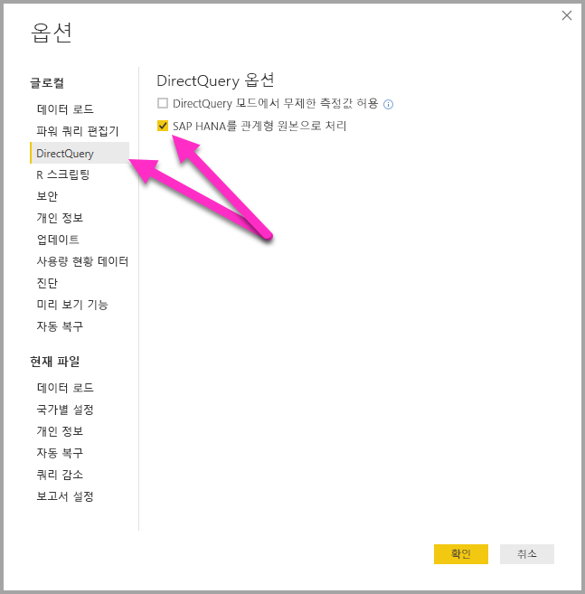

# DirectQuery 및 SAP HANA
**DirectQuery**를 사용하여 **SAP HANA** 데이터 원본에 직접 연결할 수 있습니다. SAP HANA에 연결할 때에는 두 가지 옵션이 있습니다.

* **SAP HANA를 다차원 원본으로 처리(기본값):**  이 경우 Power BI를 SAP Business Warehouse 또는 Analysis Services처럼 다른 다차원 원본에 연결할 때와 동작이 비슷합니다. 이 설정은, 단일 분석 또는 계산 보기가 선택 및 모든 측정값을 사용 하 여 SAP HANA에 연결할 때 계층 및 해당 뷰의 속성을 필드 목록에서 사용할 수 됩니다. 시각적 개체가 생성될 때 집계 데이터는 항상 SAP HANA에서 검색됩니다. 이것이 권장되는 방법이며 SAP HANA에 대한 새로운 DirectQuery 보고서의 기본값입니다.

* **SAP HANA를 관계형 원본으로 처리:** 이 경우 Power BI에서 SAP HANA를 관계형 원본으로 처리합니다. 이 더 큰 유연성을 제공합니다. 주의 해야이 방법을 사용 하 여 예상 대로 측정값이 집계 되는 확인 하는 데 성능 문제를 방지 합니다.

연결 방법을 선택 하 여 설정 된 전역 도구 옵션에 의해 결정 됩니다 **파일 > 옵션 및 설정** 차례로 **옵션 > DirectQuery**를 선택한 다음 옵션을 선택  **SAP HANA를 관계형 원본으로 처리**다음 그림에 나와 있는 것 처럼 합니다. 

SAP HANA를 관계형 원본으로 처리하는 옵션은 SAP HANA를 통해 DirectQuery를 사용하는 *새* 보고서에 사용되는 방법을 제어합니다. 이 옵션은 현재 보고서의 기존 SAP HANA 연결 또는 열려 있는 다른 보고서의 연결에 아무런 영향을 미치지 않습니다. 그러므로 이 옵션이 현재 선택되어 있지 않은 경우, **데이터 가져오기**를 사용하여 SAP HANA에 새 연결을 추가하면 해당 연결은 SAP HANA를 다차원 원본으로 처리하게 됩니다. 그러나 다른 보고서를 열면 또한 SAP HANA에 연결 하는 경우 해당 보고서가 설정 된 옵션에 따라 동작할 계속 *만들어졌을 때*, 즉, SAP HANA에 연결 된 모든 보고서 2018 년 2 월 전에 만든된 SAP HANA를 관계형 원본으로 처리를 계속 됩니다. 

두 가지 서로 다른 동작을 구성 하 고 다른 방법 중 하나에서 기존 보고서를 전환할 수 없는 합니다. 

이러한 두 가지 방법에 대해 자세히 살펴보겠습니다.

## SAP HANA를 다차원 원본으로 처리(기본값)

SAP HANA에 대한 모든 새 연결은 기본적으로 SAP HANA를 다차원 원본으로 처리하는 이 연결 방법을 사용합니다. SAP HANA에 대한 연결을 관계형 원본으로 처리하려면 **파일 > 옵션 및 설정 > 옵션**을 선택한 다음, **직접 쿼리 > SAP HANA를 관계형 원본으로 처리** 아래의 상자를 선택해야 합니다. 이 기능이 **미리 보기**로 제공되는 동안 다차원 방법을 사용하여 생성된 보고서를 Power BI 서비스에 게시할 수 ‘없으며’, 그렇게 하면 Power BI 서비스에서 보고서를 열 때 오류가 발생합니다.   

SAP HANA를 다차원 원본에 연결할 때 다음 사항을 고려해 야 합니다.

* **데이터 가져오기 탐색기**에서 단일 SAP HANA 보기를 선택할 수 있습니다. 개별 측정값 또는 특성을 선택할 수 없습니다. 연결 시 정의된 쿼리가 없습니다. SAP HANA를 관계형 원본으로 처리하는 동안 데이터 가져오기나 DirectQuery 사용과 다릅니다. 즉,이 연결 방법을 선택 하면 SAP HANA SQL 쿼리를 직접 사용할 수는 있습니다.

* 선택한 보기의 모든 측정값, 계층 구조 및 특성이 필드 목록에 표시됩니다. 

* 측정값은 시각적 개체에서 사용되므로 SAP HANA는 시각적 개체에 필요한 집계 수준에서 측정값을 검색하도록 쿼리합니다. 그러므로 비가산적 측정값(카운터, 비율 등)을 처리할 때 모든 집계는 SAP HANA에서 수행되며, 추가 집계가 Power BI에서 수행되지 않습니다. 

* SAP HANA에서 항상 올바른 집계 값을 얻기 위해 특정 제한 사항을 적용해야 합니다. 예를 들어 계산된 열을 추가하거나 동일한 보고서 내에서 여러 SAP HANA 보기의 데이터를 결합할 수 없습니다. 

SAP HANA를 다차원 원본으로 처리하면 *관계형* 원본으로 처리하는 방법보다 더 많은 유연성을 제공하지는 않지만 이 방법이 더 간단하며, 더 복잡한 SAP HANA 측정값을 처리할 때 올바른 집계 값을 얻을 수 있고 일반적으로 성능이 더 뛰어납니다. 

**필드** 목록에는 SAP HANA 보기의 모든 측정값, 특성 및 계층 구조가 포함됩니다. 이 연결 방법을 사용하면 다음 동작이 적용됩니다.

* 하나 이상의 계층 구조에 포함되는 특성은 기본적으로 숨겨집니다. 그러나 필요한 경우 필드 목록의 상황에 맞는 메뉴에서 **숨겨진 항목 표시**를 선택하여 표시할 수 있습니다. 필요한 경우, 동일한 상황에 맞는 메뉴에서 표시되도록 설정할 수 있습니다.

* SAP HANA에서 다른 특성을 레이블로 사용하도록 특성을 정의할 수 있습니다. 예를 들어 **제품** (1,2,3, 값 및 사용 등) 사용할 수 있습니다 **ProductName** (사용 하 여 자전거, 셔츠, 장갑 등에 값)을 레이블로 합니다. 이 경우, 값이 자전거, 셔츠, 장갑 등의 레이블인 단일 필드 **Product**가 필드 목록에 표시됩니다. 그러나 키 값 1,2,3으로 정렬되고 고유성이 확인됩니다. 숨겨진 열 **Product.Key**도 생성되어 필요한 경우 기본 키 값에 액세스할 수 있습니다. 

기본 SAP HANA 보기에 정의된 모든 변수는 연결 시 표시되며, 필요한 값을 입력할 수 있습니다. 이러한 값을 선택 하 여 변경할 수 있습니다 나중 **쿼리 편집** 리본에서 차례로 **매개 변수 관리** 표시 되는 드롭다운 메뉴에서. 

SAP HANA로부터 항상 올바른 집계 데이터를 얻을 수 있도록 확인해야 하므로, DirectQuery를 사용할 때 허용되는 모델링 작업은 일반적인 경우보다 더 제한적입니다. 그러나 측정값 정의, 필드 이름 바꾸기 및 숨기기, 표시 형식 정의 등 많은 추가 및 변경이 가능합니다. 이러한 모든 변경 내용은 새로 고칠 때 보존되며, SAP HANA 보기에 대해 충돌되는 변경 내용은 적용되지 않습니다. 

### 추가 모델링 제한 사항

DirectQuery를 사용하여 SAP HANA에 연결할 때(다차원 원본으로 처리) 기본적인 추가 모델링 제한 사항은 다음과 같습니다. 

* **계산 열 지원 안 함:** 계산 열을 만드는 기능을 사용할 수 없습니다. 즉 계산 열을 만드는 그룹화 및 클러스터링을 사용할 수 없습니다.
* **측정값에 대한 추가 제한 사항:** SAP HANA에서 제공하는 지원 수준을 반영하기 위해 측정값에서 사용할 수 있는 DAX 식에 추가로 적용되는 제한 사항이 있습니다.
* **관계 정의 지원 안 함:** 보고서 내에서 단일 보기만 쿼리할 수 있으며, 관계 정의에 대한 지원이 없습니다.
* **데이터 보기 없음:** **데이터 보기**는 일반적으로 테이블의 세부 수준 데이터를 표시합니다. SAP HANA와 같은 OLAP 원본의 특성을 고려할 때 이 보기는 SAP HANA를 통해 사용할 수 없습니다.
* **열 및 측정값 세부 정보 고정:** 필드 목록에 표시되는 열 및 측정값의 목록은 기본 원본에 따라 고정되며 수정할 수 없습니다. 예를 들어 열을 삭제하거나 데이터 형식을 변경할 수 없지만 이름은 변경할 수 있습니다.
* **DAX의 추가 제한 사항:** 원본의 제한 사항을 반영하기 위해 측정값 정의에 사용할 수 있는 DAX에 대한 추가 제한 사항이 있습니다. 예를 들어 테이블에 대해 집계 함수를 사용할 수 없습니다.

### 추가 시각화 제한 사항

DirectQuery를 사용하여 SAP HANA에 연결할 때(다차원 원본으로 처리) 시각적 개체에 대한 제한 사항은 다음과 같습니다. 
* **열 집계 없음:** 시각적 개체에 대한 열 집계를 변경할 수 없으며, 항상 ‘요약 안 함’입니다. 

## SAP HANA를 관계형 원본으로 처리 

관계형 원본으로 SAP HANA에 연결하도록 선택하면 유연성이 추가로 제공됩니다. 예를 들어 계산 열을 만들고, 여러 SAP HANA 보기의 데이터를 포함하고, 결과 테이블 간에 관계를 만들 수 있습니다. 그러나 이러한 방식으로 SAP HANA를 사용할 때에는 연결 처리 방법의 특정 측면을 이해하여 다음을 확인해야 합니다. 

* SAP HANA 보기에 비가산적 측정값(예: 단순한 합계가 아닌 고유 카운트 또는 평균)이 포함된 경우 결과가 예상대로 나와야 합니다.
* 결과 쿼리가 효율적이어야 합니다.

**데이터 가져오기** 또는 **쿼리 편집기**에 정의된 쿼리에서 집계를 수행할 때는 SQL Server와 같은 관계형 원본의 동작을 명확히 하고 시작하는 것이 좋습니다. 다음에 나오는 예에서 **쿼리 편집기**에 정의된 쿼리는 ‘ProductID’별 평균 가격을 반환합니다.   

데이터를 Power BI(및 DirectQuery 사용)로 가져오는 경우 결과는 다음과 같습니다.

* **쿼리 편집기**에서 작성한 쿼리에 정의된 집계 수준에서 데이터를 가져옵니다. 예를 들어, 제품별 평균 가격입니다. 그 결과, 시각적 개체에 사용할 수 있는 *ProductID* 및 *AveragePrice*라는 두 열이 있는 테이블이 생성됩니다.
* 시각적 개체에서 모든 후속 집계(예: *Sum*, *평균*, *Average* 등)는 가져온 데이터에 대해 수행됩니다. 예를 들어, 시각적 개체에 ‘AveragePrice’를 포함하면 기본적으로 ‘Sum’ 집계를 사용하고 각 ‘ProductID’에 대한 ‘AveragePrice’ 합계를 반환합니다(이 예에서는 13.67).     시각적 개체에 사용된 다른 대체 집계 함수(예: *Min*, *Average* 등)도 마찬가지입니다. 예를 들어 *평균* 의 *AveragePrice* 6.66, 4, 3 4.56을, 평균 및 평균을 반환 *가격* 기본 6 개 레코드 하는 테이블입니다.
  
가져오기 대신 **DirectQuery**(동일한 관계형 원본에 대해)를 사용하면 동일한 의미 체계가 적용되고 결과는 정확히 동일합니다.  

* 동일한 쿼리가 제공되면, 데이터를 실제로 가져오지 않더라도 논리적으로 정확히 동일한 데이터가 보고 계층에 표시됩니다.

* 시각적 개체에서 모든 후속 집계(*Sum*, *평균*, *Average* 등)는 쿼리에서 해당 논리 테이블을 통해 다시 수행됩니다. 마찬가지로 *AveragePrice*의 *Average*를 포함하는 시각적 개체는 동일한 4.56을 반환합니다.
  
연결이 관계형 원본으로 처리되는 경우 SAP HANA에 대해 생각해 보겠습니다. Power BI는 SAP HANA에서, 둘 다 측정값을 포함할 수 있는 *분석 뷰* 및 *계산 뷰* 모두로 작동할 수 있습니다. 그러나 현재 SAP HANA에 대한 접근 방식은 이전 섹션에서 설명한 것과 동일한 원칙을 따릅니다. **데이터 가져오기** 또는 **쿼리 편집기**에 정의된 쿼리에 따라 사용 가능한 데이터가 결정되고 시각적 개체의 모든 후속 집계가 데이터에 대해 수행되며 가져오기 및 DirectQuery 모두에 동일하게 적용됩니다.  
그러나 SAP HANA의 특성에 따라, 초기 **데이터 가져오기** 대화 상자 또는 **쿼리 편집기**에 정의된 쿼리는 항상 집계 쿼리이며, 일반적으로 사용되는 실제 집계가 SAP HANA 보기로 정의된 측정값을 포함합니다.

위의 SQL Server 예제와 동등한 것으로, *ID*, *ProductID*, *DepotID*를 포함하고, 뷰에서 *Average of Price*로 정의된 *AveragePrice*가 있는 측정값을 포함하는 SAP HANA 보기가 있습니다.  
    
있는 경우는 **데이터 가져오기** 에 대 한 환경을 선택 했습니다 **ProductID** 하며 **AveragePrice** 측정값을 요청 하는 뷰를 통해 쿼리를 정의 하는 다음 데이터 집계 (이전 예제에서는 편의상 의사 SQL는 SAP HANA SQL 구문과 정확 하 게 일치 하지 않는). 그런 다음 시각적 개체에 정의된 추가 집계는 이러한 쿼리의 결과를 추가로 집계합니다. 다시, SQL Server에 대해 위에서 설명한 것처럼, 이 내용은 가져오기 및 DirectQuery 경우 모두에 적용됩니다. DirectQuery의 경우 쿼리에서 **데이터 가져오기** 하거나 **쿼리 편집기** SAP HANA로 전송 된 단일 쿼리는 하위 select에 사용할 이므로 따라서 이전 버전에서는 모든 데이터를 읽을 수 있는 경우 실제로 추가로 집계 합니다.  

SAP HANA에서 DirectQuery를 사용하는 경우 이러한 고려 사항 및 동작은 모두 다음과 같은 사항을 중요하게 고려해야 합니다.  

* SAP HANA의 측정값이 비가산적(예: 단순한 *Sum*, *Min*, *Max*가 아님)일 때는 항상 시각적 개체에서 수행되는 추가 집계에 주의를 기울여야 합니다.

* **데이터 가져오기** 또는 **쿼리 편집기**에서는, 결과가 SAP HANA로 보낼 수 있는 적절한 쿼리여야 한다는 사실을 유념하여 필요한 데이터를 검색하는 데 필요한 열만 포함해야 합니다. 예를 들어, 이후 시각적 개체에 필요한 수 있습니다 이러한 생각을 사용 하 여 수십 개의 열을 선택한 경우 다음 DirectQuery 간단한 시각적 개체는 의미 하위 select에 사용 되는 집계 쿼리가 수십 개의 열은 일반적으로 포함 됩니다. 성능이 저하 됩니다.
  
예를 살펴보겠습니다. 다음 예제에서는 **데이터 가져오기** 대화 상자에서 5개의 열(**CalendarQuarter**, **Color**, **LastName**, **ProductLine**, **SalesOrderNumber**)과 *OrderQuantity* 측정값을 선택하면, 나중에 Min OrderQuantity가 포함된 간단한 시각적 개체가 생성되고 그 결과 SAP HANA에 다음 SQL 쿼리가 발생합니다. 음영 처리된 부분은 하위 SELECT로, **데이터 가져오기** / **쿼리 편집기**의 쿼리를 포함합니다. 이 하위 select가 높은 카디널리티 결과 제공 하면 결과 SAP HANA 성능이 됩니다 될 가능성이 큽니다 저하 됩니다.  

   
이러한 동작 때문에 **데이터 가져오기** 또는 **쿼리 편집기**에서 선택한 항목은 SAP HANA에 적당한 쿼리이면서 필요한 항목으로 제한하는 것이 좋습니다.  

## 모범 사례 

SAP HANA에 연결하는 두 가지 방법의 경우, 특히 우수한 성능과 관련해서 DirectQuery 사용에 대한 권장 사항이 SAP HANA에도 적용됩니다. 이러한 권장 사항은 [Power BI의 DirectQuery 사용](desktop-directquery-about.md) 문서에 자세히 설명되어 있습니다.
   
## 제한 사항

다음 목록에서는 Power BI를 사용할 때 완전히 지원되지 않는 SAP HANA 기능 또는 다르게 작동하는 기능을 모두 설명합니다. 

* **부모 자식 계층 구조** - 부모 자식 계층 구조는 Power BI에서 표시되지 않습니다.
Power BI가 SQL 인터페이스를 사용하여 SAP HANA에 액세스하고 SQL을 통해 부모 자식 계층 구조에 완전히 액세스할 수 없기 때문입니다.
* **기타 계층 구조 메타데이터** - 계층 구조의 기본 구조는 Power BI에 표시되지만 비정형 계층 구조의 동작 제어처럼 일부 계층 구조 메타데이터에는 영향을 미치지 않습니다.
이는 SQL 인터페이스로 인한 제한 사항 때문입니다.
* **SSL을 사용 하 여 연결** -가져오기를 사용 하 여 연결할 수 있습니다 하 고 SSL을 사용 하 여 다차원, 구입 관계형 커넥터에 대 한 SSL을 사용 하도록 구성 하는 SAP HANA 인스턴스에 연결할 수 없습니다.
* **특성 보기에 대한 지원** - Power BI는 분석 및 계산 보기에 연결할 수 있지만 특성 보기에는 바로 연결할 수 없습니다.
* **카탈로그 개체 지원** - Power BI는 카탈로그 개체에 연결할 수 없습니다.
* **게시 후 변수 변경** - 보고서를 게시한 후 Power BI 서비스에서 바로 SAP HANA 변수에 대한 값을 변경할 수 없습니다. 
 
## 알려진 문제 
다음 목록에서는 Power BI를 사용하여 SAP HANA(DirectQuery)에 연결할 때 알려진 모든 문제를 설명합니다. 

* **카운터 및 기타 측정값에 대해 쿼리할 때 SAP HANA 문제** - 분석 보기에 연결하고 카운터 측정값 및 기타 비율 측정값이 동일한 시각적 개체에 포함되는 경우 SAP HANA에서 잘못된 데이터가 반환됩니다. 이 문제는 SAP 참고 2128928(계산 열 및 카운터를 쿼리할 때 예상치 못한 결과)에서 다룹니다. 이 경우 비율 측정값이 올바르지 않습니다. 

* **단일 SAP HANA 열의 여러 Power BI 열** - 둘 이상의 계층 구조에서 SAP HANA 열이 사용되는 일부 계산 보기의 경우, SAP HANA는 이 열을 두 개의 별도 특성으로 표시합니다. 그 결과 Power BI에 두 개의 열이 생성됩니다.  이러한 열은 기본적으로 숨겨져 있지만, 계층 구조와 관련된 모든 쿼리 또는 열이 올바르게 동작합니다. 
 
## 다음 단계

DirectQuery에 대한 자세한 내용은 다음 리소스를 참조하세요.

* [Power BI의 DirectQuery](desktop-directquery-about.md)
* [DirectQuery에서 지원하는 데이터 원본](desktop-directquery-data-sources.md)
* [DirectQuery 및 SAP BW](desktop-directquery-sap-bw.md)
* [온-프레미스 데이터 게이트웨이](service-gateway-onprem.md)

