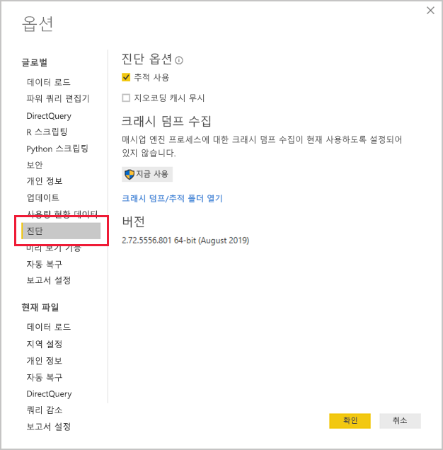
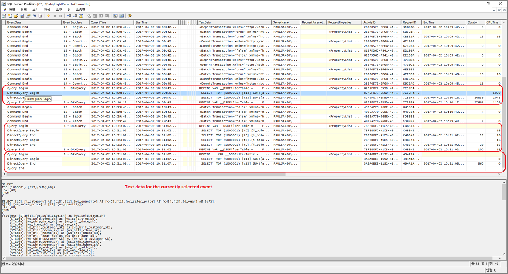
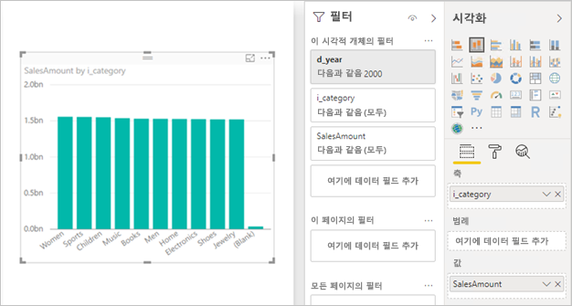

# <a name="directquery-model-troubleshooting-in-power-bi-desktop"></a>Power BI Desktop의 DirectQuery 모델 문제 해결

이 문서는 Power BI Desktop 또는 Power BI 서비스를 사용하여 Power BI DirectQuery 모델을 개발하는 데이터 모델러를 대상으로 합니다. 성능 문제를 진단하는 방법과 보고서를 최적화할 수 있도록 자세한 정보를 가져오는 방법을 설명합니다.

## <a name="performance-analyzer"></a>성능 분석기

성능 문제 진단은 Power BI(서비스 또는 Power BI Report Server) 대신 Power BI Desktop에서 시작하는 것이 좋습니다. 일반적으로 성능 문제는 단순히 기본 데이터 원본의 성능 수준을 기반으로 하고, 훨씬 격리된 Power BI Desktop 환경에서 더 쉽게 식별 및 진단되며, 처음에는 특정 구성 요소(예: Power BI 게이트웨이)를 제거합니다. Power BI Desktop에서 성능 문제가 없는 것으로 확인된 경우에만 Power BI에서 보고서의 세부 정보를 조사해야 합니다. [성능 분석기](desktop-performance-analyzer.md)는 이 프로세스 전반에 걸쳐 문제를 확인하는 데 유용한 도구입니다.

마찬가지로 페이지의 여러 시각적 개체보다는 개별 시각적 개체로 모든 문제를 먼저 격리하는 것이 좋습니다.

이 항목의 이전 단락에서 설명한 단계를 수행했다고 가정해 봅시다. 이제 Power BI Desktop의 한 페이지에 여전히 느린 시각적 개체 하나가 있습니다. Power BI Desktop에서 기본 원본으로 보내는 쿼리를 확인하려면 성능 분석기를 사용할 수 있습니다. 기본 데이터 원본에서 내보낼 수 있는 추적/진단 정보를 볼 수도 있습니다. 이러한 추적에는 쿼리를 실행한 방법과 쿼리를 개선할 수 있는 방법에 대한 유용한 정보도 포함되어 있을 수 있습니다.

또한 원본에서 이러한 추적이 없는 경우에도 다음 단락에서 설명한 대로 실행 시간과 함께 Power BI에서 보내는 쿼리를 볼 수 있습니다.

## <a name="review-trace-files"></a>추적 파일 검토

기본적으로 Power BI Desktop은 지정된 세션 동안 **FlightRecorderCurrent.trc**라는 추적 파일에 이벤트를 기록합니다.

일부 DirectQuery 원본의 경우 기본 데이터 원본에 보내는 모든 쿼리가 이 로그에 포함됩니다(향후에 나머지 DirectQuery 원본도 지원될 수 있음). 로그에 쿼리를 쓰는 원본은 다음과 같습니다.

- SQL Server
- Azure SQL Database
- Azure SQL Data Warehouse
- Oracle
- Teradata
- SAP HANA

추적 파일은 현재 사용자의 **AppData** 폴더에 있을 수 있습니다. _\\\<User>\AppData\Local\Microsoft\Power BI Desktop\AnalysisServicesWorkspaces_

이 폴더에 쉽게 액세스하려면 Power BI Desktop에서 _파일 > 옵션 및 설정 > 옵션_을 선택한 다음, **진단** 페이지를 선택합니다. 그러면 다음과 같은 대화 상자 창이 표시됩니다.



**크래시 덤프/추적 폴더 열기** 링크를 선택하면 크래시 덤프 수집 아래에 다음 폴더가 열립니다. _\\\<User>\AppData\Local\Microsoft\Power BI Desktop\Traces_

해당 폴더의 부모 폴더로 이동하면 _AnalysisServicesWorkspaces_가 포함된 폴더가 표시됩니다. 이 폴더에는 열려 있는 Power BI Desktop 인스턴스마다 하나의 작업 영역 하위 폴더가 포함되어 있습니다. 이러한 하위 폴더의 이름은 _AnalysisServicesWorkspace2058279583_와 같이 정수 접미사로 지정됩니다.

해당 폴더 내에는 현재 Power BI 세션의 FlightRecorderCurrent.trc 추적 파일이 포함된 _\Data_ 하위 폴더가 있습니다. 연결된 Power BI Desktop 세션이 끝나면 해당 작업 영역 폴더가 삭제됩니다.

추적 파일은 SQL Server Profiler 도구를 사용하여 열 수 있습니다. 이 도구는 SQL Server Management Studio와 함께 무료 다운로드로 제공됩니다. [이 위치](/sql/ssms/download-sql-server-management-studio-ssms?view=sql-server-2017)에서 가져올 수 있습니다.

SQL Server Management Studio를 다운로드하여 설치한 후에 SQL Server Profiler를 실행합니다.



추적 파일을 열려면 다음 단계를 수행합니다.

1. SQL Server Profiler에서 _‘파일 > 열기 > 추적’_ 파일을 선택합니다.
2. 다음과 같이 현재 열려 있는 Power BI 세션에 대한 추적 파일의 경로를 입력합니다. _\\\<User>\AppData\Local\Microsoft\Power BI Desktop\AnalysisServicesWorkspaces\AnalysisServicesWorkspace2058279583\Data_
3. _FlightRecorderCurrent.trc_를 엽니다.

현재 세션의 모든 이벤트가 표시됩니다. 주석이 추가된 다음 예제는 이벤트 그룹을 강조 표시하고 있습니다. 각 그룹에 있는 항목은 다음과 같습니다.

- UI로(예: 시각적 개체에서 또는 필터 UI의 값 목록 채우기에서) 생성된 DAX 쿼리의 시작과 끝을 나타내는 _쿼리 시작_ 및 _쿼리 끝_ 이벤트
- DAX 쿼리 계산 중에 기본 데이터 원본으로 보낸 쿼리를 나타내는 하나 이상의 _‘DirectQuery 시작’_ 및 _‘DirectQuery 종료’_ 이벤트 쌍

여러 DAX 쿼리를 동시에 실행할 수 있으므로 여러 그룹의 이벤트를 인터리브할 수 있습니다. ActivityID 값은 동일한 그룹에 속하는 이벤트를 확인하는 데 사용할 수 있습니다.


관심 있는 다른 열은 다음과 같습니다.

- **TextData:** 이벤트의 텍스트 세부 정보입니다. ‘쿼리 시작/종료’ 이벤트의 경우 DAX 쿼리가 됩니다.  ‘DirectQuery 시작/종료’ 이벤트의 경우 기본 원본으로 보낸 SQL 쿼리가 됩니다.  현재 선택한 이벤트의 _TextData_ 값도 맨 아래 영역에 표시됩니다.
- **EndTime:** 이벤트의 완료 시간입니다.
- **Duration:** DAX 또는 SQL 쿼리를 실행하는 데 걸리는 시간(밀리초)입니다.
- **Error:** 오류가 발생했는지 여부를 나타냅니다. 오류가 발생한 경우 이벤트도 빨간색으로 표시됩니다.

위의 이미지에서 관심 있는 열을 더 쉽게 볼 수 있도록 덜 관심 있는 열 중 일부가 좁혀졌습니다.

잠재적인 성능 문제를 진단하기 위해 추적을 캡처하는 데 권장되는 방법은 다음과 같습니다.

- 여러 작업 영역 폴더로 인한 혼동을 피하기 위해 단일 Power BI Desktop 세션을 엽니다.
- Power BI Desktop에서 관심 있는 일련의 작업을 수행합니다. 관심 있는 이벤트가 추적 파일로 플러시되도록 하려면 그 외의 몇 가지 추가 작업을 포함합니다.
- 앞에서 설명한 대로 SQL Server Profiler를 열고 추적을 검사합니다. Power BI Desktop을 닫으면 추적 파일이 삭제된다는 것에 유의하세요. 또한 Power BI Desktop의 추가 작업은 바로 표시되지 않으며, 새 이벤트를 확인하려면 추적 파일을 닫았다가 다시 열어야 합니다.
- 추적 파일을 쉽게 해석할 수 있도록 개별 세션을 적절한 크기로 작게 유지합니다(수백 개가 아닌 작업에서 10초). 추적 파일의 크기가 제한되므로 긴 세션의 경우 초기 이벤트가 삭제될 가능성이 있습니다.

## <a name="understand-queries-sent-to-the-source"></a>원본에 전송된 쿼리 이해

Power BI Desktop에서 생성하고 보내는 쿼리의 일반 형식은 참조된 각 모델 테이블에 대한 하위 쿼리를 사용합니다. 하위 쿼리는 파워 쿼리의 쿼리에서 정의됩니다. 예를 들어 SQL Server 관계형 데이터베이스에 다음과 같은 TPC-DS 테이블이 있다고 가정합니다.


다음 시각적 개체와 해당 구성을 고려합니다. **SalesAmount** 측정값은 다음과 같은 식으로 정의되었습니다.

```dax

SalesAmount = SUMX(Web_Sales, [ws_sales_price] * [ws_quantity])

```



해당 시각적 개체를 새로 고치면 아래 단락에 표시된 T-SQL 쿼리가 생성됩니다. 보시는 것처럼 **Web_Sales**, **Item** 및 **Date_dim** 모델 테이블에 대한 세 가지 하위 쿼리가 있습니다. 실제로 시각적 개체는 4개의 열만 참조하지만, 각 테이블에서 모든 모델 테이블 열을 반환합니다. 이러한 하위 쿼리(음영 처리됨)는 파워 쿼리의 쿼리 정의와 동일합니다. 지금까지 DirectQuery가 지원된 데이터 원본의 경우 하위 쿼리를 이런 방식으로 사용하면 성능에 영향을 주지 않습니다. SQL Server와 같은 데이터 원본은 사용되지 않는 열에 대한 참조를 최적화합니다.

Power BI에서 이 패턴을 사용하는 한 가지 이유는 특정 쿼리 문을 사용하도록 파워 쿼리의 쿼리를 정의할 수 있기 때문입니다. 따라서 다시 작성하지 않고 “제공된 대로” 사용합니다. 이 패턴은 CTE(공용 테이블 식) 및 저장 프로시저를 사용하는 쿼리 문 사용을 제한합니다. 이러한 문은 하위 쿼리에 사용할 수 없습니다.


## <a name="gateway-performance"></a>게이트웨이 성능

게이트웨이 성능 문제를 해결하는 방법에 대한 자세한 내용은 [게이트웨이 문제 해결 - Power BI](service-gateway-onprem-tshoot.md) 문서를 참조하세요.

## <a name="next-steps"></a>다음 단계

DirectQuery에 대한 자세한 내용은 다음 리소스를 참조하세요.

- [Power BI Desktop에서 DirectQuery 사용](desktop-use-directquery.md)
- [Power BI Desktop의 DirectQuery 모델](desktop-directquery-about.md)
- [Power BI Desktop의 DirectQuery 모델 지침](guidance/directquery-model-guidance.md)
- 궁금한 점이 더 있나요? [Power BI 커뮤니티에 질문합니다.](https://community.powerbi.com/)
