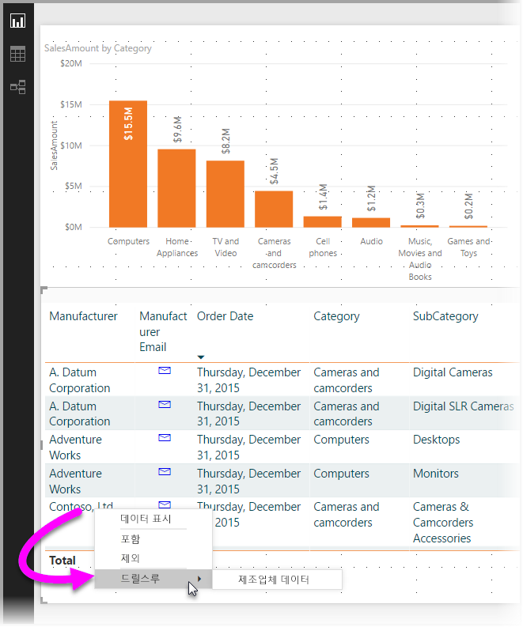
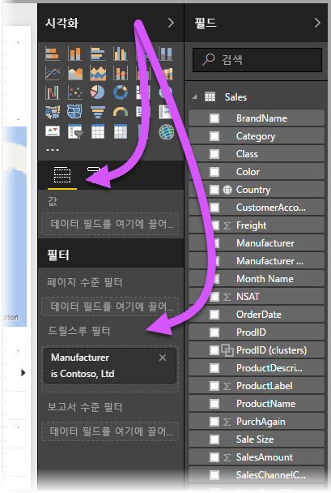
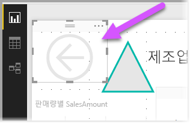
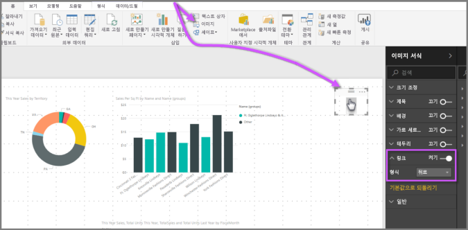
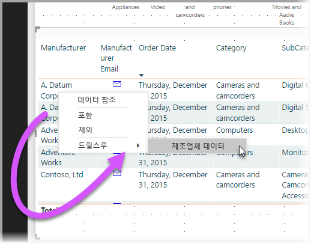
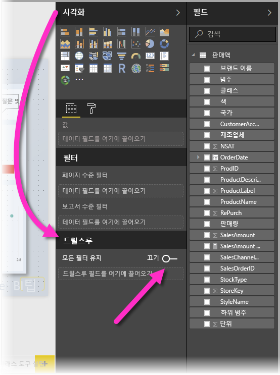
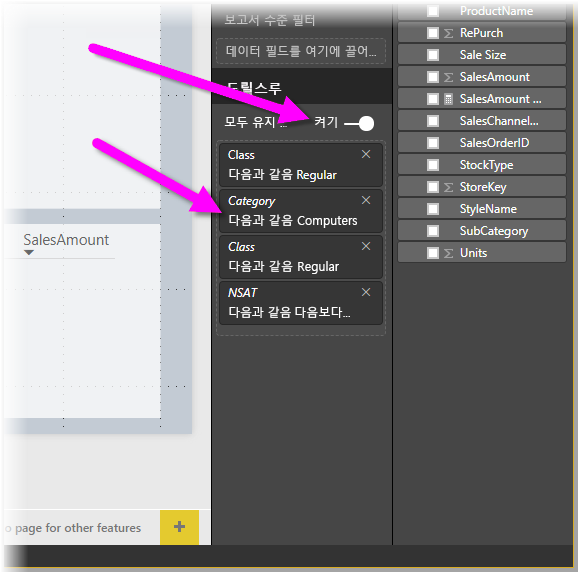
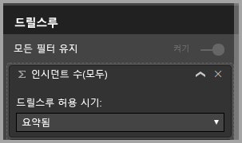

# Power BI Desktop에서 드릴스루 사용
**Power BI Desktop**의 **드릴스루**를 사용하여 보고서에서 공급업체, 고객 또는 제조업체와 같은 특정 엔터티에 초점을 맞춘 페이지를 만들 수 있습니다. 사용자가 이 보고서 페이지를 사용하여 다른 보고서 페이지의 데이터 요소를 마우스 오른쪽 단추로 클릭하고 해당 보고서 페이지로 드릴스루하여 해당 컨텍스트로 필터링된 세부 정보를 확인할 수 있습니다.

## 드릴스루 사용
1. **드릴스루**를 사용하려면 드릴스루를 제공할 엔터티 형식을 확인하려는 시각적 개체가 있는 보고서 페이지를 만듭니다. 

    예를 들어 제조업체에 대한 드릴스루를 제공하려는 경우 총 판매액, 배송된 총 단위, 범주별 판매액, 지역별 판매액 등을 보여주는 시각적 개체가 포함된 드릴스루 페이지를 만들 수 있습니다. 이런 방식으로 해당 페이지로 드릴스루하는 경우 시각적 개체는 선택한 제조업체에 따라 다릅니다.

2. 드릴스루 페이지에 있는 **시각화** 창의 **필드** 섹션에서 드릴스루하려는 필드를 **드릴스루 필터** 웰에 끌어옵니다.

    

    필드를 **드릴스루 필터** 웹에 추가하는 경우 **Power BI Desktop**은 *뒤로* 시각적 단추를 자동으로 만듭니다. 해당 시각적 개체는 게시된 보고서에서 단추로 표시되고 **Power BI 서비스**에서 보고서를 사용하는 사용자가 쉽게 출처(드릴스루하기 위해 선택한 페이지)에서 보고서 페이지로 돌아올 수 있게 합니다.

    

## 뒤로 단추에 고유한 이미지 사용    
 뒤로 단추가 이미지이므로 해당 시각적 개체의 이미지를 원하는 이미지로 바꿀 수 있고, 이 이미지가 뒤로 단추로 작동하므로 보고서 소비자가 원래 페이지로 돌아올 수 있습니다.

1. **홈** 탭에서 **이미지**를 클릭한 다음, 이미지를 찾아 드릴스루 페이지에 배치합니다.
2. 드릴스루 페이지에서 새 이미지를 선택하고, 이미지 서식 섹션에서 **링크** 슬라이더를 켜기로 설정하고, **유형**을 **뒤로**로 설정합니다. 이제 이미지가 뒤로 단추로 작동합니다.

    

    **드릴스루** 페이지가 완료되고 **드릴스루 필터** 웰에 배치한 필드를 사용하는 보고서에서 사용자가 데이터 요소를 마우스 오른쪽 단추로 클릭하면 해당 페이지에 대한 드릴스루를 지원하는 상황에 맞는 메뉴가 나타납니다.

    

    보고서 소비자가 드릴스루를 선택하는 경우 페이지가 필터링되어 마우스 오른쪽 단추로 클릭한 데이터 요소에 대한 정보를 표시합니다. 예를 들어 Contoso(제조업체)에 대한 데이터 요소를 마우스 오른쪽 단추로 클릭하고 드릴스루를 선택한 경우 사용한 드릴스루 페이지는 Contoso로 필터링됩니다.

## 드릴스루에 모든 필터 전달

**Power BI Desktop**의 2018년 5월 버전부터 적용된 모든 필터를 드릴스루 창에 전달할 수 있습니다. 예를 들어 특정 범주의 제품 및 해당 범주로 필터링된 시각적 개체만 선택한 다음, 드릴스루를 선택할 수 있습니다. 이러한 모든 필터가 적용된 드릴스루의 모양에 관심을 가질 수 있습니다.

적용된 모든 필터를 유지하려면 **시각화** 창의 **드릴스루** 섹션에서 **모든 필터 전달** 토글을 **켜기**로 설정하면 됩니다. 

**Power BI Desktop**의 2018년 5월 이전 버전에서는 이 토글을 **끄기**로 설정하는 것과 같습니다.

그런 다음, 시각적 개체에서 드릴스루하면 원본 시각적 개체에 임시 필터가 적용된 결과로 적용된 필터를 볼 수 있습니다. 드릴스루 창에서 이러한 임시 필터는 기울임꼴로 표시됩니다. 

이 작업은 도구 설명 페이지에서 수행할 수 있지만, 도구 설명이 제대로 작동하지 않는 것처럼 이상한 경험일 수 있으므로 도구 설명으로 이렇게 하는 것은 권장되지 않습니다.

## 드릴스루에 측정값 추가

모든 필터를 드릴스루 창에 전달하는 것 외에도 측정값(또는 요약된 숫자 열)를 드릴스루 영역에 추가할 수 있습니다. 간단히 드릴스루 필드를 드릴스루 카드로 끌어서 적용합니다. 

측정값(또는 요약된 숫자 열)을 추가할 때 필드가 시각적 개체의 *값* 영역에서 사용될 때 페이지로 드릴할 수 있습니다.

보고서에서 **드릴스루**를 사용하기 위한 단계는 여기까지입니다. 드릴스루 필터에 선택한 엔터티 정보에 대한 확장된 보기를 가져오는 것이 좋습니다.

## 다음 단계

다음 문서에도 관심이 있을 수 있습니다.

* [Power BI Desktop에서 슬라이서 사용](desktop-slicers.md)

