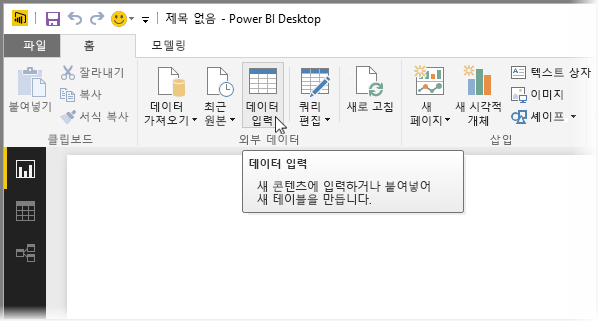
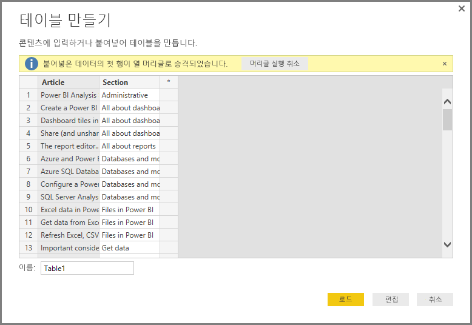
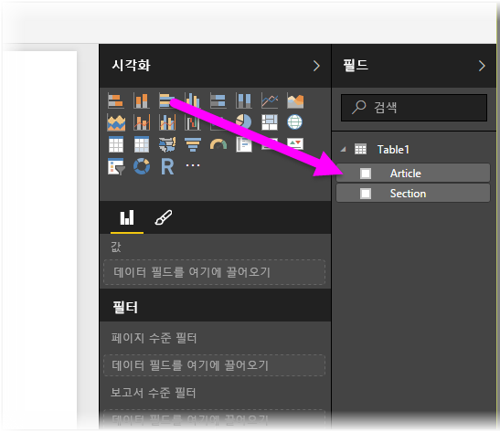

# Power BI Desktop에 데이터 직접 연결
Power BI Desktop에서는 데이터를 직접 입력하고 보고서 및 시각화에 해당 데이터를 사용할 수 있습니다. 예를 들어 통합 문서 또는 웹 페이지의 일부를 복사한 후 Power BI Desktop에 붙여넣을 수 있습니다.

데이터를 직접 입력하려면 **홈** 리본에서 **데이터 입력**을 선택합니다.

Power BI Desktop에서는 적절한 경우 어떤 원본에서 데이터를 로드할 때처럼 데이터에 대해 사소한 변환을 시도할 수 있습니다. 예를 들어 다음 경우에 데이터의 첫 번째 행을 헤더로 승격합니다.

입력한(또는 붙여넣기) 데이터의 모양을 지정하려면 편집 단추를 선택하여 **쿼리 편집기**를 실행하고 여기에서 데이터를 Power BI Desktop으로 가져오기 전에 모양을 지정하고 변환할 수 있습니다. 또는 **로드** 단추를 선택하여 데이터를 표시된 대로 가져올 수 있습니다.

**로드**를 선택하면 Power BI Desktop에서 데이터로부터 새 테이블을 만들고 **필드** 창에서 사용할 수 있습니다. 다음 그림에서는 Power BI Desktop에 기본값인 *Table1*이라는 새 테이블과 생성된 해당 테이블 내에 두 필드가 있는 것을 보여 줍니다.

이것으로 끝입니다! Power BI Desktop에 데이터를 간편하게 입력할 수 있습니다.

이제 Power BI Desktop에서 해당 데이터를 사용하여 시각적 개체, 보고서를 만들거나 Excel 통합 문서, 데이터베이스 또는 기타 데이터 원본처럼 연결 및 가져오려는 다른 모든 데이터를 조작할 수 있습니다.

## 다음 단계
Power BI Desktop을 사용하여 연결할 수 있는 모든 종류의 데이터가 있습니다. 데이터 원본에 대한 자세한 내용은 다음 리소스를 확인하세요.

* [Power BI Desktop이란?](desktop-what-is-desktop.md)
* [Power BI Desktop의 데이터 원본](desktop-data-sources.md)
* [Power BI Desktop에서 데이터 셰이핑 및 결합](desktop-shape-and-combine-data.md)
* [Power BI Desktop에서 Excel 통합 문서에 연결](desktop-connect-excel.md)   
* [Power BI Desktop에서 CSV 파일에 연결](desktop-connect-csv.md)   

