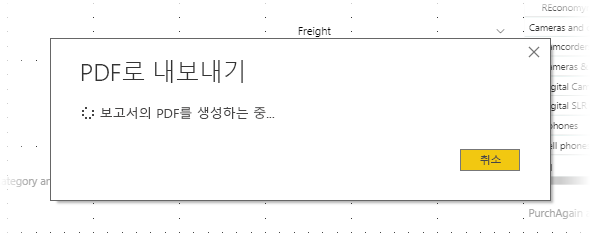

# 보고서를 Power BI Desktop에서 PDF로 내보내기
**Power BI Desktop**에서 PDF 파일로 보고서를 내보내고 따라서 해당 PDF에서 보고서를 쉽게 공유하거나 인쇄할 수 있습니다.

간단하게 **Power BI Desktop**에서 PDF로 보고서를 내보낼 수 있어 PDF를 인쇄하거나 다른 사용자와 해당 PDF 문서를 공유할 수 있습니다. Power BI Deskop에서 **파일 > PDF로 내보내기**를 선택하면 됩니다.

**PDF로 내보내기** 과정은 각 보고서 페이지를 PDF에서 단일 페이지로 내보내어 보고서에서 *표시된* 모든 페이지를 내보냅니다. 도구 설명 또는 숨겨진 페이지와 같이 현재 표시되지 않는 보고서 페이지는 PDF 파일로 내보낼 수 없습니다. 

**파일 > PDF로 내보내기**를 선택하면 내보내기가 시작되고 내보내기 과정이 진행되고 있음을 보여주는 대화 상자가 나타납니다. 내보내기 과정이 완료될 때까지 화면에 대화 상자가 표시됩니다. 내보내기 과정 중에 보고서를 내보내는 모든 상호 작용은 비활성화됩니다. 보고서와 상호 작용하는 유일한 방법은 내보내기 과정이 완료될 때까지 내보내기를 대기하거나 취소하는 것입니다. 

내보내기가 완료되면 PDF를 컴퓨터의 기본 PDF 뷰어로 로드합니다. 

## 고려 사항 및 제한 사항
**PDF로 내보내기** 기능에서 유의해야 하는 몇 가지 고려 사항이 있습니다.

* **PDF로 내보내기** 기능은 **Power BI Desktop**에서만 사용할 수 있고 현재 **Power BI 서비스**에서 사용할 수 없습니다.
* 기능은 사용자 지정 시각적 개체를 내보내지만 보고서에 적용할 수 있는 배경 화면을 내보내지 *않습니다*.

배경 화면을 PDF로 내보내지지 않으므로 어두운 배경 무늬를 사용하는 보고서에 특별히 주의해야 합니다. 배경 화면을 보고서와 함께 내보낼 수 없기 때문에, 어두운 배경 화면을 사용하기 위해 보고서의 텍스트를 밝은 색이나 흰색으로 설정한 경우, PDF로 내보내는 과정에서 텍스트를 식별할 수 없게 됩니다. 

## 다음 단계
**Power BI Desktop**에는 다양한 종류의 흥미로운 시각적 요소 및 기능이 있습니다. 자세한 내용은 다음 리소스를 확인하세요.

* [시각적 개체를 사용하여 Power BI 보고서 개선](desktop-visual-elements-for-reports.md)
* [Power BI Desktop이란?](desktop-what-is-desktop.md)

