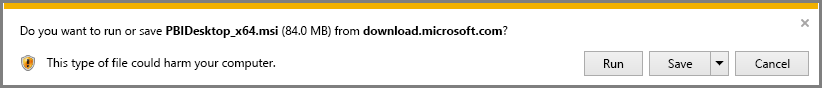

# Power BI Desktop 다운로드
**Power BI Desktop**을 통해 데이터를 시각화하는 고급 쿼리, 모델 및 보고서를 빌드할 수 있습니다. **Power BI Desktop**에서 Power BI 서비스에 게시하여 데이터 모델을 빌드하고, 보고서를 만들고, 작업을 공유할 수 있습니다.  **Power BI Desktop**은 무료로 다운로드할 수 있습니다.

**Power BI Desktop**을 두 가지 방법으로 가져올 수 있습니다. 각각은 다음 섹션에 설명되어 있습니다.

* 직접 **다운로드**(컴퓨터에 다운로드하고 설치하는 MSI 패키지)
* **Microsoft Store**에서 앱으로 설치

어느 방법이든 최신 버전의 **Power BI Desktop**을 컴퓨터로 가져올 수 있지만 주목할 만한 몇 가지 차이점이 있습니다. 이는 다음 섹션에서 설명됩니다.

## Power BI Desktop 다운로드
최신 버전의 **Power BI Desktop**을 다운로드하려면 Power BI 서비스의 오른쪽 위 모서리에서 다운로드 아이콘을 선택하고 **Power BI Desktop**을 선택합니다.

또한 다음 다운로드 페이지에서 최신 버전의 Power BI Desktop을 다운로드할 수도 있습니다.

* [**Power BI Desktop 다운로드**(32비트 및 64비트 버전)](https://powerbi.microsoft.com/desktop).
  
  

어떤 다운로드 방법을 선택하든지, **Power BI Desktop**을 다운로드하면 설치 파일을 실행하라는 메시지가 표시됩니다.

**Power BI Desktop**은 응용 프로그램으로 설치되며 데스크톱에서 실행됩니다.

> [!NOTE]
> 동일한 컴퓨터에 다운로드한(MSI) 버전 및 **Power BI Desktop**의 **Microsoft Store** 버전을 설치하는 것은(경우에 따라 *side-by-side* 설치라고 함) 지원되지 않습니다.
> 
> 

## Microsoft Store에서 앱으로 설치
Microsoft Store에서 다음 링크를 사용하여 **Power BI Desktop**을 가져올 수도 있습니다.

* [**Microsoft Store**에서 **Power BI Desktop** 설치](http://aka.ms/pbidesktopstore)

Microsoft Store에서 **Power BI Desktop** 가져오기에 대한 몇 가지 이점이 있습니다.

* **자동 업데이트** - Windows는 사용 가능할 때 가능한 빨리 최신 버전을 백그라운드에 자동으로 다운로드하므로 버전은 항상 최신 상태를 유지합니다.
* **필요한 파일만 다운로드** - **Microsoft Store**에서는 각 업데이트에서 변경된 구성 요소만 컴퓨터로 다운로드하므로 각 업데이트에 필요한 파일만 다운로드합니다.
* **관리자 권한이 필요하지 않음** - MSI를 직접 다운로드하고 설치하는 경우 성공적으로 완료하려면 설치에 대한 관리자여야 합니다. Microsoft Store에서 **Power BI Desktop**을 가져올 때 관리자 권한은 필요하지 ‘않습니다’.
* **IT 롤아웃 활성화** - **Microsoft Store** 버전을 조직의 모든 사용자에게 보다 쉽게 배포하거나 ‘롤아웃’할 수 있으며 **비즈니스용 Microsoft Store**를 통해 **Power BI Desktop**을 제공할 수 있습니다.
* **언어 감지** - **Microsoft Store** 버전은 지원되는 모든 언어를 포함하며 컴퓨터가 시작될 때마다 사용 중인 언어를 확인합니다. **Power BI Desktop**에서 든 모델의 지역화에 영향을 미칩니다. 예를 들어 기본 제공 날짜 계층 구조는 .pbix 파일을 만들 때 **Power BI Desktop**에서 사용하고 있었던 언어를 일치시킵니다.

Microsoft Store에서 **Power BI Desktop**을 설치할 때 다음과 같은 몇 가지 고려 사항과 제한 사항이 있습니다.

* SAP 커넥터를 사용하는 경우 SAP 드라이버 파일을 *Windows\System32* 폴더로 이동해야 합니다.
* Microsoft Store에서 **Power BI Desktop**을 설치하면 MSI 버전의 사용자 설정이 복사되지 않습니다. 최근 데이터 원본에 다시 연결하고 데이터 원본 자격 증명을 다시 입력해야 할 수 있습니다. 

> [!NOTE]
> 동일한 컴퓨터에 다운로드한(MSI) 버전 및 **Power BI Desktop**의 **Microsoft Store** 버전을 설치하는 것은(경우에 따라 *side-by-side* 설치라고 함) 지원되지 않습니다. **Microsoft Store**에서 **Power BI Desktop**을 다운로드하기 전에 수동으로 제거해야 합니다.
> 
> [!NOTE]
> **Power BI Desktop**의 Power BI Report Server 버전은 이 문서에서 설명한 버전과 다르게 별도로 설치합니다. **Power BI Desktop**의 보고서 서버 버전에 대한 자세한 내용은 [Power BI Report Server용 Power BI 보고서 만들기](report-server/quickstart-create-powerbi-report.md)를 참조하세요.
> 
> 

## Power BI Desktop 사용
**Power BI Desktop**을 시작하면 *시작* 화면이 표시됩니다.

**Power BI Desktop**(설치가 업그레이드되지 않은 경우)를 처음으로 사용하는 경우, 진행하기 전에 양식을 작성하고 몇 가지 질문에 답변하거나 **Power BI 서비스**에 로그인하라는 메시지가 표시됩니다.

여기에서 데이터 모델 또는 보고서 만들기를 시작한 다음 Power BI 서비스에서 다른 사용자와 공유할 수 있습니다. **Power BI Desktop**을 사용하여 시작하는 데 도움을 줄 수 있는 가이드에 대한 링크는 이 문서의 끝에서 **자세한 내용** 링크를 확인합니다.

## 최소 요구 사항
다음 목록은 **Power BI Desktop**을 실행하기 위한 최소 요구 사항을 제공합니다.

* Windows 7/Windows Server 2008 R2 이상
* .NET 4.5
* Internet Explorer 9 이상
* **메모리(RAM):** 최소 1GB, 1.5GB 이상 권장.
* **디스플레이:** 최소 1440x900, 1600x900(16:9) 권장. 1024x768 또는 1280x800처럼 낮은 해상도는 권장되지 않습니다. 시작 화면 닫기 같은 특정 컨트롤이 해상도 밖에 표시되기 때문입니다.
* **Windows 디스플레이 설정:** 디스플레이 설정이 텍스트, 앱 및 기타 항목의 크기를 100% 이상으로 변경하도록 설정되어 있으면 **Power BI Desktop**을 계속 사용하기 위해 닫히거나 응답해야 하는 특정 대화 상자가 표시되지 않을 수 있습니다. 이 문제가 발생하면 Windows에서 **설정> 시스템> 디스플레이**로 이동하여 **디스플레이 설정**을 확인하고 슬라이더를 사용하여 디스플레이 설정을 100%로 되돌립니다.
* **CPU:** 1GHz 또는 더 빠른 x86 또는 x64비트 프로세스 권장.

## 다음 단계
**Power BI Desktop**을 설치하면 다음 콘텐츠는 빠르게 시작하고 실행하는 데 도움을 줄 수 있습니다.

* [Power BI Desktop 시작](desktop-getting-started.md)
* [Power BI Desktop을 사용한 쿼리 개요](desktop-query-overview.md)
* [Power BI Desktop의 데이터 원본](desktop-data-sources.md)
* [Power BI Desktop에서 데이터에 연결](desktop-connect-to-data.md)
* [Power BI Desktop에서 데이터 셰이핑 및 결합](desktop-shape-and-combine-data.md)
* [Power BI Desktop의 일반적인 쿼리 작업](desktop-common-query-tasks.md)   

