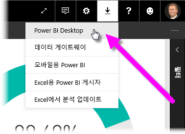
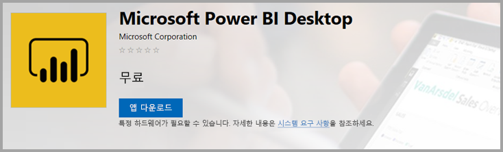
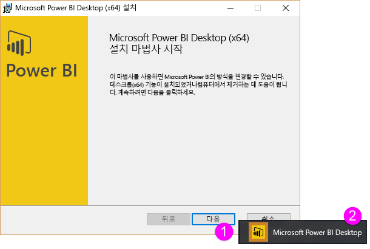
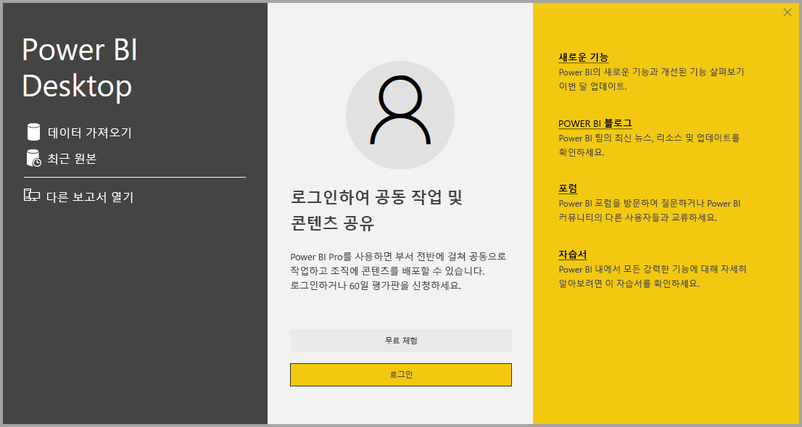

# <a name="get-power-bi-desktop"></a>Power BI Desktop 다운로드
Power BI Desktop을 통해 데이터를 시각화하는 고급 쿼리, 모델 및 보고서를 빌드할 수 있습니다. Power BI Desktop에서 Power BI 서비스에 게시하여 데이터 모델을 빌드하고, 보고서를 만들고, 작업을 공유할 수 있습니다. Power BI Desktop은 무료로 다운로드할 수 있습니다.

두 가지 방법으로 Power BI Desktop을 가져올 수 있습니다. 각 방법은 다음 섹션에 설명되어 있습니다.

* [Microsoft Store에서 앱으로 설치](#install-as-an-app-from-the-microsoft-store)합니다.
* [컴퓨터에서 다운로드하고 설치하는 실행 파일로 직접 다운로드](#download-power-bi-desktop-directly)합니다.

두 방법 모두, 최신 버전의 Power BI Desktop을 컴퓨터로 가져오지만 다음 섹션에서 설명하는 몇 가지 차이점이 있습니다.

## <a name="install-as-an-app-from-the-microsoft-store"></a>Microsoft Store에서 앱으로 설치
Microsoft Store에서 최신 버전의 Power BI Desktop에 액세스하는 방법에는 몇 가지가 있습니다. 

1. 다음 옵션 중 하나를 사용하여 Microsoft Store의 **Power BI Desktop** 페이지를 엽니다.

   - 브라우저를 열고 Microsoft Store의 [Power BI Desktop 페이지](https://aka.ms/pbidesktopstore)로 직접 이동합니다.

    - [Power BI 서비스](https://docs.microsoft.com/power-bi/service-get-started)에서 오른쪽 위에 있는 **다운로드** 아이콘을 선택한 다음, **Power BI Desktop**을 선택합니다.

      

   - [Power BI Desktop 제품 페이지](https://powerbi.microsoft.com/desktop/)로 이동한 다음, **무료 다운로드**를 선택합니다.
  
2. Microsoft Store의 **Power BI Desktop** 페이지에서 **설치**를 선택합니다.

     

Microsoft Store에서 Power BI Desktop을 가져오는 경우 몇 가지 이점이 있습니다.

* **자동 업데이트**: 최신 버전이 제공되는 즉시, Windows가 백그라운드에서 자동으로 다운로드하므로 항상 최신 버전이 유지됩니다.
* **필요한 파일만 다운로드**: Microsoft Store는 각 업데이트에서 변경된 구성 요소만 사용자 머신에 다운로드하므로 각 업데이트에 필요한 파일만 다운로드됩니다.
* **관리자 권한이 필요하지 않음**: 패키지를 직접 다운로드하고 설치하는 경우 설치가 성공적으로 완료되려면 관리자여야 합니다. Microsoft Store에서 Power BI Desktop을 가져오는 경우에는 관리자 권한이 필요하지 ‘않습니다’. 
* **IT 롤아웃 사용**: 비즈니스용 Microsoft Store를 통해 조직의 모든 사용자에게 Power BI Desktop을 보다 쉽게 배포하거나 ‘롤아웃’할 수 있습니다. 

* **언어 감지** Microsoft Store 버전은 지원되는 언어를 모두 포함하며, 시작할 때마다 컴퓨터에서 사용되는 언어를 확인합니다. 이 언어 지원은 Power BI Desktop에서 만든 모델의 지역화에도 영향을 줍니다. 예를 들어 기본 제공 날짜 계층 구조는 .pbix 파일을 만들 때 Power BI Desktop에서 사용 중인 언어와 일치합니다.

Microsoft Store에서 Power BI Desktop을 설치할 때 적용되는 고려 사항과 제한 사항은 다음과 같습니다.

* SAP 커넥터를 사용하는 경우 SAP 드라이버 파일을 *Windows\System32* 폴더로 이동해야 합니다.
* Microsoft Store에서 Power BI Desktop을 설치하는 경우 .exe 버전의 사용자 설정은 복사되지 않습니다. 최근 데이터 원본에 다시 연결하고 데이터 원본 자격 증명을 다시 입력해야 할 수도 있습니다. 

> [!NOTE]
> Power BI Report Server 버전의 Power BI Desktop은 이 문서에 설명된 버전과 다르게 별도로 설치됩니다. Report Server 버전의 Power BI Desktop에 대한 자세한 내용은 [Power BI Report Server용 Power BI 보고서 만들기](report-server/quickstart-create-powerbi-report.md)를 참조하세요.
> 
> 

## <a name="download-power-bi-desktop-directly"></a>Power BI Desktop 직접 다운로드
  
  다운로드 센터에서 Power BI Desktop 실행 파일을 다운로드하려면 [다운로드 센터 페이지](https://www.microsoft.com/download/details.aspx?id=58494)에서 **다운로드**를 선택합니다. 그런 다음, 32비트 또는 64비트 설치 파일 중에서 다운로드할 파일을 지정합니다.

  

### <a name="install-power-bi-desktop-after-downloading-it"></a>Power BI Desktop을 다운로드한 후 설치
다운로드를 완료하면 설치 파일을 실행하라는 메시지가 표시됩니다.

2019년 7월 릴리스부터 Power BI Desktop은 지원되는 모든 언어를 포함하는 단일 .exe 설치 패키지로 제공되며, 32비트 버전과 64비트 버전의 개별 .exe 파일이 있습니다. .msi 패키지는 2019년 9월 릴리스부터 중단되었으므로 설치하려면 .exe 실행 파일이 필요합니다. 이 방법을 사용하면 배포, 업데이트 및 설치(특히 관리자의 경우)가 훨씬 쉽고 편리해집니다. [설치 중에 명령줄 옵션 사용](#using-command-line-options-during-installation)에 설명된 대로 명령줄 매개 변수를 사용하여 설치 프로세스를 사용자 지정할 수도 있습니다.

설치 패키지를 시작하면 Power BI Desktop이 애플리케이션으로 설치되고 데스크톱에서 실행됩니다.



> [!NOTE]
> 다운로드한(MSI) 버전(사용되지 않음) 및 Microsoft Store 버전의 Power BI Desktop을 동일한 컴퓨터에 설치하는 기능(‘Side-by-Side’ 설치라고도 함)은 지원되지 않습니다.  Microsoft Store에서 다운로드하기 전에 Power BI Desktop을 수동으로 제거합니다.
> 

## <a name="using-power-bi-desktop"></a>Power BI Desktop 사용
Power BI Desktop을 시작하면 시작 화면이 표시됩니다.



Power BI Desktop을 처음 사용하는 경우(즉, 설치가 업그레이드되지 않은 경우), 계속하기 전에 양식을 작성하거나 Power BI 서비스에 로그인하라는 메시지가 표시됩니다.

여기에서 데이터 모델 또는 보고서 만들기를 시작한 다음 Power BI 서비스에서 다른 사용자와 공유할 수 있습니다. [다음 단계](#next-steps) 섹션에서 Power BI Desktop 사용을 시작하는 데 도움이 되는 가이드 링크를 확인하세요.

## <a name="minimum-requirements"></a>최소 요구 사항
다음 목록은 Power BI Desktop을 실행하기 위한 최소 요구 사항을 제공합니다.

* Windows 7/Windows Server 2008 R2 이상
* .NET 4.5
* Internet Explorer 10 이상
* 메모리(RAM): 최소 1GB, 1.5GB 이상 권장.
* 디스플레이: 최소 1440x900 또는 1600x900(16:9)을 권장합니다. 1024x768 또는 1280x800처럼 낮은 해상도는 권장되지 않습니다. 시작 화면 닫기와 같은 특정 컨트롤이 해상도 밖에 표시되기 때문입니다.
* Windows 디스플레이 설정: 디스플레이 설정을 통해 텍스트, 앱, 기타 항목의 크기를 100% 이상으로 변경하면 Power BI Desktop을 계속 사용하기 위해 조작해야 하는 특정 대화 상자가 표시되지 않을 수 있습니다. 이 문제가 발생할 경우 Windows에서 **설정** > **시스템** > **디스플레이**로 이동하여 디스플레이 설정을 확인한 다음, 슬라이더를 사용하여 디스플레이 설정을 100%로 되돌립니다.
* CPU: 1GHz 이상의 32비트 또는 64비트 x86 프로세서가 권장됩니다.

## <a name="considerations-and-limitations"></a>고려 사항 및 제한 사항

Power BI Desktop 사용 경험이 만족스럽기를 바랍니다. Power BI Desktop에서 문제가 발생할 수 있으므로, 이 섹션에는 문제를 해결하기 위한 해결 방법이나 제안이 포함되어 있습니다. 

### <a name="using-command-line-options-during-installation"></a>설치 중에 명령줄 옵션 사용 

Power BI Desktop을 설치할 때 명령줄 스위치를 사용하여 속성과 옵션을 설정할 수 있습니다. 이러한 설정은 조직 전체의 Power BI Desktop 설치를 관리하거나 지원하는 관리자에게 특히 유용합니다. 이러한 옵션은 .msi 설치와 .exe 설치에 모두 적용됩니다. 


|명령줄 옵션  |동작  |
|---------|---------|
|-q, -quiet, -s, -silent     |자동 설치         |
|-passive     |설치 중에 진행률 표시줄만 표시         |
|-norestart     |컴퓨터 다시 시작 요구 사항 표시 안 함         |
|-forcerestart     |설치 후에 확인 메시지를 표시하지 않고 컴퓨터 다시 시작         |
|-promptrestart     |컴퓨터를 다시 시작해야 하는 경우 사용자에게 확인 메시지 표시(기본값)         |
|-l<>, -log<>     |<>에 파일을 지정하여 특정 파일에 설치 기록         |
|-uninstall     |Power BI Desktop 제거         |
|-repair     |설치 복구(또는 현재 설치되어 있지 않은 경우 설치)         |
|-package, -update     |Power BI Desktop 설치(-uninstall 또는 -repair를 지정하지 않은 경우 기본값)         |

‘property = value’ 구문으로 지정한 다음 구문 매개 변수를 사용할 수도 있습니다. 

|매개 변수  |의미  |
|---------|---------|
|ACCEPT_EULA     |EULA에 자동으로 동의하려면 값 1이 필요합니다.         |
|ENABLECXP     |값 1을 지정하면 제품 사용량의 원격 분석을 캡처하는 사용자 환경 개선 프로그램에 등록됩니다.         |
|INSTALLDESKTOPSHORTCUT     |값 1을 지정하면 바탕 화면에 바로 가기가 추가됩니다.         |
|INSTALLLOCATION     |설치하려는 위치의 파일 경로입니다.         |
|LANGUAGE     |애플리케이션의 기본 언어를 강제로 적용하는 로캘 코드(예: en-US, de-DE, pr-BR)입니다. 언어를 지정하지 않으면 Power BI Desktop은 Windows OS 언어를 표시합니다. 이 설정은 **옵션** 대화 상자에서 변경할 수 있습니다.         |
|REG_SHOWLEADGENDIALOG     |값 0을 지정하면 Power BI Desktop에 로그인하기 전에 나타나는 대화 상자가 표시되지 않습니다.         |
|DISABLE_UPDATE_NOTIFICATION     |값 1은 업데이트 알림을 사용하지 않도록 설정합니다.         |


예를 들어 다음과 같은 옵션과 매개 변수를 사용하여 Power BI Desktop을 실행하면 사용자 인터페이스 없이 독일어로 설치할 수 있습니다. 

```-quiet LANG=de-DE ACCEPT_EULA=1```

### <a name="installing-power-bi-desktop-on-remote-machines"></a>원격 컴퓨터에 Power BI Desktop 설치

Windows Installer 파일(.msi 파일)이 필요한 도구를 사용하여 사용자에게 Power BI Desktop을 배포하는 경우 Power BI Desktop 설치 관리자 .exe 파일에서 .msi 파일을 추출할 수 있습니다. WiX 도구 세트와 같은 타사 도구를 사용합니다.

> [!NOTE]
> WiX 도구 세트 옵션은 타사 제품이므로 예고 없이 변경될 수 있습니다. 해당 설명서에서 최신 정보를 확인하고, 도움이 필요하면 사용자 메일 그룹에 문의하세요.

1. Power BI Desktop 설치 관리자를 다운로드한 컴퓨터에 최신 버전의 [WiX 도구 세트](https://wixtoolset.org/)를 설치합니다.
2. 관리자 권한으로 명령줄 창을 열고 WiX 도구 세트를 설치한 폴더로 이동합니다.
3. 다음 명령을 실행합니다. 
    
    ```Dark.exe <path to Power BI Desktop installer> -x <output folder>```

    예:

    ``` Dark.exe C:\PBIDesktop_x64.exe -x C:\output```

    출력 폴더에는 .msi 파일을 포함하는 *AttachedContainer* 폴더가 있습니다.


### <a name="issues-when-using-previous-releases-of-power-bi-desktop"></a>Power BI Desktop의 이전 릴리스 사용 시 문제

사용자가 오래된 버전의 Power BI Desktop을 사용하는 경우 다음 메시지와 유사한 오류 메시지가 표시될 수 있습니다. 

‘저장된 데이터베이스를 모델에 복원할 수 없습니다.’  

Power BI Desktop의 현재 버전으로 업데이트하면 대개 이 문제가 해결됩니다.

### <a name="disabling-notifications"></a>알림 사용 안 함
기능, 성능, 안정성 및 기타 개선 사항의 발전을 활용하려면 최신 버전의 Power BI Desktop으로 업데이트하는 것이 좋습니다. 일부 조직에서는 사용자가 개별적으로 새 버전으로 업데이트하기를 원하지 않을 수 있습니다. 다음 단계를 통해 레지스트리를 수정하여 알림을 사용하지 않도록 설정할 수 있습니다.

1. 레지스트리 편집기에서 **HKEY_LOCAL_MACHINE\SOFTWARE\Microsoft\Microsoft Power BI Desktop** 키로 이동합니다.
2. 키에 새 **REG_DWORD** 항목을 만들고 이름을 **DisableUpdateNotification**으로 지정합니다.
3. 새 항목의 값을 **1**로 설정합니다.
4. 컴퓨터를 다시 시작하여 변경 내용을 적용합니다.

### <a name="power-bi-desktop-loads-with-a-partial-screen"></a>Power BI Desktop은 부분 화면으로 로드됩니다.

특정 화면 해상도 구성을 포함한 특정 상황에 있는 일부 사용자에게는 Power BI Desktop 렌더링 콘텐츠가 큰 검은색 영역과 함께 표시될 수 있습니다. 이 문제의 원인은 일반적으로 Power BI Desktop이 콘텐츠를 표시하는 방법 때문이 아니라 항목 렌더링 방법에 영향을 주는 최근 운영 체제 업데이트 때문입니다. 이 문제를 해결하려면 다음 단계를 수행합니다.

1. **시작** 키를 누르고 표시되는 검색 창에 ‘흐리게’를 입력합니다. 
2. 표시되는 대화 상자에서 다음 옵션을 선택합니다. **Let Windows fix apps that are blurry.** (Windows에서 흐리게 표시되는 앱을 수정하도록 합니다.)
3. Power BI Desktop을 다시 시작합니다.

이 문제는 후속 Windows 업데이트가 릴리스된 후에 해결될 수 있습니다. 
 

## <a name="next-steps"></a>다음 단계
Power BI Desktop을 설치한 후에 빠르게 시작하고 실행하는 데 도움이 되는 다음 내용을 참조하세요.

* [Power BI Desktop이란?](desktop-what-is-desktop.md)
* [Power BI Desktop을 사용한 쿼리 개요](desktop-query-overview.md)
* [Power BI Desktop의 데이터 원본](desktop-data-sources.md)
* [Power BI Desktop에서 데이터에 연결](desktop-connect-to-data.md)
* [Power BI Desktop에서 데이터 셰이핑 및 결합](desktop-shape-and-combine-data.md)
* [Power BI Desktop의 일반적인 쿼리 작업](desktop-common-query-tasks.md)   

