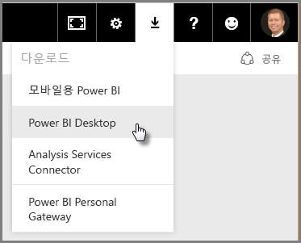
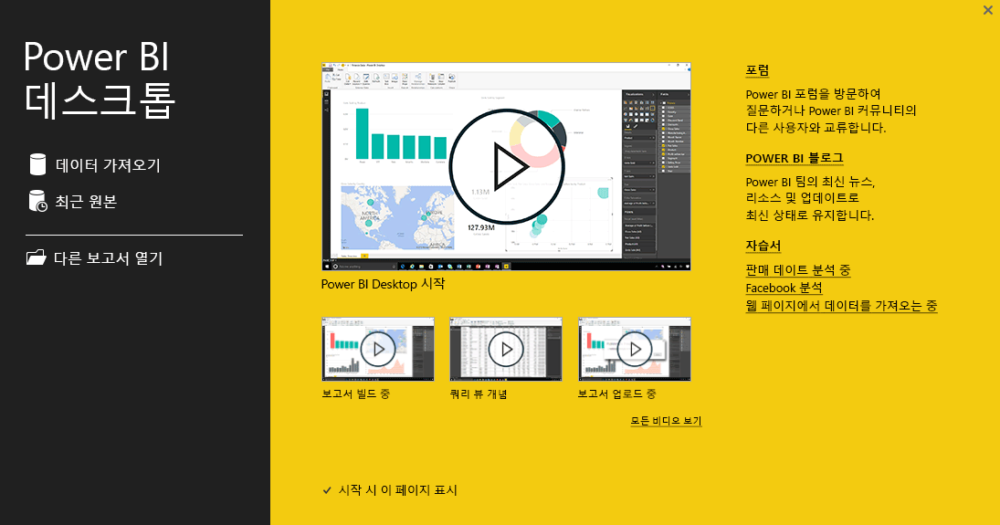
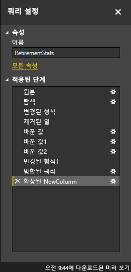
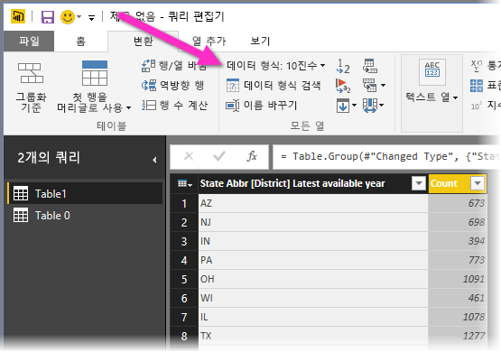

# Power BI Desktop 시작
**Power BI Desktop 시작 가이드**를 시작합니다. 아래의 간단한 안내를 통해 Power BI Desktop의 작동 방법을 파악하고, 이 도구로 수행할 수 있는 작업을 확인하고, 비즈니스 인텔리전스 활동을 강화하는 강력한 데이터 모델을 유용한 보고서와 함께 신속하게 작성할 수 있습니다. 

문서보다 동영상을 보려는 경우 간편하게 [시작 동영상을 살펴보세요](desktop-videos.md). 일치하는 샘플 데이터와 함께 동영상을 따라하려는 경우 [이 샘플 Excel 통합 문서를 다운로드](https://go.microsoft.com/fwlink/?LinkID=521962)하면 됩니다.

Power BI Desktop을 사용하면 다른 사용자와 쉽게 공유할 수 있는 쿼리, 데이터 연결 및 보고서 컬렉션을 만들 수 있습니다. Power BI Desktop은 강력한 쿼리 엔진, 데이터 모델링 및 시각화와 같은 입증된 Microsoft 기술을 통합하고 온라인 [**Power BI 서비스**](https://app.powerbi.com/)에서 원활하게 작동합니다.

**Power BI Desktop**(분석가 및 기타 사용자가 강력한 데이터 연결, 모델 및 보고서를 만드는 데 사용)과 [**Power BI 서비스**](https://preview.powerbi.com/)(사용자가 Power BI Desktop 보고서를 확인하고 조작할 수 있도록 Power BI Desktop 보고서를 공유하는 데 사용)를 함께 사용하여 데이터에서 얻은 새로운 정보를 보다 쉽게 모델링, 작성, 공유 및 확장할 수 있습니다.

데이터 분석가는 강력하고 유연하며 항상 액세스 가능한 도구인 Power BI Desktop을 사용하여 데이터에 연결하고 데이터를 셰이핑하며, 강력한 모델을 만들고, 잘 구성된 보고서를 작성할 수 있습니다.

## 이 가이드를 사용하는 방법
이 가이드는 몇 가지 방법으로 사용할 수 있습니다. 즉, 간략한 개요를 파악하기 위해 훑어보거나, Power BI Desktop의 작동 방식을 완벽하게 이해하기 위해 각 섹션을 꼼꼼하게 읽을 수 있습니다.

시간이 부족한 경우 몇 분만 이 가이드를 훑어보기만 해도 Power BI Desktop의 작동 방식과 사용 방법을 이해하는 데 도움이 됩니다. 이 가이드의 대부분은 Power BI Desktop의 작동 방식을 시각적으로 표시하는 화면으로 구성되어 있습니다.

더 철저하게 이해하려면 각 섹션을 읽고 단계를 수행한 다음 **Power BI** 서비스에 게시하고 다른 사용자와 공유할 수 있는 고유한 Power BI Desktop 파일을 만들면 됩니다.

>[!NOTE]
>데이터 및 보고를 온-프레미스에 유지해야 하는 고객을 위한 [**Power BI Report Server**](report-server/get-started.md)라고 하는 별도의 특수 **Power BI** 버전도 있습니다. 이 특수 버전을 사용하는 경우 Power BI Report Server 버전에서만 작동하는 **Power BI Desktop for Power BI Report Server**라고 하는 별도의 특수 **Power BI Desktop** 버전이 있습니다. 이 문서에서는 표준 **Power BI Desktop**에 대해 설명합니다.

## Power BI Desktop의 작동 방식
Power BI Desktop을 사용하여 *데이터에 연결* (일반적으로 여러 데이터 소스)하고, *데이터를 셰이핑* 하고(통찰력 있고 강력한 데이터 모델을 만드는 쿼리 사용), 해당 모델을 사용하여 *보고서를 만듭니다* (다른 사용자가 활용하고 기초 자료로 사용하고 공유할 수 있음).

데이터 연결, 셰이핑, 보고서 단계가 만족스럽게 완료되면 확장명이 .pbix인 Power BI Desktop 파일 형식으로 작업 내용을 저장할 수 있습니다. 다른 파일처럼 Power BI Desktop 파일을 공유할 수 있지만, [**Power BI 서비스**](https://preview.powerbi.com/)에 Power BI Desktop 파일을 업로드(공유)하는 것이 가장 효과적인 방법입니다. 

Power BI Desktop은 비즈니스 인텔리전스 리포지토리 및 보고서의 분산되고 단절된 까다로운 디자인 및 작성 프로세스를 중앙 집중화, 단순화 및 간소화합니다.

이제 본격적으로 Power BI Desktop을 설명하겠습니다.

## Power BI Desktop 설치 및 실행
톱니바퀴 모양의 **설정** 아이콘을 선택한 다음 **Power BI Desktop**을 선택하여 **Power BI** 서비스에서 Power BI Desktop을 다운로드할 수 있습니다.

Power BI Desktop은 애플리케이션으로 설치되며 데스크톱에서 실행됩니다.

Power BI Desktop을 실행하면 *시작* 화면이 표시됩니다.

**데이터 가져오기**가 가능하며 *시작* 화면에서 직접 **최근 원본** 또는 **다른 보고서** **열기**(왼쪽 창의 링크)를 참조할 수 있습니다. 화면을 닫으면(오른쪽 위 모서리에 있는 **x** 선택) Power BI Desktop의 **보고서** 보기가 표시됩니다.

Power BI Desktop에는 다음 세 가지 보기가 있습니다. **보고서** 보기, **데이터** 보기 및 **관계** 보기. 또한 Power BI Desktop에는 별도 창에서 열리는 **쿼리 편집기**도 포함되어 있습니다. **쿼리 편집기**에서 쿼리를 작성하고 데이터를 변환한 다음 구체화된 해당 데이터 모델을 Power BI Desktop으로 로드하고 보고서를 만들 수 있습니다.

다음 화면에는 Power BI Desktop의 왼쪽을 따라 위에서 아래로 다음 세 개의 보기 아이콘이 표시됩니다. **보고서**, **데이터** 및 **관계**. 현재 표시된 보기는 왼쪽을 따라 노랑 막대로 표시됩니다. 여기서는 현재 **보고서** 보기가 표시되어 있습니다. 이러한 세 아이콘 중 원하는 아이콘을 선택하여 보기를 변경할 수 있습니다.

Power BI Desktop이 설치되면 데이터에 연결하고, 데이터를 셰이핑하고, 보고서를 작성할 수 있습니다(일반적으로 이 순서대로). 다음 몇 개 섹션에서 각 작업을 순서대로 살펴보겠습니다.

## 데이터에 연결
Power BI Desktop이 설치되면 계속 확장되는 데이터에 연결할 수 있습니다. 쿼리 창에는 사용할 수 있는 *모든 종류* 의 데이터 소스가 있습니다. 다음 이미지는 리본 메뉴의 **홈** 탭을 선택한 다음 **데이터 가져오기 \>자세히...** 를 선택하여 데이터에 연결하는 방법을 보여 줍니다.

 

간략하게 살펴보기 위해 여기서는 두 가지 **웹** 데이터 소스에 연결합니다.

은퇴를 계획하면서 일조량이 많고 세제 및 의료 보험 혜택이 있는 곳에서 거주하려 하거나, 데이터 분석가로서 고객에게 유용한 정보를 제공하려 한다고 가정해 보세요. 예를 들어 일조량이 가장 많은 지역에서 선글라스 소매점이 매출 목표를 정하도록 도울 수 있습니다.

두 가지 경우 모두 아래의 웹 리소스에서 해당 주제와 관련한 흥미로운 데이터를 참조하세요.

[*https://www.bankrate.com/finance/retirement/best-places-retire-how-state-ranks.aspx*](https://www.bankrate.com/finance/retirement/best-places-retire-how-state-ranks.aspx)

**데이터 가져오기 \>웹**을 선택하고 주소를 붙여넣습니다.

 

**확인**을 선택하면 Power BI Desktop의 **쿼리** 기능이 작동합니다. 쿼리가 웹 리소스에 연결되고 **탐색기** 창에 해당 웹 페이지에서 찾은 내용이 반환됩니다. 여기서는 테이블(*Table 0*) 및 전체 웹 문서가 발견되었습니다. 테이블에 관심이 있으므로 목록에서 테이블을 선택합니다. **탐색기** 창에 미리 보기가 표시됩니다.

 

이때 창의 아래쪽에서 **편집**을 선택하여 테이블을 로드하기 전에 쿼리를 편집하거나 테이블을 로드할 수 있습니다.

**편집**을 선택하면 쿼리 편집기가 시작되고 테이블을 나타내는 보기가 표시됩니다. **쿼리 설정** 창이 표시됩니다(표시되지 않는 경우 리본 메뉴에서 **보기** 탭을 선택한 다음 **표시\> 쿼리 설정**을 선택하여 **쿼리 설정** 창을 표시할 수 있음). 표시되는 모양은 다음과 같습니다.

 

데이터에 연결하는 방법에 대한 자세한 내용은 [Power BI Desktop에서 데이터에 연결](desktop-connect-to-data.md)을 참조하세요.

> [!NOTE]
> 이 문서에서 참조하는 테이블 데이터는 시간이 지남에 따라 변경될 수 있습니다. 그러므로 수행해야 하는 단계는 다음과 다를 수 있으며, 단계 또는 결과를 조정하는 방법은 독창성이 요구되므로 알아보면 유익할 것입니다. 

다음 섹션에서는 요구 사항에 맞게 데이터를 조정합니다. 연결된 데이터를 조정하는 프로세스를 데이터 *셰이핑* 이라고 합니다.

## 데이터 모양 지정 및 결합
이제 데이터 소스에 연결했으므로 요구 사항에 맞게 데이터를 조정해야 합니다. 때때로 조정은 열 또는 테이블 이름 바꾸기, 텍스트를 숫자로 변경, 행 제거, 첫 행을 머리글로 설정 등의 데이터 *변환*을 의미합니다.

Power BI Desktop의 쿼리 편집기에서는 리본 메뉴에서 사용 가능한 작업 외에 오른쪽 클릭 메뉴를 많이 사용합니다. 리본 메뉴의 **변환** 탭에서 선택할 수 있는 옵션은 대부분 항목(예: 열)을 마우스 오른쪽 단추로 클릭하고 나타나는 메뉴에서 선택하여 사용할 수도 있습니다.

## 데이터 모양 지정
**쿼리 편집기**에서 데이터를 셰이핑하는 경우 **쿼리 편집기**가 데이터를 로드 및 표시할 때 데이터를 조정하는 단계별 지침(**쿼리 편집기**가 자동으로 수행)을 제공합니다. 원래 데이터 원본은 영향을 받지 않습니다. 이 특정 데이터 보기가 조정되거나 셰이핑됩니다. 

지정하는 단계(예: 테이블 이름 바꾸기, 데이터 형식 변환 또는 열 삭제)는 **쿼리 편집기**에 의해 기록되고, 이 쿼리가 데이터 소스에 연결할 때마다 데이터가 항상 지정한 방식으로 셰이핑되도록 이러한 단계가 수행됩니다. Power BI Desktop에서 쿼리를 사용할 때마다 또는 **Power BI** 서비스 등에서 공유 쿼리를 사용하는 사용자에 대해 이 프로세스가 발생합니다. 이러한 단계는 **쿼리 설정** 창의 **적용된 단계** 아래에 순차적으로 캡처됩니다.

다음 이미지는 셰이핑된 쿼리에 대한 **쿼리 설정** 창을 보여 줍니다. 다음 몇 단락에서 이러한 단계를 각각 수행합니다.

 

웹 데이터 소스에 연결하여 찾은 은퇴 데이터로 돌아가서 요구 사항에 맞게 데이터 모양을 지정하겠습니다.

먼저 대부분의 평점을 **쿼리 편집기** 에 정수로 가져왔지만 일부 평점은 아닙니다(한 열에 텍스트와 숫자가 포함되어 있어서 자동으로 변환되지 않음). 데이터를 숫자로 변환해야 합니다. 열 머리글을 마우스 오른쪽 단추로 클릭하고 **형식 변경 \>정수**를 선택하여 데이터 형식을 변경하면 됩니다. 둘 이상의 열을 선택해야 하는 경우 먼저 열을 하나 선택하고 **Shift**키를 누른 채 인접한 열을 추가로 선택한 다음 열 머리글을 마우스 오른쪽 단추로 클릭하여 선택한 모든 열을 변경할 수 있습니다. **Ctrl** 키를 사용하여 인접하지 않은 열을 선택할 수도 있습니다.

 

리본 메뉴의 *변환* 탭을 사용하여 이러한 열을 텍스트에서 머리글로 변경하거나 **변환** 할 수도 있습니다. 다음은 **변환** 리본이며, 화살표가 현재 데이터 형식을 다른 데이터 형식으로 변환할 수 있는 **데이터 형식** 단추를 가리키고 있습니다.

 

**쿼리 설정**에서 **적용된 단계**는 수행된 변경 내용을 반영합니다. 셰이핑 프로세스에서 단계를 제거하려는 경우 해당 단계를 선택한 다음 단계 왼쪽에 있는 **X**를 선택하면 됩니다.

 

원하는 위치로 쿼리를 가져오기 위해 몇 가지 변경 작업을 더 수행해야 합니다.

* *첫 번째 열 제거* – 이 열은 필요하지 않습니다. 이 데이터 소스가 웹 기반 테이블이 된 아티팩트로, "Check out how your state ranks for retirement"라고 표시하는 중복 행을 포함합니다.

<!-- -->

* *몇 가지 오류 수정* – 웹 페이지에 숫자와 텍스트가 혼합된 열이 하나 있습니다(일부 주가 한 범주에서 동률임). 웹 사이트에서는 제대로 작동하지만 데이터 분석의 경우 작동하지 않습니다. 이 경우 쉽게 해결할 수 있으며, **쿼리 편집기** 및 **적용된 단계**의 일부 유용한 기능을 보여 줍니다.

<!-- -->

* *테이블 이름 변경* – **Table 0** 은 유용한 설명자가 아니지만 간단하게 변경할 수 있습니다.

**[Power BI Desktop에서 데이터 셰이핑 및 결합](desktop-shape-and-combine-data.md)** 에서 이러한 각 단계를 보여 줍니다. 언제든지 자유롭게 해당 페이지를 확인하거나, 이 문서를 계속 진행하여 다음에 수행할 작업을 확인합니다. 다음 섹션은 위의 변경 내용이 적용된 이후부터 시작됩니다.

## 데이터 결합
다양한 주와 관련된 데이터는 흥미로우며 추가 분석 노력 및 쿼리를 작성하는 데 유용합니다. 그러나 한 가지 문제가 있습니다. 대부분의 데이터는 주의 전체 이름이 아니라 주 코드를 나타내는 2자로 된 약어를 사용합니다. 주 이름을 해당 약어와 연결하는 방법이 필요합니다.

다행히 이 작업을 수행하는 다른 공용 데이터 소스가 있지만 은퇴 테이블에 연결하려면 먼저 상당한 모양 지정이 필요합니다. 다음은 주 약어에 대한 웹 리소스입니다.

<https://en.wikipedia.org/wiki/List_of_U.S._state_abbreviations>

**쿼리 편집기**의 리본 메뉴 **홈** 탭에서 **데이터 가져오기 \> 웹**을 선택하고 주소를 입력한 다음 **확인**을 선택하면 **탐색기** 창에 해당 웹 페이지에서 발견된 사항이 표시됩니다.

 

원하는 데이터를 포함하지만 해당 테이블의 데이터를 줄이려면 상당한 셰이핑이 필요하므로 **테이블[편집]** 을 선택합니다. **[Power BI Desktop에서 데이터 셰이핑 및 결합](desktop-shape-and-combine-data.md)** 에서도 이러한 각 단계를 보여 줍니다. 이러한 단계를 요약하는 방법은 다음과 같습니다.

**편집**을 선택하고 다음을 선택합니다.

* *상위 두 행 제거* – 웹 페이지의 테이블이 생성된 방식의 결과이며 필요하지 않습니다.

<!-- -->

* *하위 26개 행 제거* – 모두 지역이므로 포함할 필요가 없습니다.

<!-- -->
* *워싱턴 DC 필터링* - 은퇴 통계 테이블이 DC를 포함하지 않으므로 목록에서 제외합니다

<!-- -->

* *몇 개의 불필요한 열 제거* – 주와 2자로 된 공식 약어 간의 매핑만 필요하므로 다른 열을 제거할 수 있습니다.

<!-- -->

* *첫 행을 머리글로 사용* – 상위 3개의 행을 제거했으므로 현재 첫 행이 원하는 머리글입니다.

    >[!NOTE]
    >이 시점에서 **쿼리 편집기**에서 적용된 단계의 *시퀀스*가 중요하며 데이터의 셰이핑 방식에 영향을 줄 수 있음에 주목하는 것이 좋습니다. 또한 한 단계가 다른 후속 단계에 미칠 수 있는 영향을 고려하는 것이 중요합니다. **적용된 단계**에서 한 단계를 제거하면 쿼리의 단계 시퀀스 영향 때문에 후속 단계가 의도한 대로 동작하지 않을 수 있습니다.

* *열 및 테이블 자체의 이름 바꾸기* – 일반적으로 열 이름을 바꾸는 몇 가지 방법이 있습니다. 원하는 방법을 선택할 수 있습니다.

*StateCodes* 테이블을 셰이핑했으므로 이러한 두 테이블 또는 쿼리를 하나로 결합할 수 있습니다. 이제 테이블이 데이터에 적용한 쿼리의 결과이므로 쿼리라고도 합니다. 

쿼리를 결합하는 기본 방법에는 *병합* 및 추가의 두 가지가 있습니다. 

다른 쿼리에 추가하려는 열이 하나 이상 있는 경우 쿼리를 **병합**합니다. 기존 쿼리에 추가하려는 데이터 행이 더 있는 경우 쿼리를 **추가**합니다.

이 경우 쿼리를 병합하려고 합니다. 시작하려면 다른 쿼리를 병합하려는 *쿼리*를 선택한 다음 리본 메뉴의 **홈** 탭에서 **쿼리 병합**을 선택합니다.

 

**병합** 창이 나타나고, 선택한 테이블에 병합하려는 테이블 및 병합에 사용할 일치하는 열을 선택하라는 메시지가 표시됩니다. *RetirementStats* 테이블(쿼리)에서 State를 선택한 다음 StateCodes 쿼리를 선택합니다. 이 경우에는 다른 쿼리가 하나뿐이므로 쉽지만 여러 데이터 소스에 연결하는 경우 많은 쿼리 중에서 선택해야 합니다.   일치하는 열(RetirementStats의 State 및 StateCodes의 State Name)을 올바르게 선택하면 **병합** 창이 다음과 같이 나타나고 **확인** 단추를 사용할 수 있습니다.    

 

기존 쿼리와 병합된 테이블(쿼리)의 내용인 **NewColumn** 이 쿼리의 끝 부분에 만들어집니다. 병합된 쿼리의 모든 열이 **NewColumn**에 압축되지만 테이블을 **확장** 하도록 선택하고 원하는 모든 열을 포함할 수 있습니다. 병합된 테이블을 확장하고 포함할 열을 선택하려면 확장 아이콘()을 선택합니다. **확장** 창이 나타납니다.

 

이 경우 *State Code* 열만 포함하려고 하므로 해당 열만 선택하고 **확인**을 선택합니다. 필요하지 않거나 원하지 않으므로 **Use original column name as prefix**(원래 열 이름을 접두사로 사용) 확인란을 선택 취소합니다. 선택된 상태로 두면 병합된 열의 이름이 *NewColumn.State Code*(원래 열 이름 또는 *NewColumn*, 점, 쿼리로 가져오는 열 이름)로 지정됩니다.

>[!NOTE]
>*NewColumn* 테이블에 가져오는 방법을 알아보고 싶으세요? 몇 가지를 실험한 후 결과가 만족스럽지 않으면 **쿼리 설정** 창의 **적용된 단계** 목록에서 해당 단계를 삭제합니다. 쿼리가 해당 **확장** 단계를 적용하기 전의 상태로 돌아갑니다. 확장 프로세스가 원하는 방식으로 표시될 때까지 원하는 횟수만큼 수행할 수 있는 무료 반복 서비스와 같습니다.

이제 각각 요구 사항에 맞게 모양이 지정된 두 데이터 소스를 결합하는 단일 쿼리(테이블)가 있습니다. 이 쿼리는 임의 주의 주택 비용 통계, 인구 통계 또는 구직 기회와 같은 흥미로운 많은 추가 데이터 연결의 기초로 사용될 수 있습니다.

이러한 데이터 셰이핑 및 결합의 각 단계에 대한 자세한 설명은 [Power BI Desktop에서 데이터 셰이핑 및 결합](desktop-shape-and-combine-data.md)을 참조하세요.

이제 Power BI Desktop 내에서 몇 가지 흥미로운 보고서를 만들 수 있는 충분한 데이터가 확보되었습니다. 이는 중요 시점이므로 이 Power BI Desktop 파일을 저장하고 **Power BI Desktop 시작**이라는 이름을 지정하겠습니다. **쿼리 편집기**의 변경 내용을 적용하려면 변경 내용을 Power BI Desktop으로 로드하고 **홈** 리본 메뉴에서 **닫기 및 적용**을 선택합니다.

## 보고서 작성
테이블을 로드한 후에 추가로 변경할 수 있으며, 모델을 다시 로드하여 수행한 모든 변경 내용을 적용할 수 있습니다. 그러나 현재로서는 이 작업만으로 충분합니다. Power BI Desktop **보고서** 보기에서 보고서 작성을 시작할 수 있습니다.

**보고서** 보기에는 다음과 같은 5개의 기본 영역이 있습니다.

1. **리본** 메뉴 - 보고서 및 시각화와 관련된 일반적인 작업을 표시합니다.
2. **보고서** 보기 또는 캔버스 - 시각화를 만들고 정렬합니다.
3. **페이지** 탭 영역(아래쪽에 있음) - 보고서 페이지를 선택하거나 추가할 수 있습니다.
4. **시각화** 창 - 시각화를 변경하고 색 또는 축을 사용자 지정하며 필터를 적용하고 필드를 끄는 등의 작업을 수행할 수 있습니다.
5. **필드** 창 - 쿼리 요소 및 필터를 **보고서** 보기나 **시각화** 창의 **필터** 영역으로 끌 수 있습니다.
   
   

가장자리에 있는 작은 화살표를 선택하여 **시각화** 및 **필드** 창을 축소하면 **보고서** 보기에 더 많은 공간이 제공되어 멋진 시각화를 만들 수 있습니다. 시각화를 수정할 때도 위 또는 아래를 가리키는 이러한 화살표를 볼 수 있습니다. 이는 해당 섹션을 적절하게 확장하거나 축소할 수 있음을 의미합니다.

 

시각화를 만들려면 **필드** 목록에서 **보고서**  필드를 끌면 됩니다. 여기서는 *RetirementStats* 에서 State필드를 끌어 결과를 확인해 보겠습니다. 

 

결과를 보세요. Power BI Desktop이 *State* 필드에 지리적 위치 데이터가 포함된 것을 인식했으므로 지도 기반 시각화를 자동으로 만들었습니다.

**시각화** 창에서 다양한 형식의 시각화를 선택할 수 있으며, 해당 아이콘 아래 영역에서 필드를 다양한 영역으로 끌어 범례를 적용하거나 시각화를 수정할 수 있습니다.

 

앞으로 약간 돌아가서 몇 개의 시각화와 몇 개의 새 보고서 페이지가 추가된 후 **보고서** 보기가 어떻게 표시되는지 살펴보겠습니다. 보고서에 대한 자세한 내용은 [Power BI Desktop의 보고서 보기](desktop-report-view.md)를 참조하세요.

첫 번째 보고서 페이지는 Overall rank를 기반으로 하는 데이터 큐브 뷰를 제공합니다.  시각화 중 하나를 선택하면 **필드 및 필터** 창에 선택한 필드 및 시각화 구조( **Shared Axis**, **Column Values**및 **Line Values**에 적용된 필드)가 표시됩니다.

 

이 보고서에는 6개의 **페이지**가 있고, 각각 데이터의 특정 요소를 시각화합니다.

1. 위에 표시된 첫 번째 페이지는 Overall rank를 기준으로 모든 주를 표시합니다. 
2. 두 번째 페이지는 Overall rank를 기준으로 상위 10개 주에 집중합니다. 
3. 세 번째 페이지의 경우 주거 비용(및 관련 데이터)의 상위 10개 주가 시각화되어 있습니다.
4. 네 번째 페이지의 초점은 날씨로, 일조량이 가장 많은 15개 주로 필터링되어 있습니다.
5. 다섯 번째 페이지에서는 상위 15개 주의 지역 사회 복지가 차트로 작성되고 시각화되어 있습니다.
6. 마지막으로, 범죄 통계가 시각화되어 하위 10개 주가 표시되어 있습니다.

주거 비용 중심의 보고서 페이지는 다음과 같이 표시됩니다.

 

모든 종류의 흥미로운 보고서 및 시각화를 만들 수 있습니다.

## 작업 공유
이제 비교적 완전한 Power BI Desktop 보고서가 완성되었으므로 **Power BI** 서비스에서 다른 사용자와 공유할 수 있습니다. Power BI Desktop에서 수행한 작업 내용을 공유하는 방법은 몇 가지가 있습니다. **Power BI** 서비스에 게시하거나, Power BI 서비스에서 직접 .pbix 파일을 업로드하거나, 일반적인 파일처럼 .pbix 파일을 저장하여 보낼 수 있습니다.

먼저 Power BI Desktop에서 직접 **Power BI** 서비스에 게시하는 경우를 살펴보겠습니다. **홈** 리본 메뉴에서 **게시**를 선택합니다.

Power BI에 로그인하라는 메시지가 표시될 수 있습니다.

로그인하고 게시 프로세스가 완료되면 다음과 같은 대화 상자가 표시됩니다.

Power BI에 로그인하면 방금 전에 로드한 Power BI Desktop 파일이 서비스의 **대시보드**, **보고서**및 **데이터 세트** 섹션에 표시됩니다.

작업 내용을 공유하는 또 다른 방법은 **Power BI** 서비스에서 작업 내용을 로드하는 것입니다. 다음 링크를 클릭하면 **Power BI** 서비스가 브라우저에 표시됩니다.

`https://app.powerbi.com`

**데이터 가져오기**를 선택하여 Power BI Desktop 보고서 로드 프로세스를 시작합니다.

 

**데이터 가져오기** 페이지가 표시되며, 여기서 데이터를 가져올 위치를 선택할 수 있습니다. 여기서는 **파일** 상자에서 **가져오기**를 선택합니다.

**파일** 보기가 표시됩니다. 여기서는 **로컬 파일**을 선택합니다.

파일을 선택하면 Power BI에서 파일을 업로드합니다.

파일을 업로드하면 Power BI 서비스의 왼쪽된 창에 있는 **보고서**에서 파일을 선택할 수 있습니다.

**Power BI** 서비스가 보고서의 첫 페이지를 표시합니다. 페이지의 아래쪽에서 탭을 선택하여 보고서의 해당 페이지를 표시할 수 있습니다.

 

보고서 캔버스 위쪽에서 **보고서 편집**을 선택하여 **Power BI** 서비스에서 보고서를 변경할 수 있습니다.

보고서를 저장하려면 서비스에서 **파일 \>다른 이름으로 저장**을 선택합니다. **Power BI** 서비스의 보고서에서 모든 종류의 흥미로운 시각적 개체를 만들어 대시보드에 고정할 수 있습니다.  **Power BI** 서비스<strong>[의 대시보드에 대한 자세한 내용은 유용한 대시보드를 디자인하기 위한 팁](service-dashboards-design-tips.md)</strong>을 참조하세요.

 

저장한 후 기본 페이지에서 **공유** 아이콘을 선택합니다.

 

여기서 대시보드를 공유하려는 동료에게 메일을 보낼 수 있습니다.

 

대시보드를 만들고 공유하고 수정하는 방법에 대한 자세한 내용은 [대시보드 공유](service-share-dashboards.md)를 참조하세요.

Power BI Desktop 및 Power BI 서비스를 사용하여 모든 종류의 매력적인 데이터 관련 매시업 및 시각화를 수행할 수 있습니다. 자세한 내용은 다음 섹션을 참조하세요.

## 진단

Power BI Desktop은 진단 포트 연결을 지원합니다. 진단 포트를 사용하면 진단을 위해 다른 도구를 연결하여 추적을 수행할 수 있습니다. *모델을 변경하는 것은 지원되지 않습니다! 모델을 변경하면 손상 및 데이터 손실로 이어질 수 있습니다.*

## 다음 단계
Power BI Desktop에서 모든 종류의 작업을 수행할 수 있습니다. 해당 기능에 대한 자세한 내용은 다음 리소스를 확인하세요.

* [Power BI Desktop을 사용한 쿼리 개요](desktop-query-overview.md)
* [Power BI Desktop의 데이터 원본](desktop-data-sources.md)
* [Power BI Desktop에서 데이터에 연결](desktop-connect-to-data.md)
* [Power BI Desktop에서 데이터 셰이핑 및 결합](desktop-shape-and-combine-data.md)
* [Power BI Desktop의 일반적인 쿼리 작업](desktop-common-query-tasks.md)   
