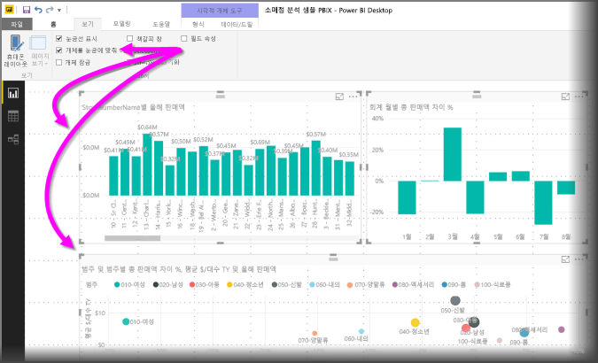
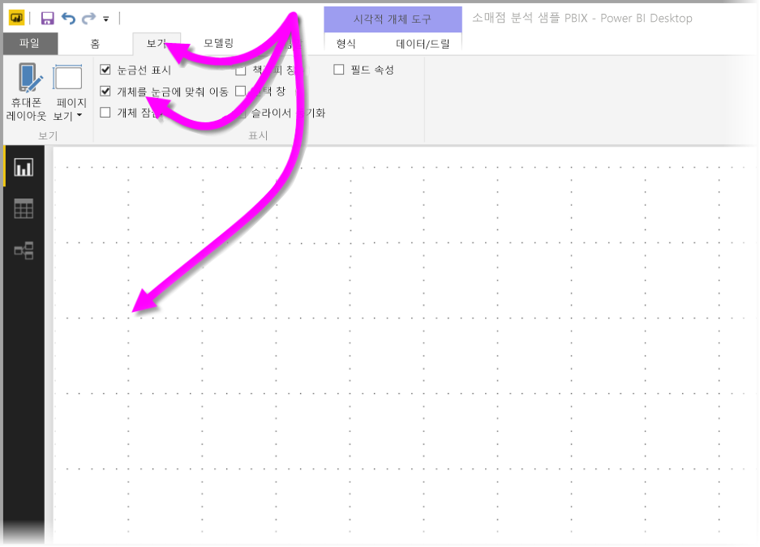
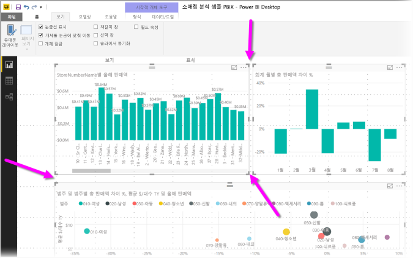
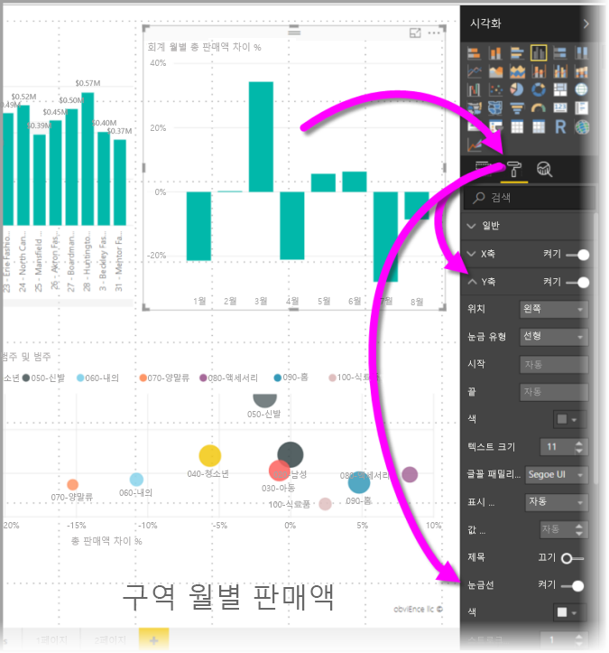
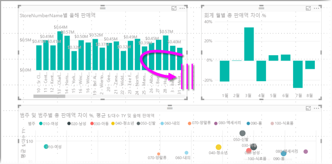
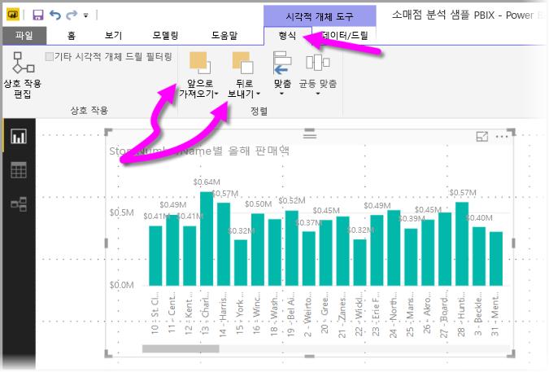
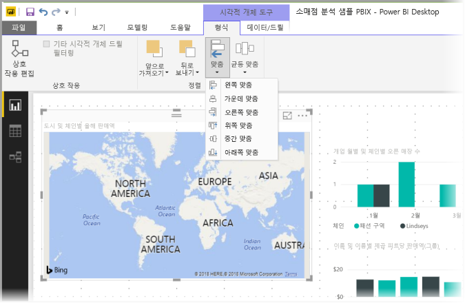
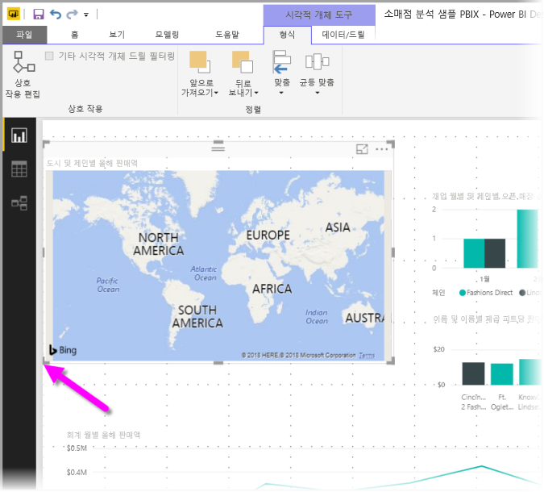
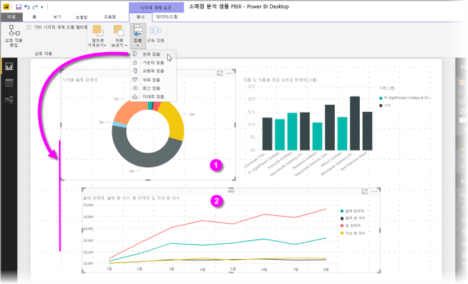
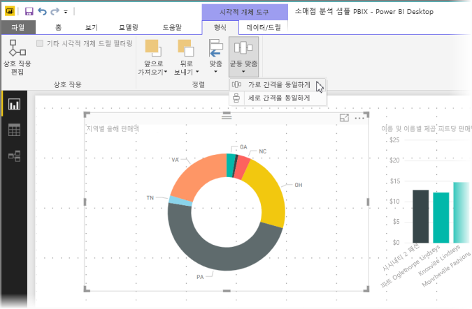

# Power BI Desktop 보고서에서 눈금선 및 눈금에 맞춤 사용
**Power BI Desktop** 보고서 캔버스는 보고서 페이지에서 시각적 개체를 깔끔하게 정렬할 수 있고, 눈금에 맞춤 기능을 사용하여 보고서의 시각적 개체가 정리되고 깨끗하고 균등하게 보이도록 하는 눈금선을 제공합니다.

또한 **Power BI Desktop**에서는 보고서에 있는 개체의 z 순서(앞으로 가져오기, 뒤로 보내기)를 조정하고, 선택한 시각적 개체를 캔버스에 정렬하거나 균등하게 배포할 수도 있습니다.

## 눈금선 및 눈금에 맞춤 사용
눈금선 및 눈금에 맞춤을 사용하려면 **보기** 리본을 선택한 다음 **눈금선 표시** 및 **개체를 눈금에 맞춰 이동**의 확인란을 사용하도록 설정합니다. 하나 또는 두 옵션을 선택할 수 있으며, 각각 독립적으로 작동합니다.

> [!NOTE]
> **눈금선 표시** 및 **개체를 눈금에 맞춰 이동**을 사용하지 않는 경우 다른 데이터 원본에 연결하면 사용할 수 있게 됩니다.

## 눈금선 사용
눈금선은 시각적 개체를 맞추는 데 도움이 되는 눈에 보이는 안내선입니다. 둘 이상의 시각적 개체가 가로 또는 세로로 정렬되는지를 확인하려는 경우 눈금선을 사용하여 해당 테두리가 정렬되는지 여부를 결정합니다.

한 번에 하나 이상의 시각적 개체를 선택하려면 Ctrl+클릭을 사용합니다. 그러면 선택한 모든 시각적 개체의 테두리가 표시되고 시각적 개체가 제대로 정렬되었는지 여부가 표시됩니다.

### 시각적 개체 내의 눈금선 사용
Power BI에는 데이터 요소와 값을 비교하기 위한 시각적 안내선을 제공하는 시각적 개체 내부의 눈금선도 있습니다. **Power BI Desktop**의 2017년 9월 릴리스부터 **시각화** 창의 **서식** 섹션에서 찾을 수 있는 **X축** 또는 **Y축**카드를 사용하여 시각적 개체 내에서 눈금선을 관리할 수 있습니다(시각적 유형에 따라 적절하게). 시각적 개체 내에서 눈금선의 다음 요소를 관리할 수 있습니다.

* 눈금선 켜기 또는 끄기
* 눈금선의 색 변경
* 눈금선의 선(두께) 조정
* 실선, 파선 또는 점선과 같이 시각적 개체에서 눈금선의 선 스타일을 선택합니다.

눈금선의 특정 요소를 수정하면 특히 시각적 개체에 어두운 배경을 사용하는 보고서에서 유용할 수 있습니다. 다음 이미지에서는 **Y축** 카드에 있는 **눈금선** 섹션을 보여 줍니다.

## 눈금에 맞춤 사용
**개체를 눈금에 맞춰 이동**을 사용하도록 설정한 경우 이동시키거나 크기를 조정한 **Power BI Desktop** 캔버스의 모든 시각적 개체는 가장 가까운 눈금 축에 정렬되어 둘 이상의 시각적 개체가 동일한 수평 또는 수직 위치나 크기로 쉽게 정렬될 수 있습니다.

이제까지 **눈금선** 및 **눈금에 맞춤**을 사용하여 보고서의 시각적 개체를 깔끔하게 정렬했습니다.

## z 순서 사용, 맞춤 및 균등 맞춤
보고서에서 종종 요소의 *z 순서*라고도 하는 시각적 개체의 앞뒤 순서를 관리할 수 있습니다. 이 기능을 사용하면 원하는 방식으로 시각적 개체를 겹치게 한 다음, 각 시각적 개체의 앞뒤 순서를 조정할 수 있습니다. **서식** 리본의 **정렬** 섹션에 있는 **앞으로 가져오기** 및 **뒤로 보내기** 단추를 사용하여 시각적 개체의 순서를 설정합니다. 페이지에서 하나 이상의 시각적 개체를 선택하는 즉시 **서식** 리본이 표시됩니다.

**서식** 리본을 사용하면 여러 가지 다양한 방식으로 시각적 개체를 정렬할 수 있으므로 시각적 요소가 페이지에서 가장 잘 보이고 작동하는 맞춤 모양으로 표시됩니다.

**맞춤** 단추를 사용하여 다음 이미지와 같이 선택한 시각적 개체를 보고서 캔버스의 가장자리(또는 가운데)에 맞춥니다.

둘 이상의 시각적 개체를 선택하는 경우 이러한 개체는 함께 맞추어지며, 해당 맞춤에 대한 시각적 개체의 정렬된 기존 경계를 사용합니다. 예를 들어 두 개의 시각적 개체를 선택하고 **왼쪽 맞춤** 옵션을 선택하면, 선택한 모든 시각적 개체의 가장 왼쪽 경계에 시각적 개체가 맞춰집니다.

또한 보고서 캔버스 전체에서 시각적 개체를 수직 또는 수평으로 균등하게 맞출 수 있습니다. **서식** 리본에서 **균등 맞춤** 단추를 사용만 하면 됩니다.

이러한 눈금선, 맞춤 및 균등 맞춤 도구에서 몇 가지 항목을 선택하면 원하는 방식으로 보고서를 볼 수 있습니다.

