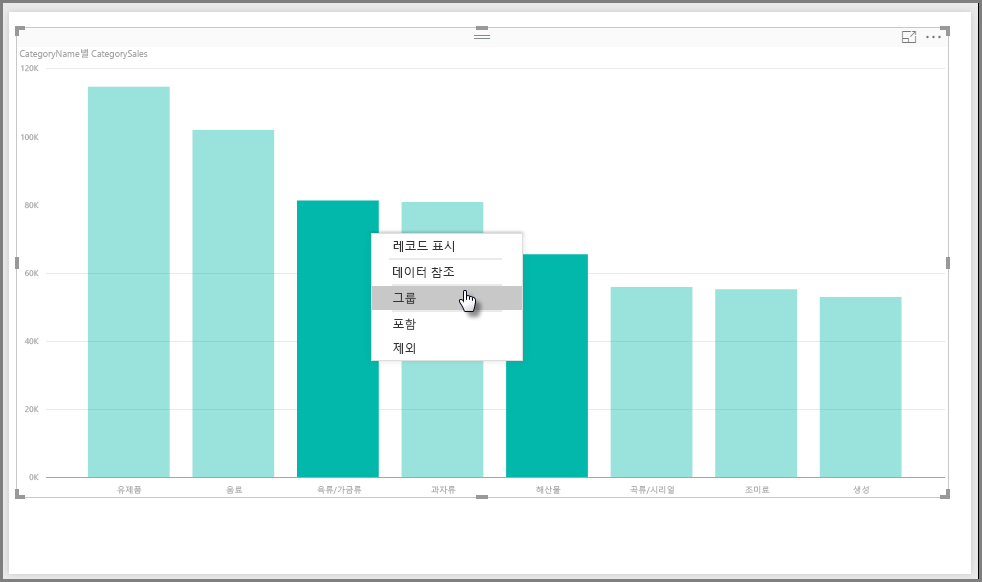
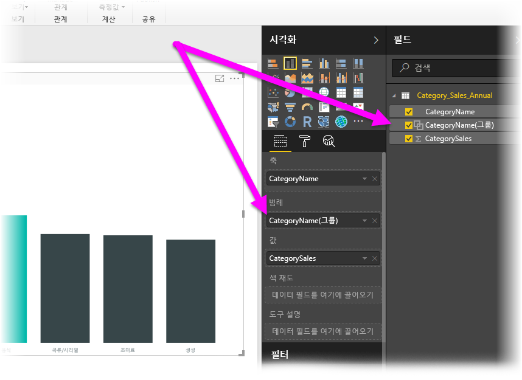
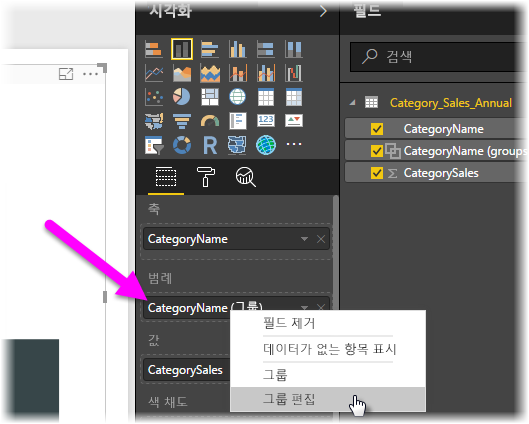
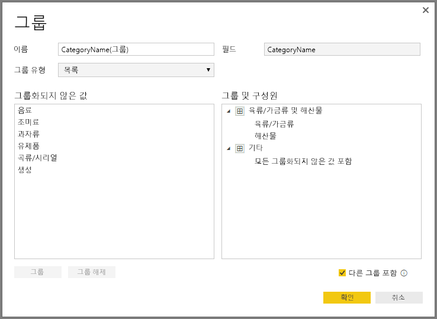
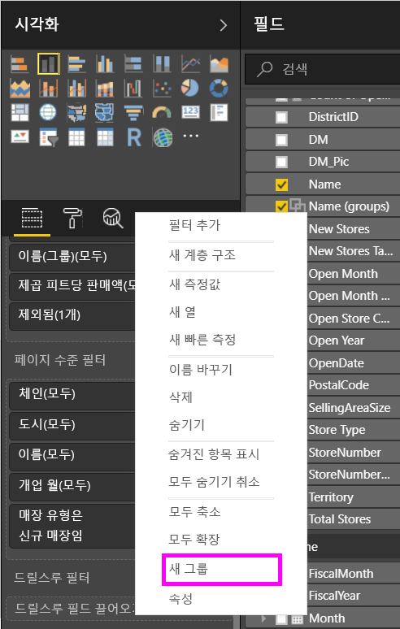
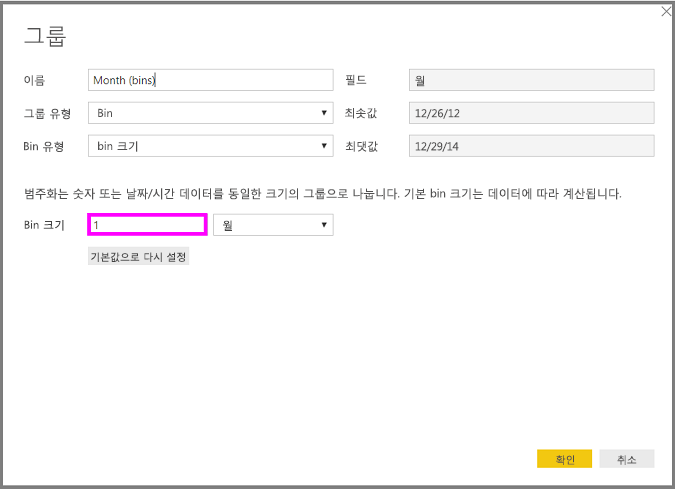
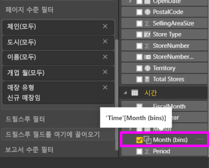

# Power BI Desktop에서 그룹화 및 범주화 사용
**Power BI Desktop**에서는 시각적 개체를 만들 때 기본 데이터에서 발견되는 값을 기반으로 청크(또는 그룹)로 데이터를 집계합니다. 대개는 좋지만 이러한 청크를 표시하는 방법을 구체화하고자 하는 때가 있을 수 있습니다. 예를 들어 하나의 큰 범주(하나의 *그룹*)에 세 가지 범주의 제품을 배치할 수 있습니다. 또는 균등하게 분할된 923,983달러 대신 1,000,000달러의 bin 크기로 배치된 판매액을 볼 수 있습니다.

Power BI Desktop에서 데이터 요소를 **그룹화**하여 시각적 개체에서 데이터와 추세를 더욱 명확하게 보고 분석하고 탐색할 수 있습니다. ‘범주화’라고 하는 **bin 크기**를 정의하여 의미 있는 방식으로 데이터 시각화를 향상하도록 하는 크기가 같은 그룹에 값을 입력할 수도 있습니다.

## 그룹화 사용
그룹화를 사용하려면 Ctrl+클릭을 사용하여 시각적 개체의 두 개 이상의 요소를 다중 선택 요소로 선택합니다. 그런 다음, 다중 선택 요소 중 하나를 마우스 오른쪽 단추로 클릭하고 표시되는 메뉴에서 **그룹**을 선택합니다.

일단 그룹을 만든 후에는 시각적 개체에 대한 **범례** 버킷에 그룹이 추가되고 **필드** 목록에도 표시됩니다.

그룹이 있으면 **범례** 버킷 또는 **필드** 목록에서 필드를 마우스 오른쪽 단추로 클릭하고 **그룹 편집**을 선택하여 해당 그룹의 구성원을 쉽게 편집할 수 있습니다.

표시되는 **그룹** 창에서 새 그룹을 만들거나 기존 그룹을 수정할 수 있습니다. 또한 **그룹 및 구성원** 상자의 그룹 제목을 두 번 클릭하고 새 이름을 입력하여 그룹의 ‘이름을 바꿀’ 수도 있습니다.

그룹으로 모든 종류의 작업을 수행할 수 있습니다. **그룹화되지 않은 값** 목록의 항목을 새 그룹 또는 기존 그룹 중 하나에 추가할 수 있습니다. 새 그룹을 만들려면 **그룹화되지 않은 값** 상자에서 둘 이상의 항목을 선택(Ctrl+클릭 사용)한 다음, 해당 상자 아래쪽의 **그룹** 단추를 클릭합니다.

기존 그룹에 그룹화되지 않은 값을 추가할 수 있습니다. 즉 그룹화되지 않은 값을 선택한 다음 추가하려는 기존 그룹을 선택하고 **그룹** 단추를 클릭하면 됩니다. 그룹에서 항목을 제거하려면 **그룹 및 구성원** 상자에서 항목을 선택한 다음 **그룹 해제**를 클릭합니다. 그룹화되지 않은 범주가 **다른** 그룹에 배치되거나 그룹화되지 않은 상태로 유지되도록 선택할 수도 있습니다.

> [!NOTE]
> 기존 시각적 개체에서 다중 선택을 하지 않고 **필드**에서 모든 필드에 대한 그룹을 만들 수 있습니다. 필드를 마우스 오른쪽 단추로 클릭하고 표시되는 메뉴에서 **새 그룹**을 선택합니다.

## 범주화 사용하기
**Power BI Desktop**에서 수치 및 시간 필드에 대한 bin 크기를 설정할 수 있습니다. 범주화를 사용하여 **Power BI Desktop**이 표시하는 데이터를 적절한 크기로 만들 수 있습니다.

bin 크기를 적용하려면 **필드**를 마우스 오른쪽 단추로 클릭하고 **새 그룹**을 선택합니다.

**그룹** 창에서 원하는 크기로 **bin 크기** 를 설정합니다.

**확인**을 선택하면 **필드** 창에 새 필드가 (bins)와 함께 표시됩니다. 그러면 캔버스에 해당 필드를 끌어 놓아 시각적 개체에서 bin 크기를 사용할 수 있습니다.

**범주화** 작업을 보려면 이 [비디오](https://www.youtube.com/watch?v=BRvdZSfO0DY)를 보세요.

**그룹화** 및 **범주화**를 사용하여 보고서에 시각적 개체에서 데이터를 원하는 방식으로 바로 표시되도록 하면 됩니다.

