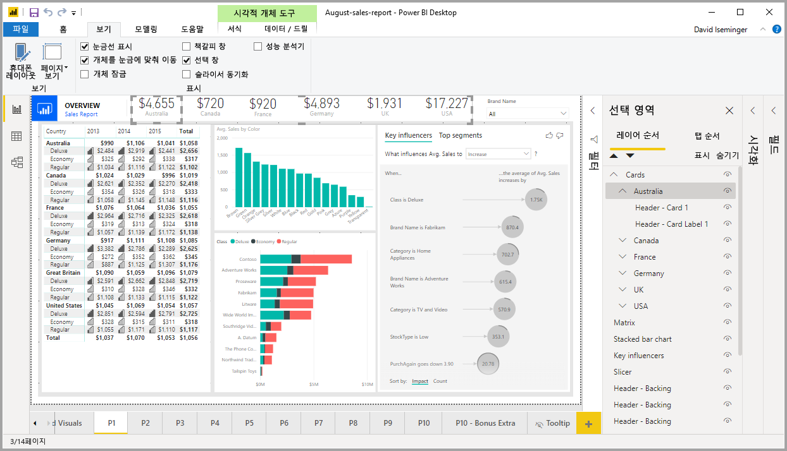
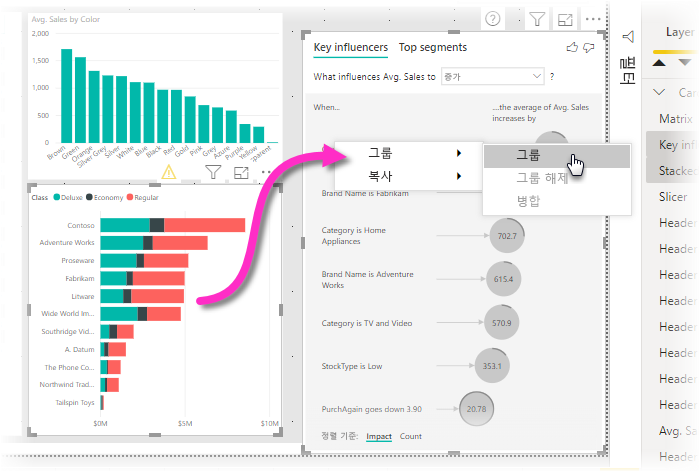
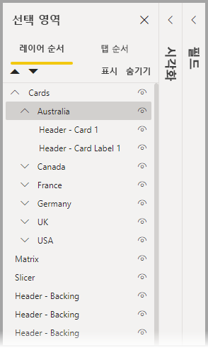
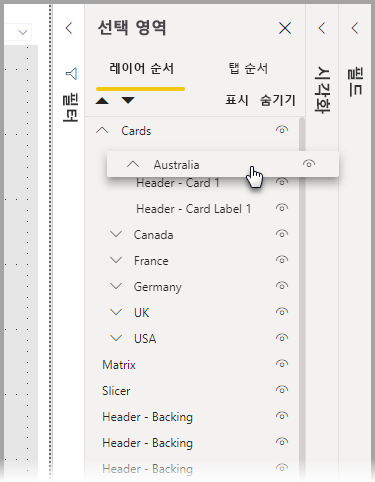
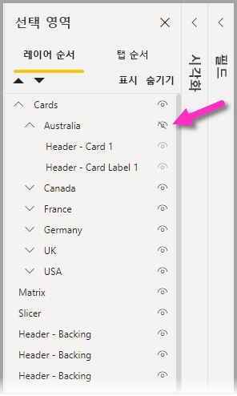
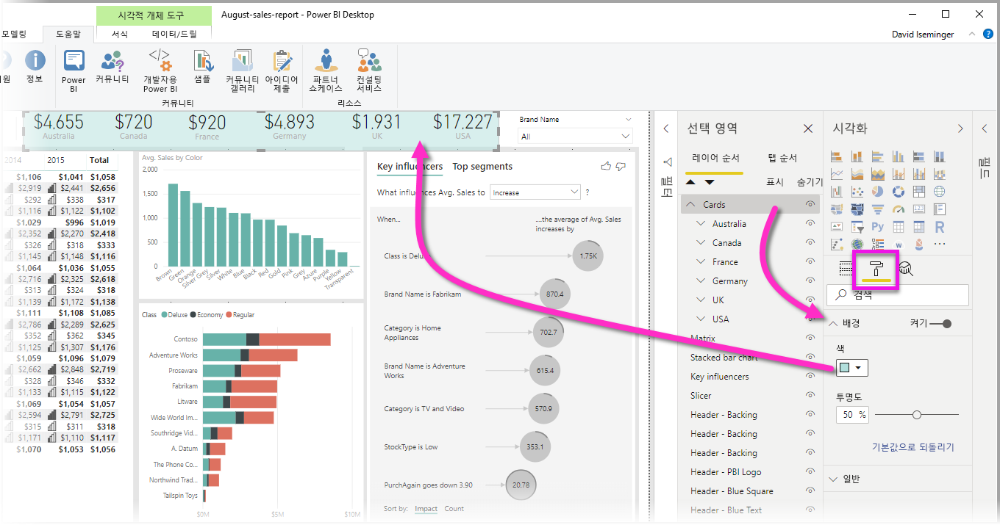

# Power BI Desktop에서 그룹화 사용
**Power BI Desktop**에서 **그룹화**를 사용하면, PowerPoint에서 항목을 그룹화하는 것처럼 단추, 텍스트 상자, 도형 이미지 및 만든 시각적 개체와 같은 보고서의 시각적 개체를 그룹화할 수 있습니다. 보고서의 시각적 개체를 그룹화함으로써 그룹을 단일 개체처럼 처리하여 보다 쉽고 빠르며 직관적인 방식으로 보고서의 계층을 이동, 크기 조정 및 사용할 수 있습니다.

## 그룹 만들기

Power BI Desktop에서 시각적 개체 그룹을 만들려면 캔버스에서 첫 번째 시각적 개체를 선택하고 Ctrl 단추를 누른 채 그룹에서 원하는 시각적 개체를 하나 이상 클릭한 다음, 시각적 개체 컬렉션을 마우스 오른쪽 단추로 클릭하고 표시되는 메뉴에서 **그룹**을 선택합니다.

**선택** 창에 그룹이 표시됩니다. 보고서에 필요한 개수만큼 시각적 개체 그룹을 포함할 수 있으며, 시각적 개체 그룹을 중첩할 수도 있습니다. 다음 그림에서 ‘Australia’ 그룹은 ‘Cards’ 그룹 아래에 중첩됩니다. 그룹 이름 옆에 있는 캐럿을 선택하여 그룹을 펼치고, 캐럿을 다시 선택하여 그룹을 접을 수 있습니다. 

**선택** 창에서 개별 시각적 개체를 끌어서 놓아 그룹에 포함하거나, 그룹에서 제거하거나, 그룹을 중첩하거나, 중첩에서 그룹 또는 개별 시각적 개체를 제거할 수도 있습니다. 조정하려는 시각적 개체를 원하는 위치에 놓기만 하면 됩니다. 겹치는 경우 ‘계층 순서’ 목록의 순서에 따라 시각적 개체의 계층화가 결정됩니다.

그룹을 해제하려면 그룹을 선택하고 마우스 오른쪽 단추를 클릭한 다음, 표시되는 메뉴에서 **그룹 해제**를 선택합니다.

## 시각적 개체 또는 그룹 숨기기 및 표시

**선택** 창을 사용하여 그룹을 간편하게 숨기거나 표시할 수 있습니다. 그룹을 숨기려면 그룹 이름(또는 개별 시각적 개체) 옆의 눈 모양 단추를 선택하여 시각적 개체나 그룹의 숨김 또는 표시를 토글합니다. 다음 그림에서 ‘Australia’ 그룹은 숨겨지고 ‘Cards’ 그룹에 중첩된 나머지 그룹은 표시됩니다.

그룹을 숨기면 해당 그룹 내의 모든 시각적 개체가 숨겨지고 해당 눈 모양 단추가 회색으로 표시됩니다(전체 그룹이 숨겨졌으므로 개별 단추를 토글하여 켜거나 끌 수 없음). 그룹 내의 특정 시각적 개체만 숨기려면 시각적 개체 옆의 눈 모양 단추를 토글하면 되고, 그룹에서 해당 시각적 개체만 숨겨집니다.

## 그룹 내의 시각적 개체 선택

시각적 개체 그룹 내의 항목을 탐색하고 선택하는 몇 가지 방법이 있습니다. 다음 목록에서 동작을 설명합니다.

* 그룹 내의 빈 공간(예: 시각적 개체 사이의 공백)을 클릭하는 경우 아무것도 선택되지 않습니다.
* 그룹 내의 시각적 개체를 클릭하면 전체 그룹이 선택되고 두 번째로 클릭하면 개별 시각적 개체가 선택됩니다.
* 그룹을 선택하고 보고서 캔버스에서 다른 개체를 선택한 다음, 오른쪽 클릭 메뉴에서 **그룹**을 선택하면 중첩된 그룹이 생성됩니다.
* 두 그룹을 선택하고 마우스 오른쪽 단추를 클릭하면 선택한 그룹을 중첩하는 옵션이 아닌 병합하는 옵션이 표시됩니다.

## 배경색 적용

다음 그림에 표시된 **시각화** 창의 **서식** 섹션을 사용하여 그룹에 배경색을 적용할 수도 있습니다. 

배경색을 적용한 후 그룹의 시각적 개체 사이에 있는 공간을 클릭하면 그룹이 선택됩니다. 배경색을 적용하기 전에는 그룹의 시각적 개체 사이에 있는 공백을 클릭할 때 그룹이 선택되지 않았습니다. 

## 다음 단계
그룹화에 대한 자세한 내용을 보려면 다음 동영상을 시청하세요.

* [Power BI Desktop의 그룹화 - 동영상](https://youtu.be/sf4n7VXoQHY?t=10)

다음 문서에도 관심이 있을 수 있습니다.

* [Power BI Desktop에서 교차 보고서 드릴스루 사용](desktop-cross-report-drill-through.md)
* [Power BI Desktop에서 슬라이서 사용](visuals/power-bi-visualization-slicers.md)

