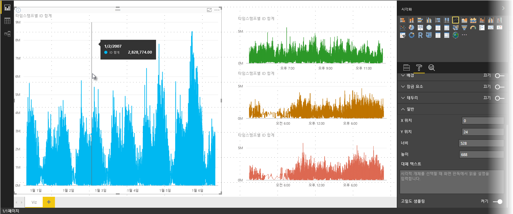
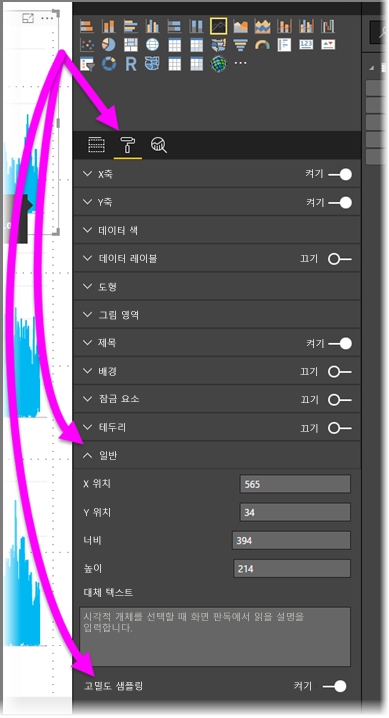

# Power BI에서 고밀도 선 샘플링
**Power BI Desktop**의 2017년 6월 릴리스 및 **Power BI 서비스**에 대한 업데이트로 시작하는 새 샘플링 알고리즘은 고밀도 데이터를 샘플링하는 시각적 개체를 향상시키는데 사용 가능합니다. 예를 들어 각 상점이 매년 10000개 이상의 판매 영수증을 갖는 소매 상점의 판매 결과에서 꺾은선형 차트를 만들 수 있습니다. 이러한 판매 정보의 꺾은선형 차트는 각 상점의 데이터에서 데이터(시간에 따른 판매 변화를 설명하기 위해 해당 데이터의 의미 있는 표현 선택)를 샘플링하고 다중 계열 꺾은선형 차트를 만들어 기본 데이터를 나타냅니다. 이것은 고밀도 데이터 시각화의 일반적인 사례이며 Power BI Desktop은 고밀도 데이터의 해당 샘플링을 향상시켰습니다. 해당 세부 정보는 이 문서에서 설명됩니다.

> [!NOTE]
> 이 문서에서 설명된 **고밀도 샘플링** 알고리즘은 **Power BI Desktop** 및 **Power BI 서비스**에 적용되며 둘 다에서 사용할 수 있습니다.
> 
> 

## 고밀도 선 샘플링 작동 방법
이전에 **Power BI**는 결정적 방식으로 기본 데이터의 전체 범위에서 샘플 데이터 요소의 컬렉션을 선택했습니다. 예를 들어 일년에 걸친 시각적 개체에서 고밀도 데이터의 경우 시각적 개체에 나타난 350개의 샘플 데이터 요소가 있을 수 있으며 데이터의 전체 범위(기본 데이터의 전체 시리즈)를 확인하기 위해 선택된 각각은 시각적 개체에 표시되었습니다. 발생하는 방법을 이해하기 위해 일년 동안의 주가를 그리고 꺾은선형 차트 시각적 개체를 만들기 위해 365개의 데이터 요소를 선택했다고 가정합니다(각 날짜에 대해 하나의 데이터 요소).

이러한 상황에서는 각 날짜 내에 주가에 대한 여러 값이 있습니다. 물론 일일 최고 및 최저가 있지만 이는 주식 시장이 열렸을 때 하루 중 언제든지 발생할 수 있습니다. 고밀도 선 샘플링의 경우 기본 데이터 샘플이 매일 오전 10시 30분과 오후 12시에 찍힌 경우 기본 데이터(오전 10시 30분 및 오후 12시의 가격)의 대표 스냅숏을 얻지만 해당 대표 데이터 요소(해당 날)에 대한 실제 주가의 높고 낮음을 캡처하지 못할 수 있습니다. 이러한 상황 및 기타 상황에서 샘플링은 기본 데이터를 대표하지만 중요한 지점(이 경우 일일 주가 고저)을 항상 캡처하지 않습니다.

기본적으로 고밀도 데이터는 매우 빠르게 만들 수 있는, 대화형 작업에 반응하는 시각화를 활성화하도록 샘플링됩니다(시각적 개체의 너무 많은 데이터 요소는 난항에 빠뜨릴 수 있으며 추세의 가시성을 손상시킬 수 있음). 최상의 시각화 환경을 제공하기 위해 이러한 데이터를 샘플링하는 방법은 샘플링 알고리즘의 생성을 이끄는 것입니다. Power BI Desktop에서 알고리즘은 각 시간 조각에서 중요한 요소의 응답, 표현 및 선명한 보존의 최적 조합을 제공하도록 개선되었습니다.

## 새 선 샘플링 알고리즘 작동 방법
고밀도 선 샘플링에 대한 새 알고리즘은 연속 x 축과 함께 꺾은선형 차트 및 영역 차트 시각적 개체에 사용할 수 있습니다.

고밀도 시각적 개체의 경우 **Power BI**는 데이터를 고해상도 청크로 지능적으로 분할한 다음 각 청크를 나타내기 위해 중요한 요소를 선택합니다. 고해상도 데이터 분할의 해당 프로세스는 결과 차트가 모든 기본 데이터 요소 렌더링에서 시각적으로 구별되지만 훨씬 빠르고 더욱 대화형이 되도록 특별히 조정됩니다.

### 고밀도 선 시각적 개체에 대한 최소 및 최대값
지정된 모든 시각화의 경우 다음과 같은 시각적 제한 사항이 적용됩니다.

* **3,500**은 기본 데이터 요소 또는 시리즈의 수에 관계 없이 시각적 개체에 *표시된* 최대 숫자 데이터 요소입니다. 이와 같이 각각 350개의 데이터 요소가 있는 10개의 시리즈가 있는 경우 시각적 개체는 해당 최대 전체 데이터 요소 제한에 도달했습니다. 하나의 시리즈가 있는 경우 새 알고리즘이 이를 기본 데이터에 대한 최상의 샘플링으로 여기는 경우 최대 3,500개의 데이터 요소를 가질 수 있습니다.
* 모든 시각적 개체에 대해 최대 **60개의 시리즈**가 있습니다. 60개 이상의 시리즈가 있는 경우 데이터를 분할하고 각각 60개 이하의 시리즈로 여러 시각적 개체를 만듭니다. **슬라이서**를 사용하여 데이터의 세그먼트만 표시하는 것이 좋습니다(특정 시리즈만). 예를 들어 범례에서 모든 하위 범주를 표시하는 경우 슬라이서를 사용하여 동일한 보고서 페이지에서 전체 범주별로 필터링할 수 있습니다.

이러한 매개 변수는 Power BI Desktop에서 시각적 개체가 매우 신속하게 렌더링하고 사용자와의 상호 작용에 반응하고 시각적 개체를 렌더링하는 컴퓨터에서 과도한 계산 오버헤드가 발생하지 않도록 합니다.

### 고밀도 선 시각적 개체에 대한 대표 데이터 요소 평가
기본 데이터 요소의 수가 시각적 개체에 나타낼 수 있는 데이터 요소를 초과하는 경우(3,500 초과) *binning*이라는 프로세스가 시작하고 기본 데이터를 *bins*라는 그룹으로 청크한 다음 해당 bins를 반복적으로 구체화합니다.

알고리즘은 시각적 개체에 대한 가장 큰 세분성을 만들기 위해 가능한 많은 bins를 만듭니다. 각 bin 내에서 알고리즘은 최소 및 최대 데이터 값을 찾아 중요하고 의미 있는 해당 값(예: 이상값)이 시각적 개체에서 캡처되고 표시되도록 합니다. Power BI에 의한 데이터의 범주화 및 후속 평가의 결과에 따라 시각적 개체에 대한 x 축의 최소 해상도는 시각적 개체에 대한 최대 세분성을 확인하도록 결정됩니다.

앞에서 설명한 대로 각 시리즈에 대한 최소 세분성은 350개의 요소이며 최대값은 3,500입니다.

각 bin은 두 개의 데이터 요소로 표시되며 시각적 개체에서 bin의 대표 데이터 요소가 됩니다. 데이터 요소는 단순히 해당 bin에 대한 높고 낮은 값이며 높은 값 및 낮은 값을 선택하여 범주화 프로세스는 모든 중요한 높은 값 또는 중요한 낮은 값이 시각적 개체에서 캡처 및 렌더링되도록 합니다.

낮은 빈도의 이상값이 시각적 개체에서 캡처되고 올바르게 표시되기 위해 많은 분석이 있는 것 같은 경우, 올바른 것입니다. 이는 정확히 새 알고리즘 및 범주화 프로세스 뒤의 이유입니다.

## 도구 설명 및 고밀도 선 샘플링
지정된 bin의 최소 및 최대 값이 시각적 개체에서 캡처되고 표시되도록 하는 이 범주화 프로세스는 데이터 요소를 마우스로 가리킬 때 도구 설명이 데이터를 표시하는 방법에 영향을 줄 수 있습니다. 발생 방법 및 이유를 설명하기 위해 이 문서의 앞부분에서 주가에 대한 예제를 다시 확인해 보겠습니다.

주가를 기본으로 하는 시각적 개체를 만들고 **고밀도 샘플링**을 사용하는 두 개의 다른 주식을 비교한다고 가정합니다. 각 시리즈에 대한 기본 데이터에는 수많은 데이터 요소가 있습니다(매일 각 초당 주가를 캡처할지도 모름). 고밀도 선 샘플링 알고리즘은 서로 독립적으로 각 계열에 대한 범주화를 수행합니다.

이제 첫 번째 주식이 12시 2분에 오른 다음 10초 후에 다시 돌아온다고 가정합니다. 이는 중요한 데이터 요소입니다. 해당 주식에 대한 범주화가 발생할 때 12시 2분의 높이는 해당 bin에 대한 대표 데이터 요소가 됩니다.

그러나 두 번째 주식의 경우 12시 2분은 해당 시간을 포함하는 bin에서 높거나 낮지 않습니다. 아마도 12시 2분을 포함하는 bin에 대한 높고 낮음은 3분 후에 발생합니다. 이러한 상황에서 꺾은선형 차트를 만들고 12시 2분으로 마우스를 가져갈 때 첫 번째 주식에 대한 도구 설명에서 값이 표시되지만(12시 2분에 올랐으며 해당 bin의 높은 데이터 요소로 해당 값이 선택되었으므로) 두 번째 주식에 대한 12시 2분의 도구 설명에는 값이 표시되지 *않습니다*. 이는 12시 2분을 포함하는 bin에 대해 두 번째 주식에 높음 및 낮음이 없기 때문입니다. 따라서 12시 2분에 두 번째 주식에 대해 표시할 데이터가 없으므로 도구 설명 데이터가 표시되지 않습니다.

이 상황은 도구 설명에서 자주 발생합니다. 지정된 bin에 대한 높은 값 및 낮은 값은 균등하게 크기 조정된 x축 값 요소와 완벽하게 일치하지 않을 수 있으므로 도구 설명은 값을 표시하지 않습니다.  

## 고밀도 선 샘플링을 설정하는 방법
기본적으로 새 알고리즘은 **설정**되어 있습니다. 이 설정을 변경하려면 **서식** 창으로 이동하고 **일반** 카드에서 아래쪽을 따라 **고밀도 샘플링**이라는 설정/해제 슬라이더가 보입니다. 이 기능을 해제하려면 **끄기**로 밉니다.

## 고려 사항 및 제한 사항
고밀도 선 샘플링에 대한 새 알고리즘은 Power BI에 중요한 개선이지만 고밀도 값 및 데이터를 사용할 때 알아야 할 몇 가지 고려 사항이 있습니다.

* 증가한 세분성 및 범주화 프로세스로 인해 **도구 설명**은 대표 데이터가 커서와 정렬되는 경우에만 값을 나타낼 수 있습니다. **도구 설명**에 대한 자세한 정보는 이 문서의 앞부분에 나오는 섹션을 참조하세요.
* 전체 데이터 원본의 크기가 너무 큰 경우 새 알고리즘은 데이터 가져오기 최대 제약 조건에 맞도록 시리즈(범례 요소)를 제거합니다.
  
  * 이 경우 새 알고리즘은 범례 시리즈를 사전순으로 정렬하고 데이터 가져오기 최대값에 도달될 때까지 알파벳 순서로 범례 요소의 목록을 아래로 시작하고 추가 시리즈를 가져오지 않습니다.
* 기본 데이터 집합에 60개 이상의 시리즈가 있는 경우(앞에서 설명한 대로 시리즈의 최대 수) 새 알고리즘은 시리즈를 사전순으로 정렬하고 60번째 사전순으로 정렬된 시리즈를 넘어가는 시리즈를 제거합니다.
* 데이터의 값이 *숫자* 또는 *날짜/시간* 형식이 아닌 경우 Power BI는 새 알고리즘을 사용하지 않으며 이전(비-고밀도 샘플링) 알고리즘으로 돌아갑니다.
* **데이터가 없는 항목 표시** 설정은 새 알고리즘에서 지원되지 않습니다.
* SQL Server Analysis Services(2016 이전 버전)에서 호스팅되는 모델에 대한 라이브 연결을 사용하는 경우 새 알고리즘이 지원되지 않습니다. **Power BI** 또는 Azure Analysis Services에서 호스팅되는 모델에서 지원됩니다.

## 다음 단계
분산형 차트에서 고밀도 샘플링에 대한 내용은 다음 문서를 참조하세요.

* [Power BI 분산형 차트의 고밀도 샘플링](desktop-high-density-scatter-charts.md)

