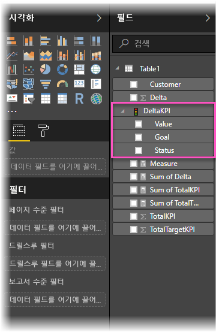
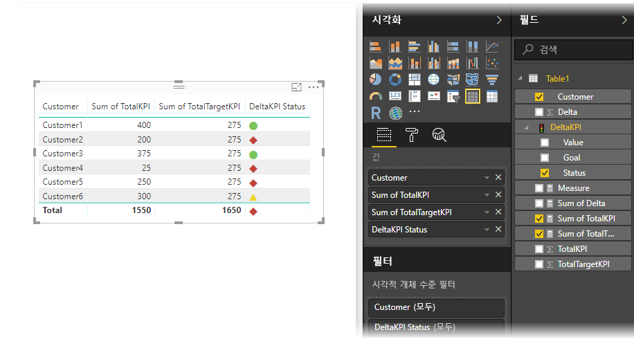

# Power BI에서 KPI 가져오기 및 표시
**Power BI Desktop**을 사용하면 테이블, 행렬 및 카드에서 KPI를 가져오고 표시할 수 있습니다.

KPI를 가져오고 표시하려면 다음 이 단계를 수행합니다.

1. 파워 피벗 모델 및 KPI를 포함하는 Excel 통합 문서를 시작합니다. 이 연습에서는 KPI라는 통합 문서를 사용합니다. 

1. **파일 -> 가져오기 -> Excel 통합 문서 콘텐츠**를 사용하여 Excel 통합 문서를 Power BI로 가져옵니다. [통합 문서를 가져오는 방법](desktop-import-excel-workbooks.md)을 알아볼 수도 있습니다. 

1. Power BI로 가져온 후에는  아이콘이 표시된 **필드** 창에 KPI가 표시됩니다. 보고서에서 KPI를 사용하려면 **값**, **목표** 및 **상태** 필드를 표시하여 콘텐츠를 확장해야 합니다.

    

1. 가져온 KPI는 **테이블** 형식과 같은 표준 시각화 형식에서 가장 효과적으로 사용됩니다. Power BI에는 새 KPI를 만드는 데만 사용해야 하는 **KPI** 시각화 형식도 포함되어 있습니다.
   
    

매우 간단합니다. KPI를 사용하여 추세, 진행률 또는 기타 중요 지표를 강조 표시할 수 있습니다.
