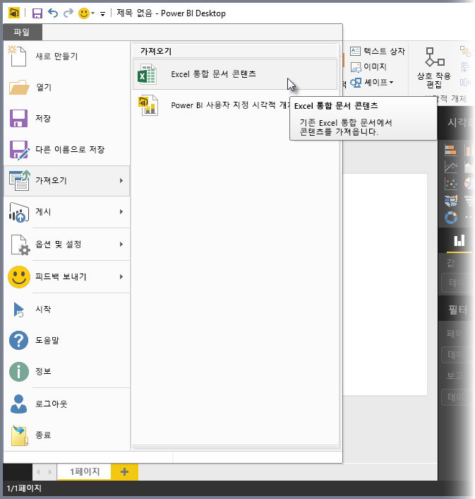
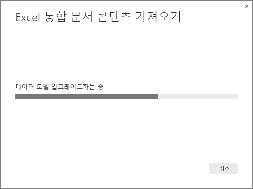
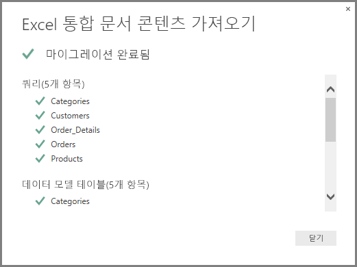
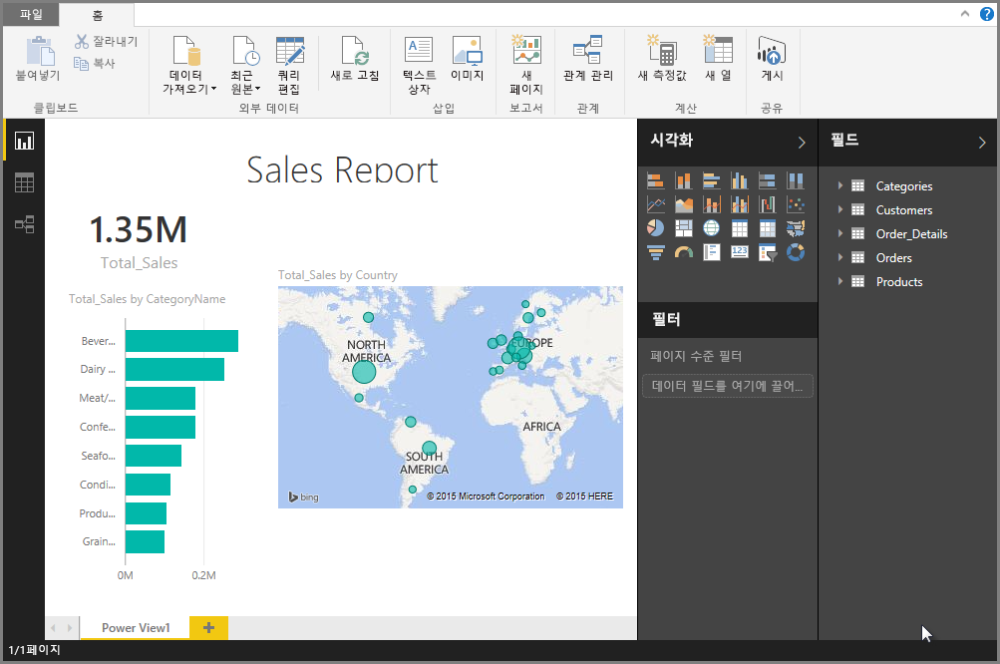

# Power BI Desktop에 Excel 통합 문서 가져오기
**Power BI Desktop**을 사용하면 Power Query 쿼리, Power Pivot 모델, Power View 워크시트를 포함하는 Excel 통합 문서를 간편하게 Power BI Desktop에 가져올 수 있습니다. Excel 통합 문서에 따라 보고서 및 시각화가 자동으로 생성되며 가져온 후에는 기존 기능과, 각 Power BI Desktop 월별 업데이트에서 제공되는 새로운 기능을 사용하여 Power BI Desktop으로 보고서를 개선하고 구체화할 수 있습니다.

향후 Excel과 Power BI Desktop 간의 추가적인 통신(예: 가져오기/내보내기)을 제공할 계획입니다. 통합 문서를 Power BI Desktop으로 가져오는 현재 기능을 사용하면 기존 Excel 사용자가 Power BI Desktop을 시작할 수 있습니다.

## Excel 통합 문서를 가져오려면 어떻게 해야 하나요?
Power BI Desktop에서 통합 문서를 가져오려면 **파일 -\>가져오기 -\>Excel 통합 문서 내용**을 선택합니다.

가져올 통합 문서를 선택할 수 있는 창이 표시됩니다. 현재 통합 문서의 크기나 개체 수에는 제약이 없지만 통합 문서가 커지면 Power BI Desktop의 분석 및 가져오기가 더 오래 걸립니다.

> [!NOTE]
> **공유된 비즈니스용 OneDrive** 폴더 또는 **Office 365 그룹** 폴더에서 Excel 파일을 로드하거나 가져오려면 Excel 파일의 URL을 사용하고 **웹** 데이터 원본을 Power BI Desktop에 입력하세요. **비즈니스용 OneDrive** URL의 형식을 제대로 지정하기 위해 따라야 하는 몇 가지 단계가 있으므로 자세한 내용 및 올바른 일련의 단계는 [Power BI Desktop에서 비즈니스용 OneDrive 링크 사용](desktop-use-onedrive-business-links.md)을 참조하세요.
> 
> 

통합 문서를 선택한 후에는 Power BI Desktop이 통합 문서를 분석하고 Power BI Desktop 파일(.pbix)로 변환합니다. 이 작업은 일회성 이벤트입니다. 절차를 거쳐 Power BI Desktop 파일이 만들어진 후에는 Power BI Desktop 파일이 원래의 Excel 통합 문서에 종속되지 않으며 원래의 통합 문서에 영향을 미치지 않고 수정 또는 변경(및 저장, 공유)할 수 있습니다.

가져오기가 완료되면 변화노딘 항목을 설명하고 가져올 수 없는 항목을 열거하는 **요약** 페이지가 표시됩니다.

**닫기**를 선택하면 보고서가 Power BI Desktop에 로드됩니다. 다음 이미지는 Excel 통합 문서를 가져온 후의 Power BI Desktop을 보여줍니다. Power BI Desktop은 통합 문서 내용에 따라 자동으로 보고서를 로드합니다.

통합 문서를 가져왔으므로 Power BI Desktop에 포함된 아무 기능 및 특징이나 사용하여 새 시각화 요소 만들기, 데이터 추가, 새 보고서 페이지 만들기 등과 같은 보고서 작업을 계속할 수 있습니다.

## 가져올 수 없는 통합 문서 요소는 무엇인가요?
Power BI Desktop은 Excel에서 일반적으로 *개체*라고 하는 다음 요소를 가져올 수 있습니다.

| Excel 통합 문서의 개체 | Power BI Desktop 파일의 최종 결과 |
| --- | --- |
| Power Query 쿼리 |Excel에서 모든 Power Query 쿼리는 Power BI Desktop의 쿼리로 변환됩니다. Excel 통합 문서에 정의된 쿼리 그룹이 있다면 동일한 구성이 Power BI Desktop에 복제됩니다. Excel에서 “연결 만들기만"으로 설정되지 않았다면 모든 쿼리가 로드됩니다. 로드 동작은 Power BI Desktop에서 **쿼리 편집기** 의 **홈** 탭에서 **속성** 대화 상자를 통해 사용자 지정할 수 있습니다. |
| 파워 피벗 외부 데이터 연결 |모든 파워 피벗 외부 데이터 연결은 Power BI Desktop의 쿼리로 변환됩니다. |
| 연결된 테이블 또는 현재 통합 문서 테이블 |Excel의 워크시트 테이블이 데이터 모델에 연결되었거나 쿼리(M에서 *From Table* 또는 *Excel.CurrentWorkbook()* 함수 사용)에 연결된 경우 다음 옵션이 제시됩니다. 1. Power BI Desktop 파일에 테이블을 가져옵니다. 이 테이블은 데이터의 일회성 스냅숏으로, 이후에는 Power BI Desktop의 테이블에서 데이터를 편집할 수 없습니다. 이 옵션을 사용하여 만들어진 테이블에는 1백만 자(총계, 모든 열 머리글 및 셀 결합)의 크기 제한이 있습니다. 2. 원래 통합 문서와의 연결을 유지합니다. 또는 원래의 Excel 통합 문서와의 연결을 유지하고, Power BI Desktop에서 Excel 통합 문서에 대해 만든 다른 쿼리와 마찬가지로 Power BI Desktop이 새로 고칠 때마다 이 테이블에서 최신 콘텐츠를 검색하도록 할 수 있습니다. |
| 데이터 모델 계산 열, 측정값, KPI, 데이터 범주 및 관계 |이러한 데이터 모델 개체는 Power BI Desktop에서 상응하는 개체로 변환됩니다. Power BI Desktop에는 사용할 수 없는 특정 데이터 범주가 있습니다(예: **이미지**). 이 경우 문제의 열에 대해 데이터 범주 정보가 재설정됩니다. |
| Power View 워크시트 |Excel에서 각 Power View 워크시트에 대해 새 보고서 페이지가 생성됩니다. 이러한 보고서 페이지의 순서와 이름은 원래의 Excel 통합 문서와 일치합니다. |

## 통합 문서를 가져오는 데 제한 사항이 있나요?
통합 문서를 Power BI Desktop으로 가져올 때는 다음 목록과 같은 몇 가지 제한 사항이 있습니다.

* **Analysis Services 테이블 형식 모델에 대한 외부 연결:** Excel 2013에서는 SQL Server Analysis Services 테이블 형식 모델에 연결하고, 데이터를 가져올 필요 없이 이 모델 위에 Power View 보고서를 만들 수 있습니다. 현재 Power BI Desktop에 Excel 통합 문서를 가져올 때 이러한 유형의 연결이 지원되지 않습니다. 해결 방법으로, Power BI Desktop에서 이러한 외부 연결을 다시 만들어야 합니다.
* **계층:** 이 유형의 데이터 모델 개체는 현재 Power BI Desktop에서 지원 되지 않습니다. 따라서 Power BI Desktop에 Excel 통합 문서를 가져올 때 계층을 건너뜁니다.
* **이진 데이터 열:** 이 유형의 데이터 모델 열은 현재 Power BI Desktop에서 지원 되지 않습니다. 이진 데이터 열은 Power BI Desktop의 결과 테이블에서 제거됩니다.
* **지원되지 않는 파워 뷰 요소:** 테마, 특정 유형의 시각화(축이 있는 분산형 차트, 드릴다운 동작 등) 등, 몇 가지 파워 뷰 기능은 Power BI Desktop에서 지원되지 않습니다. 이렇게 지원되지 않는 시각화 기능으로 인해 Power BI Desktop 보고서의 해당 위치에 *지원되지 않는 시각화* 메시지가 표시됩니다. 이 메시지는 필요에 따라 삭제하거나 재구성할 수 있습니다.
* Power Query에서의 **Named Ranges using*****From Table*** **또는 M에서의*****Excel.CurrentWorkbook*** **사용:** 현재 Power BI Desktop에 명명된 범위 데이터를 가져오는 것은 지원되지 않지만 향후 Power BI Desktop 업데이트에서 지원할 계획입니다. 현재 이렇게 명명된 범위는 외부 Excel 통합 문서 연결에 따라 Power BI Desktop에 로드됩니다.
* **PowerPivot에서 SSRS 연결:** SSRS(SQL Server Reporting Services)에 대한 PowerPivot 외부 연결은 현재 지원되지 않습니다. 이 데이터 원본을 현재 Power BI Desktop에서 사용할 수 없기 때문입니다.

