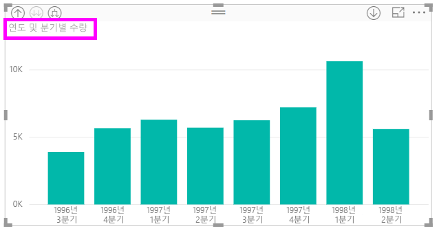
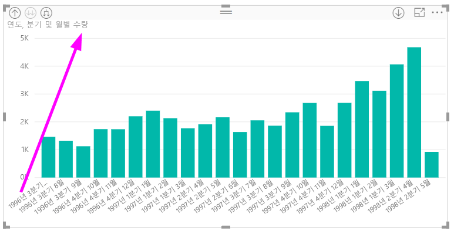
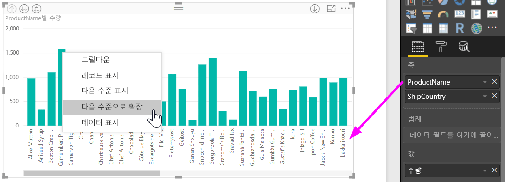
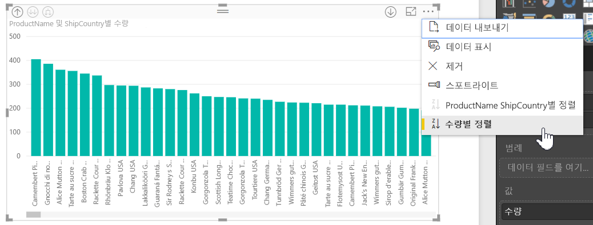
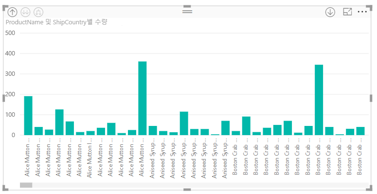

# Power BI Desktop에서 인라인 계층 구조 레이블 사용
**Power BI Desktop**은 계층적 드릴링을 개선하기 위한 두 기능 중 첫 번째 기능인 **인라인 계층 구조 레이블**의 사용을 지원합니다. 현재 개발 중인 두 번째 기능은 중첩된 계층 구조 레이블을 사용하는 기능입니다(자주 업데이트되니 기다려 주세요).   

## 인라인 계층 구조 레이블의 작동 방식
인라인 계층 레이블에서는 **모두 확장** 기능을 사용하여 시각적 개체를 확장하면서 계층 구조 레이블을 볼 수 있습니다. 이러한 계층 구조 레이블을 표시할 때 한 가지 이점은 계층 데이터를 확장하면서 이러한 다양한 계층 구조 레이블을 기준으로 **정렬**하도록 선택할 수도 있다는 점입니다.

### 기본 제공된 확장 기능 사용(계층 구조 레이블로 정렬하지 않음)
실제로 인라인 계층 구조 레이블을 보기 전에 기본 **다음 수준으로 확장** 기능 동작을 살펴 보겠습니다. 이렇게 하면 인라인 계층 구조가 얼마나 유용한지 이해하고 인정할 수 있습니다.

다음 이미지는 연간 판매량에 대한 가로 막대형 차트 시각적 개체를 보여 줍니다. 막대를 마우스 오른쪽 단추로 클릭하면 **다음 수준으로 확장**을 선택할 수 있습니다.

> [!NOTE]
> 막대를 마우스 오른쪽 단추로 클릭하는 대신 시각화 왼쪽 상단에 있는 *확장* 단추를 선택할 수 있습니다.

  

**다음 수준으로 확장**을 선택하면 다음 이미지처럼 시각적 개체가 날짜 계층 구조를 *연도*에서 *분기*로 확장합니다.

*연도* 및 *분기* 레이블이 인라인으로 함께 표시된 것에 유의하세요. 이 레이블 지정 체계는 계층 구조 최하위까지 **모두 확장**함에 따라 계속됩니다.

*날짜/시간* 데이터 형식이 있는 필드와 연결된 기본 제공 *날짜* 계층 구조가 어떻게 작동하는지 살펴 보았습니다. 다음 섹션에서는 새로운 인라인 계층 구조 레이블 기능이 어떻게 다른지 알아보겠습니다.

### 인라인 계층 구조 레이블 사용
이제 비공식 계층 구조의 데이터를 사용하는 다양한 차트를 살펴보겠습니다. 다음 시각적 개체에는 *ProductName*을 축으로 사용하고 **수량**이 있는 가로 막대형 차트가 있습니다. 이 데이터에서 *ProductName* 및 *ShipCountry*는 비공식 계층 구조를 형성합니다. 여기에서 *다음 수준으로 확장*을 다시 선택하여 계층 구조를 드릴다운할 수 있습니다.

**다음 수준으로 확장**을 선택하면 계층 구조 레이블의 인라인 표시와 함께 다음 수준을 보여줍니다. 기본적으로, 인라인 계층 구조는 측정값(이 경우 **수량**)을 기준으로 정렬됩니다. 인라인 계층 레이블이 사용하도록 설정된 경우 오른쪽 위에 있는 줄임표( **...** )를 선택한 후 다음 이미지에 나와 있는 것처럼 **ProductName ShipCountry로 정렬**을 선택하여 계층 구조를 기준으로 이 데이터를 정렬하도록 선택할 수도 있습니다.

**ShipCountry**가 선택되면 다음 이미지처럼 비공식 계층 구조 선택에 따라 데이터가 정렬됩니다.

> [!NOTE]
> 인라인 계층 구조 레이블 기능에서는 기본 제공 시간 계층을 값으로 정렬하도록 허용하지 않으며 계층 구조 순서로만 정렬됩니다.
> 
> 

## 문제 해결
시각적 개체가 확장된 인라인 계층 구조 수준 상태에 빠질 수 있습니다. 경우에 따라 일부 시각적 개체가 확장된 모드에서 움직이지 않을 수 있으며 이 경우 드릴업이 작동하지 않습니다. 다음 단계를 수행한 경우 이러한 현상이 발생할 수 있습니다(이에 대한 해결 방법은 이 단계 아래에 나와 있음). 

시각적 개체가 확장된 상태에서 움직이지 않도록 할 수 있는 단계

1. **인라인 계층 구조 레이블** 기능을 사용하도록 설정합니다.
2. 일부 시각적 개체를 계층 구조로 만듭니다.
3. 그런 다음 **모두 확장**하고 파일을 저장합니다.
4. **인라인 계층 구조 레이블** 기능을 사용하지 않도록 설정하고 Power BI Desktop을 다시 시작합니다. 
5. 파일을 다시 엽니다.

이러한 단계를 수행하고 시각적 개체가 확장된 모드에서 움직이지 않으면 다음을 수행하여 문제를 해결할 수 있습니다.

1. **인라인 계층 구조 레이블** 기능을 다시 사용하도록 설정한 후 Power BI Desktop을 다시 시작합니다.
2. 파일을 다시 열고 영향을 받는 시각적 개체 맨 위로 다시 드릴업합니다.
3. 파일을 저장합니다.
4. **인라인 계층 구조 레이블** 기능을 사용하지 않도록 설정한 후 Power BI Desktop을 다시 시작합니다.
5. 파일을 다시 엽니다.

또는 시각적 개체를 삭제하고 다시 만들 수 있습니다.

