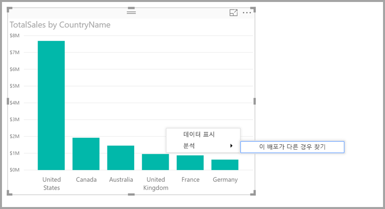
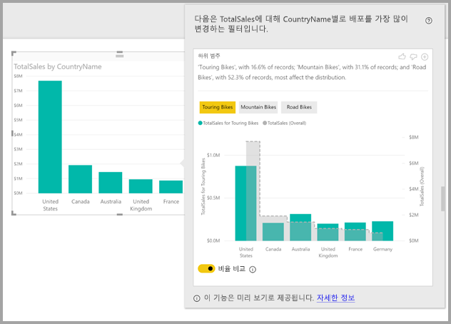

# Power BI Desktop에서 인사이트를 사용하여 분포가 다른 곳 찾기(미리 보기)

종종 시각적 개체에서, 데이터 요소를 보고 다른 범주에 대해 분포가 같을지 여부가 궁금합니다. **Power BI Desktop**에서 **인사이트**를 통해, 몇 번의 클릭으로 알아낼 수 있습니다.

*국가*별 *총 판매액*을 보여 주는 다음 시각적 개체를 고려해 보세요. 차트에서 볼 수 있듯이 모든 판매의 57%를 차지하면서 대부분의 판매가 미국에서 비롯되었으며, 다른 국가의 기여도는 적습니다. 이러한 경우에서 다른 하위 모집단에 대해서도 같은 분포를 볼 수 있는지 살펴 보는 것이 흥미로운 경우가 많습니다. 예를 들어 모든 연도, 모든 판매 채널, 제품의 모든 범주에 대해 동일한가요?  다른 필터를 적용하고 결과를 시각적으로 비교할 수 있지만, 이러한 작업은 시간 소모적이고 오류가 발생할 가능성이 높습니다. 

**Power BI Desktop**을 통해 분포가 다른 경우를 찾고 데이터에 대한 빠르고 자동화된 통찰력 있는 분석을 가져올 수 있습니다. 단순히 데이터 요소를 마우스 오른쪽 단추로 클릭하고 **분석 > 분포가 다른 경우 찾기**를 선택하면 인사이트가 사용하기 쉬운 창에 제공됩니다.

이 예에서 자동화된 분석은 *투어링 바이크*의 경우 미국 및 캐나다에서 판매 비율은 낮지만 다른 국가의 비율은 높다는 것을 신속하게 보여 줍니다.   

> [!NOTE]
> 이 기능은 미리 보기 상태이며 변경될 대상입니다. **Power BI Desktop**의 2017년 9월 버전부터 기본적으로 정보 기능을 사용할 수 있습니다(사용하기 위해 미리 보기 상자 확인란을 선택하지 않아도 됩니다).
> 
> 

## 정보 사용
인사이트를 사용하여 차트에 표시된 분포가 다른 경우를 파악하려면 데이터 요소를 마우스 오른쪽 단추로 클릭하고 **분석 > 분포가 다른 경우 찾기**를 선택합니다.

**Power BI Desktop**이 데이터에 대한 해당 머신 학습 알고리즘을 실행하고 가장 의미 있게 다른 분포를 보여 주는 범주(열)와 해당 열의 값을 설명하는 설명과 시각적 개체로 창을 채웁니다. 인사이트는 다음 이미지에 나와 있는 대로 세로 막대형 차트로 제공됩니다. 

선택한 필터가 적용된 값은 일반 기본색을 사용하여 표시됩니다. 원래 시작 시각적 개체에서 보이는 것처럼 전체 값은 간편하게 비교할 수 있도록 회색으로 표시됩니다. 최대 3개의 필터(이 예에서는 *투어링 바이크*, *산악용 바이크*, *로드 바이크*)를 포함할 수 있으며, 각 필터를 클릭하여(또는 여러 개 선택하려면 ctrl-클릭 사용) 다른 필터를 선택할 수 있습니다.

이 예에서 *총 판매액*과 같이 단순 가산 측정값의 경우 비교는 절대값이 아닌 상대값에 기반하여 이루어집니다. 따라서 투어링 바이크의 판매가 모든 범주의 전체 판매보다 확실히 낮지만, 기본적으로 시각적 개체는 이중축을 사용하여 다른 국가 전체에서 투어링 바이크와 모든 범주의 바이크에 대한 판매 비율 간에 비교할 수 있습니다.  시각적 개체 아래의 토글을 전환하면 두 값을 같은 축에 표시할 수 있어 절대 값을 쉽게 비교할 수 있습니다(다음 이미지 참조).    

또한 설명 텍스트에서는 필터와 일치하는 레코드 수에 기반하여 필터 값과 관련될 수 있는 중요성 수준을 나타내기도 합니다. 따라서 이 예에서는 *투어링 바이크*에 대한 분포가 의미 있게 다른 반면, 기록의 16.6%만을 차지한다는 것을 알 수 있습니다.

시각적 개체 및 기능에 대한 피드백을 제공할 수 있도록 페이지 맨 위에 있는 *좋아요* 및 *싫어요* 아이콘이 제공됩니다. 이를 통해 피드백을 제공하지만, 다음에 이 기능을 사용할 때 반환하는 결과에 영향을 미치도록 알고리즘을 학습하지는 않습니다.

무엇보다도 시각적 개체의 위쪽에 있는 **+** 단추를 통해 시각적 개체를 수동으로 만든 경우처럼 보고서에 선택한 시각적 개체를 추가할 수 있습니다. 다음 서식을 지정하거나 그렇지 않은 경우 보고서에서 다른 시각적 개체를 조정한 경우처럼 추가된 시각적 개체를 조정할 수 있습니다. **Power BI Desktop**에서 보고서를 편집하는 경우 선택한 정보 시각적 개체를 추가할 수 있습니다.

보고서가 읽는 또는 편집 모드인 경우 정보를 사용할 수 있습니다. 그러면 데이터를 분석하고 보고서에 쉽게 추가할 수는 시각적 개체 만드는 데 유연하게 사용할 수 있습니다.

## 반환된 결과의 세부 정보
알고리즘을 모듈에서 다른 열을 모두 가져와서 이러한 열의 모든 값의 경우 원래 시각적 개체에 대한 필터로 적용하며 원래 값과 가장 *다른* 결과를 생성하는 필터 값을 찾는 것으로 생각할 수 있습니다.

물론, *다른*이 무엇을 의미한지 궁금할 수 있습니다. 예를 들어 미국과 캐나다 간 전반적인 판매 분할이 다음과 같다고 하겠습니다.

|국가  |판매액(백만 달러)|
|---------|----------|
|미국      |15        |
|캐나다   |5         |

그런 다음, 특정 제품 범주(*“로드 바이크*)의 경우 판매 분할이 다음과 같을 수 있습니다.

|국가  |판매액(백만 달러)|
|---------|----------|
|미국      |3        |
|캐나다   |1         |

해당 각 테이블의 수치가 다르지만, 미국과 캐나다 간 상대값은 동일합니다(로드 바이크의 경우 전체적으로 75%와 25%). 이로 인해, 이 값은 다른 것으로 간주되지 않습니다. 따라서 이와 같이 단순한 가산적 측정값의 경우 알고리즘은 *상대*값에서 차이를 찾습니다.  

대조적으로, 비용 대비 수익으로 계산되는 이익과 같은 측정값을 고려해 보고 미국과 캐나다의 전체 이익이 다음과 같다고 하겠습니다.

|국가  |이익(%)|
|---------|----------|
|미국      |15        |
|캐나다   |5         |

그런 다음, 특정 제품 범주(*“로드 바이크*)의 경우 판매 분할이 다음과 같을 수 있습니다.

|국가  |이익(%)|
|---------|----------|
|미국      |3        |
|캐나다   |1         |

이러한 측정값의 특성을 고려할 때 의미 있게 다른 것으로 *간주됩니다*. 따라서 이 이익 예와 같은 비가산 측정값에 대해 알고리즘은 절대값에서 차이를 찾습니다.

따라서 표시된 시각적 개체는 전체 분포(원래 시각적 개체에 보이는 것처럼)와 특정 필터가 적용된 값 사이에 발견된 차이를 분명하게 보여주기 위한 것입니다.  

따라서 가산적 측정값의 경우 이전 예에서 *판매*와 같이 세로 막대형 차트와 꺾은선형 차트가 사용되며, 상대값을 쉽게 비교할 수 있도록 적절한 크기의 이중축을 사용합니다. 열은 필터가 적용된 값을 보여 주며 선은 전체 값을 보여 줍니다(일반적으로 열 축은 왼쪽, 선 축은 오른쪽). 선은 회색으로 채워진 점선이 있는 *계단식*으로 표시됩니다. 이전 예의 경우 열 축의 최댓값이 4이고 선 축의 최댓값이 20이라면 필터가 적용된 값과 전체 값에 대해 미국과 캐나다 간의 상대값을 쉽게 비교할 수 있습니다. 

마찬가지로, 이전 예에서 *이익*과 같은 비가산 측정값의 경우 세로 막대와 꺾은선형 차트가 사용되며, 절대값을 쉽게 비교할 수 있도록 단일축이 사용됩니다. 다시 선(회색으로 채워진)은 전체 값을 보여 줍니다. 실제 수치 또는 상대 수치를 비교하든지, 두 분포가 다른 정보에 대한 판별은 단순히 값의 차이를 계산하는 문제가 아닙니다. 예:

* 전체 모집단 중 작은 비율에 적용 시 차이가 통계적으로 덜 유의미하고 덜 흥미롭기 때문에 모집단의 크기가 요소로 고려됩니다. 예를 들어 국가 전체에서 판매 분포는 일부 특정 상품에 대해 매우 다를 수 있으며, 수천 개의 상품이 있고 해당 특정 제품이 전체 판매 중 작은 비율만 차지했다면 흥미로운 것으로 고려되지 않습니다.

* 원래 값이 매우 높거나 0에 아주 가까운 범주의 차이는 가중치가 다른 범주보다 더 높게 적용됩니다. 예를 들어 국가 전체가 판매의 1%만 기여하지만, 일부 특정 유형의 제품의 경우 6%를 기여할 경우 기여도가 50%에서 55%로 변경된 국가에서보다 더 통계적으로 유의미하고, 따라서 더 흥미로운 것으로 간주됩니다. 

* 데이터 간의 다른 관계를 고려하는 등, 더 의미 있는 결과를 선택하기 위해 다양한 추론 데이터가 사용됩니다.
     
다양한 열과 이러한 각 열의 값을 자세히 살펴본 후 가장 큰 차이를 보여 주는 값 집합이 선택됩니다. 그런 다음, 이해하기 쉽도록 이러한 값은 열별로 그룹화되어 산출되며, 열에는 차이가 가장 큰 값이 목록의 처음에 표시됩니다. 열당 최대 3개 값이 표시되지만, 영향이 큰 값이 3개 미만이거나, 일부 값이 나머지 값보다 훨씬 더 영향력이 있는 경우 3개 미만으로 표시될 수 있습니다. 

모델의 모든 열을 가능한 시간에 반드시 자세히 살펴볼 필요는 없으므로, 가장 영향력 있는 열과 값이 표시된다고 보장할 수는 없습니다. 그러나 가장 가능성 있는 열을 가장 먼저 자세히 살펴볼 수 있도록 다양한 추론이 적용됩니다. 예를 들어 모든 열을 자세히 살펴본 후에 다음 열/값이 가장 영향력이 높은 것에서 가장 낮은 것까지 분포에 가장 큰 영향을 미치는 것으로 확인되었다고 말할 수 있습니다.

    Subcategory = Touring Bikes
    Channel = Direct
    Subcategory = Mountain Bikes
    Subcategory = Road Bikes
    Subcategory = Kids Bikes
    Channel = Store

다음과 같은 열 순서로 산출될 수 있습니다.

    Subcategory: Touring Bikes, Mountain Bikes, Road Bikes (only three listed, with the text including “...amongst others” to indicate that more than three have a significant impact) 

    Channel = Direct (only Direct listed, if it’s level of impact was much greater than Store)

## 고려 사항 및 제한 사항
다음 목록은 **정보**에 현재 지원되지 않는 시나리오의 컬렉션입니다.

* TopN 필터
* 측정값 필터
* 숫자가 아닌 측정값
* “다음과 같이 값 표시” 사용
* 필터링된 측정값 - 필터링된 측정값은 특정 필터(예: *프랑스의 총 판매액*)가 적용된 시각적 개체 수준의 계산이며 인사이트 기능으로 만든 일부 시각적 개체에서 사용됩니다.

또한 다음 모델 유형 및 데이터 소스는 현재 정보에 지원되지 않습니다.

* DirectQuery
* 라이브 연결
* 온-프레미스 Reporting Services
* 포함

## 다음 단계
**Power BI Desktop**에 대한 자세한 내용 및 시작하는 방법은 다음 문서를 확인하세요.

* [Power BI Desktop이란?](desktop-what-is-desktop.md)
* [Power BI Desktop을 사용한 쿼리 개요](desktop-query-overview.md)
* [Power BI Desktop의 데이터 원본](desktop-data-sources.md)
* [Power BI Desktop에서 데이터에 연결](desktop-connect-to-data.md)
* [Power BI Desktop에서 데이터 셰이핑 및 결합](desktop-shape-and-combine-data.md)
* [Power BI Desktop의 일반적인 쿼리 작업](desktop-common-query-tasks.md)   

