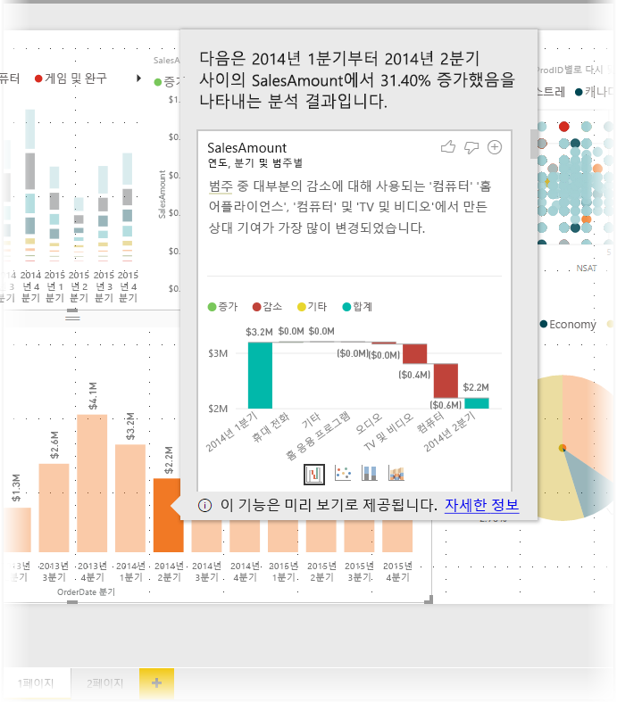
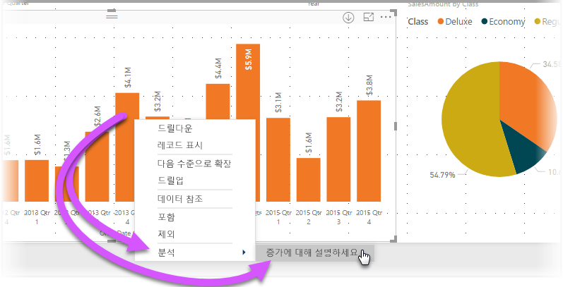
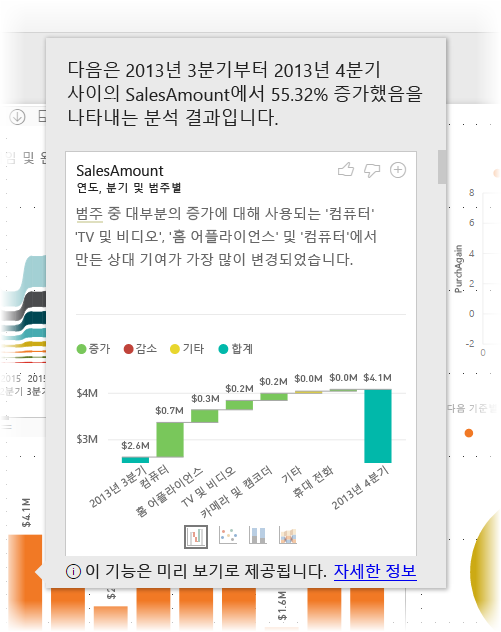
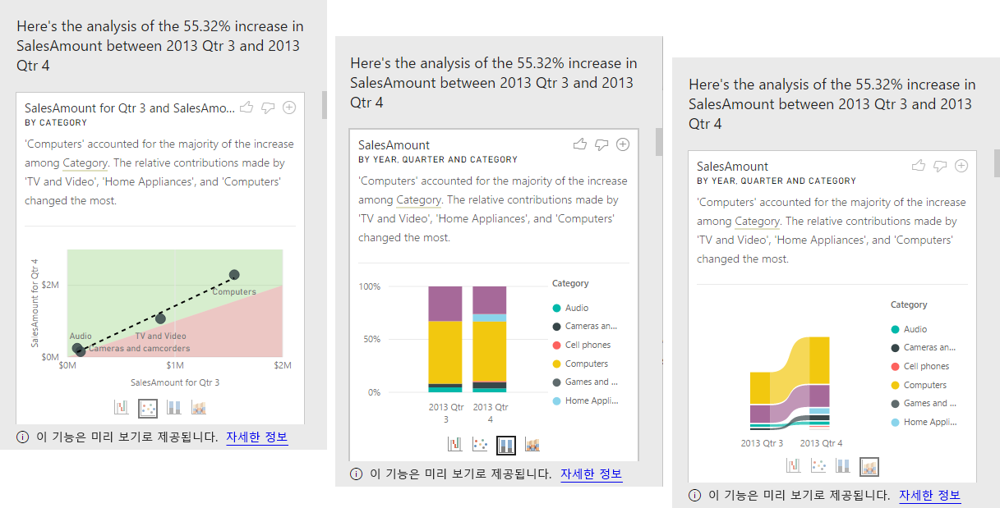

# Power BI Desktop에서 인사이트를 사용하여 시각적 개체에서 보이는 증가 및 감소 정보 설명(미리 보기)

종종 시각적 개체에서 값의 대폭 증가 후 대폭 하락을 보고 이러한 변동의 원인에 대해 궁금해 합니다. **Power BI Desktop**에서 **인사이트**를 통해, 몇 번의 클릭으로 원인을 알 수 있습니다.

예를 들어, *연도* 및 *국가*별 *판매액*을 보여 주는 다음과 같은 시각적 개체가 있습니다. 2014년에는 *1분기*와 *2분기* 사이에 판매가 급격하게 하락하면서 판매가 대폭 감소했습니다. 이러한 경우에는 데이터를 탐색하여 발생한 변경 사항에 대해 설명할 수 있습니다. 

**Power BI Desktop**을 통해 차트에서 증가 및 감소를 설명하고, 차트에서 배포 요소를 확인하고, 데이터에 대한 빠르고 자동화된 통찰력 있는 분석을 가져옵니다. 단순히 데이터 요소를 마우스 오른쪽 단추로 클릭하고 **분석 > 축소 설명**(또는 이전 표시줄이 낮은 경우 증가)를 선택하거나 **분석 > 이 배포가 다른 경우 찾기**를 선택하면 인사이트가 사용하기 쉬운 창에 제공됩니다.

정보 기능은 상황에 따라 다르고 이전 막대 또는 열과 같은 바로 이전의 데이터 요소에 기반합니다.

> [!NOTE]
> 이 기능은 미리 보기 상태이며 변경될 대상입니다. **Power BI Desktop**의 2017년 9월 버전부터 기본적으로 정보 기능을 사용할 수 있습니다(사용하기 위해 미리 보기 상자 확인란을 선택하지 않아도 됩니다).

## 정보 사용
인사이트를 사용하여 차트에 보이는 증가 또는 감소 정보를 설명하려면 가로 막대형 차트 또는 꺾은선형 차트에서 데이터 요소를 마우스 오른쪽 단추로 클릭하고 **분석 > 증가 설명**(또는 모든 정보가 이전 데이터 요소의 변경 내용을 기반으로 하므로 ‘감소 설명’)을 선택합니다.

그러면 **Power BI Desktop**이 데이터에 대한 해당 기계 학습 알고리즘을 실행하고 증가 또는 감소에 가장 영향을 주는 범주를 설명하는 시각적 개체 및 설명이 있는 창을 채웁니다. 기본적으로 정보는 다음 이미지에 나와 있는 대로 *폭포* 시각적 개체로 제공됩니다.

폭포 시각적 개체의 맨 아래에 있는 작은 아이콘을 선택하여 정보를 분산형 차트, 누적 세로 막대형 차트 또는 리본 차트로 표시하도록 선택할 수 있습니다.

시각적 개체 및 기능에 대한 피드백을 제공할 수 있도록 페이지 맨 위에 있는 *좋아요* 및 *싫어요* 아이콘이 제공됩니다. 이를 통해 피드백을 제공하지만, 다음에 이 기능을 사용할 때 반환하는 결과에 영향을 미치도록 알고리즘을 학습하지는 않습니다.

무엇보다도 시각적 개체의 위쪽에 있는 **+** 단추를 통해 시각적 개체를 수동으로 만든 경우처럼 보고서에 선택한 시각적 개체를 추가할 수 있습니다. 다음 서식을 지정하거나 그렇지 않은 경우 보고서에서 다른 시각적 개체를 조정한 경우처럼 추가된 시각적 개체를 조정할 수 있습니다. **Power BI Desktop**에서 보고서를 편집하는 경우 선택한 정보 시각적 개체를 추가할 수 있습니다.

보고서가 읽는 또는 편집 모드인 경우 정보를 사용할 수 있습니다. 그러면 데이터를 분석하고 보고서에 쉽게 추가할 수는 시각적 개체 만드는 데 유연하게 사용할 수 있습니다.

## 반환된 결과의 세부 정보

인사이트를 통해 반환된 세부 정보는 그간의 변화를 파악할 수 있도록 두 기간 사이의 차이점이 강조 표시됩니다.  

예를 들어 *3분기*에서 *4분기*까지 전체 *판매*가 55%가 증가했고 이 증가폭이 모든 제품 *범주*(컴퓨터, 오디오 등의 판매가 55% 증가), 모든 국가, 그리고 모든 유형의 고객에 동일하다면 데이터에서 이러한 변화를 설명하기 위해 데이터에서 식별할 수 있는 것은 거의 없습니다. 그러나 이러한 상황은 일반적인 경우가 아니며, 대체로 이 기간의 변화에서 차이를 찾아낼 수 있습니다. 범주 중에 *컴퓨터*와 *가전*이 63% 더 크게 성장한 반면, *TV와 오디오*의 판매는 23%에 불과하므로 *컴퓨터*와 *가전*이 *3분기*보다 *4분기*에 총 판매액의 큰 부분에 기여했습니다.  이 예에서 볼 때, *특히 컴퓨터와 TV 및 오디오의 판매 강세*가 판매 증가에 대한 합리적인 설명이 될 수 있습니다. 

따라서 알고리즘은 단순히 변화의 가장 큰 부분을 차지하는 값을 반환하는 것이 아닙니다. 예를 들어 판매의 압도적인 부분(98%)이 미국에서 발생한 것이라면 일반적으로 증가량에 있어서도 미국에서 압도적으로 발생했을 것입니다. 하지만 미국 또는 기타 국가에서 총 판매액에 대한 상대적인 기여에 의미 있는 변화가 있지 않았다면 *국가*는 이 맥락에서 흥미로운 요소로 고려되지 않습니다.  

단순하게 말하면, 알고리즘은 이 모델의 다른 모든 열을 가져와 기간 *전*과 *후*에 대해 해당 열별로 분석 결과를 계산하며 해당 분석 결과에서 발생한 변화의 정도를 확인한 다음, 가장 큰 변화가 있는 열을 반환하는 것으로 생각할 수 있습니다. 예를 들어 위 예에서는 *TV와 비디오*의 판매 기여도가 33%에서 26%로 7% 하락한 반면, *가전*의 판매 기여도는 0%에서 6% 이상 증가했으므로 *범주*가 선택되었습니다. 

반환된 각 열에 대해 표시할 수 있는 네 가지 시각적 개체가 있습니다. 이러한 시각적 개체 중 3개가 두 기간 간 기여도의 변화를 강조 표시하기 위한 것입니다. 예를 들어 *2분기*에서 *3분기*의 증가를 설명하기 위한 것입니다.

### 산점도

산점도 시각적 개체는 해당 열의 각 값(이 예에서는 *범주*)에 대한 두 번째 기간(y 축)의 측정값 대비 첫 번째 기간(x 축)의 측정값을 보여 줍니다. 따라서 다음 이미지에 표시된 대로, 데이터 요소는 값이 증가한 경우 녹색 영역으로, 감소한 경우 빨강 영역에 위치합니다. 

점선은 최적을 보여 주며 이 선 위의 데이터 요소는 전반적인 추세 이상으로 증가한 것을, 이 선 아래의 데이터 요소는 추세 미만으로 증가한 것을 나타냅니다.  

이 기간 중 값이 비어 있는 데이터 항목은 산점도에 나타나지 않습니다(예: 이 경우에는 *가전*).

### 100% 누적 세로 막대형 차트

100% 누적 세로 막대형 차트 시각적 개체는 100% 누적 세로 막대로 표시한 것처럼 선택한 열별로 측정 전과 후의 값을 보여 줍니다. 따라서 기간 전과 후의 기여도를 나란히 비교할 수 있습니다. 도구 설명은 선택한 값에 대한 실제 기여도를 보여 줍니다.

### 리본 차트

리본 차트 시각적 요소는 측정 전과 후의 값도 보여 줍니다. 특히 기여 요소의 *순서*가 변경된 경우 기여도에서 변화를 보여 주는 데 유용합니다(예: *컴퓨터*의 기여 순위가 이전에는 1위였지만, 3위로 떨어짐). 

### 폭포 차트

네 번째 시각적 개체는 기간 사이의 주요 실제 증가 또는 감소 정보를 보여 주는 폭포 차트입니다. 이 시각적 개체는 실제 변화를 분명하게 보여 주지만, 단독으로는, 해당 열이 흥미로운 요소로 선택된 이유를 실제로 강조 표시해 주는 기여 수준에 대한 변화를 나타내지는 않습니다. 

상대적 기여에 가장 큰 차이를 보이는 열의 순위 지정 시 다음 사항이 고려됩니다. 

* 열에 큰 카디널리티가 있는 경우 차이가 통계적으로 덜 유의미하고 관심도가 떨어지므로 카디널리티가 요소로 고려됩니다. 

* 원래 값이 매우 높거나 0에 아주 가까운 범주의 차이는 가중치가 다른 범주보다 더 높게 적용됩니다. 예를 들어 범주가 판매의 1%만 기여했고 이 범주가 6%로 증가한 경우 기여도가 50%에서 55%로 변화한 범주보다 통계적으로 유의미하고 따라서 더 흥미로운 요소로 간주됩니다. 

* 데이터 간의 다른 관계를 고려하는 등, 더 의미 있는 결과를 선택하기 위해 다양한 추론 데이터가 사용됩니다.
 
다른 열을 자세히 살펴본 후 상대적 기여에 가장 큰 변화를 보여 주는 열이 선택되어 산출됩니다. 각 열에 대해 기여에 가장 의미 있는 변화가 있는 값이 설명에 나타나며, 또한 실제 증가 및 감소가 가장 큰 값도 제시됩니다.

## 고려 사항 및 제한 사항
이러한 인사이트는 이전 데이터 요소에서의 변경 내용을 기반으로 하므로 시각적 개체에서 첫 번째 데이터 요소를 선택하는 경우에는 사용할 수 없습니다. 

다음 목록은 **증가/감소 설명**에 대한 현재 지원되지 않는 시나리오의 컬렉션입니다.

* TopN 필터
* 포함/제외 필터
* 측정값 필터
* 숫자가 아닌 측정값
* “다음과 같이 값 표시” 사용
* 필터링된 측정값 - 필터링된 측정값은 특정 필터(예: *프랑스의 총 판매액*)가 적용된 시각적 개체 수준의 계산이며 인사이트 기능으로 만든 일부 hte 시각적 개체에서 사용됩니다.
* 스칼라인 열 기준 정렬을 정의하지 않으면 X-축의 범주 열입니다. 계층 구조를 사용하는 경우 활성 계층 구조의 모든 열은 이 조건에 맞아야 합니다.

또한 다음 모델 유형 및 데이터 소스는 현재 정보에 지원되지 않습니다.

* DirectQuery
* 라이브 연결
* 온-프레미스 Reporting Services
* 포함

## 다음 단계
**Power BI Desktop**에 대한 자세한 내용 및 시작하는 방법은 다음 문서를 확인하세요.

* [Power BI Desktop이란?](desktop-what-is-desktop.md)
* [Power BI Desktop을 사용한 쿼리 개요](desktop-query-overview.md)
* [Power BI Desktop의 데이터 원본](desktop-data-sources.md)
* [Power BI Desktop에서 데이터에 연결](desktop-connect-to-data.md)
* [Power BI Desktop에서 데이터 셰이핑 및 결합](desktop-shape-and-combine-data.md)
* [Power BI Desktop의 일반적인 쿼리 작업](desktop-common-query-tasks.md)   

