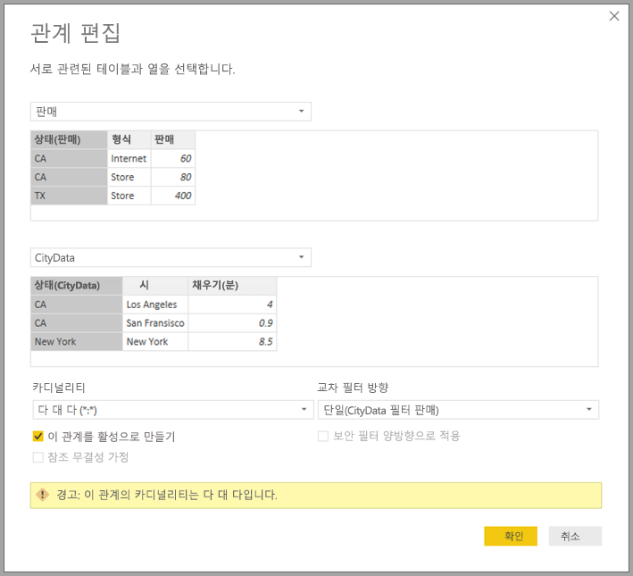
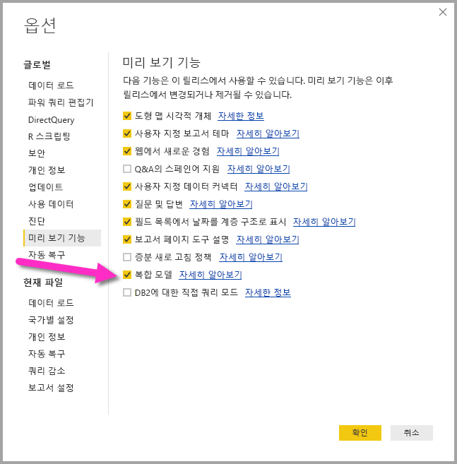

# Power BI Desktop의 다 대 다 관계(미리 보기)

**Power BI Desktop**의 **다 대 다 관계** 기능을 사용하면 **다 대 다**의 카디널리티를 사용하여 테이블을 조인하고 여러 데이터 원본을 포함하는 데이터 모델을 더 쉽고 직관적으로 만들 수 있습니다. **다 대 다 관계** 기능은 **Power BI Desktop**의 더 큰 **복합 모델** 기능에 포함됩니다.

**Power BI Desktop**의 **다 대 다 관계** 기능은 다음 세 가지 관련 기능 모음에 포함됩니다.

* **복합 모델** - 보고서에 DirectQuery 연결 또는 가져오기를 비롯한 여러 데이터 연결을 다양한 조합으로 포함할 수 있습니다.
* **다 대 다 관계** - **복합 모델**을 사용하면 테이블 간에 **다 대 다 관계**를 설정할 수 있어 테이블의 고유한 값에 대한 요구 사항이 제거되고 관계 설정만을 위한 새 테이블 도입과 같은 이전 해결 방법을 사용할 필요가 없습니다. 
* **저장소 모드** - 이제 백 엔드 데이터 원본에 대한 쿼리가 필요한 시각적 개체를 지정할 수 있고, 쿼리가 필요하지 않은 시각적 개체는 DirectQuery를 기반으로 하는 경우에도 가져오게 되어 성능을 향상하고 백 엔드 로그를 줄일 수 있습니다. 이전에는 슬라이서와 같은 간단한 시각적 개체도 백 엔드 원본으로 전송되는 쿼리를 시작했습니다. 

**복합 모델**에 대한 세 가지 관련 기능 모음은 다음 별도의 문서에서 설명합니다.

* **복합 모델**은 [Power BI Desktop(미리 보기)의 복합 모델](desktop-composite-models.md) 문서에서 자세히 설명합니다.
* **다 대 다 관계**는 이 문서에서 설명합니다.
* **저장소 모드**는 자체 문서인 [Power BI Desktop의 저장소 모드(미리 보기)](desktop-storage-mode.md)에서 설명합니다.

## 다 대 다 관계 미리 보기 기능 사용

**다 대 다 관계** 기능은 **복합 모델** 기능에 포함되고 미리 보기로 제공되며 **Power BI Desktop**에서 사용할 수 있어야 합니다. **복합 모델**을 사용하려면 **파일 > 옵션 및 설정 > 옵션 > 미리 보기 기능**을 선택한 후 **복합 모델** 확인란을 선택합니다.

기능을 사용하려면 **Power BI Desktop**을 다시 시작해야 합니다.

## 다 대 다 관계로 해결하는 문제

**다 대 다 관계**가 제공되기 전에는 Power BI에서 두 테이블 간 관계를 정의할 때 관계에 포함된 열 중 하나 이상에 고유한 값이 포함되어야 했습니다. 대부분의 경우 테이블에는 고유한 값을 포함하는 열이 없었습니다. 

예를 들어 두 개의 테이블에 *Country*를 포함하는 열이 있을 수 있지만, *Country* 값이 테이블에서 고유하지 않았습니다. 이러한 테이블 간에 조인하려면 필요한 고유한 값이 포함된 추가 테이블을 모델에 도입하는 것과 같은 해결 방법을 만들어야 했습니다. **다 대 다 관계** 기능은 대체 접근 방식을 제공하므로 **다 대 다**의 카디널리티와 함께 관계를 사용하여 해당 테이블을 직접 조인할 수 있습니다.  

## 다 대 다 관계 사용

Power BI에서 두 테이블 간 관계를 정의할 때 관계의 카디널리티를 정의해야 합니다. 예를 들어 *ProductSales*와 *Product* 간 관계(*ProductSales[ProductCode]* 및 *Product[ProductCode]* 열 사용)는 **다 대 일**로 정의되므로 각 제품에 대한 많은 판매가 있고 *Product* 테이블의 열 *(ProductCode)* 은 고유합니다. **다 대 일**, **일 대 다** 또는 **일 대 일**로 관계 카디널리티를 정의할 경우 Power BI는 유효성 검사를 수행하여 선택한 카디널리티가 실제 데이터와 일치하는지 확인합니다.

예를 들어 다음 이미지에서 간단한 모델을 살펴보겠습니다.

그런 다음, *Product* 테이블에 행이 두 개만 있다고 가정합니다.

또한 참조 무결성 오류로 인해 *Product* 테이블에 없는 **C** 제품에 대한 ‘판매액’을 포함하는 4개의 행이 *Sales* 테이블에 있다고 가정합니다.

*ProductName* 및 *Price*(*Product* 테이블에 포함됨)를 표시한 시각적 개체는 각 제품의 총 *Qty*(*ProductSales* 테이블에 포함됨)와 함께 다음 이미지와 같이 표시됩니다. 

이전 이미지에서 볼 수 있듯이 제품 *C*의 판매와 연결된 빈 *ProductName*이 포함된 행이 시각적 개체에 있습니다. 이 빈 행은 다음에 해당합니다.

* *Product* 테이블에 일치하는 행이 없는 *ProductSales* 테이블의 모든 행에는 이 예제에서 제품 *C*의 경우처럼 참조 무결성 문제가 있습니다.

* 외래 키 열이 Null인 *ProductSales* 테이블의 모든 행. 

이러한 이유로 인해 두 경우에 모두 빈 행은 *ProductName* 및 *Price*를 알 수 없는 판매에 해당합니다.

그러나 테이블이 두 개의 열에 의해 조인되지만 두 열이 모두 고유하지 않은 경우가 있습니다. 예를 들어 다음 두 테이블을 살펴봅니다.

* *Sales* 테이블에는 ‘주’별 판매 데이터가 포함되고 각 행에는 해당 주(CA, WA 및 TX 주 포함)의 판매 유형에 대한 판매 금액이 포함됨 

    

* *CityData* 테이블에는 인구 및 주(CA, WA 주 및 New York 포함)를 비롯한 도시 관련 데이터가 포함됨

    

두 테이블에 모두 ‘주’에 대한 열이 있고 ‘주’별 총 ‘판매액’을 각 주의 총 인구와 함께 보고하려는 것이 적절하지만, *State* 열이 한쪽 테이블에서 고유하지 않다는 문제가 있습니다. 

## 이전 해결 방법

2018년 7월 릴리스 이전의 **Power BI Desktop** 버전에서는 이러한 테이블 간에 직접 관계를 만들 수 없었습니다. 이 문제에 대한 일반적인 해결 방법은 다음을 수행하는 것이었습니다.

* 고유한 ‘주’ ID만 포함하는 세 번째 테이블을 만듭니다. 이는 DAX를 사용하여 정의된 계산된 테이블이거나, 테이블 중 하나 또는 통합된 전체 집합에서 가져온 고유 ID가 들어 있을 수 있는 **쿼리 편집기**에 정의된 쿼리를 사용하여 정의된 테이블일 수 있습니다.

* 일반 *’다 대 일’ 관계를 사용하여 두 개의 원본 테이블을 새 테이블과 연결합니다.

해당 해결 방법 테이블이 표시되거나 필드 목록에 나타나지 않도록 숨겨질 수 있었습니다. 후자의 경우 **다 대 일** 관계는 일반적으로 다른 테이블에 대한 후속 교차 필터링 전파와 함께 한쪽 테이블의 *State* 필드를 사용할 수 있도록 양쪽 방향으로 필터링하도록 설정됩니다. 이 해결 방법은 **관계 보기**의 다음 이미지에 표시됩니다.

*State*(*CityData* 테이블에 포함됨)를 총 ‘인구’ 및 총 ‘판매액’과 함께 표시하는 시각적 개체는 다음과 같습니다.

이 해결 방법에서 *CityData* 테이블의 주를 사용하면 해당 테이블에 있는 해당 ‘주’만 나열됩니다(따라서 TX가 제외됨). 또한 **다 대 일** 관계의 경우와 달리 합계 행에는 모든 ‘판매액’(TX 수 포함)이 포함되지만, 세부 정보에는 일치하지 않는 행을 포함하는 빈 행이 포함되지 않습니다. 마찬가지로 *State* 값이 Null인 ‘판매액’을 포함하는 빈 행이 없습니다.

시각적 개체에 *City*가 추가된 경우 ‘도시’별 인구는 알 수 있지만 ‘도시’에 표시된 ‘판매액’은 다음 이미지와 같이 해당하는 ‘주’의 ‘판매량’을 단순히 반복합니다(일부 집계 측정값에 관련되지 않은 열을 그룹화하는 경우와 같음).

새 테이블 *Sales*가 이 해결 방법이 모든 ‘주’의 통합이 되도록 정의되고 필드 목록에 표시된 경우 총 ‘인구’ 및 총 ‘판매액’과 함께 ‘주’(새 테이블에 있음)를 표시하는 동일한 시각적 개체는 다음과 같습니다.

이 경우 시각적 개체에 표시된 *TX*(‘판매액’이 있지만 인구를 알 수 없음) 및 *New York*(인구를 알 수 있지만 ‘판매액’이 없음)이 포함됩니다. 

그림과 같이 이 해결 방법은 최적의 방법이 아니었고 많은 문제가 있습니다. **다 대 다 관계**를 만들면 다음 섹션에 설명된 대로 이러한 문제가 해결됩니다.

## 해결 방법 대신 다 대 다 관계 사용

2018년 7월부터 **Power BI Desktop** 버전에서는 해당 해결 방법을 사용할 필요 없이 이전 섹션에서 설명한 대로 해당 테이블을 직접 연결할 수 있습니다. 이제 관계 카디널리티를 **다 대 다**로 설정할 수 있고, 이는 모든 테이블에 고유한 값이 포함되지 않음을 나타냅니다. 이 관계의 경우 다른 테이블을 필터링하는 기준 테이블을 제어하거나 두 테이블이 서로를 필터링하는 양방향 필터링을 포함할 수 있습니다.  

> [!NOTE]
> **다 대 다** 관계를 만드는 기능은 미리 보기로 제공되고 미리 보기 상태에서는 **다 대 다** 관계를 사용하여 모델을 Power BI 서비스에 게시할 수 없습니다. 

**Power BI Desktop**에서는 관계에서 열의 고유한 값이 모든 테이블에 포함되지 않는 것으로 확인될 경우 카디널리티가 기본적으로 **다 대 다**로 설정됩니다. 이 경우 관계 설정이 데이터 문제의 의도하지 않은 결과가 아니라 의도한 동작인지 확인하는 경고가 표시됩니다. 

예를 들어 *CityData*와 *Sales* 간에 직접 관계를 만드는 경우 필터는 *CityData*에서 *Sales*로 이동해야 하며, 관계 대화 상자는 다음 이미지와 같이 표시됩니다.

결과 **관계 보기**에는 두 테이블 간의 직접 **다 대 다** 관계가 포함됩니다. **필드** 목록 및 시각적 개체가 만들어질 때 후속 동작의 모양은 이전 섹션에서 설명한 해결 방법을 적용하는 것과 동일하고, 이 경우 추가 테이블(포함된 개별 *States* 있음)이 표시되지 않습니다. 예를 들어 해결 방법을 설명하는 이전 섹션과 같이 총 인구 및 총 판매액과 함께 *States*를 표시하는 시각적 개체는 다음과 같습니다.

따라서 **다 대 다** 관계와 더 일반적인 **다 대 일** 관계의 주요 차이점은 다음과 같습니다.

* 표시된 값에는 다른 테이블의 일치하지 않는 행에 해당하는 빈 행이 포함되지 않고 다른 테이블의 관계에 사용된 열이 Null인 행에 해당하는 빈 행도 포함되지 않습니다.
* *RELATED()* 함수를 사용할 수 없습니다(둘 이상의 행이 관련될 수 있으므로).
* 테이블에서 *ALL()* 함수를 사용해도 **다 대 다** 관계에 의해 관련된 다른 테이블에 적용된 필터가 제거되지 않습니다. 예를 들어 이전 예에서 다음과 같이 정의된 측정값은 관련 *CityData* 테이블의 열에 대한 필터를 제거하지 않습니다.

    

    따라서 ‘주’, ‘판매액’ 및 ‘판매액 합계’를 표시하는 시각적 개체는 다음과 같습니다.

    

이로 인해 *ALL(\<Table>)* 을 사용한 계산(예: ’총계의 %’)이 의도한 결과를 반환하게 하려면 주의해야 합니다. 

## 제한 사항 및 고려 사항

**다 대 다 관계** 및 **복합 모델**의 이 릴리스에 대한 몇 가지 제한 사항이 있습니다.

다음 다차원 원본은 **복합 모델**과 함께 사용할 수 없습니다.

* SAP HANA
* SAP Business Warehouse
* SQL Server Analysis Services
* Power BI 데이터 집합

DirectQuery를 사용하여 이러한 다차원 원본에 연결할 경우 다른 DirectQuery 원본에 연결할 수 없고 가져온 데이터와 결합할 수도 없습니다.

**다 대 다 관계**를 사용할 경우에도 DirectQuery 사용에 대한 기존 제한 사항이 계속 적용됩니다. 이러한 제한 사항 중 대부분은 테이블의 **저장소 모드**에 따라 테이블별로 적용됩니다. 예를 들어 가져온 테이블의 계산 열은 다른 테이블을 참조할 수 있지만, DirectQuery 테이블에서 계산 열은 동일한 테이블의 열만 참조하도록 제한됩니다. 다른 제한 사항은 모델 내의 테이블이 DirectQuery인 경우 모델에 전체적으로 적용됩니다. 예를 들어 **QuickInsights** 및 **Q&A** 기능은 모델 내의 테이블에 DirectQuery의 **저장소 모드**가 있는 경우 해당 모델에서 사용할 수 없습니다. 

## 다음 단계

다음 문서에서는 복합 모델을 자세히 설명하고 DirectQuery도 자세히 설명합니다.

* [Power BI Desktop의 복합 모델(미리 보기)](desktop-composite-models.md)
* [Power BI Desktop의 저장소 모드(미리 보기)](desktop-storage-mode.md)

DirectQuery 문서:

* [Power BI의 DirectQuery 사용](desktop-directquery-about.md)
* [Power BI의 DirectQuery에서 지원하는 데이터 원본](desktop-directquery-data-sources.md)

