# Power BI Desktop에서 행렬 시각적 개체 사용
**행렬** 시각적 개체 기능(때로는 ‘테이블’이라고도 함)을 사용하여 **Power BI Desktop** 보고서에서 행렬 시각적 개체를 만들고 기타 시각적 개체를 사용하여 행렬 내에서 크로스 강조 표시 요소를 만들 수 있습니다. 또한 행, 열 및 개별 셀과 상호 강조 표시를 선택할 수 있습니다. 마지막으로 레이아웃 공간을 효율적으로 사용할 수 있도록 행렬 시각적 개체는 단계별 레이아웃을 지원합니다.

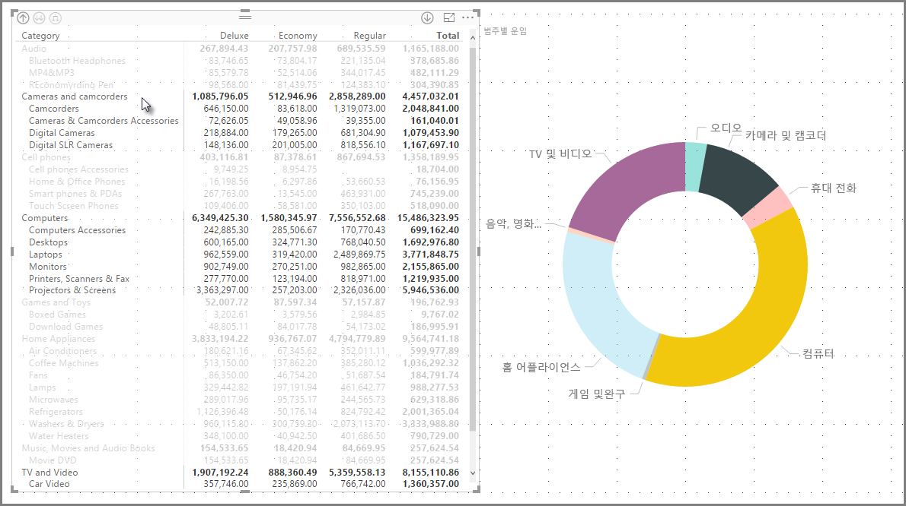

행렬과 관련된 여러 가지 기능을 이 문서의 다음 섹션에서 살펴보겠습니다.

> [!NOTE]
> **Power BI Desktop**의 2017년 7월 릴리스부터 행렬 및 테이블 시각적 개체는 적용된 **보고서 테마**의 스타일(색 포함)을 반영합니다. 이러한 색은 행렬 시각적 개체에 기대하는 색이 아닐 수 있지만, **보고서 테마** 구성에서 변경할 수 있습니다. 테마에 대한 자세한 내용은 [**Power BI Desktop에서 보고서 테마 사용**](desktop-report-themes.md)을 참조하세요.
> 
> 

## Power BI에서 총계를 계산하는 방법 이해

**행렬** 시각적 개체 사용 방법으로 진행하기 전에 Power BI에서 테이블과 행렬의 총계 및 소계 값을 계산하는 방법을 이해해야 합니다. 총계 및 소계 행의 경우, 측정값은 기본 데이터의 모든 행에서 계산됩니다. 표시되는 행의 값을 단순히 더하는 것이 ‘아닙니다’. 즉, 예상보다 총계 행에 여러 값이 있을 수 있습니다. 

다음 **행렬** 시각적 개체를 살펴보세요. 

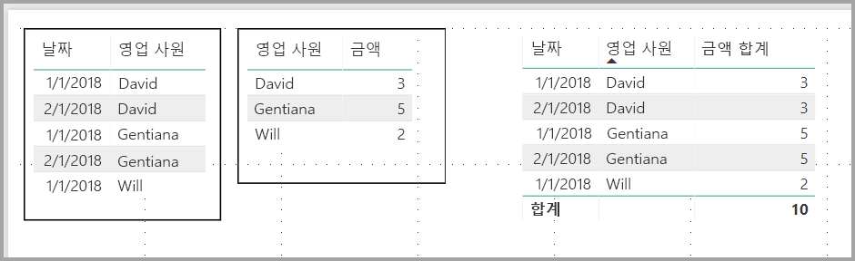

이 예에서 오른쪽 맨 끝의 **행렬** 시각적 개체의 각 행에서 각 영업 직원/날짜 조합에 대한 ‘금액’을 보여줍니다. 그러나 영업 직원은 여러 날짜에 대해 표시되기 때문에 숫자는 두 번 이상 나타날 수 있습니다. 그러므로 기본 데이터의 정확한 총계와 표시되는 값의 단순한 더하기는 같지 않습니다. 더하는 값이 일대다 관계의 ‘일’ 쪽인 경우 일반적인 패턴입니다.

총계와 소계를 검토할 때, 이러한 값은 표시되는 값이 아니라 기본 데이터를 기준으로 함을 기억하세요. 

## 행렬 시각적 개체로 드릴다운 사용
**행렬** 시각적 개체를 사용하면 이전에는 사용할 수 없었던 모든 종류의 흥미로운 드릴다운 작업을 수행할 수 있습니다. 행, 열을 사용하여 개별 섹션 및 셀에도 드릴다운하는 기능이 포함됩니다. 각 기능의 작동 방법을 살펴보겠습니다.

### 행 헤더의 드릴다운
**시각화** 창에 있는 **필드**의 **행** 섹션에 여러 필드를 추가하는 경우 행렬 시각적 개체의 행에서 드릴다운을 사용하도록 설정합니다. 계층 구조를 만드는 작업과 비슷합니다. 그러면 해당 계층을 통해 드릴다운(및 백업)하고 각 수준에서 데이터를 분석할 수 있습니다.

다음 이미지에서 **행** 섹션은 *범주* 및 *하위 범주* 를 포함하여 파악할 수 있는 행에서 그룹(또는 계층 구조)를 만듭니다.

시각적 개체에 **행** 섹션에서 만든 그룹이 있는 경우 시각적 개체 자체는 시각적 개체의 왼쪽 위 모퉁이에 있는 *드릴* 및 *확장* 아이콘을 표시합니다.

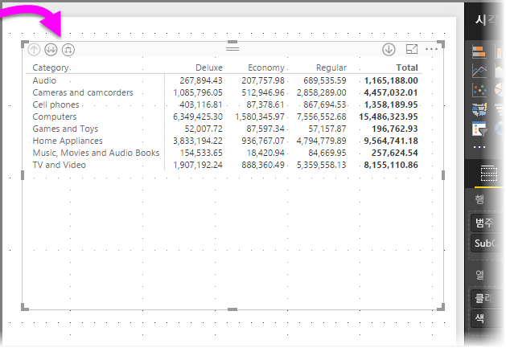

다른 시각적 개체의 드릴 및 확장 작업과 비슷하게 해당 단추를 선택하면 계층 구조를 통해 드릴다운(또는 백업)할 수 있습니다. 이 경우에 드릴다운 수준 아이콘(쇠스랑)이 선택된 다음 이미지와 같이 *Category*에서 *SubCategory*로 드릴다운할 수 있습니다.

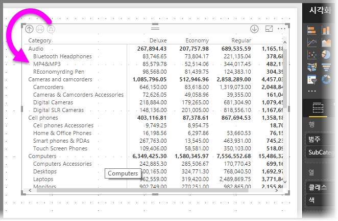

해당 아이콘을 사용하는 것 외에도 해당 행 머리글을 마우스 오른쪽 단추로 클릭하고 나타나는 메뉴에서 선택하여 드릴다운할 수 있습니다.

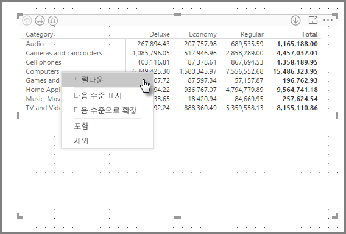

나타나는 메뉴에 몇 가지 옵션이 있고 서로 다른 결과가 생성됩니다.

**드릴다운**을 선택하면 *해당* 행 수준의 행렬을 확장합니다. 마우스 오른쪽 단추로 클릭한 행 헤더를 제외하고 다른 모든 행 헤더를 *제외* 합니다. 다음 이미지에서 *컴퓨터* 를 마우스 오른쪽 단추로 클릭하고 **드릴다운**을 선택합니다. 기타 최상위 행이 행렬에 더 이상 표시되지 않는지 확인합니다. 이 기능은 유용하고 **상호 강조 표시** 섹션에서 특히 유용합니다.

**드릴업** 아이콘을 클릭하여 이전 최상위 보기로 돌아갈 수 있습니다. 마우스 오른쪽 단추 클릭 메뉴에서 **다음 수준 표시**를 선택하는 경우 더 높은 수준의 계층 구조 분류 없이 모든 다음 수준 항목을 사전순으로 나열합니다(이 경우에 ‘SubCategory’ 필드).

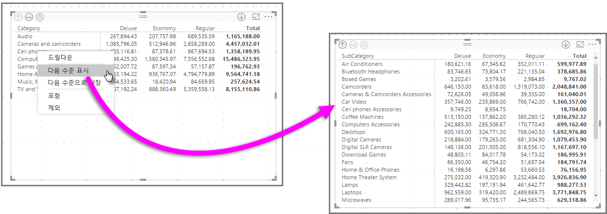

왼쪽 위에서 **드릴업** 아이콘을 클릭하여 행렬에서 모든 최상위 범주를 표시한 경우 **다음 수준으로 확장**을 마우스 오른쪽 단추로 클릭하고 선택하면 다음이 표시됩니다.

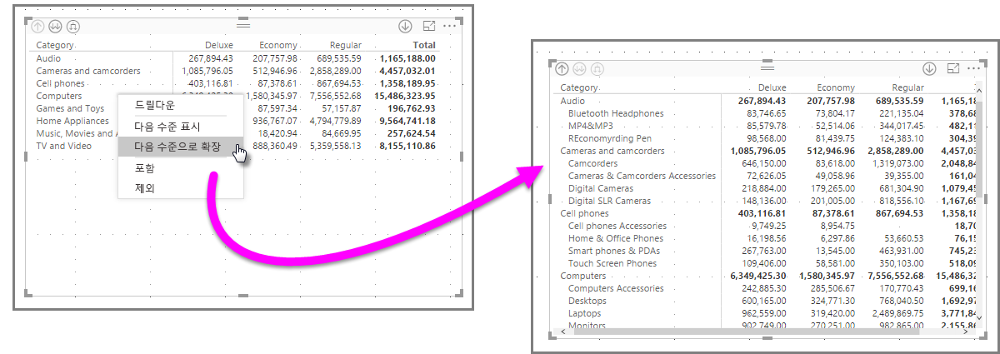

**포함** 및 **제외** 메뉴 항목을 사용하여 행렬에서 마우스 오른쪽 단추로 클릭한 행 및 모든 하위 범주를 유지하거나 각각 제거할 수도 있습니다.

### 열 헤더에 드릴다운
행을 드릴다운하는 유사한 기능을 사용하여 **열**을 드릴다운할 수도 있습니다. 다음 이미지에서 이 문서의 앞부분에서 행에 사용한 것과 비슷한 계층 구조를 만들고 **열** 필드에 두 개의 필드가 있다는 것을 확인할 수 있습니다. **열** 필드에는 *클래스* 및 *색* 이 있습니다.

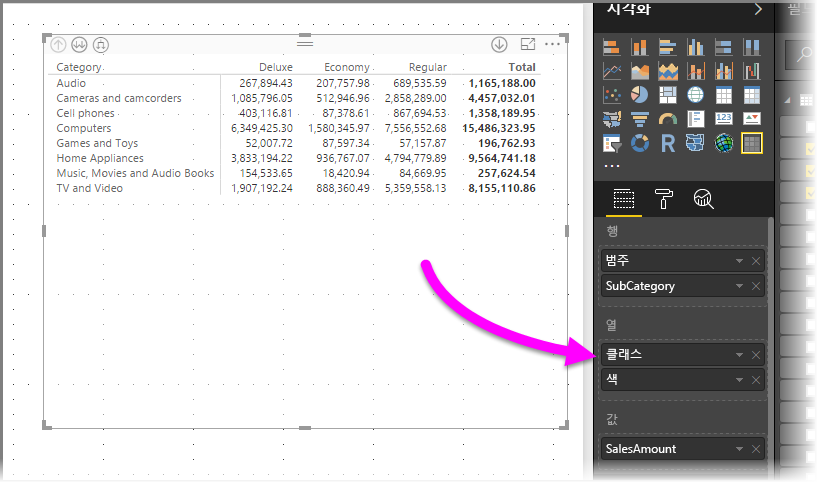

**행렬** 시각적 개체에서 열을 마우스 오른쪽 단추로 클릭하면 드릴다운 옵션이 표시됩니다. 다음 이미지에서에서는 *Deluxe* 를 마우스 오른쪽 단추로 클릭하고 **드릴다운**을 선택합니다.

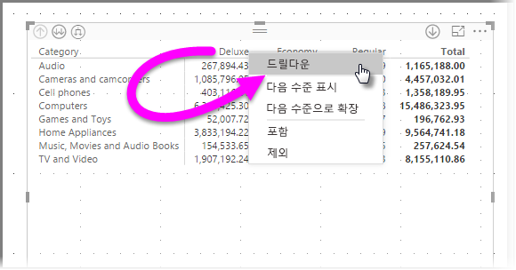

**드릴다운** 을 선택하면 *Deluxe*에 대한 열 계층 구조의 다음 수준이 표시되고 이 경우에는 ‘색’입니다.

마우스 오른쪽 단추 클릭 메뉴 항목의 나머지는 열에서 동일한 방식으로 작동합니다(이전 섹션인 **행 헤더의 드릴다운** 참조). 행에서 수행한 대로 열에서 **다음 수준 표시**, **다음 수준으로 확장** 및 **포함**이나 **제외**를 수행할 수 있습니다.

> [!NOTE]
> 행렬 시각적 개체의 왼쪽 위에 있는 드릴다운 및 드릴업 아이콘은 행에만 적용됩니다. 열에 드릴다운하기 위해 오른쪽 클릭 메뉴를 사용해야 합니다.
> 
> 

## 매트릭스 시각적 개체를 사용한 단계별 레이아웃
**행렬** 시각적 개체는 **단계별 레이아웃**이라고 하는 각 부모 아래의 계층 구조에 하위 범주를 자동으로 들여씁니다.

행렬 시각적 개체의 ‘원래’ 버전에서 하위 범주는 완전히 다른 열에 표시되고 시각적 개체에서 훨씬 더 많은 공간을 사용합니다. 다음 이미지에서는 원래 **행렬** 시각적 개체에서 테이블을 표시합니다. 완전히 별도의 열에서 하위 범주를 확인합니다.

다음 이미지에서는 **단계별 레이아웃**이 작동 중인 **행렬** 시각적 개체가 표시되어 있습니다. 범주 *컴퓨터* 에서는 하위 범주(컴퓨터 악세사리, 데스크톱, 랩톱, 모니터 등)를 약간 들여쓰고 더 간결한 시각적 개체를 제공합니다.

단계별 레이아웃 설정을 쉽게 수정할 수 있습니다. **행렬** 시각적 개체를 선택하면 **시각화** 창의 **형식** 섹션(페인트 롤러 아이콘)에서 **행 헤더** 섹션이 펼쳐집니다. **단계별 레이아웃** 토글(켜기 또는 끄기) 및 **단계별 레이아웃 들여쓰기**(들여쓰기 크기를 픽셀 단위로 지정)라는 두 가지 옵션이 있습니다.

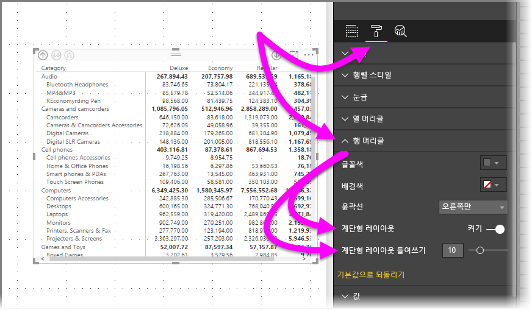

**단계별 레이아웃**을 사용하지 않는 경우 하위 범주는 상위 범주 아래에서 들여쓰기하지 않고 다른 열에 표시됩니다.

## 행렬 시각적 개체에서 부분합
행과 열 모두의 경우 행렬 시각적 개체에서 부분합을 켜거나 끌 수 있습니다. 다음 이미지에서 행 부분합이 **켜기**로 설정된 것을 확인할 수 있습니다.

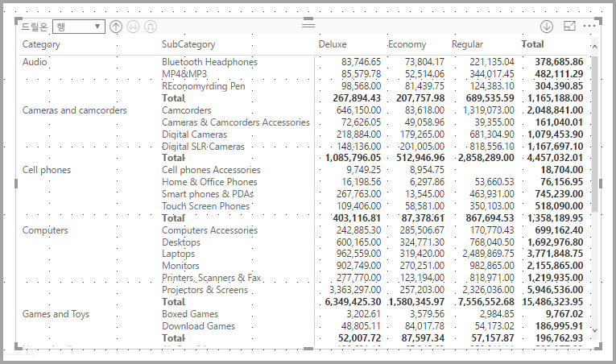

**시각화** 창의 **형식** 섹션에서 **부분합** 카드를 확장하고 **행 부분합** 슬라이더를 **끄기**로 설정합니다. 이렇게 하면 부분합이 표시되지 않습니다.

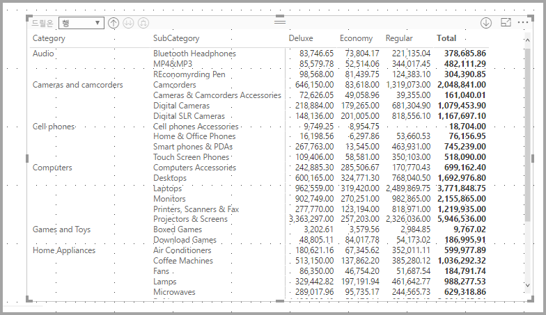

열 부분합에 동일한 프로세스가 적용됩니다.

## 행렬 시각적 개체를 사용한 상호 강조 표시
**행렬** 시각적 개체를 사용하여 크로스 강조 표시를 위한 기준으로 행렬의 모든 요소를 선택할 수 있습니다. **행렬**에서 열을 선택하면 보고서 페이지에 있는 다른 시각적 개체처럼 해당 열이 강조 표시됩니다. 이는 다른 시각적 개체 및 데이터 요소 선택의 공통 기능이므로 **행렬** 시각적 개체는 동일한 기능을 제공합니다.

또한 Ctrl+클릭은 크로스 강조 표시에서도 작동합니다. 예를 들어, 다음 이미지의 경우 **행렬** 시각적 개체에서 하위 범주 컬렉션을 선택했습니다. 시각적 개체에서 선택하지 않은 항목이 회색으로 표시되고, **행렬** 시각적 개체에서 선택한 항목이 페이지의 다른 시각적 개체에 반영되는 방법을 살펴보세요.

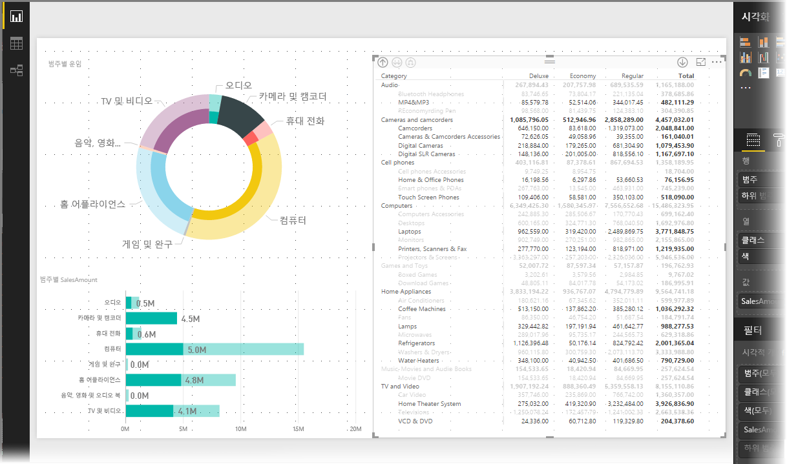

## 매트릭스 시각적 개체에서 음영 및 글꼴 색
**행렬** 시각적 개체를 사용하여 행렬 내에서 셀의 배경에 **조건부 서식**(색 및 음영)을 적용할 수 있고 텍스트와 값 자체에 조건부 서식을 적용할 수 있습니다.

조건부 서식을 적용하려면 매트릭스 시각적 개체를 선택하는 경우 다음 중 하나를 수행할 수 있습니다.

* **필드** 창에서 필드를 마우스 오른쪽 단추로 클릭하고 메뉴에서 **조건부 서식**을 선택합니다.
  
  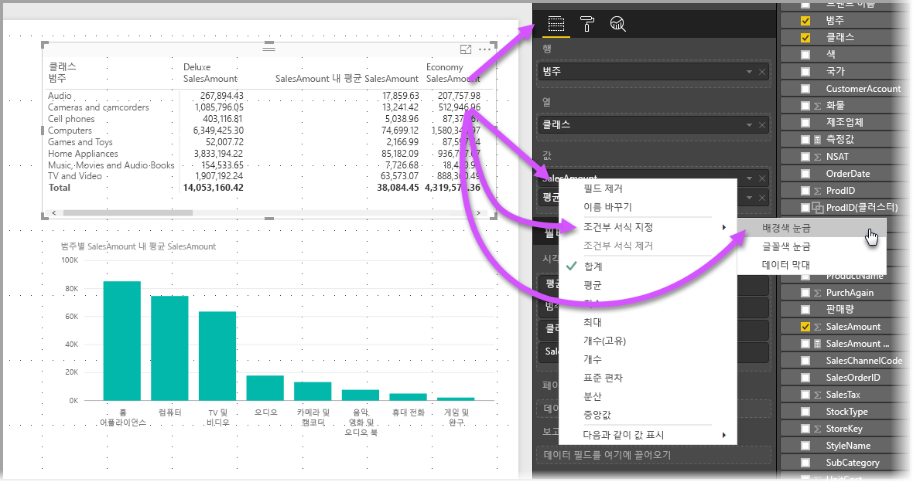
* 또는 **형식** 창에서 **조건부 서식** 카드를 확장하고 **배경 색 눈금** 또는 **글꼴 색 눈금** 중 하나에서 슬라이더를 **켜기**로 설정합니다. ‘고급 컨트롤’에 대한 링크 표시 옵션 중 하나를 켜면 색 서식 지정에 대한 색 및 값을 사용자 지정할 수 있습니다.
  
  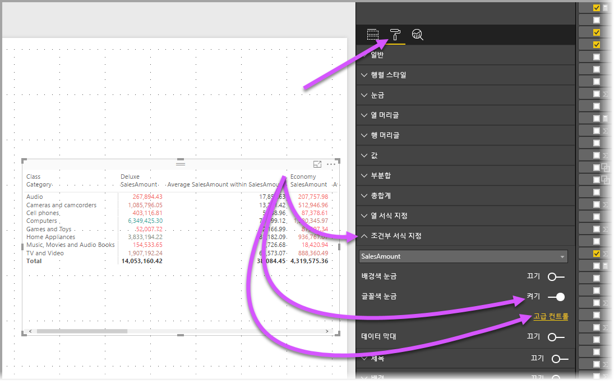

둘 다 동일한 결과를 달성할 수 있습니다. *고급 컨트롤*을 선택하면 다음과 같이 조정할 수 있는 대화 상자가 표시됩니다.

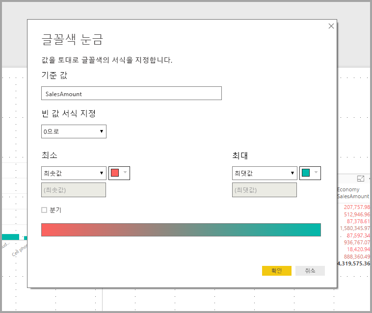

## 다음 단계

다음 문서에도 관심이 있을 수 있습니다.

* [Power BI Desktop 보고서에서 눈금선 및 눈금에 맞춤 사용](desktop-gridlines-snap-to-grid.md)
* [Power BI Desktop의 데이터 원본](desktop-data-sources.md)
* [Power BI Desktop의 데이터 형식](desktop-data-types.md)

 