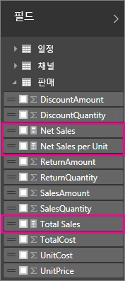
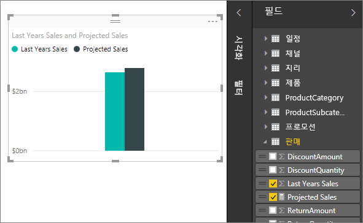
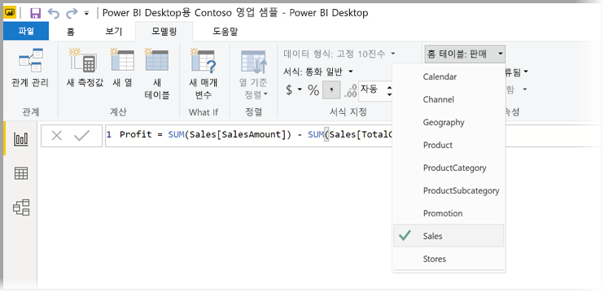
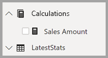

# Power BI Desktop의 측정값

**Power BI Desktop**에서는 몇 번의 클릭만으로 데이터에 대한 정보를 만들 수 있습니다. 그러나 가장 중요한 질문에 답변하는 데 필요한 모든 정보가 해당 데이터에 포함되지 않은 경우도 있습니다. 이러한 경우 측정값을 사용하면 도움이 될 수 있습니다.

측정값은 가장 일반적인 데이터 분석에서 사용됩니다. [요약 및 범주](https://docs.microsoft.com/power-bi/guided-learning/visualizations?tutorial-step=16) 동영상에 설명된 대로 합계, 평균, 최소값, 최댓값, 개수 등과 같은 간단한 요약을 필드를 통해 설정할 수 있습니다. DAX 수식을 사용하여 직접 고급 계산을 직접 작성할 수 있습니다. 측정값의 계산된 결과는 보고서 조작에 대한 응답으로 항상 변경되어 빠른 동적 임시 데이터 탐색이 가능합니다. 측정값에 대해 좀 더 자세히 살펴보겠습니다.

## 측정값 이해

**Power BI Desktop**에서 측정값은 **보고서 보기** 또는 **데이터 보기**에서 만들고 표시합니다. 사용자가 직접 만든 측정값은 계산기 아이콘과 함께 필드 목록에 나타납니다. 측정값에 원하는 대로 이름을 지정하고 다른 모든 필드처럼 새 시각화나 기존 시각화에 추가할 수 있습니다.

> [!NOTE]
> 대화 상자에서 선택할 수 있는 이미 작성된 측정인 **빠른 측정**에도 관심이 있을 수 있습니다. 자동으로 생성된 DAX 수식을 검토할 수 있으므로 측정을 신속하게 작성하고 DAX 구문을 학습할 수 있는 좋은 방법입니다. [빠른 측정](desktop-quick-measures.md) 문서를 확인하세요.
> 
> 

## Data Analysis Expressions

측정값은 수식의 결과를 계산합니다. 고유한 측정값을 만드는 경우 [DAX(Data Analysis Expressions)](https://msdn.microsoft.com/library/gg413422.aspx) 수식 언어를 사용합니다. DAX에는 200개가 넘는 함수, 연산자 및 구문의 라이브러리가 포함됩니다. 해당 라이브러리는 데이터 분석 필요에 대한 결과를 계산하는 측정값을 만들 때 뛰어난 유연성을 제공합니다.

DAX 수식은 Excel 수식과 매우 유사합니다. DAX에는 DATE, SUM 및 LEFT와 같이 Excel과 동일한 함수도 많습니다. 그러나 DAX의 함수는 Power BI Desktop에서처럼 관계형 데이터에서 작동합니다.

## 예를 살펴보겠습니다.
Jan은 Contoso의 판매 관리자입니다. Jan은 다음 회계 연도의 재판매인 판매 예상액을 제공해달라는 요청을 받았습니다. 따라서 작년의 판매액을 기준으로 예측하기로 결정하고 다음 6개월 동안 예정된 다양한 프로모션의 결과로 판매액이 연간 6% 증가할 것으로 판단합니다.

Jan은 예상액을 보고하기 위해 작년의 판매 데이터를 Power BI Desktop으로 가져옵니다. Jan은 Reseller Sales 테이블에서 SalesAmount 필드를 찾습니다. 가져온 데이터에 작년의 판매액만 포함되어 있으므로 Jan은 SalesAmount 필드의 이름을 Last Years Sales로 바꿉니다. 그런 다음, Last Years Sales를 보고서 캔버스로 끌어옵니다. 해당 필드가 차트 시각화에서 작년의 모든 대리점 판매액의 합계인 단일 값으로 나타납니다.

Jan은 계산을 지정하지 않았지만 계산이 자동으로 제공되었음을 확인합니다. Power BI Desktop에서 Last Years Sales의 값을 모두 합하여 측정값을 직접 만들었습니다.

그러나 Jan은 내년의 판매 예상액을 계산하는 측정값이 필요하며, 이 값은 6% 예상 증가를 고려하여 작년의 판매액에 1.06을 곱한 값을 기준으로 합니다. 이 계산을 위해 Jan은 고유한 측정값을 만듭니다. 새 측정값 기능을 사용하여 새 측정값을 만들고, 다음과 같은 DAX 수식을 입력합니다.

    Projected Sales = SUM('Sales'[Last Years Sales])*1.06

그런 다음, 새로운 Projected Sales 측정값을 차트로 끌어옵니다.

이제 Jan은 최소한의 노력으로 신속하게 예상 판매량을 계산하는 측정값을 얻었습니다. Jan은 특정 재판매인을 필터링하거나 보고서에 다른 필드를 추가하여 예상액을 추가로 분석할 수 있습니다.

## 측정값에 대한 데이터 범주

측정값에 대한 데이터 범주를 선택할 수도 있습니다. 

무엇보다도 측정값을 사용하여 동적으로 URL을 만들고 데이터 범주를 웹 URL로 표시할 수 있습니다. 

측정값을 웹 URL로 표시하는 테이블을 만들고 선택에 따라 만든 URL을 클릭할 수 있습니다. [URL 필터 매개 변수](service-url-filters.md)를 사용하여 다른 Power BI 보고서에 연결하려고 할 때 특히 유용합니다.

## 측정값 구성

측정값에는 필드 목록에서 찾을 위치를 정의하는 *홈* 테이블이 있습니다. 모델의 테이블에서 위치를 선택하여 해당 위치를 변경할 수 있습니다.

테이블의 필드를 *표시 폴더*로 구성할 수도 있습니다. Power BI Desktop 창의 왼쪽에서 **모델 뷰**를 선택한 다음 캔버스에 표시되는 사용 가능한 필드 목록에서 이동할 필드를 선택합니다. 속성 창에 **표시 폴더**에 대한 텍스트 상자가 나타납니다. **표시 폴더** 필드에 이름을 입력하면 폴더가 생성되고 선택한 필드가 해당 폴더로 이동합니다.

백슬래시 문자를 사용하여 하위 폴더를 만들 수 있습니다. 예를 들어 *Finance\Currencies*는 *Finance* 폴더를 만들고 그 안에 *Currencies* 폴더를 만듭니다.

세미콜론으로 폴더 이름을 구분하여 여러 폴더에 필드를 표시할 수 있습니다. 예를 들어 *Products\Names;Departments*는 *Departments* 폴더와 *Products* 폴더 내 *Names* 폴더에 필드를 표시합니다.

마지막으로 **필드 목록**의 맨 위에 항상 표시되는 측정값만 포함하는 특수 테이블을 만들 수 있습니다. 이렇게 하려면 열이 하나만 있는 테이블을 만듭니다. **데이터 입력**을 사용하여 해당 테이블을 만들 수 있습니다. 그런 다음 측정값을 해당 테이블로 이동합니다. 마지막으로 만든 열(테이블 아님)을 숨깁니다. Power BI Desktop을 올바르게 표시하려면 **필드 목록**의 맨 위에 있는 펼침 단추를 클릭하여 **필드 목록**을 닫았다가 다시 열어야 합니다.

## 자세한 정보
여기서는 측정값에 대해 간략하게 소개만 했지만 직접 만드는 방법을 알아보는 데 도움이 되는 추가 정보가 제공됩니다. 샘플 파일을 다운로드하여 더 많은 측정값을 만드는 방법에 대한 단계별 학습을 진행할 수 있는 [자습서: Power BI Desktop에서 고유한 측정값 만들기](desktop-tutorial-create-measures.md)를 참조하세요.  

DAX에 대해 더 자세히 알아보려면 [Power BI Desktop의 DAX 기본 사항](desktop-quickstart-learn-dax-basics.md)을 확인하세요. [DAX(Data Analysis Expressions) 참조](https://msdn.microsoft.com/library/gg413422.aspx)에서는 각 함수, 구문, 연산자 및 명명 규칙에 대한 자세한 문서를 제공합니다. DAX는 Excel 및 SQL Server Analysis Services의 파워 피벗에서 여러 해 동안 사용되었으므로 여러 가지 유용한 리소스도 사용할 수 있습니다. BI 커뮤니티의 영향력 있는 멤버가 DAX에 대한 지식을 공유하는 [DAX 리소스 센터 Wiki](http://social.technet.microsoft.com/wiki/contents/articles/1088.dax-resource-center.aspx)(영문)를 확인하세요.

