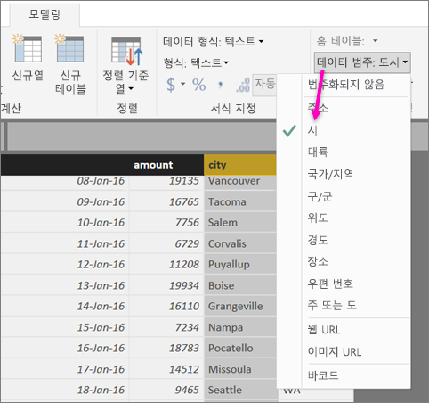
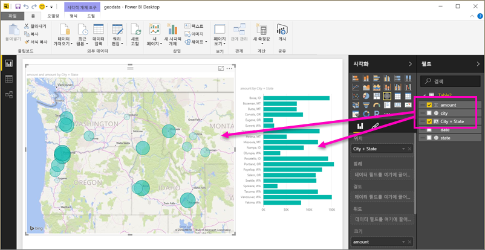
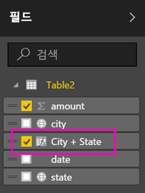
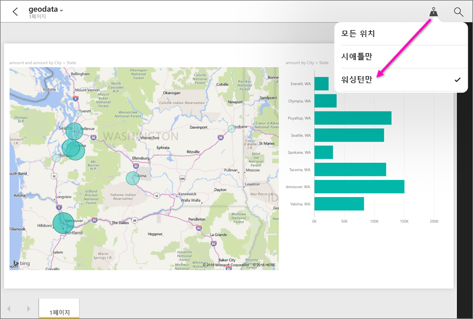

# 모바일 앱용 Power BI Desktop에서 지리적 필터링 설정
Power BI Desktop에서는 열의 [지리 데이터 범주](desktop-data-categorization.md)를 지정하여 보고서의 시각적 개체에서 해당 값을 처리하는 방식을 Power BI Desktop에 알려줄 수 있습니다. 추가적인 이점으로 사용자 또는 동료가 Power BI 모바일 앱에서 해당 보고서를 볼 때 Power BI에서 사용자가 있는 위치와 일치하는 지리적 필터를 자동으로 제공합니다. 

예를 들어 고객을 만나기 위해 이동하는 판매 관리자이고, 방문하려는 특정 고객에 대한 총 판매 및 수익을 신속하게 필터링하려고 한다고 합시다. 현재 위치에 대한 상세 데이터를 시/도, 구/군/시 또는 실제 주소별로 얻으려고 합니다. 나중에 시간이 남으면 근처에 있는 다른 고객을 방문하려고 합니다. [위치별로 보고서를 필터링하여 이러한 고객을 찾을 수 있습니다](consumer/mobile/mobile-apps-geographic-filtering.md).

> [!NOTE]
> 보고서의 지리적 이름이 영어인 경우(예: "New York City" 또는 "Germany") 모바일 앱에서 위치별로 필터링할 수 있습니다.
> 
> 

## 보고서에서 지리적 데이터 식별
1. Power BI Desktop에서 데이터 보기로 전환 .
2. 지리적 데이터(예: City 열)로 열을 선택합니다.
   
    
3. **모델링** 탭에서 **데이터 범주**, 올바른 범주(이 예에서는 **City**)를 선택합니다.
   
    
4. 이 모델의 다른 필드에 대한 지리적 데이터 범주 설정을 계속합니다. 
   
   > [!NOTE]
   > 모델에서 각 데이터 범주에 대한 여러 열을 설정할 수 있지만 이렇게 할 경우 모델은 Power BI 모바일 앱에서 지리에 대해 필터링할 수 없습니다. 모바일 앱에서 지리 필터링을 사용하려면 각 데이터 범주에 대해 하나의 열만 설정합니다(예를 들어 하나의 **City** 열, 하나의 **State 또는 Province** 열, 하나의 **Country**). 
   > 
   > 

## 지리적 데이터를 사용하여 시각적 개체 만들기
1. 보고서 보기로 전환 하고 데이터의 지리적 필드를 사용하는 시각적 개체를 만듭니다. 
   
    
   
    또한 이 예제에서 모델은 하나의 열에 도시와 시/도를 함께 제공하는 계산 열을 포함합니다. [Power BI Desktop에서 계산 열 만들기](desktop-calculated-columns.md)를 참고하세요.
   
    
2. Power BI 서비스에 보고서를 게시합니다.

## Power BI 모바일 앱에서 보고서 보기
1. [Power BI 모바일 앱](consumer/mobile/mobile-apps-for-mobile-devices.md) 중 하나에서 보고서를 엽니다.
2. 보고서에서 데이터가 포함된 지리적 위치에 있는 경우 사용자의 위치에 자동으로 필터링할 수 있습니다.
   
    

[Power BI 모바일 앱에서 위치별 보고서 필터링](consumer/mobile/mobile-apps-geographic-filtering.md)에 대해 자세히 알아보세요.

## 다음 단계
* [Power BI Desktop의 데이터 분류](desktop-data-categorization.md)  
* 궁금한 점이 더 있나요? [Power BI 커뮤니티에 질문합니다.](http://community.powerbi.com/)

