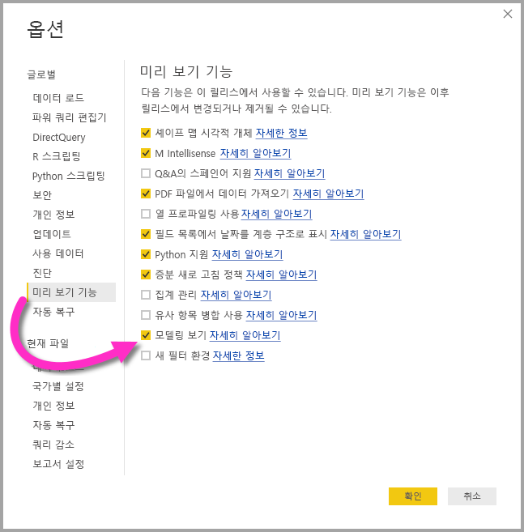
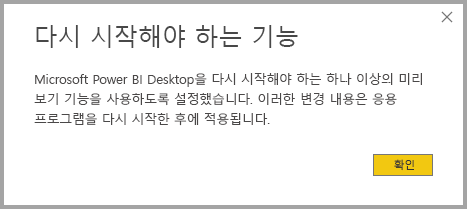
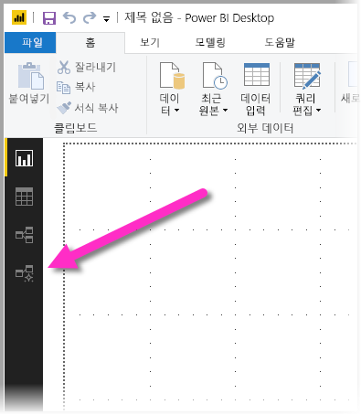
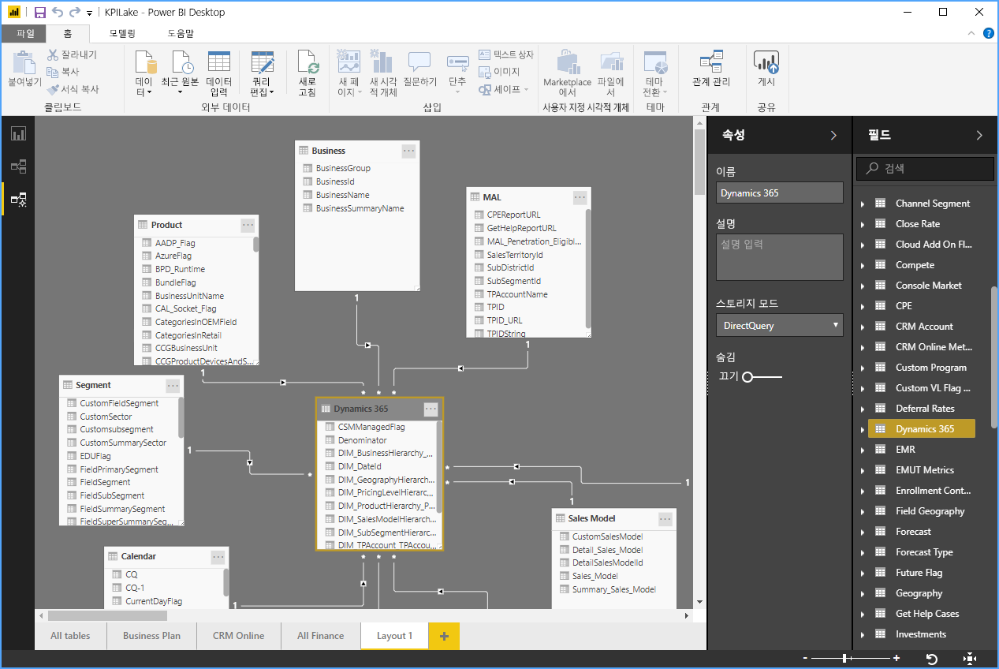
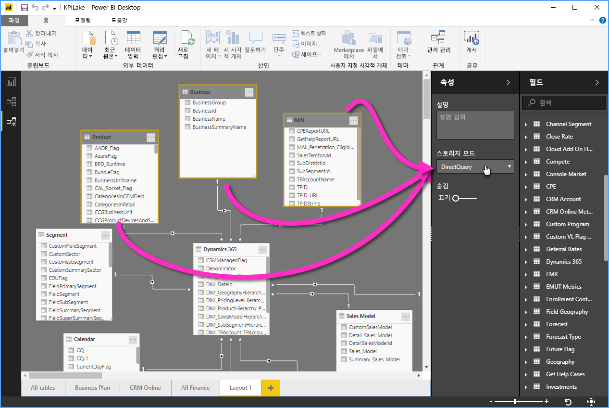

# Power BI Desktop의 모델링 보기(미리 보기)

**Power BI Desktop**의 **모델링 보기**를 사용하면 테이블이 많이 포함된 복잡한 데이터 세트를 보고 작업할 수 있습니다. 모델링 보기로 다음을 수행할 수 있습니다.

## 모델링 보기 미리 보기 기능 사용

모델링 보기 기능은 미리 보기 상태이며 **Power BI Desktop**에서 사용하도록 설정해야 합니다. 모델링 보기를 사용하도록 설정하려면 다음 이미지에 표시된 것처럼 **파일 > 옵션 및 설정 > 옵션 > 미리 보기 기능**을 선택하고 **모델링 보기** 확인란을 선택합니다.

미리 보기 기능을 사용하도록 설정하려면 **Power BI Desktop**을 다시 시작해야 한다는 메시지가 표시됩니다. 

## 모델링 보기 사용

모델링 보기에 액세스하려면 다음 이미지에 표시된 대로 **Power BI Desktop**의 왼쪽에 있는 모델링 보기 아이콘을 선택합니다.

## 별도의 다이어그램 만들기

모델링 보기를 통해 모델에서 테이블의 하위 집합만 포함되는 모델의 다이어그램을 만들 수 있습니다. 그러면 작업하려는 테이블을 더 명확하게 볼 수 있고 복잡한 데이터 세트를 더 쉽게 작업할 수 있습니다. 테이블의 하위 집합만으로 새 다이어그램을 만들려면 Power BI Desktop 창 하단에 있는 **모든 테이블** 탭 옆의 **+** 기호를 클릭합니다.

그런 다음, **필드** 목록에서 다이어그램 곡면으로 테이블을 끌어올 수 있습니다. 테이블을 마우스 오른쪽 단추로 클릭하고 나타나는 메뉴에서 **관련 테이블 추가**를 선택합니다.

![테이블을 마우스 오른쪽 단추로 클릭하고 [관련 테이블 추가] 선택](media/desktop-modeling-view/modeling-view_04.png)

작업을 수행하면 원래 테이블과 관련된 테이블이 새 다이어그램에 표시됩니다. 다음 이미지는 **관련 테이블 추가** 메뉴 옵션을 선택한 후 관련 테이블이 표시되는 방법을 보여 줍니다.

## 공용 속성 설정

**Ctrl** 키를 누른 상태에서 여러 테이블을 클릭하여 모델링 보기에서 여러 개체를 한번에 선택할 수 있습니다. 여러 테이블을 선택하면 모델링 보기에서 강조 표시됩니다. 여러 테이블이 강조 표시되면 **속성** 창에서 적용된 변경 내용이 선택한 모든 테이블에 적용됩니다.

예를 들어 **Ctrl** 키를 누른 상태에서 테이블을 선택한 다음, **속성** 창에서 스토리지 모드 설정을 변경하여 다이어그램 보기에서 여러 테이블의 [스토리지 모드](desktop-storage-mode.md)를 변경할 수 있습니다.

## 다음 단계

다음 문서에서는 데이터 모델을 자세히 설명하고 DirectQuery도 자세히 설명합니다.

* [Power BI Desktop의 집계(미리 보기)](desktop-aggregations.md)
* [Power BI Desktop의 복합 모델(미리 보기)](desktop-composite-models.md)
* [Power BI Desktop의 저장소 모드(미리 보기)](desktop-storage-mode.md)
* [Power BI Desktop의 다 대 다 관계(미리 보기)](desktop-many-to-many-relationships.md)

DirectQuery 문서:

* [Power BI의 DirectQuery 사용](desktop-directquery-about.md)
* [Power BI의 DirectQuery에서 지원하는 데이터 원본](desktop-directquery-data-sources.md)
