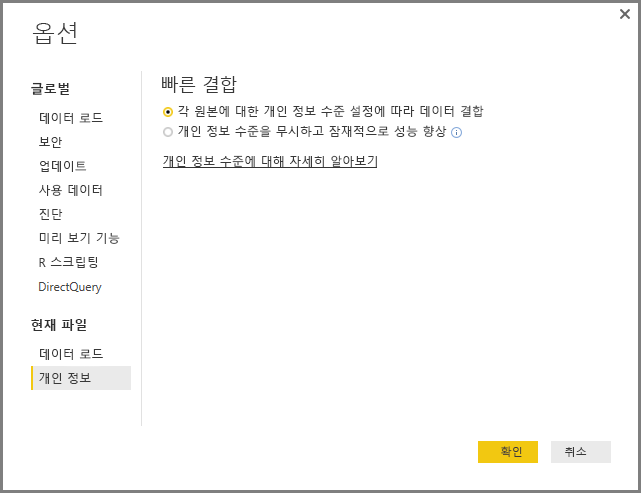
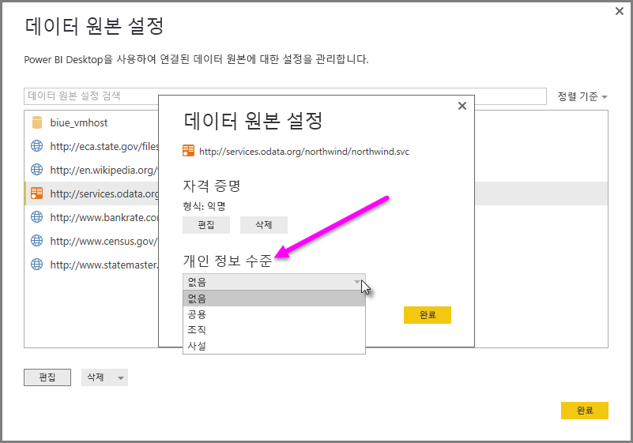

# Power BI Desktop 개인 정보 수준
**Power BI Desktop**에서, 개인 정보 수준은 특정 데이터 원본이 다른 데이터 원본과 격리되는 정도를 정의하는 격리 수준을 지정합니다. 제한적인 격리 수준은 데이터 원본 간에 교환 되는 정보를 차단하지만 기능이 감소되고 성능이 영향을 받을 수 있습니다.

**파일 > 옵션 및 설정 > 옵션**에 있는 **개인 정보 수준** 설정과 **현재 파일 > 개인 정보**가 차례로 Power BI Desktop에서 데이터를 결합하는 동안 개인 정보 수준 설정을 사용할지 여부를 결정합니다. 이 대화 상자에는 개인 정보 수준 및 개인 정보 수준에 대한 Power BI Desktop 설명서의 링크(이 문서)가 포함되어 있습니다.

## 개인 정보 수준 구성
개인 정보 수준 설정으로, 특정 데이터 원본을 다른 데이터 원본과 격리해야 하는 정도를 정의하는 격리 수준을 지정할 수 있습니다.

| 설정 | 설명 | 예제 데이터 원본 |
| --- | --- | --- |
| **비공개 데이터 원본** |**비공개** 데이터 원본에는 중요한 정보나 기밀 정보가 포함되며, 데이터 원본의 표시 여부는 권한 있는 사용자로 제한될 수 있습니다. 프라이빗 데이터 원본은 다른 데이터 원본과 완전히 격리됩니다. |Facebook 데이터, 주식 보상이 포함된 텍스트 파일 또는 직원 검토 정보가 포함된 통합 문서 |
| **조직 데이터 원본** |**조직** 데이터 원본은 데이터 원본의 표시 여부를 신뢰할 수 있는 사용자 그룹으로 제한합니다. **조직** 데이터 원본은 모든 **공용** 데이터 원본과 격리되지만 다른 **조직** 데이터 원본에는 표시됩니다. |신뢰할 수 있는 그룹에서 사용하도록 권한이 지정된 인트라넷 SharePoint 사이트의 **Microsoft Word** 문서 |
| **공용 데이터 원본** |**공용** 데이터 원본은 데이터 원본에 포함된 데이터를 모든 사용자에게 표시합니다. 파일, 인터넷 데이터 원본 또는 통합 문서 데이터만 **공용**으로 표시할 수 있습니다. |Microsoft Azure Marketplace의 무료 데이터, Wikipedia 페이지의 데이터 또는 공용 웹 페이지에서 복사된 데이터가 포함된 로컬 파일. |

## 개인 정보 수준 설정 구성
각 데이터 원본에 대한 **개인 정보** 설정 대화 상자는 **파일 > 옵션 및 설정 > 데이터 원본 설정**에 있습니다.

데이터 원본 개인 정보 수준을 구성하려면 데이터 원본을 선택한 다음 **편집**을 선택합니다. 다음 이미지와 같은 **데이터 원본 설정** 대화 상자가 표시됩니다. 이 대화 상자의 하단에 있는 드롭다운 메뉴에서 적절한 개인 정보 수준을 선택할 수 있습니다.

> [!CAUTION]
> 매우 중요한 데이터나 기밀 데이터를 포함하는 데이터 원본은 **프라이빗**으로 구성해야 합니다.
> 

## 개인 정보 수준 구성
**개인 정보 수준**은 기본적으로 **각 원본에 대한 개인 정보 수준 설정에 따라 데이터 결합** 으로 지정된 설정입니다. 즉, **개인 정보 수준**이 사용되지 않습니다.

| 설정 | 설명 |
| --- | --- |
| **각 원본에 대한 개인 정보 수준 설정에 따라 데이터 결합** (켜짐 및 기본 설정) |개인 정보 수준 설정은 데이터를 결합할 때 데이터 원본 간의 격리 수준을 결정하는 데 사용됩니다. |
| **개인 정보 수준을 무시하고 잠재적으로 성능 향상** (꺼짐) |데이터를 결합할 때 개인 정보 수준은 고려되지 않지만 데이터의 성능과 기능이 향상할 수 있습니다. |

> **보안 정보:** **개인 정보 수준** 대화 상자에서 **개인 정보 수준을 무시하고 잠재적으로 성능 향상**을 선택하여 **개인 정보 수준**을 사용하도록 설정하면 권한 없는 사용자에게도 중요한 데이터 또는 기밀 데이터가 노출될 수 있습니다. 데이터 원본에 중요한 데이터 또는 기밀 데이터가 포함되지 않았다고 확신하지 않는 한 **개인 정보 수준**을 사용하지 마세요.
> 
> 

> [!CAUTION]
> **개인 정보 수준을 무시하고 잠재적으로 성능 향상**은 Power BI 서비스에서 작동하지 않습니다. 따라서 이 설정이 활성화된 Power BI Desktop 보고서는 Power BI 서비스에 게시되면 서비스에 사용될 때 이 동작을 반영하지 *않습니다*.
> 

**개인 정보 수준 구성**

Power BI Desktop 또는 쿼리 편집기에서 **파일 > 옵션 및 설정 > 옵션**, **현재 파일 > 개인 정보**를 차례로 선택합니다.

a. **각 원본에 대한 개인 정보 수준 설정에 따라 데이터 결합** 을 선택한 경우 개인 정보 수준 설정에 따라 데이터가 결합됩니다. 개인 정보 격리 영역을 병합하면 데이터 버퍼링이 어느 정도 발생합니다.

b. **개인 정보 수준을 무시하고 잠재적으로 성능 향상** 을 선택하면 권한 없는 사용자에게 중요한 데이터 또는 기밀 데이터를 표시할 수 있는 개인 정보 수준을 무시하면서 데이터가 결합됩니다. 이 설정은 성능 및 기능을 향상시킬 수 있습니다.

> **보안 정보:** **개인 정보 수준을 무시하고 잠재적으로 성능 향상**을 선택하면 성능이 향상될 수 있지만, Power BI Desktop에서 Power BI Desktop 파일에 병합된 데이터의 개인 정보 보호를 보장할 수 없습니다.
> 
> 

