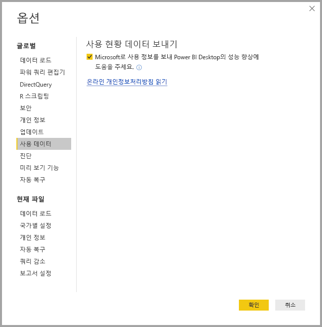
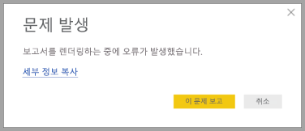

# Power BI Desktop 개인 정보

Microsoft에서는 사용자가 원하는 성능, 기능 및 편리를 가져다주는 제품을 제공하는 동시에 개인 정보를 보호하기 위해 노력하고 있습니다. Microsoft는 Power BI Desktop의 사용량에 대한 특정 정보를 수집하여 문제를 진단하고 제품을 향상할 수 있습니다. Microsoft의 개인정보처리방침에 대한 자세한 내용은 Microsoft 개인정보처리방침을 검토하세요. **Power BI Desktop** 사용에서 수집한 데이터에 적용합니다.
 
**Power BI Desktop** 사용자에서 수집한 정보에는 운영 체제, Power BI Desktop 정보 및 Internet Explorer 버전에 대한 데이터가 포함될 수 있습니다. 
 
이 데이터 수집을 취소하려는 경우 다음 이미지에 나와 있는 대로 **파일 &gt; 옵션 및 설정 &gt; 옵션**으로 이동하고 **사용량 현황 데이터** 탭에서 **사용량 현황 데이터 보내기** 확인란의 선택을 취소할 수 있습니다.

## 추가 정보 보내기

크래시 또는 다른 문제가 발생하는 경우 이후 릴리스에서 문제를 해결하는 데 도움이 될 수 있는 오류 보고서 및 추가 정보를 보내도록 선택할 수 있습니다. 또한 문서 로캘, 활성화된 미리 보기 기능 및 스토리지 모드 등에서 작업한 **Power BI Desktop** 파일의 상태에 대한 정보를 수집합니다. 여기에는 스크린샷, 오류 메시지 및 모델의 수식이 포함될 수 있습니다. 보내기 전에 검토해야 하므로 이러한 항목에는 오류가 발생했을 때 사용한 파일의 콘텐츠가 포함될 수 있습니다. Microsoft로 보내기 전에 보낼 정보를 선택할 수 있습니다.  
 
이 정보를 보내지 않으려면 오류가 발생할 때 **닫기**를 클릭하거나 위에서 설명한 대로 사용량 현황 데이터 전송을 취소할 수 있습니다. 

