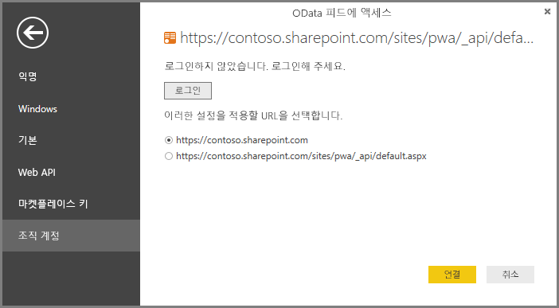

# Project Online: Power BI Desktop을 통해서 데이터에 연결
Power BI Desktop을 통해 Project Online의 데이터에 연결할 수 있습니다.

## 1단계: Power BI Desktop 다운로드
1. [Power BI Desktop을 다운로드](http://go.microsoft.com/fwlink/?LinkID=521662)하고 설치 관리자를 실행하여 컴퓨터에 **Power BI Desktop**을 설치합니다.

## 2단계: OData를 사용하여 Project Online에 연결
1. **Power BI Desktop**을 엽니다.
2. *시작 화면*에서 **데이터 가져오기**를 선택합니다.
3. **OData 피드**를 선택하고 **연결**을 선택합니다.
4. URL 상자의 OData 피드에 대한 주소를 입력하고 확인을 클릭합니다.
   
   프로젝트 웹 앱 사이트 주소가 *https://\<tenantname\>.sharepoint.com/sites/pwa*와 유사하다면, OData 피드에 대해 입력할 주소는 *https://\<tenantname\>.sharepoint.com/sites/pwa/\_api/projectdata*입니다.
   
   이 예에서는 https://contoso.sharepoint.com/sites/pwa/default.aspx를 사용합니다.
5. Power BI Desktop에서 Office 365 계정을 사용하여 인증하라는 메시지가 나타납니다. 조직 계정을 선택하고 자격 증명을 입력합니다.
   
   

OData 피드에 연결하기 위해 사용하는 계정은 프로젝트 웹 앱 사이트에 최소한 포트폴리오 뷰어 액세스가 있어야 합니다. 

여기에서는 연결하고자 하는 테이블을 선택하고 쿼리를 작성할 수 있습니다. 시작하는 방법이 궁금하십니까?  다음 블로그 게시물에는 Project Online 데이터에서 번 다운 차트를 작성하는 방법을 보여줍니다. 이 블로그 게시물은 Project Online에 연결하는 데 Power Query를 사용하는 것을 언급하지만, Power BI Desktop에도 사용 가능합니다.

[PowerPivot 및 Power Query를 사용하여 프로젝트에 대한 번 다운 차트 만들기](http://blogs.office.com/2014/03/24/creating-burndown-charts-for-project-using-power-pivot-and-power-query/)

