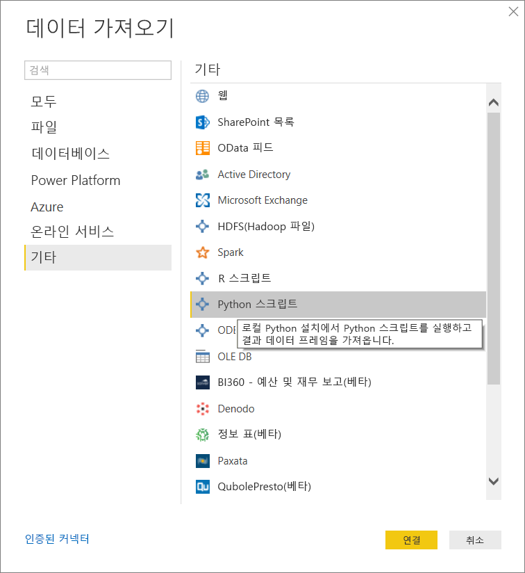
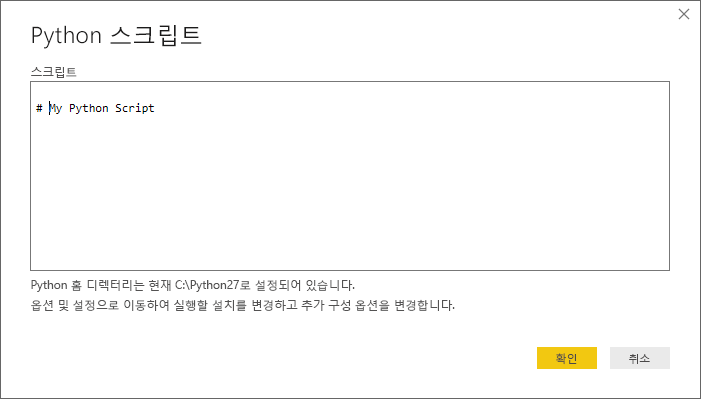
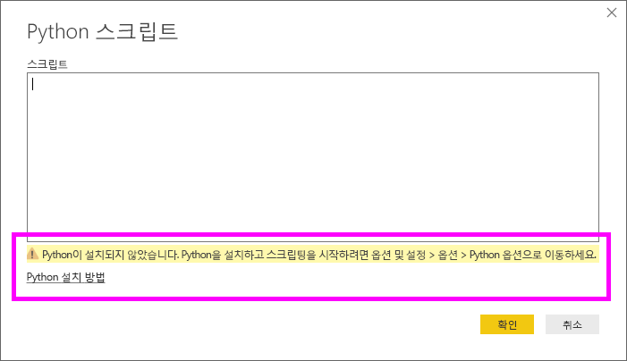

# Power BI Desktop에서 Python 스크립트 실행
**Power BI Desktop**에서 직접 Python 스크립트를 실행하고 결과 데이터 집합을 Power BI Desktop 데이터 모델로 가져올 수 있습니다.

## Python 설치
Power BI Desktop에서 Python 스크립트를 실행하려면 로컬 머신에 **Python**을 설치해야 합니다. [공식 Python 다운로드 페이지](https://www.python.org/) 및 [Anaconda](https://anaconda.org/anaconda/python/)를 비롯한 여러 위치에서 무료로 **Python**을 다운로드 및 설치할 수 있습니다. Power BI Desktop의 현재 Python 스크립팅 릴리스는 설치 경로에서 유니코드 문자뿐만 아니라 공백(빈 문자)을 지원합니다.

## Python 스크립트 실행
Power BI Desktop의 몇 단계를 사용하여 보고서를 만드는 위치에서 Python 스크립트를 실행하고 데이터 모델을 만들며 Power BI 서비스에서 공유할 수 있습니다.

### Python 스크립트 준비
Power BI Desktop에서 Python 스크립트를 실행하려면 로컬 Python 개발 환경에서 스크립트를 만들고 성공적으로 실행되도록 합니다.

Power BI Desktop에서 스크립트를 실행하려면 새로 수정되지 않은 작업 영역에서 스크립트를 성공적으로 실행해야 합니다. 즉, 패키지 및 종속성이 명시적으로 로드되고 실행되어야 합니다.

Power BI Desktop에서 Python 스크립트를 준비하고 실행하는 경우 몇 가지 제한 사항이 있습니다.

* Pandas 데이터 프레임만 가져와서 Power BI로 가져오려는 데이터가 데이터 프레임에 표시되는지 확인
* 30분 이상 실행하는 Python 스크립트는 시간이 초과됨
* 사용자 입력을 기다리는 등의 Python 스크립트의 대화형 호출은 스크립트의 실행을 중지함
* Python 스크립트 내에서 작업 디렉터리를 설정할 때, 작업 디렉터리에 ‘반드시’ 상대 경로가 아닌 전체 경로를 정의해야 합니다.
* 중첩 테이블(테이블의 테이블)은 현재 지원되지 않습니다. 

### Python 스크립트 실행 및 데이터 가져오기
1. Power BI Desktop에서 Python 스크립트 데이터 커넥터는 **데이터 가져오기**에 위치합니다. Python 스크립트를 실행하려면 다음 이미지에서 보여주듯이 **데이터 가져오기 &gt;더 보기...** 를 선택한 다음, **기타 &gt; Python 스크립트**를 선택합니다.
   
   
2. Python이 로컬 머신에 설치되면 최신 설치된 버전은 Python 엔진으로 선택됩니다. 단순히 스크립트 창에 스크립트를 복사하고 **확인**을 선택합니다.
   
   
3. Python이 설치되지 않거나, 식별되지 않거나, 로컬 머신에 여러 설치가 있는 경우 경고가 표시됩니다.
   
   
   
   Python 설치 설정은 [옵션] 대화 상자의 Python 스크립팅 섹션 가운데에 있습니다. Python 설치 설정을 지정하려면 **파일 > 옵션 및 설정**, **옵션 > Python 스크립팅**을 차례로 선택합니다. 여러 개의 Python을 설치할 수 있는 경우 사용할 설치를 선택할 수 있는 드롭다운 메뉴가 나타납니다. **기타**를 선택하고 사용자 지정 경로를 지정할 수도 있습니다.
   
   
4. **확인**을 선택하여 Python 스크립트를 실행합니다. 이 스크립트를 성공적으로 실행하는 경우 결과 데이터 프레임을 선택하여 Power BI 모델에 추가할 수 있습니다.

### 새로 고침
Power BI Desktop에서 Python 스크립트를 새로 고칠 수 있습니다. Python 스크립트를 새로 고칠 때 Power BI Desktop은 Power BI Desktop 환경에서 Python 스크립트를 다시 실행합니다.

## 다음 단계
Power BI의 Python에 대한 자세한 내용은 다음을 참조하세요.

* [Power BI Desktop에서 Python 시각적 개체 만들기](desktop-python-visuals.md)
* [Power BI로 외부 Python IDE 사용](desktop-python-ide.md)