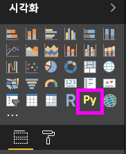
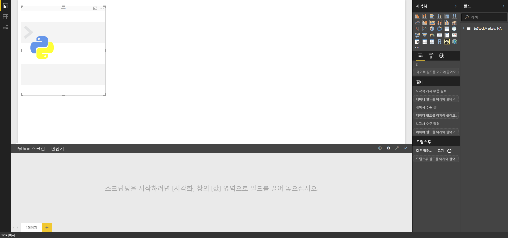
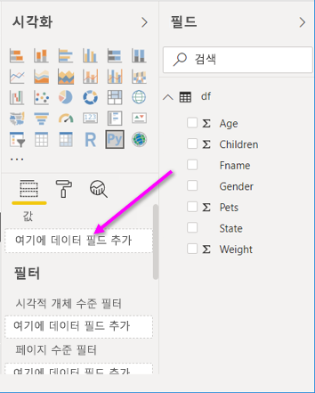
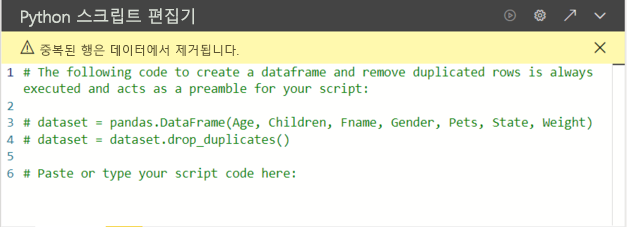

# <a name="create-power-bi-visuals-by-using-python"></a>Python을 사용하여 Power BI 시각적 개체 만들기

*Power BI Desktop*에서 Python을 사용하여 데이터를 시각화할 수 있습니다.

## <a name="prerequisites"></a>필수 조건

다음 Python 스크립트를 사용하여 [Power BI Desktop에서 Python 스크립트 실행](desktop-python-scripts.md) 자습서를 수행합니다.

```python
import pandas as pd 
df = pd.DataFrame({ 
    'Fname':['Harry','Sally','Paul','Abe','June','Mike','Tom'], 
    'Age':[21,34,42,18,24,80,22], 
    'Weight': [180, 130, 200, 140, 176, 142, 210], 
    'Gender':['M','F','M','M','F','M','M'], 
    'State':['Washington','Oregon','California','Washington','Nevada','Texas','Nevada'],
    'Children':[4,1,2,3,0,2,0],
    'Pets':[3,2,2,5,0,1,5] 
}) 
print (df) 
```

[Power BI Desktop에서 Python 스크립트 실행](desktop-python-scripts.md) 문서에서는 로컬 머신에 Python을 설치하여 Power BI Desktop에서 Python 스크립팅에 사용하도록 설정하는 방법을 보여 줍니다. 이 자습서에서는 위 스크립트의 데이터를 사용하여 Python 시각적 개체를 만드는 방법을 보여 줍니다.

## <a name="create-python-visuals-in-power-bi-desktop"></a>Power BI Desktop에서 Python 시각적 개체 만들기

1. **시각화** 창에서 **Python 시각적 개체** 아이콘을 선택합니다.

   

1. 표시되는 **스크립트 시각적 개체 사용** 대화 상자에서 **사용**을 선택합니다.

    보고서에 Python 시각적 개체를 추가하면 Power BI Desktop이 다음 작업을 수행합니다.

    - 자리 표시자 Python 시각적 개체 이미지가 보고서 캔버스에 나타납니다.

    - 가운데 창의 아래쪽을 따라 **Python 스크립트 편집기**가 나타납니다.

    

1. 다음으로, **Age**, **Children**, **Fname**, **Gender**, **Pets**, **State**, **Weight** 필드를 **여기에 데이터 필드 추가**라고 표시된 **값** 섹션으로 끕니다.

    

   Python 스크립트는 **값** 섹션에 추가된 필드만 사용할 수 있습니다. Python 스크립트를 사용하는 동안 **값** 섹션에서 필드를 추가하거나 제거할 수 있습니다. Power BI Desktop에서 필드 변경 내용을 자동으로 검색합니다.

   > [!NOTE]
   > Python 시각적 개체의 기본 집계 유형은 ‘요약 안 함’입니다. 
   > 
   > 

1. 이제 선택한 데이터를 사용하여 도표를 만들 수 있습니다.

    필드를 선택하거나 제거하면, Python 스크립트 편집기에서 지원 코드가 자동으로 생성되거나 제거됩니다. 

    선택 사항에 따라 Python 스크립트 편집기에서 다음과 같은 바인딩 코드가 생성됩니다.

    - 추가한 필드를 사용하여 편집기에서 *데이터 세트* 데이터 프레임이 생성됩니다.
    - 기본 집계는 ‘요약 안 함’입니다. 
    - 테이블 시각적 개체와 마찬가지로, 필드가 그룹화되고 중복 행이 한 번만 표시됩니다.

    

     > [!TIP]
     > 자동 그룹화를 사용하지 않거나 중복 항목을 포함하여 모든 행을 표시하려는 경우도 있습니다. 이 경우, 데이터 세트에 인덱스 필드를 추가하면 모든 행이 고유한 행으로 간주되어 그룹화되지 않습니다.

   각 이름을 사용하여 데이터 세트의 열에 액세스할 수 있습니다. 예를 들어 Python 스크립트에서 `dataset["Age"]`를 코딩하면 Age 필드에 액세스할 수 있습니다.

1. 선택한 필드에 의해 데이터 프레임이 자동으로 생성되면 Python 기본 디바이스에 그림으로 표시될 Python 스크립트 작성 준비가 완료된 것입니다. 스크립트가 완료되면, **Python 스크립트 편집기** 제목 표시줄에서 **실행**을 선택합니다.

   다음과 같은 이벤트가 발생하면 Power BI Desktop에서 시각적 개체를 다시 그립니다.

   - **Python 스크립트 편집기** 제목 표시줄에서 **스크립트 실행**을 선택할 때
   - 데이터 새로 고침, 필터링 또는 강조 표시로 인해 데이터가 변경될 때마다

   오류가 발생하는 Python 스크립트를 실행하면 Python 시각적 개체가 그려지지 않고 캔버스 오류 메시지가 나타납니다. 오류 정보를 보려면 메시지에서 **세부 정보 보기**를 선택합니다.

   시각화 요소를 더 크게 보려면 **Python 스크립트 편집기**를 최소화하면 됩니다.

몇 개의 시각적 개체를 만들어 봅시다.

## <a name="create-a-scatter-plot"></a>산점도 만들기

연령과 체중 간에 상관 관계가 있는지 확인하기 위해 산점도를 만들어 봅시다.

1. **여기에 스크립트 코드를 붙여넣거나 입력** 아래에 다음 코드를 입력합니다.

   ```python
   import matplotlib.pyplot as plt 
   dataset.plot(kind='scatter', x='Age', y='Weight', color='red')
   plt.show() 
   ```  

   이제 Python 스크립트 편집기 창이 다음과 같이 표시됩니다.

   

   **matplotlib** 라이브러리를 가져와 시각적 개체를 그리고 만듭니다.

1. 스크립트 **실행** 단추를 선택하면, 자리 표시자 Python 시각적 개체 이미지에 다음 산점도가 생성됩니다.

   

## <a name="create-a-line-plot-with-multiple-columns"></a>여러 개의 열이 있는 꺾은선형 그림 만들기

 자녀와 애완 동물 수를 표시하는 각 개인의 꺾은선형 그림을 만들어 봅시다. **여기에 스크립트 코드를 붙여넣거나 입력** 아래에 있는 코드를 제거하거나 주석으로 처리하고 다음 Python 코드를 입력합니다.

 ```python
 import matplotlib.pyplot as plt 
ax = plt.gca() 
dataset.plot(kind='line',x='Fname',y='Children',ax=ax) 
dataset.plot(kind='line',x='Fname',y='Pets', color='red', ax=ax) 
plt.show() 
```

스크립트 **실행** 단추를 선택하면, 여러 개의 열이 있는 다음 꺾은선형 그림이 생성됩니다.


## <a name="create-a-bar-plot"></a>가로 막대형 그림 만들기

각 개인의 연령을 나타내는 가로 막대형 그림을 만들어 봅시다. **여기에 스크립트 코드를 붙여넣거나 입력** 아래에 있는 코드를 제거하거나 주석으로 처리하고 다음 Python 코드를 입력합니다.

```python
import matplotlib.pyplot as plt 
dataset.plot(kind='bar',x='Fname',y='Age') 
plt.show() 
```

스크립트 **실행** 단추를 선택하면, 다음 가로 막대형 그림이 생성됩니다.

 

## <a name="security"></a>보안

> [!IMPORTANT] 
> **Python 스크립트 보안:** Python 시각적 개체는 Python 스크립트에서 생성되며 보안 또는 개인 정보 위험에 대한 코드를 포함할 수 있습니다. 처음으로 Python 시각적 개체를 보거나 조작하려고 하면 사용자에게 보안 경고 메시지가 표시됩니다. 만든 이와 원본을 신뢰하거나 Python 스크립트를 검토하고 파악한 경우에만 Python 시각적 개체를 사용합니다.
>  

## <a name="more-information-about-plotting-with-matprolib-pandas-and-python"></a>Matprolib, Pandas 및 Python으로 그리기에 대한 자세한 정보

이 자습서는 Power BI Desktop에서 Python으로 시각적 개체 만들기를 시작하는 데 도움이 되도록 작성되었습니다. Python, Pandas 및 Matprolib 라이브러리를 사용하여 시각적 보고서를 만들기 위한 다양한 옵션과 기능은 거의 설명하지 않습니다. 자세한 관련 내용은 외부 사이트에서 제공되며 시각적 개체 만들기를 시작하는 데 유용한 몇 가지 링크는 아래와 같습니다.

- [Matplotlib](https://matplotlib.org/) 웹 사이트의 문서 
- [Matplotlib Tutorial: A Basic Guide to Use Matplotlib with Python](https://www.datasciencelearner.com/matplotlib-tutorial-complete-guide-to-use-matplotlib-with-python/)(Matplotlib 자습서: Python과 함께 Matplotlib를 사용하기 위한 기본 가이드) 
- [Matplotlib Tutorial – Python Matplotlib Library with Examples](https://www.edureka.co/blog/python-matplotlib-tutorial/)(Matplotlib 자습서 – Python Matplotlib Library 및 예제) 
- [Pandas API Reference](https://pandas.pydata.org/pandas-docs/stable/reference/index.html)(Pandas API 참조) 
- [Python visualizations in Power BI Service](https://powerbi.microsoft.com/blog/python-visualizations-in-power-bi-service/)(Power BI 서비스의 Python 시각화) 
- [Using Python Visuals in Power BI](https://www.absentdata.com/how-to-user-python-and-power-bi/)(Power BI에서 Python 시각적 개체 사용)

## <a name="known-limitations"></a>알려진 제한 사항

Power BI Desktop의 Python 시각적 개체에는 다음과 같은 몇 가지 제한 사항이 있습니다.

- 데이터 크기 제한. Python 시각적 개체가 그리기에 사용하는 데이터는 150,000개 행으로 제한됩니다. 150,000개를 초과하는 행을 선택할 경우 상위 150,000개만 사용되고 이미지에 메시지가 표시됩니다.
- 해상도. 모든 Python 시각적 개체는 72DPI로 표시됩니다.
- 계산 시간 제한. Python 시각적 개체 계산 시간이 5분을 초과하면 실행 시간이 초과되어 오류가 발생합니다.
- 관계. 다른 Power BI Desktop 시각적 개체와 마찬가지로 테이블 간의 관계가 정의되지 않은 여러 테이블의 데이터 필드를 선택하면 오류가 발생합니다.
- 데이터 업데이트, 필터링 및 강조 표시가 발생하면 Python 시각적 개체가 새로 고쳐집니다. 그러나 이미지 자체는 대화형이 아니며 교차 필터링의 원본으로 사용할 수 없습니다.
- 다른 시각적 개체를 강조 표시하면 Python 시각적 개체가 그에 응답하지만, Python 시각적 개체의 요소를 클릭하여 다른 요소를 교차 필터링할 수는 없습니다.
- Python 기본 디스플레이 디바이스에 그려지는 그림만 캔버스에 올바르게 표시됩니다. 다른 Python 디스플레이 디바이스를 명시적으로 사용하지 마세요.

## <a name="next-steps"></a>다음 단계

Power BI의 Python에 대한 자세한 내용은 다음을 참조하세요.

- [Power BI Desktop에서 Python 스크립트 실행](desktop-python-scripts.md)
- [Power BI로 외부 Python IDE 사용](desktop-python-ide.md)

