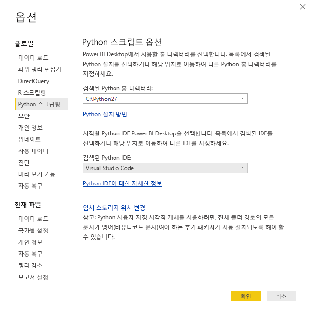
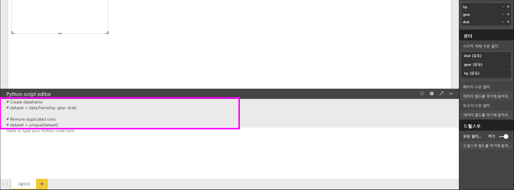
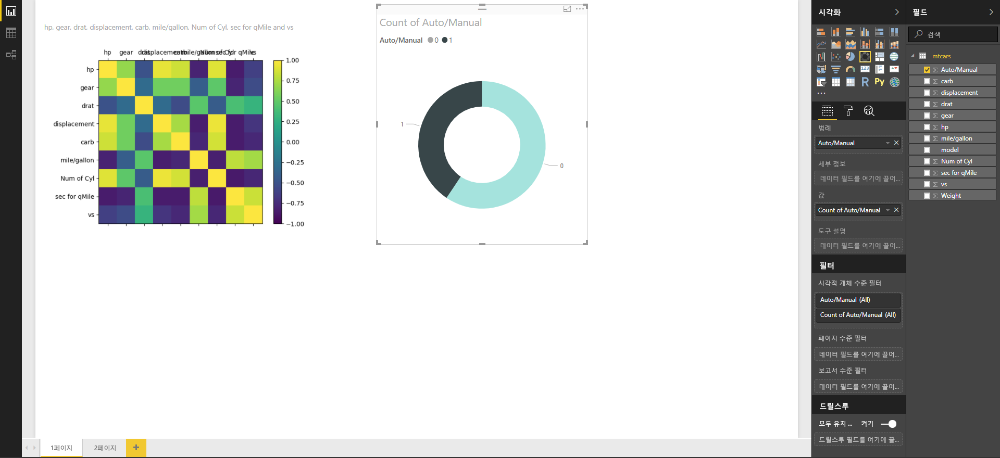
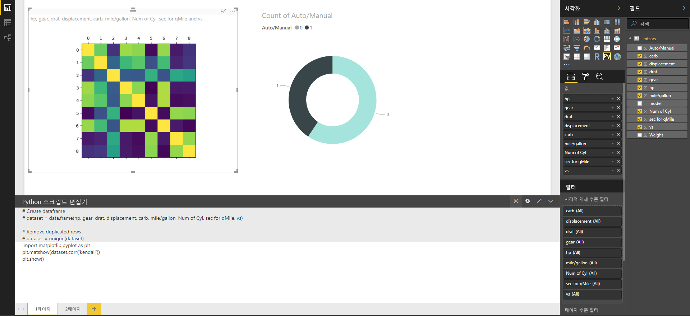
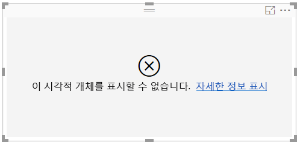

# Python을 사용하여 Power BI 시각적 개체 만들기
**Power BI Desktop**에서 **Python**을 사용하면 데이터를 시각화할 수 있습니다.

## Python 설치
**Power BI Desktop**은 **Python** 엔진을 포함, 배포 또는 설치하지 않습니다. **Power BI Desktop**에서 Python 스크립트를 실행하려면 로컬 컴퓨터에 **Python**을 별도로 설치해야 합니다. [공식 Python 다운로드 페이지](https://www.python.org/) 및 [Anaconda](https://anaconda.org/anaconda/python/)를 비롯한 여러 위치에서 무료로 **Python**을 다운로드 및 설치할 수 있습니다. Power BI Desktop의 현재 Python 스크립팅 릴리스는 설치 경로에서 유니코드 문자뿐만 아니라 공백(빈 문자)을 지원합니다.

## Python 시각적 개체 사용
Python 시각적 개체를 사용하기 위해 **파일 > 옵션 및 설정 > 옵션**을 선택하면 **옵션** 페이지가 나타납니다. 다음 이미지와 같이 **옵션** 창의 **Python 스크립팅** 섹션에서 로컬에 설치된 Python이 지정되었는지 확인합니다. 다음 이미지에서 Python의 로컬 설치 경로는 **C:\Python27**이고 이 경로는 텍스트 상자에 명시적으로 제공됩니다. 표시되는 경로가 **Power BI Desktop**에서 사용할 로컬에 설치된 Python을 올바르게 반영하는지 확인합니다.
   
   

Python 설치를 지정하면 Python 시각적 개체 만들기를 시작할 준비가 되었습니다.

## Power BI Desktop에서 Python 시각적 개체 만들기
1. 다음 이미지에 나와 있는 것처럼 **시각화** 창에서 **Python 시각적 개체** 아이콘을 선택하여 Python 시각적 개체를 추가합니다.
   
   

   보고서에 Python 시각적 개체를 추가하면 **Power BI Desktop**에서 다음 작업을 수행합니다.
   
   - 자리 표시자 Python 시각적 개체 이미지가 보고서 캔버스에 나타납니다.
   
   - 가운데 창의 아래쪽을 따라 **Python 스크립트 편집기**가 나타납니다.
   
   

2. 그다음에 다른 **Power BI Desktop** 시각적 개체와 마찬가지로 Python 스크립트에 사용할 필드를 **필드** 웰의 **값** 섹션에 추가합니다. 
    
    **필드** 웰에 추가된 필드만 Python 스크립트에 사용할 수 있습니다. **Power BI Desktop Python 스크립트 편집기**에서 Python 스크립트 작업을 수행하면서 새 필드를 추가하거나 **필드** 웰에서 불필요한 필드를 제거할 수 있습니다. **Power BI Desktop**에서는 추가하거나 제거한 필드를 자동으로 감지합니다.
   
   > [!NOTE]
   > Python 시각적 개체의 기본 집계 유형은 ‘요약 안 함’입니다.
   > 
   > 
   
3. 이제 선택한 데이터를 사용하여 도표를 만들 수 있습니다. 

    필드를 선택하면 선택한 필드를 기반으로 **Python 스크립트 편집기**가 편집기 창 상단의 회색 섹션을 따라 지원 Python 스크립트 바인딩 코드를 생성합니다. 추가 필드를 선택하거나 필드를 제거하면 그에 따라 Python 스크립트 편집기에서 지원 코드가 자동으로 생성되거나 제거됩니다.
   
   다음 그림의 예제에서는 세 개의 필드 hp, gear, drat가 선택되었습니다. 그 결과, Python 스크립트 편집기에서 다음과 같은 바인딩 코드를 생성했습니다.
   
   * **dataset**라는 데이터 프레임이 생성
     * 이 데이터 프레임은 사용자가 선택한 여러 필드로 구성
   * 기본 집계는 테이블 시각적 개체와 마찬가지로 *요약되지 않으며*
   * 필드는 그룹화되고 중복 행은 한 번만 표시됩니다.
   
   
   
   > [!TIP]
   > 자동 그룹화를 사용하지 않으려는 경우 또는 중복 항목을 포함하여 모든 행을 표시하려는 경우가 있을 수 있습니다. 이 경우 데이터 세트에 인덱스 필드를 추가하면 모든 행이 고유한 행으로 간주되어 그룹화되지 않습니다.
   > 
   > 
   
   생성된 데이터 프레임을 **데이터 세트**라고 하고 선택된 열은 해당 이름으로 액세스할 수 있습니다. 예를 들어 Python 스크립트에 *dataset["gear"]* 라고 써서 gear 필드에 액세스합니다.

4. 선택한 필드에 의해 데이터 프레임이 자동으로 생성되면 Python 기본 디바이스에 그림으로 표시될 Python 스크립트 작성 준비가 완료된 것입니다. 스크립트가 완료되면 **Python 스크립트 편집기** 제목 표시줄에서 **스크립트 실행**을 선택합니다(**스크립트 실행**은 제목 표시줄의 오른쪽에 있음).
   
    **스크립트 실행**을 선택하면 **Power BI Desktop**에서 그림을 식별하여 캔버스에 표시합니다. 이 프로세스는 로컬에 설치된 Python에서 실행되므로 필수 패키지가 설치되어 있어야 합니다.
   
   다음과 같은 이벤트가 발생하면 **Power BI Desktop**에서 시각적 개체를 다시 그립니다.
   
   * **Python 스크립트 편집기** 제목 표시줄에서 **실행**을 선택할 때
   * 데이터 새로 고침, 필터링 또는 강조 표시로 인해 데이터가 변경될 때마다

    다음 이미지는 상관 관계 그림 코드의 예를 보여주고, 다양한 자동차의 특성 간 상관 관계를 그림으로 표시합니다.

    

5. 시각화 요소를 더 크게 보려면 **Python 스크립트 편집기**를 최소화하면 됩니다. 물론 **Power BI Desktop**의 다른 시각적 개체와 마찬가지로 도넛형 시각적 개체(위 예제의 이미지 오른쪽에 있는 원형 시각적 개체)에서 스포츠카만 선택하여 상관 관계 그림을 교차 필터링할 수 있습니다.

    

6. 또한 Python 스크립트를 수정하여 시각적 개체를 사용자 지정하고, 그리기 명령에 매개 변수를 추가하여 Python의 성능을 활용할 수 있습니다.

    원래 그리기 명령은 다음과 같습니다.

    plt.matshow(dataset.corr('pearson'))

    Python 스크립트를 약간 변경한 지금, 명령은 다음과 같습니다.

    plt.matshow(dataset.corr('kendall'))

    그 결과, Python 시각적 개체는 다음 이미지에 표시된 대로 Kendall Tau 상관 계수를 사용하여 그려집니다.

    

    Python 스크립트를 실행했는데 오류가 발생하면 Python 시각적 개체가 그려지지 않고 캔버스에 오류 메시지가 표시됩니다. 오류에 대한 자세한 내용을 보려면 캔버스의 Python 시각적 개체 오류에서 **세부 정보 보기**를 선택합니다.

    

    > **Python 스크립트 보안:** Python 시각적 개체는 Python 스크립트에서 생성되며 보안 또는 개인 정보 위험에 대한 코드를 포함할 수 있습니다. 처음으로 Python 시각적 개체를 보거나 조작하려고 하면 사용자에게 보안 경고 메시지가 표시됩니다. 만든 이와 원본을 신뢰하거나 Python 스크립트를 검토하고 파악한 경우에만 Python 시각적 개체를 사용합니다.
    > 
    > 

## 알려진 제한 사항
**Power BI Desktop**의 Python 시각적 개체에는 다음과 같은 몇 가지 제한이 있습니다.

* 데이터 크기 제한 – Python 시각적 개체가 그리기에 사용하는 데이터가 150,000행으로 제한됩니다. 150,000개를 초과하는 행을 선택할 경우 상위 150,000개만 사용되고 이미지에 메시지가 표시됩니다.
* 계산 시간 제한 - Python 시각적 개체 계산 시간이 5분을 초과하면 실행 시간이 초과되어 오류가 발생합니다.
* 관계 – 다른 Power BI Desktop 시각적 개체와 마찬가지로, 테이블 간의 관계가 정의되지 않은 테이블의 데이터 필드를 선택하면 오류가 발생합니다.
* 데이터 업데이트, 필터링 및 강조 표시가 발생하면 Python 시각적 개체가 새로 고쳐집니다. 그러나 이미지 자체는 대화형이 아니므로 교차 필터링의 소스로 사용할 수 없습니다.
* 다른 시각적 개체를 강조 표시하면 Python 시각적 개체가 그에 응답하지만 Python 시각적 개체의 요소를 클릭하여 다른 요소를 교차 필터링할 수는 없습니다.
* Python 기본 디스플레이 디바이스에 그려지는 그림만 캔버스에 올바르게 표시됩니다. 다른 Python 디스플레이 디바이스를 명시적으로 사용하지 마세요.

## 다음 단계
Power BI의 Python에 대한 자세한 내용은 다음을 참조하세요.

* [Power BI Desktop에서 Python 스크립트 실행](desktop-python-scripts.md)
* [Power BI로 외부 Python IDE 사용](desktop-python-ide.md)

