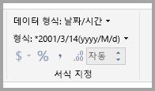
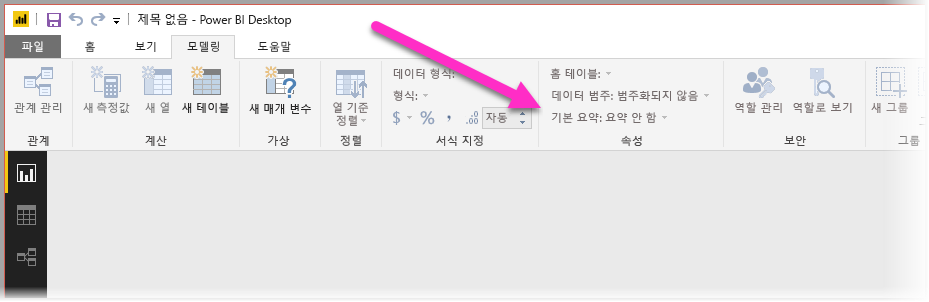
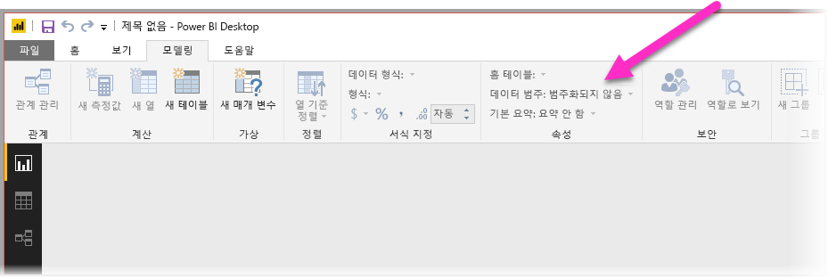
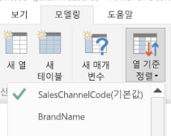
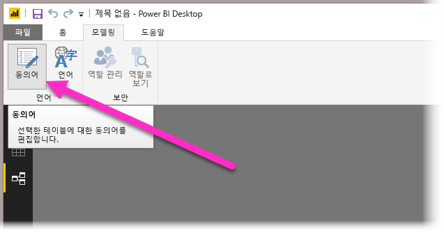
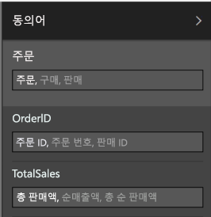

# 자연어 쿼리에 대한 Power BI Desktop의 Q&A 사용
일반적인 구 및 자연어를 사용하여 데이터에 대해 질문하는 것은 강력한 기능입니다. 훨씬 더 강력한 것은 데이터가 응답할 때입니다. 즉, **Power BI Desktop**의 Q&A를 통해 수행할 수 있는 것입니다.

Q&A가 대응이 가능한 수많은 질문을 성공적으로 해석하도록 하려면 Q&A에서 모델에 대한 가정을 만들어야 합니다. 사용자 모델의 구조가 이러한 가정을 하나 이상 만족하지 못하는 경우 모델을 조정해야 합니다. Q&A에 대한 이러한 조정은 질문과 대답의 사용 여부와 상관 없이 Power BI에서 모든 모델에 대해 동일한 최상의 최적화입니다. 

> [!NOTE]
> 질문 및 답변은 **가져온** 데이터가 포함된 모델로 작업할 때만 사용할 수 있습니다. SSAS 및 DirectQuery 모델에 대한 라이브 연결은 지원되지 않습니다.
>
>

다음 섹션에서는 Power BI의 Q&A가 잘 작동하도록 모델을 조정하는 방법에 대해 설명합니다.

## 누락된 관계 추가

모델에서 테이블 간 관계가 누락된 경우에는 해당 항목에 대해 질문했을 때 Power BI 보고서와 Q&A 모두 해당 테이블을 조인하는 방법을 해석할 수 없습니다. 관계는 적합한 모델의 기초입니다. 예를 들어 *주문* 테이블 및 *고객* 테이블 간 관계가 누락되면 “시애틀 고객에 대한 총 매출”을 요청할 수 없습니다. 다음 이미지에는 질문과 대답을 위해 작업이 필요한 모델 및 준비가 된 모델에 대한 예제가 나와 있습니다.

**작업 필요**

**Q&A에 대해 준비됨**

## 테이블 및 열의 이름 변경

테이블 및 열 선택은 Q&A에 매우 중요합니다. 예를 들어 고객의 목록이 포함된 *CustomerSummary*라는 테이블이 있을 경우 “시카고의 고객 나열” 대신에 “시카고의 고객 요약을 나열”과 같은 질문을 해야 합니다. 

Q&A에서 몇 가지 기본 단어 분리 및 복수형 검색을 수행할 수 있는 동안 Q&A에서는 사용자의 테이블 및 열 이름이 콘텐츠를 정확하게 반영한다고 가정합니다.

또 다른 예를 고려합니다. 성과 이름 및 직원 번호가 포함된 *Headcount*라는 테이블이 있고, 직원 번호, 직업 번호 및 시작 날짜가 포함된 *Employees*라는 다른 테이블이 있다고 가정합니다. 이 예는 모델에 대해 친숙한 사용자가 이해할 수 있습니다. “직원을 카운트”라고 질문하는 어떤 사람은 자신이 생각했던 것이 아닐 수도 있는 열의 카운트를 “Employees” 테이블에서 가져오게 됩니다. 왜냐하면 모든 직원이 가졌었던 모든 직업의 카운트이기 때문입니다. 포함된 내용을 실제로 반영하도록 해당 테이블의 이름을 변경하는 것이 훨씬 더 좋을 것입니다.

**작업 필요**

**Q&A에 대해 준비됨**

## 잘못된 데이터 형식 수정

가져온 데이터에 잘못된 데이터 형식이 있을 수 있습니다. 특히, *문자열*로 가져온 *날짜* 및 *번호* 열은 Q&A에서 날짜 및 숫자로 해석되지 않게 됩니다. Power BI 모델에서는 올바른 데이터 형식을 선택해야 합니다.

## 연도 및 식별자 열을 요약 안 함으로 표시

Power BI는 적극적으로 기본적으로 숫자 열을 집계하기 때문에 “연도별 총 매출”과 같은 질문은 매출의 총계가 연도의 총계와 함께 결과로 표시되곤 합니다. 특정 열에서 Power BI가 이 동작을 나타내지 않도록 하려면 열에서 **요약 기준** 속성을 **요약 안 함**으로 설정합니다. **연도**, **월**, **일** 및 **ID** 열은 가장 흔한 문제이므로 주의해야 합니다. *나이*와 요약하는 것이 적절하지 않은 다른 열은 **요약 기준**을 **요약 안 함** 또는 **평균**으로 설정하는 것이 좋습니다. 이제 설정을 **모델링** 탭에서 찾을 수 있습니다.

## 각 날짜 및 지리 열에 대한 데이터 범주 선택

**데이터 범주**는 데이터 형식 이외의 열 콘텐츠에 대한 추가 의미 체계 정보를 제공합니다. 예를 들어 정수 열은 우편 번호로 표시될 수 있으며, 문자열 열은 도시, 국가, 지역 등으로 표시될 수 있습니다. 이 정보는 시각화 선택 및 언어 기준의 중요한 두 가지 방법으로 Q&A에서 사용됩니다.

먼저, Q&A는 **데이터 범주** 정보를 사용하여 어떤 종류의 시각적 표시를 사용할지 선택하는 데 도움을 줍니다. 예를 들어 날짜 또는 시간 **데이터 범주**가 있는 열은 일반적으로 꺾은선형 차트의 가로 축 또는 거품형 차트의 재생 축에 적합한 것으로 인식합니다. 또한 지리적 **데이터 범주**가 있는 열을 포함한 결과는 지도에서 잘 표시되는 것으로 가정합니다.

둘째, Q&A는 특정 종류의 질문을 이해하는 데 도움이 되도록 사용자가 날짜 및 지리적 열에 대해 설명하는 방법에 대한 몇 가지 학습에 의한 추측을 만듭니다. 예를 들어 “John Smith가 고용된 시기”의 “시기”는 거의 확실히 날짜 열에 매핑되며, “Brown의 고객 카운트”의 “Brown”은 머리 색이 아닌 도시가 될 가능성이 더 높습니다.

## 관련 열에 대한 열 기준 정렬 선택

**열 기준 정렬** 속성은 대신 한 열에서의 정렬이 자동으로 다른 열 기준으로 정렬되는 것을 허용합니다. 예를 들어 “셔츠 사이즈를 기준으로 고객 정렬”이라고 질문하는 경우 아마도 셔츠 사이즈 열을 알파벳 순(L, M, S, XL, XS)이 아닌 기본 사이즈 번호(XS, S, M, L, XL) 순으로 정렬하려는 것입니다.

## 모델 표준화

전체 모델의 셰이프를 변경해야 함을 제안하지는 않을 것입니다. 단, 단순히 너무 어려워서 Q&A에서 잘 처리하지 못하는 특정 구조가 있습니다. 모델의 구조에 대한 몇 가지 기본 표준화를 수행하면 Q&A 결과의 정확도와 함께 Power BI 보고서의 유용성도 크게 향상됩니다.

사용자가 따라야 하는 일반적인 규칙은 사용자가 말하는 각 고유한 “항목”이 정확히 하나의 모델 개체(테이블 또는 열)로 나타나야 한다는 점입니다. 따라서 사용자가 고객에 대해 말한다면 하나의 *고객* 개체가 있어야 합니다. 또한 사용자가 판매에 대해 말한다면 하나의 *판매* 개체가 있어야 합니다. 단순한 이야기이지 않나요? 사용자가 시작하는 데이터의 모양에 따라 다를 수 있습니다. 필요한 경우 **쿼리 편집기**에서 사용할 수 있는 다양한 데이터 셰이핑 기능이 있는 반면, 간단히 Power BI 모델에서 계산을 사용하면 더 쉬운 변환이 많이 발생할 수 있습니다.

다음 섹션에서는 사용자가 수행해야 할 수도 있는 몇 가지 일반적인 변환이 포함되어 있습니다.

### 다중 열 엔터티에 대한 새 테이블 만들기

더 큰 테이블 내에서 단일 고유 단위의 역할을 하는 열이 여러 개 있는 경우 해당 열을 각 테이블로 분할해야 합니다. 예를 들어 *회사* 테이블 내에 연락처 이름, 연락처 제목 및 연락처 휴대폰 열이 있는 경우 더 나은 디자인은 이름, 제목 및 휴대폰이 포함된 별개의 *연락처* 테이블과 *회사* 테이블로 돌아가는 링크가 있는 것입니다. 그러면 연락처가 있는 회사 관련 질문 중 연락처에 관한 개별적인 질문을 더 손쉽게 할 수 있으며 유연성을 향상시킵니다.

**작업 필요**

**Q&A에 대해 준비됨**

### 속성 모음을 제거하는 피벗

모델에 속성 모음이 있으면 속성당 하나의 열을 갖도록 재구성해야 합니다. 속성 모음은 다양한 속성을 관리하기에 편리한 반면, Power BI 보고서와 Q&A에서 해결하도록 디자인되어 있지 않은 많은 내제된 제한 사항의 영향을 받습니다.

예를 들어 고객 ID, 속성 및 값 열이 있는 *CustomerDemographics* 테이블을 고려합니다. 각 행에는 고객의 다양한 속성(예: 나이, 혼인 여부, 도시 등)이 표시되어 있습니다. 속성 열의 콘텐츠에 따라 값 열의 의미를 오버로드하면 Q&A가 이를 참조하는 대부분의 쿼리를 해석하지 못하게 됩니다. “각 고객의 나이를 표시”와 같은 간단한 질문은 “속성이 나이인 고객 및 고객 인구 통계를 표시”로 해석될 수 있으므로 작동할 수도 있습니다. 단, 모델 구조는 그저 “시카고에 있는 고객의 평균 나이”처럼 약간 더 복잡한 질문을 지원하지 않을 뿐입니다. 직접 Power BI 보고서를 작성하는 사용자는 종종 찾고 있는 데이터를 가져오는 명확한 방법을 찾을 수 있는 반면, Q&A는 각 열에 단일 의미만 있는 경우에만 작동합니다.

**작업 필요**

**Q&A에 대해 준비됨**

### 병합하여 분할 제거

데이터를 여러 테이블로 분할하거나 값을 여러 열로 피벗한 경우 여러 일반적인 작업은 사용자가 달성하기 어렵거나 불가능하게 됩니다. *Sales2000-2010* 테이블 및 *Sales2011-2020* 테이블과 같은 일반적인 테이블 분할을 먼저 고려합니다. 중요한 보고서가 모두 특정 10년으로 제한된 경우 아마도 Power BI 보고서에 대해 이러한 방식으로 유지할 수 있습니다. 그러나Q&A의 유연성을 통해 사용자는 “연도별 총 매출”과 같은 질문에 대한 답을 기대할 수 있습니다. 이 작업이 수행되려면 데이터를 단일 Power BI 모델 테이블로 병합해야 합니다.

마찬가지로, 작성자, 책, 도시 1, 도시 2 및 도시 3 열이 포함된 *BookTour* 테이블과 같은 일반적인 피벗된 값 열을 고려합니다. 이와 같은 구조를 사용하면 “도시별 책 카운트”와 같이 간단한 질문도 올바르게 해석될 수 없습니다. 이 작업이 수행되려면 도시 값을 단일 열로 병합하는 별도의 *BookTourCities* 테이블을 만들어야 합니다.

**작업 필요**

**Q&A에 대해 준비됨**

### 서식이 지정된 열 분할

데이터를 가져오는 소스에 형식이 지정된 열이 포함된 경우 Power BI 보고서(및 Q&A)는 해당 콘텐츠를 구문 분석하는 열 내에 도달하지 못합니다. 따라서 예를 들어 주소, 도시 및 국가가 포함된 **전체 주소** 열이 있는 경우 사용자가 개별적으로 쿼리할 수 있도록 주소, 도시 및 국가 열로 분할해야 합니다.

**작업 필요**

**Q&A에 대해 준비됨**

마찬가지로, 사람의 전체 이름 열이 있을 때 부분 이름을 사용하여 질문하고자 하는 경우에 한해 **이름** 및 **성** 열을 추가할 수 있습니다. 

### 다중값 열에 대한 새 테이블 만들기

또한 데이터를 가져오는 소스에 다중값 열이 포함된 비슷한 상황의 경우 Power BI 보고서(및 Q&A)는 콘텐츠를 구문 분석하는 열 내에 도달하지 못합니다. 따라서 예를 들어 한 노래에 여러 작곡가의 이름이 포함된 작곡가 열이 있는 경우 개별 *작곡가* 테이블의 여러 행으로 분할해야 합니다.

**작업 필요**

**Q&A에 대해 준비됨**

### 비정규화로 비활성 관계 제거

한 테이블에서 다른 테이블로 가는 경로가 하나 이상인 경우에는 “정규화가 더 나은” 규칙에 대한 한 가지 예외가 발생합니다. 예를 들어 각각 *도시* 테이블과 관련이 있는 SourceCityID 및 DestinationCityID 열이 포함된 *항공편* 테이블이 있는 경우, 해당 관계 중 하나는 비활성으로 표시되어야 합니다. Q&A는 활성 관계만 사용할 수 있으므로 사용자 선택에 따라 출발지 또는 도착지 중 어느 하나에 관해서는 질문할 수가 없습니다. 대신에 도시 이름 열을 *항공편* 테이블로 비정규화하면 “출발지가 시애틀이고 도착지가 샌프란시스코인 내일 항공편을 나열”과 같은 질문을 할 수 있게 됩니다.

**작업 필요**

**Q&A에 대해 준비됨**

### 테이블 및 열에 동의어 추가

이 단계는 Q&A에 특별히 적용됩니다(일반적으로 Power BI 보고서에는 해당되지 않음). 사용자에게는 종종 총 매출액, 순매출액, 총 순매출액과 같이 동일한 항목을 참조하는 데 사용하는 다양한 용어가 있습니다. Power BI의 모델을 사용하면 이러한 동의어를 테이블과 모델 내 열에 추가할 수 있습니다. 

이는 매우 중요한 단계일 수 있습니다. 간단한 테이블 및 열 이름을 사용하는 경우라도 Q&A 사용자는 먼저 떠오르는 어휘를 사용하여 질문하고 미리 정의된 열 목록에서 선택하지 않습니다. 더 민감한 동의어를 추가하면 할수록 보고서를 이용하는 사용자의 경험은 더 향상됩니다. 동의어를 추가하려면 다음 그림에 나와 있는 것처럼 **관계** 보기에서 리본에 있는 동의어 단추를 선택합니다.

**동의어** 필드는 다음 그림처럼 동의어를 추가할 수 있는 **Power BI Desktop**의 오른쪽에 표시됩니다.

 동일한 동의어를 둘 이상의 열 또는 테이블에 추가하면 모호성이 발생하게 되므로 동의어를 추가할 때 주의를 기울여야 합니다. Q&A는 모호한 동의어 중에서 선택할 수 있는 컨텍스트를 활용하지만 모든 질문에 충분한 컨텍스트가 있는 것은 아닙니다. 예를 들어 사용자가 “고객을 카운트”라고 질문했을 때 모델에서 “고객” 동의어가 3개인 경우 찾고 있는 답변을 얻지 못할 수도 있습니다. 이러한 경우, 기본 동의어는 재작성 시 사용되므로 고유하게 만들어야 합니다. 사용자에게 모호성에 대한 경고(예: “저장된 고객 레코드의 수를 표시”의 재작성)가 표시될 수 있습니다. 이러한 힌트는 다르게 질문하라는 의미일 수 있습니다.

## 다음 단계
Power BI Desktop의 기능에 대한 자세한 내용은 다음 문서를 참조하세요.

* [Power BI Desktop에서 드릴스루 사용](desktop-drillthrough.md)
* [포커스 모드에서 대시보드 타일 또는 보고서 시각적 개체 표시](service-focus-mode.md)

