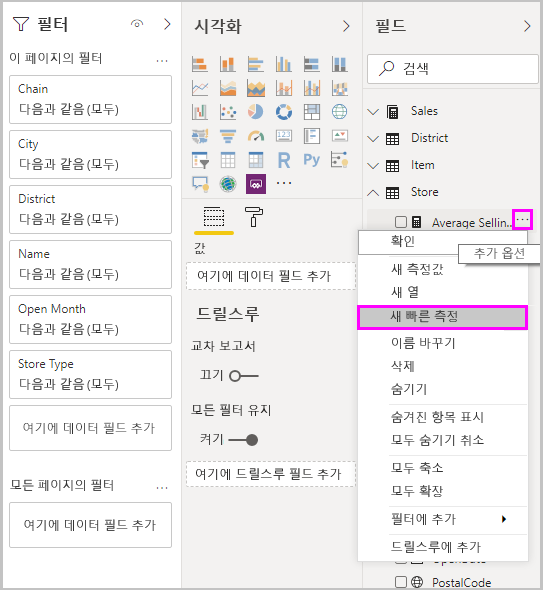
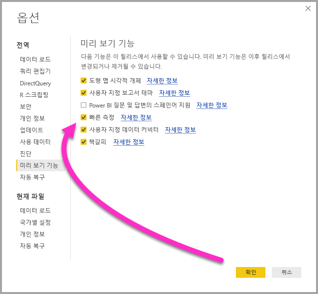
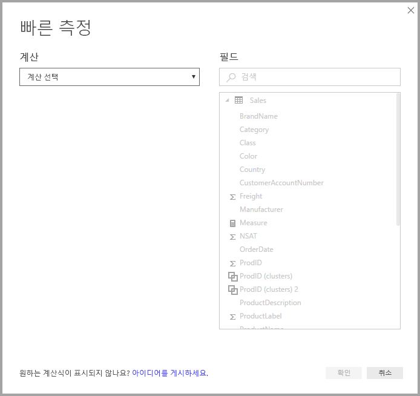
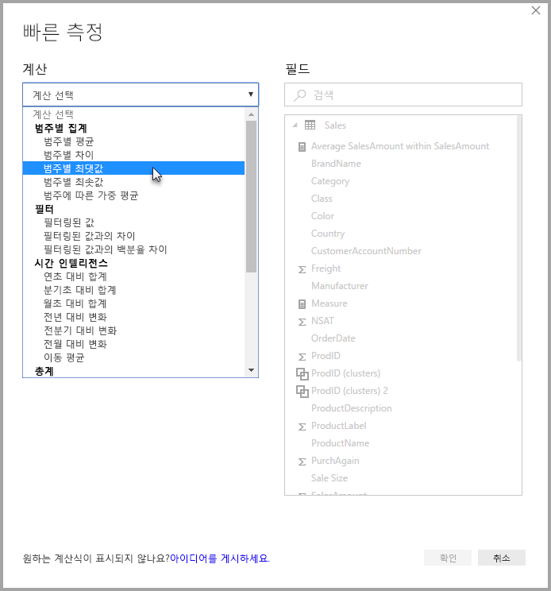
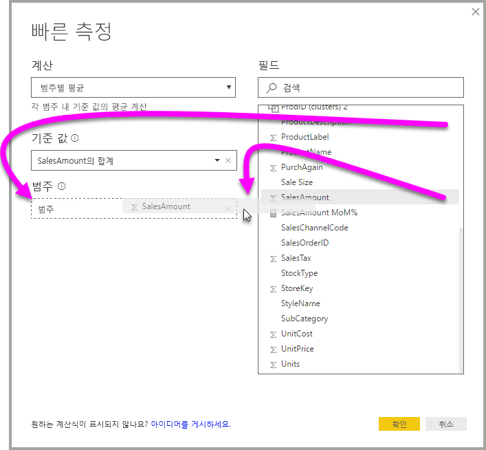
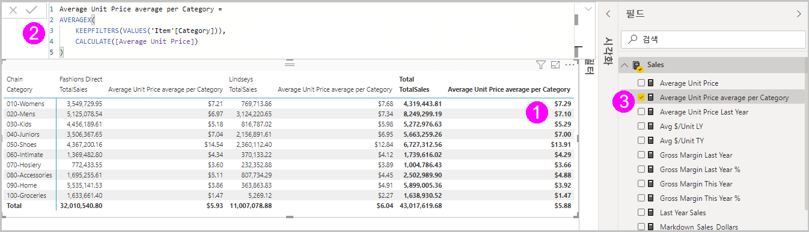
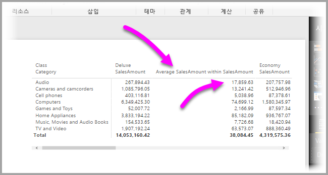
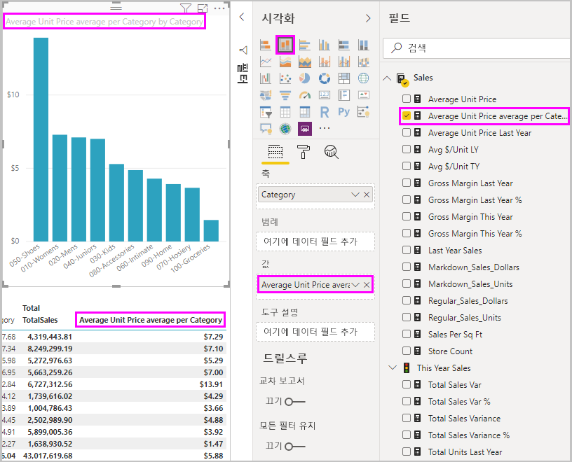
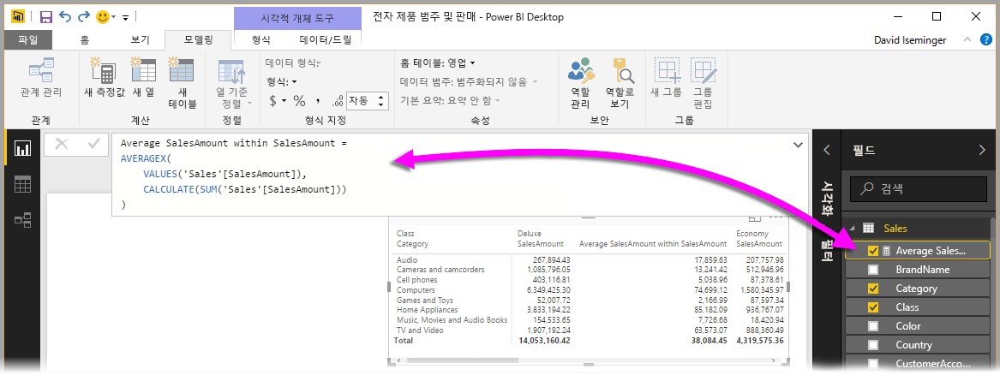
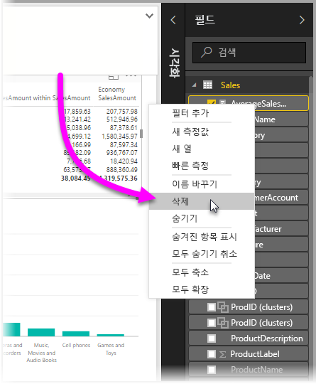

# 빠른 측정을 사용하여 일반적이고 강력한 계산 수행
**빠른 측정**을 사용하여 일반적이고 강력한 계산을 빠르고 쉽게 수행할 수 있습니다. **빠른 측정**은 사용자가 대화 상자에 입력한 내용에 따라 내부적으로(DAX를 작성할 필요가 없음) DAX 명령 집합을 실행한 후 사용할 결과를 보고서에 표시합니다. 무엇보다도 빠른 측정으로 실행되는 DAX를 확인하고 사용자 고유의 DAX 지식을 바로 사용하거나 확장할 수 있습니다.

**필드** 영역에서 필드를 마우스 오른쪽 단추로 클릭하여 **빠른 측정**을 만든 후 나타나는 메뉴에서 **빠른 측정**을 선택합니다. 기존 시각적 개체의 **값** 창에서도 값을 마우스 오른쪽 단추로 클릭할 수 있습니다(예: *가로 막대형 차트* 시각적 개체의 *값* 필드). 사용 가능한 수많은 계산 범주와 사용자 요구에 맞게 각 계산을 수정할 방법이 있습니다.

### 빠른 측정이 이제 출시됨

**Power BI Desktop**의 2018년 2월 릴리스부터 빠른 측정이 출시됩니다(미리 보기 아님). **Power BI Desktop**의 이전 릴리스를 사용하는 경우 **Power BI Desktop**의 **2017년 4월** 릴리스부터 **파일 > 옵션 및 설정 > 옵션 > 미리 보기 기능**을 선택한 다음, **빠른 측정** 옆의 확인란을 선택하여 **빠른 측정** 기능을 사용해 볼 수 있습니다.

선택한 후에는 **Power BI Desktop**을 다시 시작해야 합니다.

## 빠른 측정 사용
**빠른 측정**을 만들려면 **Power BI Desktop**의 **필드** 영역에서 필드를 마우스 오른쪽 단추로 클릭하고 나타나는 메뉴에서 **빠른 측정**을 선택합니다.

SSAS(SQL Server Analysis Services) 라이브 연결을 사용하는 경우 일부 **빠른 측정**을 사용할 수 있습니다. **Power BI Desktop**은 연결된 버전의 SSAS에 지원되는 **빠른 측정**의 컬렉션만을 표시합니다. 따라서 SSAS 라이브 데이터 원본에 연결되어 있는 경우 목록에 특정 **빠른 측정**이 표시되지 않습니다. 연결된 SSAS 버전이 **빠른 측정**을 구현하는 데 사용되는 DAX 측정값을 지원하지 않기 때문입니다.

오른쪽 클릭 메뉴에서 선택하면 다음 **빠른 측정** 창이 나타나고 여기에서 원하는 계산과 계산을 실행할 필드를 선택할 수 있습니다.

드롭다운 메뉴를 선택하면 긴 **빠른 측정** 목록이 표시됩니다.

5개의 고유한 빠른 측정 계산 형식 그룹이 있으며 각각 계산 컬렉션을 포함합니다. 이러한 그룹 및 계산은 다음과 같습니다.

* **범주별 집계**
  * 범주별 평균
  * 범주별 차이
  * 범주별 최댓값
  * 범주별 최솟값
  * 범주에 따른 가중 평균
* **필터**
  * 필터링된 값
  * 필터링된 값과의 차이
  * 필터링된 값과의 백분율 차이
  * 새 범주의 판매량
* **시간 인텔리전스**
  * 연초 대비 합계
  * 분기초 대비 합계
  * 월초 대비 합계
  * 전년도 대비 변화
  * 전분기 대비 변화
  * 전월 대비 변화
  * 이동 평균
* **합계**
  * 누계
  * 범주에 대한 합계(필터 적용)
  * 범주에 대한 합계(필터 적용하지 않음)
* **수학 연산**
  * 더하기
  * 빼기
  * 곱하기
  * 나누기
  * 백분율 차이
  * 상관 계수
* **텍스트**
  * 별 등급
  * 연결된 값 목록

이 계산에 추가하거나 **빠른 측정**에 표시되기를 바라는 사항에 대한 의견에 귀 기울이고 있습니다. **빠른 측정**에 대한 아이디어(기본 DAX 수식 포함)가 있다면 반영할 수 있도록 제출해 주세요. 자세한 내용은 이 문서의 끝에서 제공됩니다.

## 빠른 측정의 예
이러한 실제 **빠른 측정**의 예를 살펴 보겠습니다.

다음 **매트릭스** 시각적 개체는 다양한 전자 제품의 판매량에 대한 테이블을 보여 줍니다. 각 범주에 대한 합계가 포함된 기본 테이블입니다.

**값** 필드 영역을 마우스 오른쪽 단추로 클릭하고 **빠른 측정**을 선택하면, ‘계산’으로 ‘범주별 평균’을 선택한 후 ‘기준 값’으로 ‘SalesAmount의 합계’를 선택하고 오른쪽 창의 ‘필드’ 상자에서 왼쪽의 ‘범주’ 상자로 해당 필드를 끌어서 *SalesAmount*를 지정할 수 있습니다.

**확인**을 선택하면 목록 다음 이미지와 같이 몇 가지 흥미로운 일이 발생합니다.

1. 이제 **매트릭스** 시각적 개체에는 계산을 보여 주는 새로운 열이 포함됩니다(이 경우 *SalesAmount 내 평균 SalesAmount*).
2. 새로운 **측정**이 생성되고 **필드** 영역에 제공되며 강조 표시됩니다(Power BI에서는 노란색 상자로 둘러쌈). 따라서 원래 생성된 시각적 개체뿐만 아니라 보고서의 다른 시각적 개체에도 제공됩니다.
3. **빠른 측정**에 생성된 DAX 수식은 수식 입력줄에 표시됩니다.

첫 번째 항목으로 시작하려면 **빠른 측정**이 시각적 개체에 적용되었는지 확인합니다. 새 열과 연결된 값이 있으며 둘 다 생성된 **빠른 측정**을 기반으로 합니다.

두 번째로, **빠른 측정**이 데이터 모델의 **필드** 영역에 표시되며 다른 시각적 개체에 대한 모델의 다른 필드처럼 사용할 수 있습니다. 다음 이미지에서는 **빠른 측정**으로 생성된 새 필드를 사용하여 신속한 **가로 막대형 차트** 시각적 개체가 생성되었습니다.

다음 섹션으로 이동하여 세 번째 항목인 DAX 수식에 대해 알아보겠습니다.

## 빠른 측정을 사용하여 DAX 학습
**빠른 측정** 기능의 또 다른 장점은 측정값을 구현하기 위해 생성 된 DAX 수식을 직접 보여준다는 점입니다. 다음 이미지에서는 **빠른 측정**(현재 **필드** 영역에 있으므로 클릭해야 함)으로 생성된 측정값을 선택했습니다. 이렇게 **수식 입력줄**이 나타나고 Power BI가 측정값을 구현하기 위해 생성한 DAX 수식이 표시됩니다.

측정값 이면의 수식을 보여 주므로 그 자체로 도움이 됩니다. 하지만 더 중요한 것은 아마도 **빠른 측정**을 사용하여 기본 DAX 수식이 생성되는 방식을 알 수 있다는 것일 것입니다.

연도별 계산을 수행해야 하지만 DAX 수식을 구조화하는 방법을 확실히 모른다고(또는 무엇부터 시작할지 모르는 경우) 상상해 보세요. 책상에서 고민하는 대신 **전년 대비 변화** 계산을 사용하여 **빠른 측정**을 만들고 무슨 일이 일어나는지 볼 수 있습니다. 마찬가지로 **빠른 측정**을 만들어 시각적 개체에 어떻게 나타나고 DAX 수식이 어떻게 작동하는지 확인한 다음, DAX에 직접 변경 사항을 적용하거나 계산이 사용자 요구 또는 기대치를 충족할 때까지 다른 측정을 만듭니다.

몇 번의 클릭으로 가정(what-if) 질문에 즉시 응답해 주는 신속한 선생님이 있는 것과 같습니다. 마음에 들지 않을 때는 모델에서 측정값을 언제든지 쉽게 삭제할 수 있습니다. 측정값을 마우스 오른쪽 단추로 클릭하고 **삭제**를 선택하기만 하면 됩니다.

측정값이 마음에 들면 동일한 오른쪽 클릭 메뉴를 사용하여 원하는 대로 이름을 바꿀 수 있습니다.

## 제한 사항 및 고려 사항
유념해야 할 몇 가지 제한 사항과 고려 사항이 있습니다.

* **빠른 측정**은 모델을 수정할 수 있는 경우에만 사용할 수 있으며, 일부 라이브 연결을 사용하는 경우에는 그렇지 않습니다(이전에 설명한 대로 SSAS 테이블 형식 라이브 연결은 지원됨).
* **필드** 영역에 추가된 측정값을 보고서의 시각적 개체와 함께 사용할 수 있습니다.
* **필드** 영역에서 생성된 측정값을 선택한 후 **수식 입력줄**에서 해당 수식을 확인하는 방법으로 **빠른 측정**과 연결된 DAX를 항상 볼 수 있습니다.
* DirectQuery 모드에서 작업할 때는 시간 인텔리전스 빠른 측정를 빠르게 만들 수 없습니다. 이러한 빠른 측정에 사용되는 DAX 함수는 데이터 원본으로 보내지는 T-SQL 문으로 변환될 때 성능에 영향을 미칩니다.

> [!WARNING]
> 빠른 측정은 현재 인수 구분 기호에 대해 쉼표로 *오직* DAX 문만 생성합니다. **Power BI Desktop** 버전이 소수 구분 기호로 쉼표를 사용하는 언어로 현지화된 경우 빠른 측정이 올바르게 작동되지 않습니다.
> 
> 

### 시간 인텔리전스 및 빠른 측정
**Power BI Desktop**에 대한 2017년 10월 업데이트부터는 시간 인텔리전스 **빠른 측정**에서 고유한 사용자 지정 날짜 테이블을 사용할 수 있습니다. 외부 테이블 형식 모델을 사용하는 경우 모델 작성 시 해당 테이블의 기본 날짜 열이 [이 문서](https://docs.microsoft.com/sql/analysis-services/tabular-models/specify-mark-as-date-table-for-use-with-time-intelligence-ssas-tabular)에서 설명한 대로 날짜 테이블로 표시되었는지 확인합니다. 자신의 날짜 테이블을 가져오는 경우 [이 문서](https://docs.microsoft.com/power-bi/desktop-date-tables)에서 설명한 대로 날짜 테이블로 표시해야 합니다.

### 추가 정보 및 예제
각 **빠른 측정** 계산에 대한 예제와 지침을 제공할 예정이므로 관련 문서에 대한 업데이트를 조만간 다시 확인하세요.

아직 제공하지 않은 **빠른 측정**에 대한 아이디어가 있으신가요? 좋습니다! [이 페이지](https://go.microsoft.com/fwlink/?linkid=842906)를 확인하고 **Power BI Desktop**에 표시되었으면 하는 **빠른 측정**에 대한 아이디어(및 DAX 수식)를 제출해 주세요. 향후 릴리스에서 **빠른 측정** 제공 목록에 추가되도록 노력하겠습니다.

