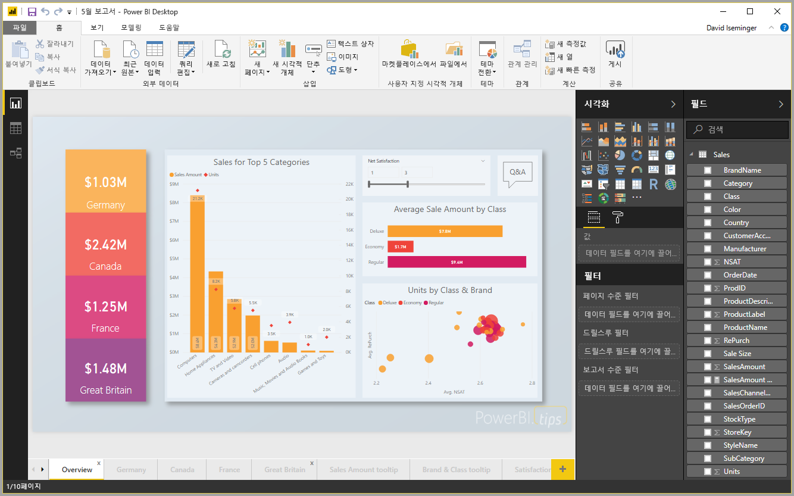

# 빠른 시작: Power BI Desktop에서 데이터에 연결

이 빠른 시작에서는 데이터 모델을 빌드하고 보고서를 만드는 첫 번째 단계로서 **Power BI Desktop**을 사용하여 데이터에 연결합니다.

아직 Power BI에 등록하지 않은 경우 시작하기 전에 [평가판에 등록합니다](https://app.powerbi.com/signupredirect?pbi_source=web).

## 필수 조건

이 문서의 단계를 완료하려면 다음이 필요합니다.
* 로컬 컴퓨터에서 실행되는 무료 애플리케이션인 **Power BI Desktop**을 다운로드하여 설치합니다. 직접 [**Power BI Desktop**을 다운로드](https://powerbi.microsoft.com/desktop)하거나 [**Microsoft 저장소**](http://aka.ms/pbidesktopstore)에서 가져올 수 있습니다.
* [이 샘플 Excel 통합 문서를 다운로드](http://go.microsoft.com/fwlink/?LinkID=521962)하고 Excel 파일을 저장할 수 있는 *C:\PBID-qs*라는 폴더를 만듭니다. 이 빠른 시작의 후속 단계에서는 이 폴더가 다운로드한 Excel 통합 문서의 파일 위치라고 가정합니다.

## Power BI Desktop 시작

**Power BI Desktop**을 설치한 후 로컬 컴퓨터에서 실행되도록 애플리케이션을 시작합니다. 사용자가 연결하는 데이터를 기반으로 시각적 개체 및 보고서를 만들 빈 캔버스가 표시됩니다. 

## 데이터에 연결

**Power BI Desktop**을 사용하면 다양한 형식의 데이터에 연결할 수 있습니다. Microsoft Excel 파일과 같은 기본 데이터 원본에 연결할 수 있고 Salesforce, Microsoft Dynamics, Azure Blob Storage 등의 모든 데이터 종류를 포함하는 온라인 서비스에 연결할 수 있습니다.

데이터에 연결하려면 리본 메뉴 **홈** 탭에서 **데이터 가져오기**를 선택합니다.

**Power BI Desktop**이 연결할 수 있는 다양한 데이터 원본에서 선택할 수 있는 **데이터 가져오기** 창이 나타납니다. 이 빠른 시작에서는 이 문서의 시작 부분에 나오는 *필수 구성 요소* 섹션에 설명된 다운로드한 Excel 통합 문서를 사용합니다.

이 파일은 Excel 파일이므로 **데이터 가져오기** 창에서 **Excel**을 선택한 다음, **연결** 단추를 선택합니다.

연결할 Excel 파일의 위치를 제공하라는 메시지가 표시됩니다. 다운로드한 파일을 ‘재무 샘플’이라고 하므로 해당 파일을 선택한 다음, **열기**를 선택합니다.

**Power BI Desktop**은 통합 문서를 로드하여 해당 내용을 읽고, Power BI Desktop으로 로드할 데이터를 선택할 수 있는 **탐색기** 창을 사용하여 파일의 사용 가능한 데이터를 표시합니다. 가져올 각 테이블 옆의 확인란을 선택하여 테이블을 선택합니다. 이 경우 사용 가능한 테이블을 둘 다 가져옵니다.

선택한 후에 **로드**를 선택하여 데이터를 Power BI Desktop으로 가져옵니다.

## 필드 창에서 데이터 보기

테이블을 로드하면 **필드** 창에 데이터가 표시됩니다. 이름 옆의 삼각형을 선택하여 각 테이블을 확장할 수 있습니다. 다음 이미지에서는 각 필드를 표시하는 *financials* 테이블이 확장됩니다. 

이것으로 끝입니다! **Power BI Desktop**의 데이터에 연결하여 해당 데이터를 로드했고 이제 해당 테이블 내에서 사용 가능한 모든 필드를 볼 수 있습니다.

## 다음 단계

시각적 개체 및 보고서 만들기 같이 데이터에 연결한 후 **Power BI Desktop**으로 모든 종류의 작업을 수행할 수 있습니다. 시작하려면 다음 리소스를 살펴봅니다.

* [Power BI Desktop 시작 가이드](desktop-getting-started.md)