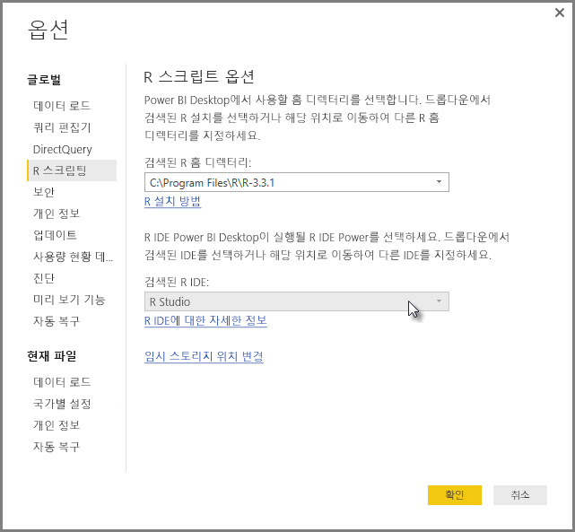
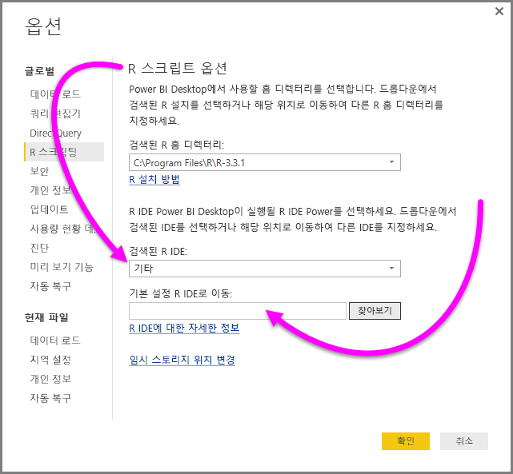
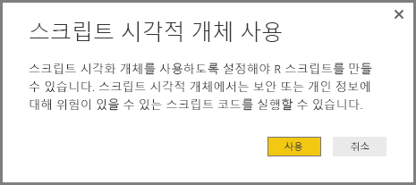
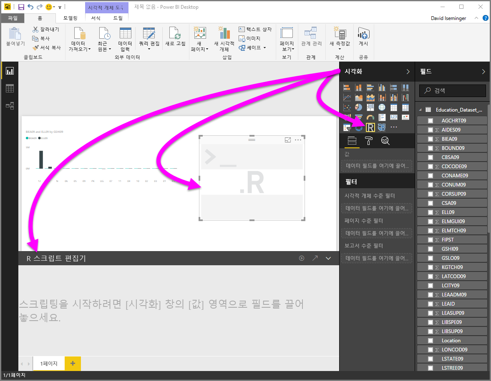
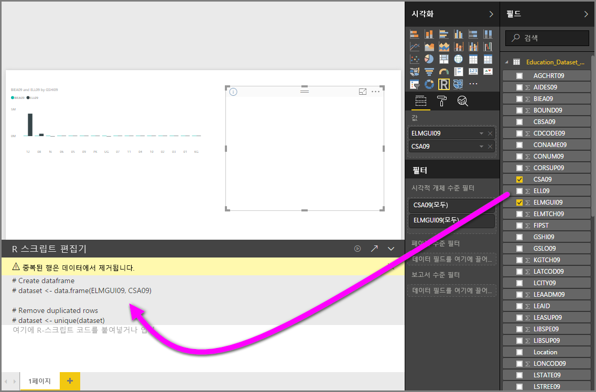
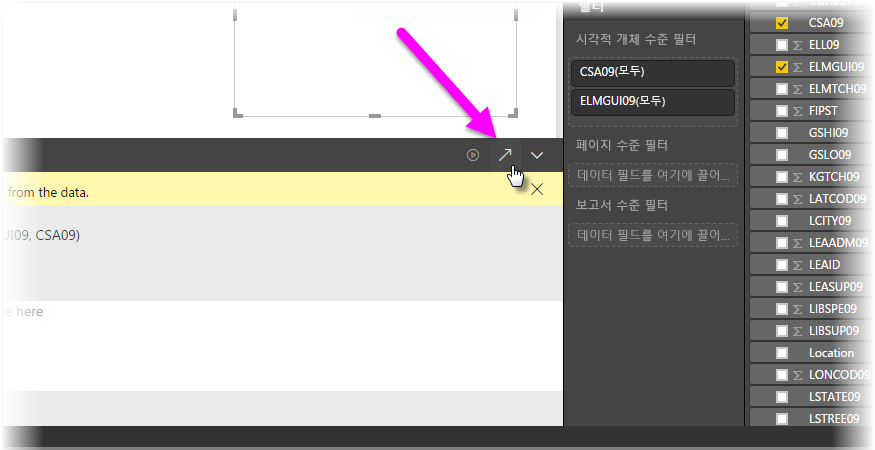
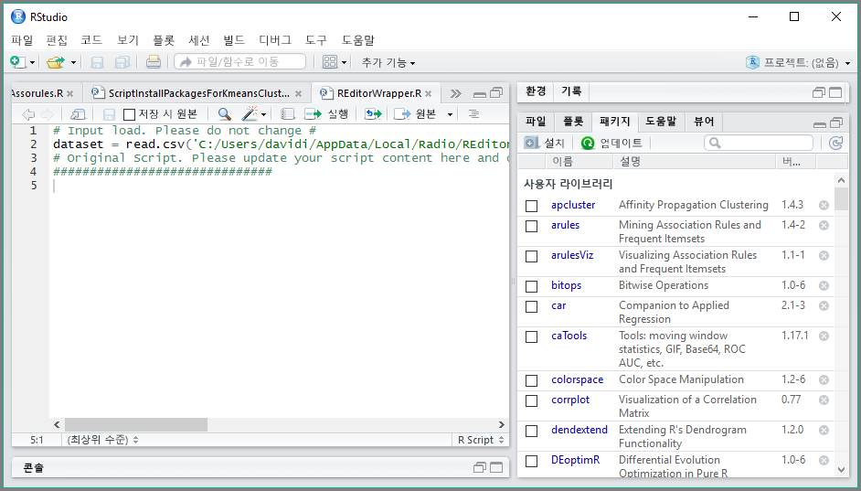

# Power BI로 외부 R IDE 사용
**Power BI Desktop**을 통해 외부 R IDE(통합 개발 환경)를 사용하여 R 스크립트를 작성하고 구체화한 다음, Power BI에서 해당 스크립트를 사용할 수 있습니다.

## 외부 R IDE 사용
이전에는 R 스크립트를 만들고 실행하려면 **Power BI Desktop**에서 R 스크립트 편집기를 사용해야 했습니다. 이 릴리스를 사용하면 **Power BI Desktop**에서 외부 R IDE를 시작하여 데이터를 자동으로 가져와 R IDE에 표시할 수 있습니다. 여기에서 해당 외부 R IDE에서 스크립트를 수정한 다음, **Power BI Desktop**에 다시 붙여 넣어 Power BI 시각적 개체와 보고서를 만들 수 있습니다.

**Power BI Desktop** (버전 2.39.4526.362) 2016년 9월 릴리스를 시작으로 어떤 R IDE를 사용할 것인지 지정하고 **Power BI Desktop** 내에서 자동으로 시작되게 할 수 있습니다.

### 요구 사항
이 기능을 사용하려면 로컬 컴퓨터에 **R IDE**를 설치해야 합니다. **Power BI Desktop**은 R 엔진을 포함하거나, 배포하거나, 설치하지 않기 때문에 로컬 컴퓨터에 **R**을 별도로 설치해야 합니다. 다음 옵션과 함께 어떤 R IDE를 사용할 것인지 선택할 수 있습니다.

* [Revolution Open 다운로드 페이지](https://mran.revolutionanalytics.com/download/)나 [CRAN Repository](https://cran.r-project.org/bin/windows/base/)같이 무료로 사용할 수 있는 대다수의 R IDE 중에서 선호하는 것을 선택하여 설치할 수 있습니다.
* **Power BI Desktop**는 또한 [*R Tools for Visual Studio*](https://beta.visualstudio.com/vs/rtvs/) 편집기를 사용하여 [R Studio](https://www.rstudio.com/) 및 **Visual Studio 2015** 지원합니다.
* 또한 다른 R IDE를 설치하고 **Power BI Desktop**에서 다음 중 하나를 수행하여 **R IDE**를 시작할 수 있습니다.
  
  * **R** 파일을 **Power BI Desktop**을 시작하려는 외부 IDE와 연결할 수 있습니다.
  * **옵션** 대화 상자의 **R 스크립트 옵션** 섹션에서 기타를 선택하여 **Power BI Desktop**이 시작해야 할 .exe를 지정할 수 있습니다.  **파일 > 옵션 및 설정 > 옵션**으로 가서 **옵션** 대화 상자를 가져올 수 있습니다.
    
    

여러 R IDE를 설치한 경우 어떤 것을 시작할 것인지 **옵션** 대화 상자의 *검색된 R IDE* 드롭다운에서 선택하여 지정할 수 있습니다.

기본적으로 **Power BI Desktop**은 **R Studio**가 로컬 컴퓨터에 설치된 경우 그것을 외부 R IDE로 시작할 것이며 **R Studio**가 설치되지 않았고 **R Tools for Visual Studio**와 함께 **Visual Studio 2015**가 있다면 그것이 대신 시작될 것입니다. 어떠한 R IDE도 설치되지 않은 경우 **.R** 파일과 관련된 응용 프로그램이 시작됩니다.

**R** 파일 연결이 없는 경우 **옵션** 대화 상자의 *선호하는 R IDE로 이동* 섹션에서 사용자 지정 IDE로 경로를 지정하는 것이 가능합니다. 또한 **Power BI Desktop**에서 **R IDE 시작** 화살표 아이콘 옆에 있는 **설정** 기어 아이콘을 선택하여 다른 R IDE를 시작할 수 있습니다.

## Power BI Desktop에서 R IDE 시작
**Power BI Desktop**에서 R IDE를 시작하려면 다음 단계를 수행합니다.

1. 데이터를 **Power BI Desktop**으로 로드합니다.
2. 작업하려는 **필드** 창에서 필드 일부를 선택합니다. 스크립트 시각적 개체를 아직 활성화하지 않은 경우 활성화할 것인지 묻는 메시지가 나타납니다.
   
   
3. 스크립트 시각적 개체가 활성화된 경우 **시각화** 창에서 R 시각적 개체를 선택하여 스크립트의 결과를 표시할 빈 R 시각적 개체를 만들 수 있습니다. **R 스크립트 편집기** 창도 나타납니다.
   
   
4. 이제 R 스크립트에서 사용할 필드를 선택할 수 있습니다. 필드를 선택하면 **R 스크립트 편집기** 필드는 선택한 필드에 따라 스크립트 코드를 자동으로 만듭니다. **R 스크립트 편집기** 창에서 R 스크립트를 직접 만들거나(또는 붙여 넣거나), 비워둘 수 있습니다.
   
   
   
   > [!NOTE]
   > R 시각적 개체의 기본 집계 유형은 *요약 안 함*입니다.
   > 
   > 
5. 이제 **Power BI Desktop**에서 R IDE를 직접 시작할 수 있습니다. 아래와 같이 **R 스크립트 편집기** 제목 표시줄의 오른쪽에 있는 **R IDE 시작** 단추를 선택합니다.
   
   
6. 다음 이미지와 같이 지정된 R IDE가 Power BI Desktop에 의해 시작됩니다(이 이미지에서 **R 스튜디오**는 기본 R IDE입니다).
   
   
   
   > [!NOTE]
   > **Power BI Desktop**은 스크립트를 실행했을 때 **Power BI Desktop**에서 데이터를 가져오도록 하는 스크립트의 첫 세 줄을 추가합니다.
   > 
   > 
7. **Power BI Desktop**의 **R 스크립트 편집기 창**에서 만든 스크립트는 R IDE의 네 번째 줄부터 표시됩니다. 이때 R IDE에서 R 스크립트를 작성할 수 있습니다. R IDE에서 R 스크립트 작성을 완료하면, **Power BI Desktop**이 자동으로 생성한 스크립트의 첫 세 줄을 제외하고 이를 복사하여 **Power BI Desktop**의 **R 스크립트 편집기** 창에 다시 붙여 넣어야 합니다. 스크립트의 첫 세 줄은 **Power BI Desktop**에 다시 복사하지 마십시오. 해당 줄은 **Power BI Desktop**에서 R IDE로 데이터를 가져오는 데에만 사용됩니다.

### 알려진 제한 사항
Power BI Desktop에서 직접 R IDE를 시작하는 데에는 다음과 같은 몇 가지 제한 사항이 있습니다.

* R IDE에서 **Power BI Desktop**으로 스크립트 자동 내보내기는 지원되지 않습니다.
* **R 클라이언트** 편집기(RGui.exe)는 편집기 자체가 파일 열기를 지원하지 않기 때문에 지원되지 않습니다.

## 다음 단계
Power BI의 R에 대한 자세한 내용은 다음을 참조하세요.

* [Power BI Desktop에서 R 스크립트 실행](desktop-r-scripts.md)
* [R을 사용하여 Power BI 시각적 개체 만들기](desktop-r-visuals.md)

