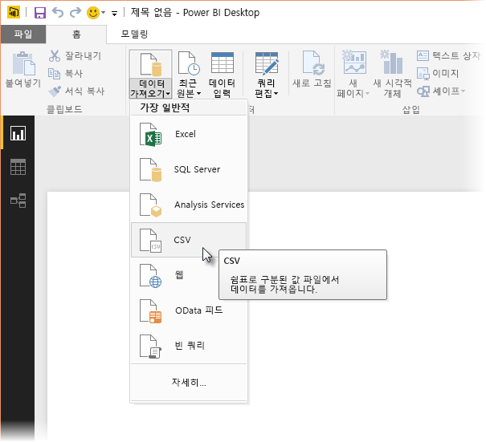
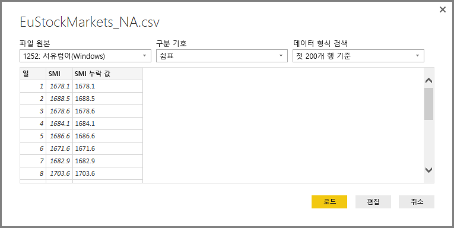
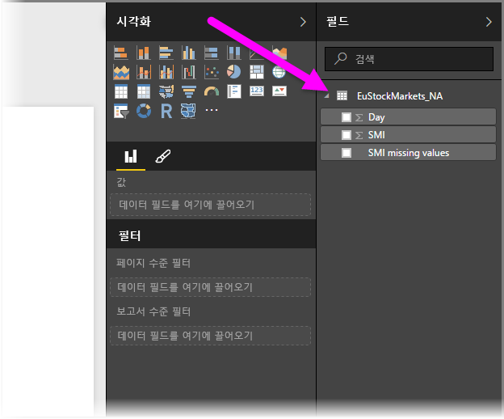
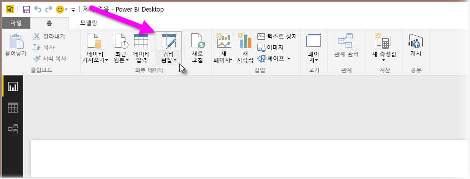
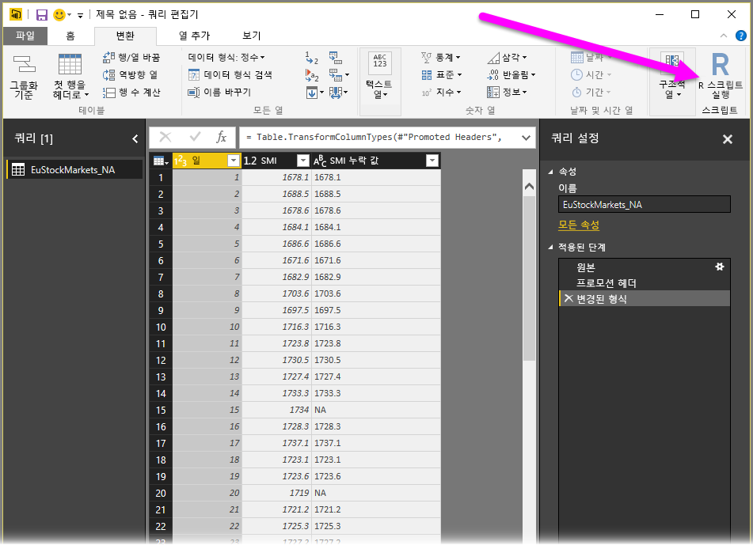
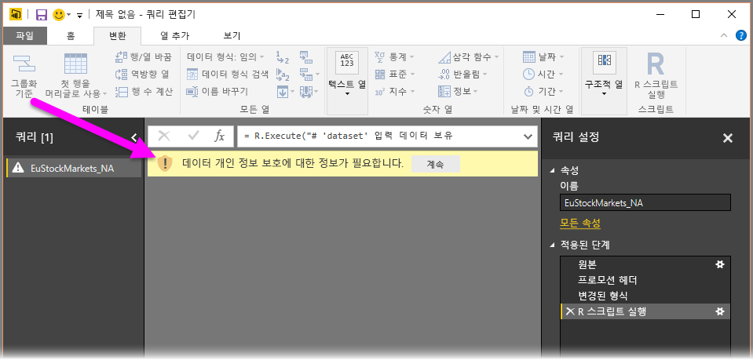
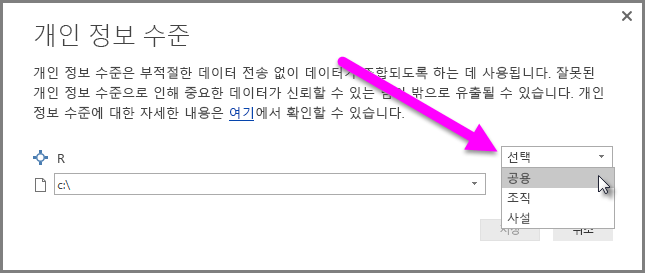
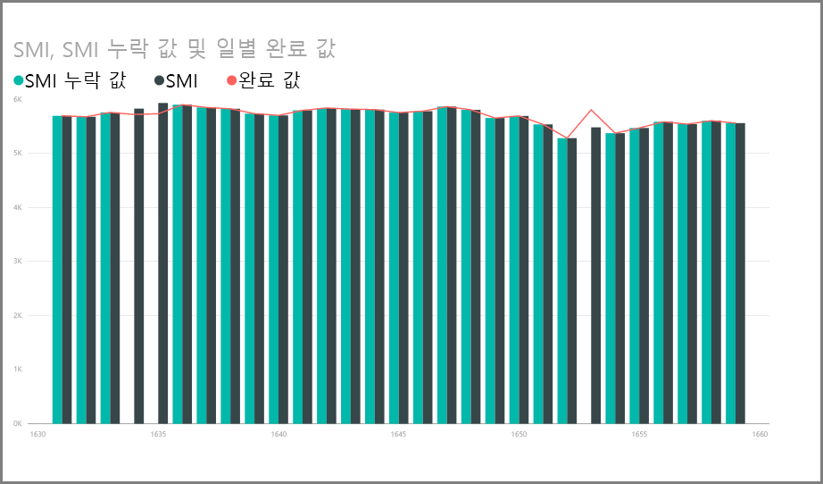
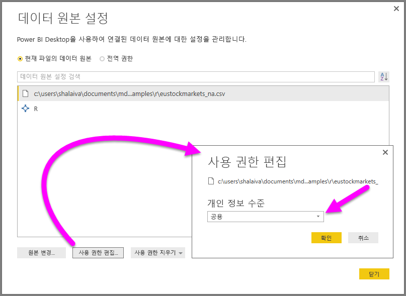

# <a name="use-r-in-query-editor"></a>쿼리 편집기에서 R 사용

[**R**](https://mran.microsoft.com/documents/what-is-r)은 많은 통계학자, 데이터 과학자 및 데이터 분석가가 사용하는 강력한 프로그래밍 언어입니다. Power BI Desktop의 **쿼리 편집기**에서 **R**을 사용하여 다음을 수행할 수 있습니다.

* 데이터 모델 준비

* 보고서 만들기

* 데이터 정리, 고급 데이터 셰이핑 및 데이터 세트 분석 수행. 여기에는 누락된 데이터 완성, 예측, 클러스터링 등이 포함됩니다.  

## <a name="install-r"></a>R 설치

[Revolution Open 다운로드 페이지](https://mran.revolutionanalytics.com/download/) 및 [CRAN 리포지토리](https://cran.r-project.org/bin/windows/base/)에서 **R**을 무료로 다운로드할 수 있습니다.

### <a name="install-mice"></a>mice 설치

[**mice** 라이브러리](https://www.rdocumentation.org/packages/mice/versions/3.5.0/topics/mice)가 R 환경에 설치되어 있어야 합니다. **mice**가 없으면 샘플 스크립트 코드가 제대로 작동하지 않습니다. **mice** 패키지는 누락된 데이터를 처리하는 메서드를 구현합니다.

**mice**를 설치하려면 다음을 수행합니다.

1. R.exe 프로그램(예: C:\Program Files\Microsoft\R Open\R-3.5.3\bin\R.exe)을 시작합니다.  

2. 아래 설치 명령을 실행합니다.

   ``` 
   >  install.packages('mice') 
   ```

## <a name="use-r-in-query-editor"></a>쿼리 편집기에서 R 사용

**쿼리 편집기**에서 **R**을 사용하는 방법을 보여 주기 위해 .csv 파일에 포함된 예제 주식 시장 데이터 세트를 사용하고 다음 단계를 수행합니다.

1. [**EuStockMarkets_NA.csv** 파일](http://download.microsoft.com/download/F/8/A/F8AA9DC9-8545-4AAE-9305-27AD1D01DC03/EuStockMarkets_NA.csv)을 다운로드합니다. 파일을 어디에 저장했는지 기억해야 합니다.

1. **Power BI Desktop**에 파일을 로드합니다. **홈** 리본에서 **데이터 가져오기 > 텍스트/CSV**를 선택합니다.

   

1. 파일을 선택한 다음, **열기**를 선택합니다. CSV 데이터가 **텍스트/CSV 파일** 대화 상자에 표시됩니다.

   

1. 데이터가 로드되면 **필드** 창에서 볼 수 있습니다.

   

1. **쿼리 편집기**를 열려면 **홈** 리본에서 **쿼리 편집**을 선택합니다.

   

1. **변환** 리본에서 **R 스크립트 실행**을 선택합니다. **R 스크립트 실행** 편집기가 나타납니다.  

   이미지에 표시되지 않는 다른 행과 마찬가지로, 15행과 20행에는 누락된 데이터가 있습니다. 아래 단계는 R을 통해 해당 행이 완성되는 방법을 보여 줍니다.

   

1. 이 예제에서는 다음 스크립트 코드를 입력합니다. ‘&lt;Your File Path&gt;’를 로컬 파일 시스템에 있는 **EuStockMarkets_NA.csv**의 경로(예: C:/Users/John Doe/Documents/Microsoft/EuStockMarkets_NA.csv)로 바꿔야 합니다.

    ```r
       dataset <- read.csv(file="<Your File Path>/EuStockMarkets_NA.csv", header=TRUE, sep=",")
       library(mice)
       tempData <- mice(dataset,m=1,maxit=50,meth='pmm',seed=100)
       completedData <- complete(tempData,1)
       output <- dataset
       output$completedValues <- completedData$"SMI missing values"
    ```

    > [!NOTE]
    > 필터를 적용하여 새 데이터 집합을 제대로 만들려면 *output*이라는 변수를 덮어써야 할 수도 있습니다.

7. **확인**을 선택하면 **쿼리 편집기**에서 데이터 개인 정보 보호에 대한 경고를 표시합니다.

   
8. R 스크립트가 Power BI 서비스에서 제대로 작동하려면 모든 데이터 원본은 **공용**으로 설정해야 합니다. 개인 정보 설정 및 해당 구현에 대한 자세한 내용은 [개인 정보 수준](desktop-privacy-levels.md)을 참조하세요.

   

   **저장**을 선택하면 스크립트가 실행됩니다. **필드** 창에서 **completedValues**라는 새 열을 확인할 수 있습니다. 행 15, 18에서와 같은 몇 가지 누락된 데이터 요소가 있습니다. 다음 섹션에서는 R이 이를 처리하는 방법을 살펴봅니다.

   **쿼리 편집기**는 R 스크립트 다섯 줄을 사용하여 예측 모델을 포함한 누락된 값을 입력했습니다.

## <a name="create-visuals-from-r-script-data"></a>R 스크립트 데이터의 시각적 개체 만들기

시각적 개체를 만들어서 다음 이미지에 보이는 것처럼 R 스크립트 코드가 **mice** 라이브러리를 사용하여 누락된 값을 완성하는 방법을 확인할 수 있습니다.



완성된 모든 시각적 개체를 **Power BI Desktop** .pbix 파일 하나에 저장하고, Power BI 서비스에서 데이터 모델과 해당 R 스크립트를 사용할 수 있습니다.

> [!NOTE]
> 이러한 단계를 모두 완료하면 [.pbix 파일을 다운로드](http://download.microsoft.com/download/F/8/A/F8AA9DC9-8545-4AAE-9305-27AD1D01DC03/Complete%20Values%20with%20R%20in%20PQ.pbix)할 수 있습니다.

.pbix 파일을 Power BI 서비스에 업로드한 후에는 추가 단계를 수행하여 서비스 데이터 새로 고침 및 업데이트된 시각적 개체를 사용하도록 설정해야 합니다.  

* **데이터 세트에 대해 예약된 새로 고침 사용** - R 스크립트에서 데이터 세트를 포함하는 통합 문서에 대해 예약된 새로 고침을 사용하도록 설정하려면 [예약된 새로 고침 구성](refresh-scheduled-refresh.md)을 참조하세요. 여기에는 **개인 게이트웨이**에 대한 정보도 포함되어 있습니다.

* **개인 게이트웨이 설치** - 파일과 **R**이 있는 머신에 **개인 게이트웨이**를 설치해야 합니다. Power BI 서비스는 해당 통합 문서에 액세스하고 업데이트된 시각적 개체를 모두 다시 렌더링합니다. 자세한 내용은 [개인 게이트웨이 설치 및 구성](service-gateway-personal-mode.md)을 참조하세요.

## <a name="limitations"></a>제한 사항

**쿼리 편집기**에서 만든 R 스크립트를 포함하는 쿼리에 몇 가지 제한 사항이 있습니다.

* 모든 R 데이터 원본 설정을 **공용**으로 설정해야 합니다. **쿼리 편집기** 쿼리의 다른 모든 단계도 공용이어야 합니다. 데이터 원본 설정으로 이동하려면 **Power BI Desktop**에서 **파일 > 옵션 및 설정 > 데이터 원본 설정**을 선택합니다.

  

  **데이터 원본 설정** 대화 상자에서 데이터 원본을 선택한 다음, **사용 권한 편집...** 을 선택합니다.  **개인 정보 수준**을 **공용**으로 설정합니다.

      
* R 시각적 개체 또는 데이터 세트의 예약된 새로 고침을 사용하려면 **예약된 새로 고침**을 사용하도록 설정하고, 통합 문서 및 **R**을 포함하는 컴퓨터에 **개인 게이트웨이**를 설치해야 합니다. 둘 다에 대한 자세한 내용은 이 문서의 이전 섹션을 참조하며 여기서 각각에 대한 자세한 내용을 알아보는 링크를 제공합니다.

R 및 사용자 지정 쿼리를 사용하여 수행할 수 있는 모든 것이 있으므로 데이터 모양을 지정하여 데이터를 탐색하고 모양을 지정합니다.

## <a name="next-steps"></a>다음 단계

* [R 소개](https://mran.microsoft.com/documents/what-is-r) 

* [Power BI Desktop에서 R 스크립트 실행](desktop-r-scripts.md) 

* [Power BI로 외부 R IDE 사용](desktop-r-ide.md) 

* [Power BI 서비스의 R 패키지](service-r-packages-support.md)
