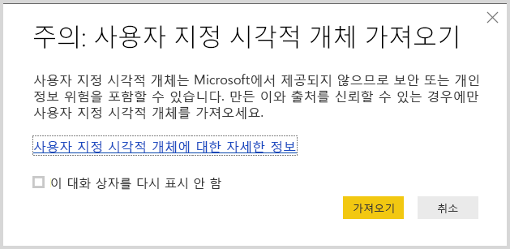
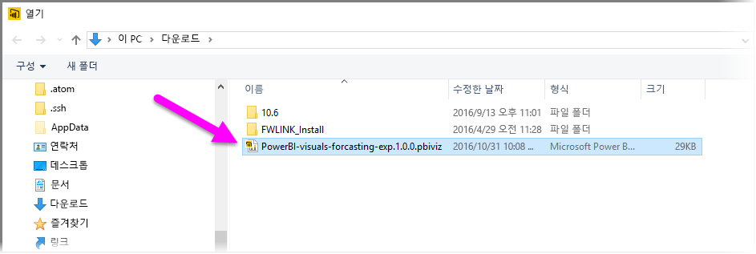
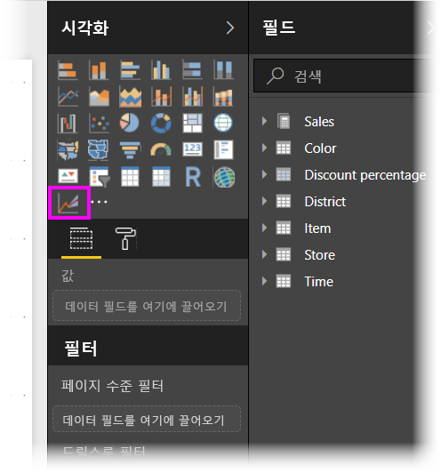
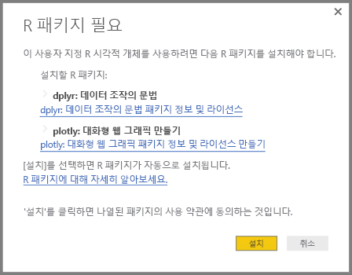
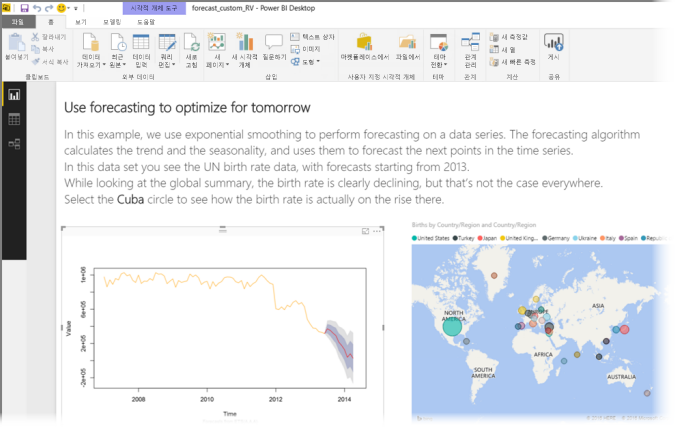
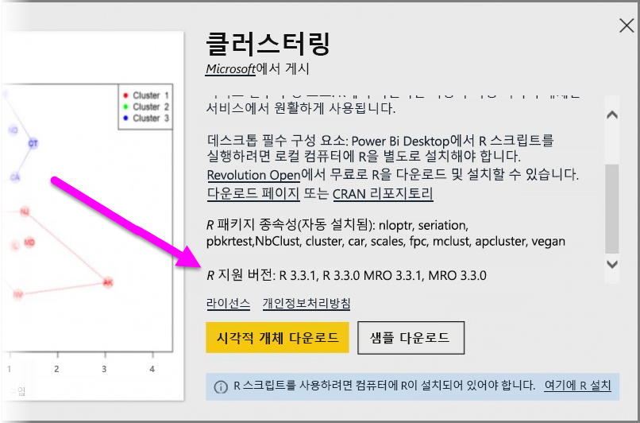

# Power BI에서 R 지원 사용자 지정 시각적 개체 사용
**Power BI Desktop**의 2016년 10월 릴리스 및 **Power BI 서비스**에서는 R 지원 사용자 지정 시각적 개체를 R에 대한 지식 없이 R 스크립트하지 않고 사용할 수 있습니다. 그러면 직접 R을 학습하거나 프로그래밍하지 않고도 R 시각적 개체 및 R 스크립트의 분석 및 시각적 기능을 활용할 수 있습니다.

R 지원 사용자 지정 시각적 개체를 사용하려면 먼저 Power BI **사용자 지정 시각적 개체** 갤러리의 **R 지원 시각적 개체** 섹션에서 사용하려는 R 사용자 지정 시각적 개체를 선택하고 다운로드합니다.

다음 섹션은 **Power BI Desktop**에서 R 지원 시각적 개체를 선택, 로드 및 사용하는 방법에 대해 설명합니다.

### R 사용자 지정 시각적 개체 사용
R 지원 사용자 지정 시각적 개체를 사용하려면 **사용자 지정 시각적 개체** 라이브러리에서 각 시각적 개체를 다운로드해야 합니다. 그러면 **Power BI Desktop**에서 다른 유형의 시각적 개체와 같은 시각적 개체를 사용할 수 있습니다. 수행하는 단계는 다음과 같습니다.

1. [http://app.powerbi.com/visuals](http://app.powerbi.com/visuals)에 있는 [사용자 지정 시각적 개체](http://app.powerbi.com/visuals) 라이브러리로 이동합니다. 페이지의 위쪽에 가까운 *R 지원 시각적 개체* 링크를 선택합니다.
   
   
2. 갤러리에서 사용하고 싶은 **R 지원 시각적 개체**를 선택합니다. 추가 세부 정보가 표시된 대화 상자가 나타납니다. **시각적 개체 다운로드**를 선택하여 다운로드합니다.
   
   > [!NOTE]
> **Power BI Desktop**에서 작성하려면 로컬 컴퓨터에 R을 설치해야 합니다. 하지만 사용자가 **Power BI 서비스**에서 R 지원 시각적 개체를 확인하려는 경우 로컬로 R을 설치하지 *않아도* 됩니다.
   > 
   > 
   
   
   
   **Power BI 서비스**에서 R 지원 사용자 지정 시각적 개체를 사용하기 위해 R을 설치할 필요가 없습니다. 단, **Power BI Desktop**에서 R 지원 사용자 지정 시각적 개체를 사용하려는 경우 로컬 컴퓨터에 R을 *반드시* 설치해야 합니다. R은 다음 위치에서 다운로드할 수 있습니다.
   
   * [CRAN 3.3.1](https://cran.r-project.org/bin/windows/base/R-3.3.1-win.exe)
   * [MRO 3.3.1](https://mran.microsoft.com/install/mro/3.3.1/microsoft-r-open-3.3.1.msi)
3. 브라우저에서 모든 파일을 다운로드하는 등 일단 시각적 개체를 다운로드하면 **Power BI Desktop**으로 이동하여 **시각화** 창에서 줄임표(...)를 마우스 오른쪽 단추로 클릭하고 **사용자 지정 시각적 개체 가져오기**를 선택합니다.
   
   
4. 다음 이미지에 나와 있는 것처럼 사용자 지정 시각적 개체를 가져올 때 주의해야 합니다.
   
   
5. 시각적 파일이 저장된 위치로 이동하여 파일을 선택합니다. **Power BI Desktop** 사용자 지정 시각화는 .pbiviz 확장명입니다.
   
   
6. Power BI Desktop으로 돌아가면 **시각화** 창에서 새로운 시각적 개체 유형을 볼 수 있습니다.
   
   
7. 새 시각적 개체를 가져오는 경우(또는 R 지원 사용자 지정 시각적 개체를 포함하는 보고서를 여는 경우) **Power BI Desktop**에서 필요한 R 패키지를 설치합니다.
   
   

여기에서부터 다른 **Power BI Desktop** 시각적 개체처럼 시각적 개체에 데이터를 추가할 수 있습니다. 작업이 완료되면 캔버스에서 완성된 시각적 개체를 볼 수 있습니다. 다음 시각적 개체에서 R 지원 시각적 개체 **예측**은 UN(United Nations) 출생 속도 프로젝션(왼쪽에 있는 시각적 개체)과 함께 사용되었습니다.

다른 **Power BI Desktop** 시각적 개체처럼 R 지원 시각적 개체와 함께 이 보고서를 **Power BI 서비스**에 게시하고 다른 사용자와 공유할 수 있습니다.

새 시각적 개체를 추가한 이후 [R 지원 사용자 지정 시각적 개체](https://app.powerbi.com/visuals/R-powered) 라이브러리를 자주 확인합니다.

### R 지원 사용자 지정 시각적 개체 제공
보고서에 사용하기 위해 사용자 고유의 R을 만드는 경우 **사용자 지정 시각적 개체 갤러리**에 사용자 지정 시각적 개체를 제공하여 전세계 사용자와 공유할 수 있습니다. 이 작업은 GitHub을 통해 제공하고 다음 위치에서 프로세스를 간략하게 설명합니다.

* [R 지원 사용자 지정 시각적 개체 갤러리에 제공](https://github.com/Microsoft/PowerBI-visuals#building-r-powered-custom-visual-corrplot)

### R 지원 사용자 지정 시각적 개체의 문제 해결
R 지원 사용자 지정 시각적 개체가 제대로 작동하려면 시각적 개체를 반드시 충족시키는 특정 종속성이 있습니다. R 지원 사용자 지정 시각적 개체가 제대로 실행 또는 로드되지 않으면 문제는 일반적으로 다음 중 하나에 해당됩니다.

* R 엔진이 누락됨
* 시각적 개체의 기반이 되는 R 스크립트 오류
* R 패키지가 누락되거나 만료됨

다음 섹션은 직면한 주소 문제에 대처할 수 있는 문제 해결 단계를 설명합니다.

#### 누락되거나 만료된 R 패키지
R 지원 사용자 지정 시각적 개체를 설치하려고 시도할 때, 누락되거나 만료된 R 패키지가 있으면 오류가 발생할 수 있습니다. 그 이유는 일반적으로 다음 중 하나에서 비롯됩니다.

* R 설치는 R 패키지와 호환되지 않습니다.
* 방화벽, 바이러스 백신 소프트웨어 또는 프록시 설정은 R이 인터넷에 연결되지 않도록 방지합니다.
* 인터넷 연결이 느리거나 인터넷 연결 문제가 있습니다.

Power BI 팀은 사용자에게 도달하기 전에 이러한 문제를 완화하기 위해 적극적으로 작업하고 다음 Power BI Desktop은 이러한 문제를 해결하기 위해 업데이트를 통합합니다. 그때까지는 문제를 완화하기 위해 다음 단계 중 하나 이상을 수행할 수 있습니다.

1. 사용자 지정 시각적 개체를 제거한 다음 다시 설치합니다. 그러면 R 패키지의 재설치가 시작됩니다.
2. R의 설치가 현재 없는 경우 R 설치를 업그레이드한 다음 이전 단계에서 설명하는 대로 사용자 지정 시각적 개체를 제거/재설치합니다.
   
   * 지원되는 R 버전은 다음 그림에 나와 있는 것처럼 각각의 R 지원 사용자 지정 시각적 개체의 설명에 나열됩니다.
     
     > [!NOTE]
> 원래 R 설치는 그대로 두고 설치 중인 최신 버전으로 Power BI Desktop을 연결하기만 하면 됩니다. **파일 > 옵션 및 설정 > 옵션 > R 스크립팅**으로 이동합니다.
3. 모든 R 콘솔을 사용하여 R 패키지를 직접 설치합니다. 이 방법의 다음 단계는 다음과 같습니다.
   
   a.  R 지원 시각적 개체 설치 스크립트를 다운로드하 고 로컬 드라이브에 해당 파일을 저장합니다.
   
   b.  R 콘솔에서 다음을 실행합니다.
   
       > source(“C:/Users/david/Downloads/ScriptInstallPackagesForForecastWithWorkarounds.R”)    
   
   일반적인 기본 설치 위치는 다음과 같습니다.
   
       c:\Program Files\R\R-3.3.x\bin\x64\Rterm.exe (for CRAN-R)
       c:\Program Files\R\R-3.3.x\bin\x64\Rgui.exe (for CRAN-R)
       c:\Program Files\R\R-3.3.x\bin\R.exe (for CRAN-R)
       c:\Program Files\Microsoft\MRO-3.3.x\bin\R.exe (for MRO)
       c:\Program Files\Microsoft\MRO-3.3.x\bin\x64\Rgui.exe (for MRO)
       c:\Program Files\RStudio\bin\rstudio.exe (for RStudio)
4. 이전 단계가 작동하지 않으면 다음과 같이 하세요.
   
   a. **R 스튜디오**를 사용하고 위의 3.b항에 설명된 단계를 따릅니다 (R 콘솔에서 스크립트 줄 실행).
   
   b. 이전 단계가 작동하지 않는 경우 **R 스튜디오**에서 **도구 > 전역 옵션 > 패키지**를 변경하고 **HTTP용 Internet Explorer 라이브러리/프록시 사용**에 대한 확인란을 활성화한 다음 위의 단계에서 3.b항을 반복합니다.

### 다음 단계
Power BI의 R에 대한 자세한 내용은 다음을 참조하세요.

* [Power BI 사용자 지정 시각적 개체 갤러리](https://app.powerbi.com/visuals/)
* [Power BI Desktop에서 R 스크립트 실행](desktop-r-scripts.md)
* [Power BI Desktop에서 R 시각적 개체 만들기](desktop-r-visuals.md)
* [Power BI로 외부 R IDE 사용](desktop-r-ide.md)

