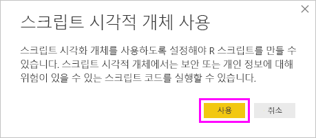

# <a name="create-power-bi-visuals-using-r"></a>R을 사용하여 Power BI 시각적 개체 만들기
Power BI Desktop에서 *R*을 사용하여 데이터를 시각화할 수 있습니다. [R](https://mran.revolutionanalytics.com/documents/what-is-r)은 통계 컴퓨팅 및 그래픽을 위한 언어이자 환경입니다.

## <a name="install-r"></a>R 설치
기본적으로 Power BI Desktop은 R 엔진을 포함하거나 배포하거나 설치하지 않습니다. Power BI Desktop에서 R 스크립트를 실행하려면 로컬 컴퓨터에 R을 별도로 설치해야 합니다. [Revolution Open 다운로드 페이지](https://mran.revolutionanalytics.com/download/) 및 [CRAN 리포지토리](https://cran.r-project.org/bin/windows/base/)를 포함한 여러 위치에서 무료로 R을 다운로드하여 설치할 수 있습니다. Power BI Desktop의 현재 R 스크립팅 릴리스는 설치 경로에서 유니코드 문자뿐만 아니라 공백(빈 문자)을 지원합니다.

## <a name="enable-r-visuals-in-power-bi-desktop"></a>Power BI Desktop에서 R 시각적 개체 사용
R을 설치하고 나면 Power BI Desktop에서 자동으로 사용하도록 설정합니다. Power BI Desktop이 올바른 위치에서 R을 사용하도록 설정했는지 확인하려면 다음 단계를 수행합니다. 

1. Power BI Desktop 메뉴에서 **파일** > **옵션 및 설정** > **옵션**을 선택합니다. 

2. **옵션** 페이지의 왼쪽에 있는 **전역**에서 **R 스크립팅**을 선택합니다. 

3. **R 스크립트 옵션**에서 로컬 R 설치가 **검색된 R 홈 디렉터리**에 지정되었는지, Power BI Desktop에서 사용하려는 로컬 R 설치가 제대로 반영되었는지를 확인합니다. 다음 이미지에서 R의 로컬 설치 경로는 **C:\Program Files\R Open\R-3.5.3\\** 입니다.
   
   

R 설치를 확인했으면 R 시각적 개체 만들기를 시작할 준비가 되었습니다.

## <a name="create-r-visuals-in-power-bi-desktop"></a>Power BI Desktop에서 R 시각적 개체 만들기
1. **시각화** 창에서 **R 시각적 개체** 아이콘을 선택하여 R 시각적 개체를 추가합니다.
   
   

2. **스크립트 시각적 개체 사용** 창이 표시되면 **사용**을 선택합니다.

   

   보고서에 R 시각적 개체를 추가하면 Power BI Desktop에서 다음과 같이 변경합니다.
   
   - 자리 표시자 R 시각적 개체 이미지가 보고서 캔버스에 나타납니다.
   
   - 가운데 창의 아래쪽을 따라 **R 스크립트 편집기** 가 나타납니다.
   
   

3. **시각화** 창의 **값** 섹션에서, 다른 모든 Power BI Desktop 시각적 개체와 마찬가지로 R 스크립트에서 사용할 필드를 **필드** 창에서 끌어옵니다. 또는 **필드** 창에서 직접 필드를 선택할 수도 있습니다.
    
    **값** 섹션에 추가한 필드만 R 스크립트에 사용할 수 있습니다. **R 스크립트 편집기**에서 R 스크립트 작업을 수행하면서 **값** 섹션에서 필요 없는 필드를 제거하거나 새 필드를 추가할 수 있습니다. Power BI Desktop은 추가되거나 제거된 필드를 자동으로 감지합니다.
   
   > [!NOTE]
   > R 시각적 개체의 기본 집계 유형은 *요약 안 함*입니다.
   > 
   > 
   
4. 이제 선택한 데이터를 사용하여 도표를 만들 수 있습니다. 

    - 필드를 선택하면 **R 스크립트 편집기**는 해당 필드에 지원되는 R 스크립트 바인딩 코드를 편집기 창 위쪽의 회색 섹션에 생성합니다.
    - 필드를 제거하면 **R 스크립트 편집기**는 해당 필드에 지원되는 코드를 자동으로 제거합니다.
   
   다음 이미지의 예제에는 세 개의 필드 hp, gear 및 drat가 선택되어 있습니다. 이러한 선택에 따라 R 스크립트 편집기는 바인딩 코드를 생성하며, 다음과 같이 요약할 수 있습니다.
   
   * **dataset**라는 데이터 프레임을 만듭니다. 이 데이터 프레임은 사용자가 선택한 여러 필드로 구성됩니다.
   * 기본 집계는 ‘요약 안 함’입니다. 
   * 테이블 시각적 개체와 마찬가지로, 필드가 그룹화되고 중복 행이 한 번만 표시됩니다.
   
   
   
   > [!TIP]
   > 자동 그룹화를 사용하지 않으려는 경우 또는 중복 항목을 포함하여 모든 행을 표시하려는 경우가 있을 수 있습니다. 이 경우 데이터 세트에 인덱스 필드를 추가하여 모든 행이 고유한 행으로 간주되고 그룹화되지 않도록 합니다.
   > 
   > 
   
   생성된 데이터 프레임을 **dataset**라고 하고 선택한 열은 해당 이름으로 액세스합니다. 예를 들어 R 스크립트에 *dataset$gear*를 추가하여 gear 필드에 액세스합니다. 공백이나 특수 문자가 포함된 필드에 대해서는 작은따옴표를 사용합니다.

5. 선택한 필드에 따라 데이터 프레임이 자동으로 생성되면 Power BI Desktop에서 R 기본 디바이스에 그림으로 표시할 R 스크립트를 작성할 수 있습니다. 스크립트가 완성되면 **R 스크립트 편집기** 제목 표시줄의 오른쪽에 있는 **스크립트 실행**을 선택합니다.
   
    **스크립트 실행**을 선택하면 Power BI Desktop에서 그림을 식별하여 캔버스에 표시합니다. 이 프로세스는 로컬에 설치된 R에서 실행되므로 필수 R 패키지가 설치되어 있어야 합니다.
   
   다음 이벤트가 발생하면 Power BI Desktop에서 시각적 개체를 다시 그립니다.
   
   * **R 스크립트 편집기** 제목 표시줄에서 **실행**을 선택합니다.
   * 데이터 새로 고침, 필터링 또는 강조 표시로 인해 데이터가 변경됩니다.

     다음은 다양한 자동차의 특성 간 상관 관계를 그림으로 나타내는 상관 관계 그림 코드의 예제를 보여 주는 이미지입니다.

     

6. 시각화 요소를 더 크게 보려면 **R 스크립트 편집기**를 최소화하면 됩니다. Power BI Desktop의 다른 시각적 개체와 마찬가지로 도넛형 시각적 개체(오른쪽의 원형 시각적 개체)에서 특정 섹션(예: 스포츠카)을 선택하여 상관 관계 그림을 교차 필터링할 수 있습니다.

    

7. R 스크립트를 수정하여 시각적 개체를 사용자 지정하고, 그리기 명령에 매개 변수를 추가하여 R의 성능을 활용할 수 있습니다.

    원래 그리기 명령은 다음과 같습니다.

    ```
    corrplot(M, method = "color",  tl.cex=0.6, tl.srt = 45, tl.col = "black")
    ```

    그리기 명령이 다음과 같이 되도록 R 스크립트를 변경합니다.

    ```
    corrplot(M, method = "circle", tl.cex=0.6, tl.srt = 45, tl.col = "black", type= "upper", order="hclust")
    ```

    결과적으로 R 시각적 개체는 원을 그리고, 위쪽 절반만 고려하고, 행렬을 다시 정렬하여 상관 관계가 지정된 특성을 클러스터링합니다.

    

    오류가 발생하는 R 스크립트를 실행하면 오류 메시지가 R 시각적 개체 그림 대신 캔버스에 표시됩니다. 오류에 대한 자세한 내용을 보려면 R 시각적 개체 오류에서 **자세한 정보 표시**를 선택하세요.

    

## <a name="r-scripts-security"></a>R 스크립트 보안 
R 시각적 개체는 R 스크립트에서 생성되며 보안 또는 개인 정보 위험에 대한 코드를 포함할 수 있습니다. 처음으로 R 시각적 개체를 보거나 조작하려고 하면 사용자에게 보안 경고 메시지가 표시됩니다. 만든 이와 원본을 신뢰하거나 R 스크립트를 검토하고 파악한 경우에만 R 시각적 개체를 사용합니다.


## <a name="known-limitations"></a>알려진 제한 사항
Power BI Desktop의 R 시각적 개체에는 다음과 같은 제한 사항이 있습니다.

* 데이터 크기: R 시각적 개체에서 그리기에 사용하는 데이터는 15만 개 행으로 제한됩니다. 150,000개를 초과하는 행을 선택할 경우 상위 150,000개만 사용되고 이미지에 메시지가 표시됩니다.

* 계산 시간: R 시각적 개체 계산이 5분을 초과하면 시간 제한 오류가 발생합니다.

* 관계: 다른 Power BI Desktop 시각적 개체와 마찬가지로 테이블 간의 관계가 정의되지 않은 여러 테이블의 데이터 필드를 선택하면 오류가 발생합니다.

* 새로 고침: 데이터 업데이트, 필터링 및 강조 표시가 발생하면 R 시각적 개체가 새로 고쳐집니다. 그러나 이미지 자체는 대화형이 아니며 교차 필터링의 원본으로 사용할 수 없습니다.

* 강조 표시: R 시각적 개체는 다른 시각적 개체를 강조 표시하면 응답하지만 R 시각적 개체의 요소를 선택하여 다른 요소를 교차 필터링할 수는 없습니다.

* 디스플레이 디바이스: R 기본 디스플레이 디바이스에 그려지는 그림만 캔버스에 올바르게 표시 됩니다. 다른 R 디스플레이 디바이스를 명시적으로 사용하지 마세요.

* RRO 설치: 이 릴리스에서는 RRO 설치가 32비트 버전의 Power BI Desktop에서 자동으로 식별되지 않으므로 **옵션 및 설정** > **옵션** > **R 스크립팅**에서 R 설치 디렉터리 경로를 수동으로 제공해야 합니다.

## <a name="next-steps"></a>다음 단계
Power BI의 R에 대한 자세한 내용은 다음 문서를 참조하세요.

* [Power BI Desktop에서 R 스크립트 실행](desktop-r-scripts.md)
* [Power BI로 외부 R IDE 사용](desktop-r-ide.md)

