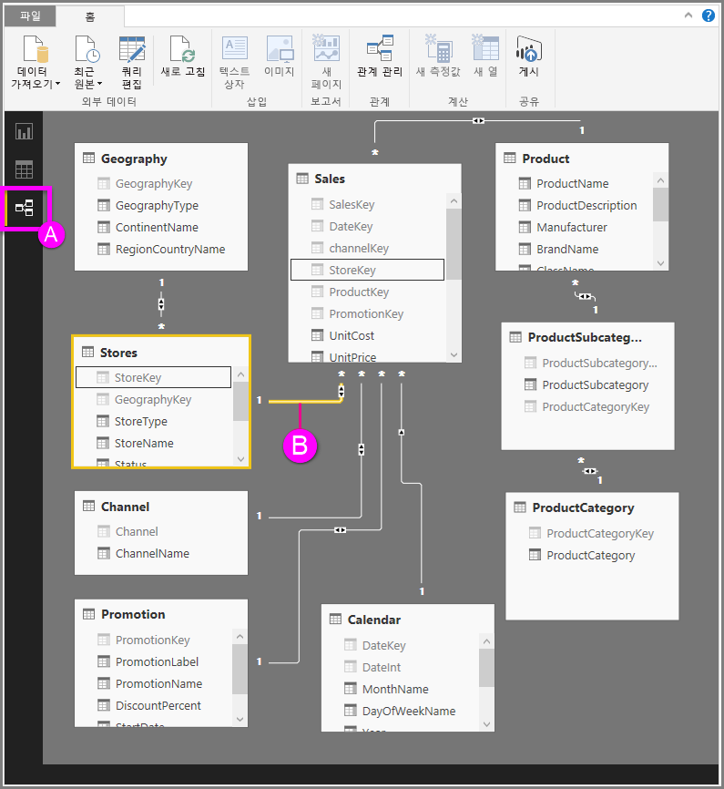

# Power BI Desktop의 관계 보기
**관계 보기**는 모델의 모든 테이블, 열 및 관계를 표시합니다. 이는 모델이 여러 테이블 간의 복잡한 관계를 가지고 있는 경우 특히 유용합니다.

직접 살펴보겠습니다.

**A.**  관계 보기 아이콘 – 관계 보기에 모델을 표시하려면 클릭

**B.** 관계 – 관계 위에 커서를 올려서 사용되는 열을 표시할 수 있습니다. 관계를 두 번 클릭하면 **관계 편집** 대화 상자가 열립니다. 

위 그림에서는 *StoreKey* 열이 있는 *Stores* 테이블이, 역시 *StoreKey* 열이 있는 *Sales* 테이블과 관련된 것을 볼 수 있습니다. 이것이 *다대일* ( \*:1) 관계임을 알 수 있으며, 선 가운데 있는 아이콘은 *모두* 로 설정된 교차 필터 방향을 나타냅니다. 아이콘의 화살표는 필터 컨텍스트 흐름의 방향을 나타냅니다.

관계에 대한 자세한 내용은 [Power BI Desktop에서 관계 만들기 및 관리](desktop-create-and-manage-relationships.md)를 참조하세요.

